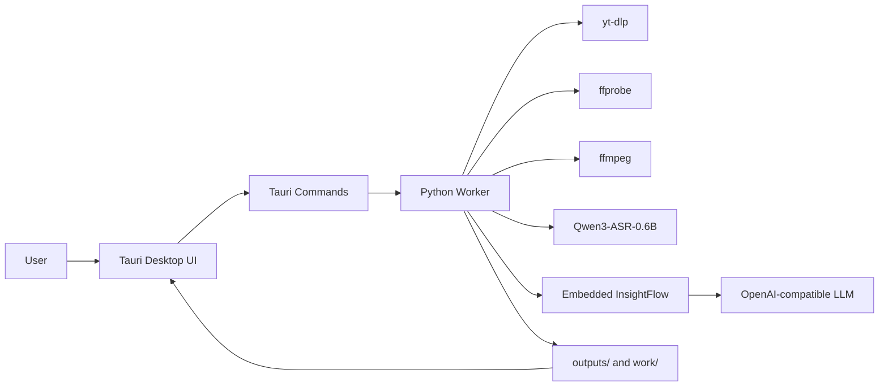

# FrameQ

把一条抖音视频 URL，变成本地视频、完整文字稿和可继续思考的启发话题点。

FrameQ 是一个本地优先的桌面客户端：它把视频下载、媒体校验、音频提取、Qwen3-ASR 转写和 InsightFlow 话题点生成串成一条清晰的工作流。你粘贴一个已授权处理的公开视频链接，剩下的交给本机 worker 完成。

```text
Douyin URL
  -> yt-dlp 下载公开视频
  -> ffprobe 校验媒体流
  -> ffmpeg 提取 16 kHz 单声道音频
  -> Qwen3-ASR-0.6B 本地转写
  -> InsightFlow 生成启发话题点
  -> txt / md / json 文件导出
```

## Why FrameQ

- 本地优先：视频、音频和文字稿默认留在本机。
- 一条链路：下载、转码、ASR、话题点生成、导出都在同一个桌面工作流里。
- 可解释进度：UI 明确展示视频提取、视频转译、话题点生成、完成或失败。
- 可恢复结果：InsightFlow 配置缺失或调用失败时，仍保留文字稿，并支持只重试话题点生成。
- 真取消：处理中取消会终止当前 worker 进程树，晚到结果不会覆盖 UI。
- 可审计工程：产品规格、架构、设计、安全边界、执行计划和验证脚本都在仓库内。

## Current MVP

FrameQ 的 MVP 已经打通：

- Tauri + React + TypeScript 桌面客户端。
- Python worker 调用 `yt-dlp`、`ffprobe`、`ffmpeg` 和 `qwen-asr`。
- 默认 ASR 模型：`Qwen/Qwen3-ASR-0.6B`。
- 内置裁剪后的 InsightFlow 话题点生成模块。
- `.env` 驱动 OpenAI-compatible LLM 配置。
- 支持导出：
  - `outputs/<video_id>.mp4`
  - `outputs/<video_id>_transcript.txt`
  - `outputs/<video_id>_transcript.md`
  - `outputs/<video_id>_insights.json`
  - `outputs/<video_id>_insights.md`

## Architecture



Runtime boundary: the app must not import from `D:\Github\InsightFlow\src\server`. Required InsightFlow behavior lives inside `worker/insightflow/`.

## Quick Start

Install dependencies:

```powershell
uv sync --dev
npm --prefix app install
```

Run focused checks:

```powershell
uv run ruff check worker
uv run pytest worker\tests
npm --prefix app test
```

Build the frontend:

```powershell
npm --prefix app run build
```

Build the desktop app without bundling an installer:

```powershell
npm --prefix app run tauri -- build --no-bundle
```

The built executable is written to:

```text
app/src-tauri/target/release/app.exe
```

## LLM Configuration

Copy `.env.example` to `.env` and fill in local values:

```dotenv
FRAMEQ_LLM_PROVIDER=openai_compatible
FRAMEQ_LLM_BASE_URL=https://api.example.com/v1
FRAMEQ_LLM_API_KEY=your-api-key
FRAMEQ_LLM_MODEL=your-model
FRAMEQ_LLM_TIMEOUT_SECONDS=60
```

When this is configured, transcript text is sent to the configured LLM service for InsightFlow topic generation. Without it, FrameQ still produces the transcript and enters `部分完成`, so you can retry later.

## Real ASR

Real ASR is explicit opt-in during development:

```powershell
$env:FRAMEQ_ALLOW_REAL_ASR = "1"
```

Model files are cached under `models/` by default. Override with:

```powershell
$env:FRAMEQ_MODEL_DIR = "D:\path\to\models"
```

Large model weights are not packaged into the installer.

## Worker Smoke

Retry InsightFlow generation from an existing transcript without rerunning download or ASR:

```powershell
$env:PYTHONPATH = "$PWD\worker"
@'
import json
from pathlib import Path
from frameq_worker.cli import retry_insights_once

transcript_path = "outputs/7524373044106677544_transcript.txt"
text = Path(transcript_path).read_text(encoding="utf-8")
result = retry_insights_once(
    json.dumps({"transcript_path": transcript_path, "text": text}),
    project_root=Path.cwd(),
)
print(json.dumps({
    "status": result["status"],
    "insights_count": len(result["insights"]),
    "insights_path": result["insights_path"],
}, ensure_ascii=False, indent=2))
'@ | uv run python -
```

Tauri passes the JSON argument directly. For manual shell smoke tests, stdin scripts avoid PowerShell JSON quoting issues.

## Project Map

- `app/` - Tauri + React + TypeScript desktop client.
- `worker/` - Python worker for download, media validation, audio extraction, ASR and InsightFlow.
- `worker/insightflow/` - embedded InsightFlow topic generation code.
- `outputs/` - generated videos, transcripts and insight files.
- `work/` - intermediate audio and temporary files.
- `models/` - local ASR model cache.
- `docs/` - architecture, design, security, product specs and execution plans.
- `AGENTS.md` - AI collaboration entry map.
- `WORKFLOW.md` - project workflow rules.
- `TASKS.md` - current recovery/task checkpoint.

## Validation Gates

Before claiming a change is complete:

```powershell
python scripts/validate_agents_docs.py --level WARN
uv run ruff check worker
uv run pytest worker\tests
npm --prefix app test
npm --prefix app run build
cargo test --manifest-path app\src-tauri\Cargo.toml
```

For desktop release validation:

```powershell
npm --prefix app run tauri -- build --no-bundle
```

## Use Boundaries

FrameQ is for:

- public videos,
- your own videos,
- or videos you have permission to process.

FrameQ is not for bypassing platform access controls, bulk scraping unauthorized content, or republishing copyrighted/private material. If cloud LLM generation is enabled, treat transcript text as data sent to that configured provider.

## Source Of Truth

The original technical plan is [douyin_video_download_solution.md](douyin_video_download_solution.md). The completed MVP execution plan is [docs/exec-plans/completed/2026-06-16-mvp-desktop-client-plan.md](docs/exec-plans/completed/2026-06-16-mvp-desktop-client-plan.md).
