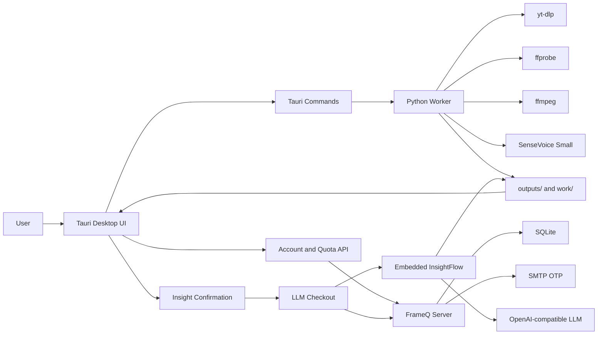

# FrameQ

<div align="center">

**A local-first desktop workflow for turning public or authorized short-video links into media files, transcripts, and insight prompts.**

[](https://tauri.app/)
[](https://react.dev/)
[](https://docs.astral.sh/uv/)
[](https://www.modelscope.cn/)
[](https://fastify.dev/)

</div>

---

## Overview

FrameQ is a desktop application that keeps video processing local by default. Paste a supported public or authorized video link, and FrameQ coordinates the local worker to download the video, extract audio, transcribe speech with SenseVoice Small, and export usable artifacts. Insight topic generation is a separate, confirmed step that uses the server-managed LLM checkout and quota flow.

```text
Supported video link
  -> yt-dlp download
  -> ffprobe media validation
  -> ffmpeg 16 kHz mono audio extraction
  -> SenseVoice Small local transcription
  -> transcript export
  -> optional confirmed InsightFlow topic generation
```

> [!IMPORTANT]
> FrameQ is for public videos, videos you own, or videos you are authorized to process. It is not designed to bypass platform access controls, login walls, CAPTCHA, copyright restrictions, or privacy boundaries.

## Contents

- [Why FrameQ](#why-frameq)
- [Current Capabilities](#current-capabilities)
- [Supported Inputs and Outputs](#supported-inputs-and-outputs)
- [Architecture](#architecture)
- [Quick Start](#quick-start)
- [Desktop Release Runtime](#desktop-release-runtime)
- [Desktop Local Settings](#desktop-local-settings)
- [Server Deployment](#server-deployment)
- [Worker Smoke Test](#worker-smoke-test)
- [Repository Map](#repository-map)
- [Quality Gates](#quality-gates)
- [Security Boundary](#security-boundary)
- [Source of Truth](#source-of-truth)

## Why FrameQ

| Principle | What it means |
| --- | --- |
| Local-first processing | Videos, audio, transcripts, model caches, and local history stay on the user's machine by default. |
| Clear workflow states | The UI shows video extraction, transcription, insight generation, completion, partial completion, or failure. |
| Four artifact entry points | Completed tasks expose video, audio, transcript, and insight-topic cards. Video and audio cards locate files directly. |
| Two-stage insight generation | Download, audio extraction, and transcription run first. Insight topics require a separate confirmation and quota check. |
| Recoverable results | If insight generation fails, the transcript remains available and the user can retry only the insight step. |
| Auditable project structure | Product specs, architecture notes, design rules, security boundaries, execution plans, and validation scripts are tracked in the repository. |

## Current Capabilities

- Tauri + React + TypeScript desktop client.
- Python worker managed by `uv`.
- Public/authorized video download through `yt-dlp`.
- Media validation with `ffprobe`.
- Audio extraction with `ffmpeg`.
- Default release ASR model: `iic/SenseVoiceSmall`.
- Optional Qwen ASR adapter remains available for development, but ordinary release builds do not install `qwen-asr` by default.
- Embedded, trimmed InsightFlow module for topic-question generation.
- Server-managed account, activation-code, LLM checkout, and insight quota service.
- Exported artifacts:
  - `outputs/<video_id>.mp4`
  - `work/<video_id>.wav`
  - `outputs/<video_id>_transcript.txt`
  - `outputs/<video_id>_transcript.md`
  - `outputs/<video_id>_insights.json`
  - `outputs/<video_id>_insights.md`

## Supported Inputs and Outputs

| Area | Supported today |
| --- | --- |
| Input workflow | One pasted public or user-authorized video source; FrameQ is transcription-first, not a general downloader |
| Douyin public videos | Long links, short links, share text, `/note/{id}`, `/share/slides/{id}`, `modal_id`, and `aweme_id` inputs when they resolve to a playable public video |
| Xiaohongshu public video notes | Share text, direct note IDs, full `xiaohongshu.com/explore/{note_id}` links, `xhslink.com` short links, and `www.xhslink.com` short links |
| Bilibili ordinary public videos | BV links, av links, selected `?p=N` parts, and safe `b23.tv` short links that resolve to ordinary `/video/` pages |
| Transcript output | Plain text and Markdown |
| Insight output | JSON and Markdown |
| Video and audio viewing | Locate generated files in the system file manager |

> [!NOTE]
> Platform links may still fail if they are expired, private, region-blocked, login-gated, CAPTCHA-gated, member-only, DRM-protected, or otherwise unavailable to the local worker. FrameQ does not provide platform login, browser-cookie import, proxy setup, stream picking, batch queues, or a download center.

## Architecture



Runtime boundary: the app must not import from `D:\Github\InsightFlow\src\server`. Required InsightFlow behavior lives inside `worker/insightflow/`.

## Quick Start

Install development dependencies:

```powershell
uv sync --dev
npm --prefix app install
npm --prefix server install
```

Run focused checks:

```powershell
uv run ruff check worker
uv run pytest worker\tests
npm --prefix app test
npm --prefix server test
```

Build the frontend:

```powershell
npm --prefix app run build
```

Build the desktop app without bundling an installer:

```powershell
npm --prefix app run tauri -- build --no-bundle
```

The built executable is written to:

```text
app/src-tauri/target/release/app.exe
```

## Desktop Release Runtime

Installed builds run the bundled Python worker directly and set `FRAMEQ_ALLOW_REAL_ASR=1` automatically. SenseVoice Small is the only release-exposed ASR model in the first installer build, but the model cache is downloaded on first run into app-local data.

Build unsigned internal installer resources and package:

```powershell
$env:FRAMEQ_PYTHON_STANDALONE_URL = "D:\archives\python-build-standalone.tar.zst"
$env:FRAMEQ_FFMPEG_ARCHIVE_URL = "D:\archives\ffmpeg-release.zip"
powershell -ExecutionPolicy Bypass -File scripts\build-installer.ps1 -Target windows-x64
```

The Python and ffmpeg values may be URLs or local archive paths. Use `-Target windows-x64`, `-Target macos-arm64`, or `-Target macos-x64` on the matching build machine. The installer build copies runtime files into `app/src-tauri/resources/`, then runs `tauri build`. Large generated resources stay out of git.

The installer does not bundle SenseVoice Small weights. It prunes non-runtime Python debug, cache, test, and header artifacts; keeps `resources/models` out of the bundle; and guides the user through downloading SenseVoice Small into app-local data on first run.

### GitHub Releases updater artifacts

FrameQ desktop uses Tauri signed updater artifacts hosted on GitHub Releases. The bundled updater endpoint is:

```text
https://github.com/jiabai/FrameQ/releases/latest/download/latest.json?frameq-updater=1
```

The GitHub Actions workflow `.github/workflows/desktop-release.yml` prepares the bundled runtime resources, builds the Windows NSIS installer, uploads updater artifacts, and uploads `latest.json` for Tauri updater checks. Configure these repository secrets before running it:

```text
FRAMEQ_PYTHON_STANDALONE_URL
FRAMEQ_FFMPEG_ARCHIVE_URL
TAURI_SIGNING_PRIVATE_KEY
TAURI_SIGNING_PRIVATE_KEY_PASSWORD
```

Create or update a release by pushing a `v*` tag or running the workflow manually with a tag such as `v0.1.0`. Draft releases are useful for inspection, but updater clients only resolve `releases/latest/download/latest.json?frameq-updater=1` after the release is published as a non-draft, non-prerelease release.

Release operators can override the default ModelScope download source:

```powershell
$env:FRAMEQ_ASR_MODEL_DOWNLOAD_URL = "https://cdn.example.com/frameq/sensevoice-small-cache.zip"
$env:FRAMEQ_ASR_MODEL_DOWNLOAD_SHA256 = "expected-sha256"
$env:FRAMEQ_MODELSCOPE_ENDPOINT = "https://www.modelscope.cn"
$env:FRAMEQ_SENSEVOICE_REVISION = "master"
```

The custom archive must contain:

```text
models/iic/SenseVoiceSmall/model.pt
models/iic/speech_fsmn_vad_zh-cn-16k-common-pytorch/model.pt
```

LLM API keys, cloud model credentials, ASR weights, and user-private configuration are never packaged into the installer.

The workflow validates and rewrites the uploaded `latest.json` as UTF-8 without BOM before the final release-asset upload, because Tauri updater rejects updater manifests with a BOM as invalid JSON. The bundled updater endpoint includes a fixed query string to avoid stale GitHub release-asset cache entries after a manifest is corrected in place.

## Desktop Local Settings

The desktop app stores non-LLM local settings in its app-local data `.env` file. The settings sheet creates this file when needed, shows its path, and can reveal it in the system file manager.

This file is for local output, ASR, and model-download settings only. Insight-topic LLM configuration is managed on the FrameQ server and is not read from desktop `.env` files.

## Server Deployment

The account, activation-code, entitlement, and server-managed LLM checkout service lives in `server/`.

Production domain:

```text
https://frameq.8xf.pro
```

Deployment files:

| File | Purpose |
| --- | --- |
| `deploy/server-deployment.md` | Production deployment runbook |
| `deploy/nginx/frameq-server.conf` | Nginx reverse proxy for `frameq.8xf.pro` |
| `deploy/nginx/frameq-proxy-headers.conf` | Shared proxy headers snippet |
| `deploy/systemd/frameq-server.service` | systemd service example |

Recommended production shape:

```text
Nginx :443 on frameq.8xf.pro
  -> FrameQ server 127.0.0.1:8787
      -> server/data/frameq.sqlite
```

The server uses SQLite, so run a single FrameQ server instance against a given database.

Server checks:

```powershell
npm --prefix server run build
npm --prefix server test
```

Local server schema setup:

```powershell
npm --prefix server run prisma:generate
npm --prefix server run db:push
```

## Worker Smoke Test

Retry InsightFlow generation from an existing transcript without rerunning download or ASR:

```powershell
$env:PYTHONPATH = "$PWD\worker"
@'
import json
from pathlib import Path
from frameq_worker.cli import retry_insights_once

transcript_path = "outputs/7524373044106677544_transcript.txt"
text = Path(transcript_path).read_text(encoding="utf-8")
result = retry_insights_once(
    json.dumps({"transcript_path": transcript_path, "text": text}),
    project_root=Path.cwd(),
)
print(json.dumps({
    "status": result["status"],
    "insights_count": len(result["insights"]),
    "insights_path": result["insights_path"],
}, ensure_ascii=False, indent=2))
'@ | uv run python -
```

Tauri passes the JSON argument directly. For manual shell smoke tests, stdin scripts avoid PowerShell JSON quoting issues.

## Repository Map

| Path | Role |
| --- | --- |
| `app/` | Tauri + React + TypeScript desktop client |
| `server/` | TypeScript Fastify account, activation-code, entitlement, and LLM-checkout service |
| `worker/` | Python worker for download, media validation, audio extraction, ASR, and InsightFlow |
| `worker/insightflow/` | Embedded InsightFlow topic generation module |
| `deploy/` | Server deployment runbook plus Nginx and systemd reference configs |
| `outputs/` | Generated videos, transcripts, and insight files |
| `work/` | Intermediate audio, local history, and temporary files |
| `models/` | Local ASR model cache |
| `docs/` | Architecture, design, security, product specs, and execution plans |
| `AGENTS.md` | AI collaboration entry map |
| `WORKFLOW.md` | Project workflow rules |
| `TASKS.md` | Current recovery/task checkpoint |

## Quality Gates

Before claiming a change is complete:

```powershell
python scripts/validate_agents_docs.py --level WARN
uv run ruff check worker
uv run pytest worker\tests
npm --prefix app test
npm --prefix app run build
npm --prefix server test
npm --prefix server run build
cargo test --manifest-path app\src-tauri\Cargo.toml
```

For desktop release validation:

```powershell
npm --prefix app run tauri -- build --no-bundle
```

## Security Boundary

- FrameQ is for public videos, user-owned videos, or videos the user is authorized to process.
- FrameQ does not implement bypasses for platform login walls, access controls, CAPTCHA, or privacy restrictions.
- The account service stores email accounts, OTP metadata, session token hashes, activation-code records, entitlements, encrypted LLM config, and quota events.
- The account service must not receive video files, audio files, transcripts, generated insights, cookies, model caches, or local history contents.
- If insight topic generation is enabled, transcript text may be sent to the server-managed OpenAI-compatible LLM provider.
- Real `.env` files, SQLite databases, backups, logs, model caches, output files, and secrets stay out of git.

## Source of Truth

- Product specs: [docs/product-specs/](docs/product-specs/)
- Architecture: [docs/ARCHITECTURE.md](docs/ARCHITECTURE.md)
- Design rules: [docs/DESIGN.md](docs/DESIGN.md)
- Security boundary: [docs/SECURITY.md](docs/SECURITY.md)
- Execution plans: [docs/exec-plans/](docs/exec-plans/)
