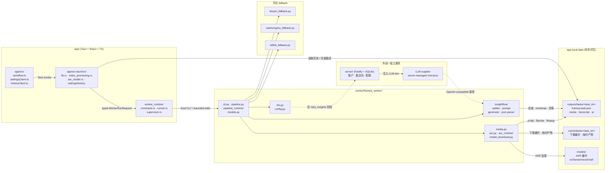

# FrameQ Architecture

## 2026-07-22 Broad-release reliability boundary (persistence implemented; watchdog planned)

- The authoritative-persistence half of this boundary is implemented on `main` at `61d489a`.
  Transcript, AI, preference, manifest, and Rust transcript-edit owners use reviewed atomic
  replacement, while existing-task bundles recover through the closed prepared/committed journal.
- Broad consumer publication remains blocked on the independent worker-watchdog change. The current
  Rust runner still has an unbounded `child.wait()`; the watchdog bullets below describe the
  accepted target architecture rather than current runtime capability.
- Persistence keeps two layers distinct. A shared Python/Rust same-directory staging + sync +
  atomic-replace primitive prevents individual-file truncation. A closed task-local
  prepared/committed journal makes existing-task transcript and AI bundles recover to one complete
  revision before `SupportedTask`/`TaskStoreFacade` readers trust them.
- The journal retains official artifact paths and task schema v3, contains no content or absolute
  paths, remains outside artifact discovery, and fails closed before unsafe recovery. New task
  creation continues using the atomically written manifest as the final visibility record.
- `worker_runtime` remains the sole process lifecycle owner and will derive fixed idle/absolute
  policies from `WorkerOperation`. An instance-bound watchdog can terminate while stdin delivery or
  wait is blocked, reuses the existing process-tree primitives, and cannot act on a newer instance.
- Structured-result-first and explicit cancellation semantics remain unchanged. A timeout has its
  own safe outcome, clears the busy state, preserves committed artifacts, and never automatically
  retries an LLM or consumes another AI Credit.
- Durable decisions and implementation steps are in
  `docs/product-specs/2026-07-22-release-reliability-hardening.md`,
  `docs/design-docs/2026-07-19-worker-atomic-artifact-commit.md`,
  `docs/design-docs/2026-07-22-rust-worker-watchdog.md`, the completed atomic-persistence ExecPlan,
  and the active worker-watchdog ExecPlan.
- Server OTP/ticket/quota concurrency and production operations remain a separate broad-release
  blocker; the desktop persistence/watchdog architecture does not close it.

## 2026-07-20 ASR application module boundary

- `worker/frameq_worker/asr.py` is now a 52-line stable compatibility surface. Production callers
  continue importing errors, transcript DTOs, adapters, registry/cache functions, and artifact
  writers only from `frameq_worker.asr`; the root re-exports the actual private objects rather than
  wrappers or duplicate classes.
- The private `asr_runtime/` package separates five owners: `types.py` owns shared contracts,
  `qwen.py` owns the lazy Qwen adapter, `sensevoice.py` owns SenseVoice normalization/VAD/WAV
  behavior, `registry.py` owns model selection and cache mutation, and `artifacts.py` owns official
  transcript output. The package initializer is empty.
- Provider modules never import the registry, and no private module imports the stable root or
  application orchestration. `qwen_asr`, `funasr`, and `numpy` remain lazy; importing the stable
  root does not load a provider SDK or initialize a model.
- SenseVoice VAD remains best-effort and falls back to the existing full-audio call. At this
  structural checkpoint provider failures, model order/defaults, source-identity
  validation-before-directory-creation, filenames, Markdown/JSON shape, direct non-atomic writes,
  and public error behavior were unchanged; `61d489a` later replaced those writes without changing
  the ASR formats.
- The canonical `worker/frameq_worker/` tree remains authoritative. Packaging validation refreshed
  the ignored Tauri resource through the established build path and proved all 56 relative files
  byte-equal, including the new private package. Worker contracts, local-media runtime, manifests,
  model-download behavior, UI, and server code are unchanged.

## 2026-07-20 Douyin fallback module boundary

- `douyin_fallback.py` is now a 132-line stable compatibility/application adapter. It retains the
  complete fallback sequence, default dependency composition, output naming, candidate-order
  wrapper, and all four `douyin.*` progress events.
- The private `douyin/` package separates immutable shared types, source/short-link policy, pure
  Router Data interpretation, bit-rate/ratio-probe stream policy, and CookieJar/urllib/atomic-write
  transport. The package initializer exports nothing, and production consumers outside the package
  continue importing only `frameq_worker.douyin_fallback`.
- One default `UrllibDouyinHttpClient` and its process-local anonymous `CookieJar` still span source
  resolution, share-page request, ratio probes, and final media request. Direct canonical IDs remain
  network-free.
- Candidate sorting/deduplication stays in stream policy and the root wrapper; transport receives an
  ordered sequence, removes probe Range headers, retries only request/safe-write failures, and uses
  the shared atomic writer without emitting progress or exposing volatile URLs.
- AST tests enforce owner symbols, dependency direction, transport-only low-level effects,
  root-only production entry/progress, and exact shared identities. The generated Tauri worker
  remains a recursive byte-equal mirror of the canonical 50-file worker tree.

## 2026-07-20 Desktop-worker contract v4 source-type boundary

- `contracts/desktop-worker-contract.json` is now global contract v4. The existing URL worker
  request deliberately remains `contract_version: 3` with exactly `url + asr_model`; local media
  owns an independent closed v4 worker request and `--process-local-media-stdin` mode.
- The local-media contract declares the closed video/audio kind and extension sets, frontend-safe
  selection metadata, token-only IPC intent, worker stdin fields, fixed error codes, progress codes,
  and machine-readable full-path/selection-token transport restrictions.
- TypeScript owns only token plus safe display metadata and has no local-path field. Rust owns pure
  selection/IPC/worker-request types and fixed non-echoing validators. Python owns the corresponding
  path-bearing request model and strict parser; its path and safe basename are excluded from repr.
- This contract-first step does not register a Tauri picker/command, add a `WorkerJob` variant, add a
  Python CLI mode, process media, change manifests, or expose local tasks in History/UI. Those
  consumers remain atomic with their later ExecPlan steps.
- The three local progress codes are registered and accepted but have no fake producer yet. The
  producer-source gate marks them as reserved until the real local worker pipeline lands.
- The packaged Tauri worker directory is a generated ignored mirror. Its existing refresh test now
  proves recursive relative-file and byte equality after excluding Python cache files, rather than
  relying on one sampled file.

## 2026-07-20 Video-processing application module boundary

- `video_processing.rs` is now a 68-line Tauri adapter/module root. It retains the three stable
  command entry points, cancellation, and narrowly shared trusted desktop task-result DTO support;
  the process and retry commands delegate immediately to focused child modules.
- `video_processing/url_processing.rs` owns strict process-video IPC/worker DTOs, contract-v3 ASR
  request resolution, exact-URL then canonical-identity cache orchestration, source-identity
  preflight, cache-hit diagnostics, and semantic process job submission.
- Source-identity preflight is an explicit closed policy: completed identity enables the second
  cache lookup; failed identity, wrong result family, unstructured failure, and protocol violation
  continue without identity; cancellation, busy, and remaining transport errors stay terminal.
- `video_processing/url_cache.rs` owns model-aware validated URL-task reuse. Its API accepts only URL
  or `SourceIdentity` plus ASR model, reads through `SupportedTask`, and has no Tauri, worker-job,
  settings, runtime-path, supervisor, or diagnostics dependency.
- `video_processing/retry_insights.rs` owns strict retry parsing, execution, and safe diagnostics and
  has no URL cache, source-identity, task-manifest, or ASR-settings dependency.
- The existing `video_processing/task_result.rs` remains the sole closed process/retry task-outcome
  mapper. Tauri command names/registration, contract v3, worker/runtime behavior, manifest schema,
  frontend behavior, cancellation, and future local-media contract v4 are unchanged.

## 2026-07-19 Video-processing task-result adapter boundary

- `video_processing.rs` remains the Tauri command adapter and application orchestrator for request
  preparation, URL cache lookup, source-identity preflight, diagnostics, job submission, retry, and
  cancellation.
- `video_processing/task_result.rs` alone maps typed task worker outcomes into the public closed task
  result. Its exhaustive context is limited to process-video and retry-insights.
- Each context fixes status, stage, code, and public fallback message. Valid structured task results
  pass through unchanged; a wrong terminal-result family or protocol failure becomes a fixed empty
  `WORKER_PROTOCOL_VIOLATION` task error rather than exposing rejected data.
- Source-identity preflight keeps its distinct tolerant cache policy in the parent, but its terminal
  cancellation/busy/transport categories enter the same task-result adapter instead of recreating
  public result policy.
- Worker runtime lifecycle, terminal parsing, diagnostics, Tauri commands, contract v3, and the
  future local-media contract v4 remain unchanged by this boundary.

## 2026-07-19 Closed worker terminal-result boundary

- Each worker operation accepts exactly one declared terminal-result family: task processing and AI
  retry use `TaskTerminalResult`, source preflight uses `SourceIdentityTerminalResult`, and model
  download uses `ModelDownloadTerminalResult`.
- The canonical contract closes every result object and nested object. Rust validates stdout with
  operation-aware typed DTOs, while TypeScript independently parses unknown IPC values before they
  enter application state, including cached and synthetic results.
- The supervised runner retains lifecycle and cancellation ownership and delegates result semantics
  to a focused protocol module. A validated result wins a cancellation race; missing or malformed
  output follows the documented cancelled/protocol/unstructured precedence.
- Worker stdout contains exactly one non-empty terminal JSON line. Progress and diagnostics remain
  on stderr, and protocol rejection never echoes the raw line, paths, transcript, or generated text.
- Safe unknown error codes remain structurally valid for generic localized guidance; unknown fields,
  wrong types, unsafe codes, invalid enums, and operation-family mismatches are rejected.
- This formalizes contract v3 without implementing local-media v4. The durable decision is recorded
  in `docs/design-docs/2026-07-19-closed-worker-terminal-results.md`.

## 2026-07-19 Worker atomic artifact commit boundary

- Official task media and JSON files are commit destinations, never scratch outputs. Worker-owned
  producers write to unique same-directory staging files, close and sync those files, validate
  media where applicable, and install them with `os.replace` only after success.
- `MediaPreparationFacade` owns staging, validation, installation, and safe failure mapping for the
  current URL video and normalized WAV. The pipeline receives only committed `PreparedMedia` paths.
- `TaskStoreFacade` atomically installs `frameq-task.json` and the preference snapshot. The manifest
  is the final task-result commit record and may reference only committed ordinary files at known
  official artifact paths.
- Video and audio use independent per-file commits. A later audio failure may preserve an already
  committed valid video under existing partial-task semantics, but incomplete staging media never
  enters artifacts, results, History, or cache authority.
- The original 2026-07-19 boundary did not add local-media contract v4 or change manifest schema
  v3/result DTOs. Release-hardening Phase 2 is now implemented: transcript/AI/Rust edit owners use
  per-file atomic replacement and existing-task updates use the closed journal/recovery boundary.
  The durable decision and residual native validation risks are recorded in
  `docs/design-docs/2026-07-19-worker-atomic-artifact-commit.md` and the completed ExecPlan.

## 2026-07-19 Media preparation facade boundary

- Python `run_worker_pipeline` enters download, media selection, ffprobe validation, task-owned
  video copying, audio extraction/reuse, and subtitle discovery only through
  `MediaPreparationFacade`.
- The current closed input is `UrlMediaSource`. `LocalVideoSource` and `LocalAudioSource` are added
  only with desktop-worker contract v4 and the real local-media CLI consumer; no dead variant is
  reserved under contract v3.
- The facade returns `PreparedMedia` with optional task-owned video, required task-owned audio, and
  an optional parsed subtitle candidate. URL subtitle writing and ASR remain pipeline stages; local
  sources must return no subtitle candidate.
- `MediaPreparationError` carries a stable code, sanitized message, and workflow stage. The pipeline
  maps it into a result and owns `TaskStoreFacade.finalize`; the facade does not write manifests.
- ASR, transcript artifact writing, InsightFlow/AI, History, cache policy, and task persistence stay
  outside this facade. Existing URL progress, artifacts, results, task schema, and contract v3 are
  unchanged.

## 2026-07-21 Worker pipeline private-owner boundary

- `worker/frameq_worker/pipeline.py` is now a 39-line stable compatibility surface containing only
  explicit direct re-exports. Production callers continue importing pipeline-owned symbols only
  from `frameq_worker.pipeline`; the root owns no processing behavior and preserves the exact
  private function/class objects rather than wrappers or duplicate definitions.
- The empty-initializer private `pipeline_runtime/` package separates four owners: `shared.py` owns
  path/progress/failure policy, `transcript.py` owns subtitle and ASR stages, `insights.py` owns
  official-transcript validation/read plus target-scoped AI generation, and `orchestration.py` owns
  URL source/task/media/transcript/finalization composition.
- Dependency direction is closed: transcript may depend on shared policy; URL orchestration may
  depend on shared and transcript; process orchestration cannot import AI/InsightFlow/output-language
  policy; and AI generation cannot import ASR, media preparation, source resolution, or task
  persistence. `cli.py` and `worker_service.py` retain their existing stable-root imports.
- `TaskStoreFacade` remains the task lifecycle/persistence boundary and `MediaPreparationFacade`
  remains the media subsystem boundary. The split changes no request/result contract, task or
  manifest schema, progress/error semantics, artifact, AI call, CLI mode, or local-media behavior.
- Ownership/identity AST gates and behavior characterization enforce this boundary. The canonical
  worker remains authoritative, and the ignored Tauri worker resource is refreshed through the
  supported generator and checked recursively for identical relative files and bytes.
- The durable decision is recorded in
  `docs/design-docs/2026-07-21-worker-pipeline-module-split.md`.

## 2026-07-18 Task access facade boundary

- Rust raw task-manifest parsing, privacy predicates, relative-path resolution, canonical artifact
  validation, and manifest writes are private to the `task_manifest` module tree. The 26-line
  `task_manifest.rs` root is the only crate-visible import surface; its private `source_identity`,
  `schema`, `storage`, and `access` children own canonical source policy, pure DTO/projection policy,
  filesystem/path effects, and validated capability orchestration respectively.
- History, cache reuse, transcript read/edit, and deletion continue entering through root-re-exported
  `SupportedTask::scan/open`; no caller may import a private child or assemble raw DTO/path helpers.
- `SupportedTask` is a validated capability, not another persisted DTO. Application callers use a
  closed `TaskArtifact` enum and receive safe projections or validated task-local capabilities;
  transcript mutation is restricted to `TaskEditSession`.
- A scan isolates corrupt, unsupported, or racing individual task entries while preserving failure
  for an unreadable configured task root. This keeps History and cache fail-closed without allowing
  one damaged task to hide valid tasks.
- Python task lifecycle orchestration enters through `TaskStoreFacade`, which owns create, open,
  finalize, and preference-snapshot persistence. `OpenedTask` exposes normalized transcript metadata
  and a validated context rather than the raw manifest.
- This boundary does not change manifest schema v3, desktop-worker contract v3, IPC/result shapes,
  cache identity, transcript backup behavior, or AI retry semantics. The future local-media source
  union must extend the facade predicate rather than reintroducing caller-local manifest checks.

## 2026-07-18 Process-video request contract v3 boundary

- React-to-Tauri `process_video` input expresses user intent only and contains exactly `url`. UI
  locale, transcript language, output formats, ASR configuration, and AI mode are not frontend
  processing parameters.
- Rust owns app-local ASR configuration. It preserves the submitted URL, resolves one supported ASR model,
  performs cache matching with that value, and constructs a distinct immutable worker request.
- The bounded worker-stdin request contains exactly `contract_version: 3`, `url`, and `asr_model`.
  Python validates this request and treats it as execution truth; it does not override the model from
  environment configuration in the process path.
- `contracts/desktop-worker-contract.json` is the canonical worker-request schema. TypeScript IPC,
  Rust serialization, and Python parsing/consumption tests reject missing, legacy, additional,
  wrong-version, or unsupported values without echoing raw source input.
- `language`, `output_formats`, and `insightflow_mode` are retired rather than assigned manufactured
  semantics. A future option requires an owner, validator, executable consumer, failure policy, and
  versioned contract test.
- The change does not alter task manifests, History, cache identity, artifacts, source handling,
  cancellation, or AI generation. The future local-media boundary remains a separate command and
  advances the desktop-worker contract from v3 to v4.

## 2026-07-16 Local Media Import Boundary

- URL processing remains the existing `process_video` capability. Local processing is an independent
  `process_local_media` command, but both share the ProcessSupervisor video lane, cancellation
  semantics, normalized-WAV ASR path, task lifecycle, and separately confirmed AI targets.
- The native Tauri picker accepts one allowlisted file. Rust owns the complete absolute path in one
  non-persisted current selection and returns React only a random token, sanitized basename, kind,
  extension, and size. A replacement token invalidates the old selection; processing revalidates
  ordinary-file/no-link status, nonzero size, extension, size, and modification time.
- The local path crosses into the bundled worker only through a bounded one-shot
  `--process-local-media-stdin` request. It must not enter frontend state, argv, environment variables,
  results, progress, errors, logs, manifests, transcript exports, prompts, or cloud requests.
- `contracts/desktop-worker-contract.json` v4 adds a closed local-media request plus registered local
  progress/error codes while preserving the cleaned v3 URL request. TypeScript, Rust, Python, and the
  packaged worker mirror must reject drift and invalid/additional values consistently.
- Every local source is decoded into official `media/audio.wav` as 16 kHz mono signed 16-bit PCM
  before SenseVoice. Video requires video+audio streams, preserves original bytes as generic
  `media/video.<ext>`, and ignores subtitles. Audio requires an audio stream, retains no original
  copy, and owns no video artifact. Partial artifacts are validated before manifest registration.
- Manifest schema v3 gains a closed `local_file` source variant with empty URL, null SourceIdentity,
  and safe local-only basename/kind/extension. Existing or absent `source_kind` retains the current
  strict URL predicate. History and task source models become discriminated unions; older clients
  ignore unrecognized local tasks without mutation.
- A local task supports the existing History detail/restore/delete, normalized-audio playback,
  transcript editing, artifact location, and confirmed summary/inspiration flows. AI receives the
  saved transcript under existing rules and never receives local filename, path, token, or manifest.

## 2026-07-15 Desktop i18n and AI Output-Language Boundary

- The desktop localization implementation must support exactly `zh-CN`, `zh-TW`, and `en-US`
  through bundled `i18next + react-i18next` resources. `system` must remain a persisted preference,
  not a worker locale, and resolve to one supported locale before rendering or AI confirmation.
- Tauri must be the only owner of app-local `ui-preferences.json` schema v1. The file must contain
  only the language preference, fail safely to `system` with recovery metadata, and remain separate
  from `.env`, server/account state, task manifests, History, and inspiration preferences.
- Desktop startup must use a neutral FrameQ shell and a bounded 1.5-second preference read. Timeout
  or failure must mount once with resolved system language and ignore a late result. Sequenced saves
  must preserve the most recent successfully persisted rollback anchor.
- `contracts/desktop-worker-contract.json` v2 declares a closed `retry_insights` request schema and
  no old-call default. TypeScript, Rust, and Python runtime boundaries must still implement and test
  rejection of missing, invalid, target-incompatible, or additional fields before closeout.
- Final summary/insights confirmation must freeze the actual resolved UI locale for that request.
  Summary text, Mermaid labels, topic planning, and Insight user-visible fields must receive fixed
  enum-derived language semantics. Existing ASR language, subtitles, transcripts, artifacts,
  History, caches, and task manifests must remain unchanged.
- Worker and model-download producers must emit only contract-registered `domain.action.state` codes
  and closed safe args; consumers must drop invalid events and record only the safe code. Model codes
  must uniquely determine status and whether a bounded cross-platform basename `current_file` is
  required or forbidden. URL, full path, Cookie, credential, transcript, prompt, generated content,
  request headers, and preference prose must remain forbidden.
- `cancelling` is a desktop ProcessSupervisor/UI transition, not a worker-progress wire stage; the
  shared stage enum and Python/Rust/TypeScript worker boundaries therefore reject it on that channel.
- Language adherence must remain a best-effort prompt constraint. FrameQ must add no output-language
  detector, translation, or automatic retry, preserving server-managed LLM data flow and AI Credits
  per-call accounting.

## 2026-07-12 History Task Permanent Deletion Boundary

- `delete_history_task(taskId)` is the only product deletion command. The frontend sends no path;
  Rust derives the configured task and per-task playback-cache paths from runtime configuration
  plus a strictly validated task ID.
- Deletion accepts only a task that passes the same exact schema-v3, current privacy-marker,
  canonical SourceIdentity, no-quarantine, no-link History vNext predicate. Unsupported legacy
  directories remain outside product mutation.
- A focused Rust history-deletion domain validates that the target is exactly one child of the
  configured tasks root, rejects symlink/junction/reparse storage, removes only the rebuildable
  task cache first, and then permanently removes the task root with standard filesystem APIs. It
  never invokes shell, Python, server, LLM, billing, or payment paths.
- `useHistoryController` owns confirmation, pending state, detail-request invalidation, and list
  refresh/removal. `useTaskProcessingController` remains the sole task-identity owner and resets
  the workspace only when the successfully deleted task is current. App remains composition-only.
- Local processing, AI generation, cancellation, transcript save, and overlapping deletion block
  the operation. Recursive permanent deletion is explicitly non-transactional; failure keeps a
  truthful current workflow and reloads disk-derived History without promising rollback.

## 2026-07-11 Local Transcript and AI Workspace Boundary

- One workflow task remains the only identity and artifact aggregate, but the desktop UI
  projects it into `LocalTranscriptWorkspace` and `AiGenerationWorkspace`. App composes the
  workspaces; `useTaskProcessingController` remains the sole task-identity owner.
- A typed `activeAiTarget` identifies `summary`, `insights`, or no active AI request. Local
  progress is projected only from download/media/transcription stages. AI progress, errors,
  availability, quota, and cancellation placement are projected into the target-specific AI
  workspace, so an AI run never hides a usable local transcript.
- `TranscriptReviewPanel` is a presentation extraction backed by the existing transcript
  detail controller and Tauri commands. Audio review, task-root path validation, backup,
  save, and stale-task guards remain single implementations.
- Summary and inspiration use separate target view models and confirmation flows. Summary
  continues to generate summary plus its attached local Mermaid file with no preference
  snapshot; inspiration alone may carry the confirmed snapshot. AI result viewing is
  separate from transcript review.
- The existing worker stage and ProcessSupervisor cancellation contract remain unchanged.
  Selectors use `cancellingFromStage` and typed target state to place the single cancellation
  action in the owning workspace without manufacturing a terminal result.
- Strict History vNext detail restoration installs one complete task before either workspace
  renders. Both projections therefore share the same task ID, and existing operation/detail/
  save guards reject stale callbacks before state projection.

## 2026-07-11 History vNext Strict Read Boundary

- `frameq-task.json` schema v3 is the only history authority. Every history, cache,
  transcript, edit, and retry read first requires the current privacy marker, an
  allowlisted canonical SourceIdentity matching `source_url`, and
  `source_privacy_quarantined != true`. Schema v1/v2, missing markers, invalid identities,
  malformed manifests, and linked/reparse storage are unsupported external legacy data.
- `get_history` is a Rust-only manifest projection. It returns lightweight
  `HistoryListItem` values and never reads transcript, summary, insights, or transcript
  metadata artifacts. It records only sanitized aggregate counts and stage elapsed time;
  opening history never starts Python.
- `get_history_detail(taskId)` performs one strict task-id/manifest validation and then
  reads artifacts for only the selected supported task. History detail responses are
  sequenced by the history controller; only the newest selected response may be forwarded
  to `useTaskProcessingController`, which remains the sole task-identity owner.
- Runtime migration is removed end to end. Tauri has no migration invocation, worker
  command, or process-video/history/transcript migration hook; Python has no migration CLI
  mode. Unsupported directories are not rewritten, indexed, renamed, quarantined, or
  deleted. Their physical retention and manual backup/deletion remain outside product
  history.
- Cache lookup, transcript detail/save, and AI retry reuse the same strict current-task
  predicate. They fail closed before artifact reads and never derive compatibility data
  from an old `source_url`.

## 2026-07-10 History Task-Restore Ownership Boundary

- `useTaskProcessingController` is the only owner that may replace a workflow task identity. It exposes semantic actions for stable history restoration, waiting-input URL drafts, and a guarded task-local transcript-save result; it must not expose its internal React setter to App, history, or detail features.
- A history restore is permitted only when the shared `isProcessingStage` predicate is false. Video processing, AI retry, and `cancelling` all reject restoration without cancelling or invalidating the current worker operation, so that operation continues to publish its real terminal state.
- A permitted restore increments the controller operation ID, clears task-scoped transient UI through the existing reset callback, and installs one complete history-derived workflow. Task ID, task directory, artifacts, transcript text, summary, and insights are therefore always from the same selected task.
- Worker progress/result callbacks and transcript-save callbacks must prove that their captured task/operation is still current before merging state. History loading and panel visibility remain in `useHistoryController`; App remains composition-only and does not own a task-identity state machine.

## 2026-07-10 Desktop Process Supervision and Cancellation Boundary

- `ProcessSupervisors` privately owns one `WorkerLane` for video/source/AI work and one for ASR model download. Each lane wraps the same private `ProcessSupervisor` state machine, admits one child at a time, and records a monotonically increasing instance ID, PID, Unix PGID (equal to the controlled child PID), and `Running` or `Cancelling` phase; absence is the only finished state.
- `WorkerLane::run` is the sole FrameQ child-process lifecycle owner. It accepts the internal typed `WorkerRunRequest`, but application modules can enter the video lane only through `VideoWorkerFacade::execute(WorkerJob)` and can enter the model-download lane only through the narrow `ProcessSupervisors` model-download method. Application modules cannot select a lane, operation, progress route, invocation, credential policy, spawn behavior, pipe, wait/reap path, supervisor mutation, or process-tree termination.
- `worker_runtime/facade.rs` exhaustively derives video-job invocation, lifecycle operation, progress route, retry-only server-managed LLM material, and lane. `command.rs` owns fixed invocation/environment construction, `supervisor.rs` owns instance-safe state and OS process-tree termination, and `runner.rs` owns spawn/register/stdin/read/wait/finish/parse/classify/log ordering. Raw composition helpers remain private to this module boundary.
- Start, cancellation claim, signal-failure rollback, and terminal cleanup must match the running instance ID. A stale waiter or PID cannot clear or restore a newer child. A duplicate cancellation request returns structured `already_cancelling` and sends no second signal.
- Registration occurs before one-shot stdin delivery. After terminal observation, the runner finishes the matching instance before joining stderr readers; an internal guard clears only its own instance on every setup or wait failure.
- Windows terminates the controlled PID with `taskkill /PID <pid> /T /F`. On supported macOS releases, the Unix implementation starts each worker in a fresh process group, sends `TERM` to the negative PGID, waits only for the bounded escalation grace, and sends `KILL` to the same group only if it remains alive. Commands receive only supervisor-owned numeric IDs and are never built through a shell. Linux is not a supported release target.
- Signal delivery exposes `cancelling`, never a fabricated completed cancellation. The runner owns terminal precedence: a structured result wins a concurrent cancellation claim; only an unstructured termination observed for the matching `Cancelling` instance becomes `Cancelled`. Successful malformed stdout is a protocol violation, while nonzero malformed output is a typed unstructured failure.
- Progress routing is closed to `None`, validated worker progress, or validated ASR model-download progress. The typed job/model-download boundary derives the route; application modules cannot select it or provide arbitrary parsers, event names, or unvalidated payload emission.
- React keeps the operation ID and task UI while cancellation is pending. It resets only after a confirmed cancelled worker/model-download terminal result; a signal failure restores the prior observable processing state so progress and the real later result remain visible. Cancellation deliberately preserves existing outputs, cache, and model files.
- Current production execution still has no watchdog and can remain blocked in `child.wait()` after
  a hung worker. The accepted but unimplemented extension is
  `docs/design-docs/2026-07-22-rust-worker-watchdog.md`; no deadline behavior should be inferred
  until its ExecPlan is complete.

## 2026-07-19 Typed Worker Job Execution Boundary

- The current closed `WorkerJob` set is `ProcessVideo`, `ResolveSourceIdentity`, and
  `RetryInsights`. Each semantic constructor supplies only payload plus the window required by a
  progress-publishing job; callers cannot construct or import raw `WorkerInvocation`,
  `WorkerOperation`, `ProgressRoute`, `WorkerRunRequest`, or `WorkerLane` policy.
- `VideoWorkerFacade::execute` is the single application-facing video-lane entry. Its exhaustive
  match fixes the CLI mode, lifecycle log operation, progress protocol, lane, and LLM policy; only
  `RetryInsights` resolves server-managed LLM invocation material.
- ASR model download remains a separate semantic method because it owns a distinct command builder,
  progress protocol, and lane. It still delegates the complete child lifecycle to `WorkerLane`.
- `ProcessLocalMedia` is added only when desktop-worker contract v4 and the Python CLI consumer are
  implemented in the same change. Reserving a dead variant would weaken rather than prove the
  cross-language boundary. The accepted decision is recorded in
  `docs/design-docs/2026-07-19-typed-worker-job-facade.md`.

## 2026-07-21 Server HTTP Capability Boundary

- `server/src/server.ts` is the sole public server composition surface. It exports only
  `ServerDependencies` and `buildServer()`, creates Fastify and the six application services,
  resolves environment/configuration defaults and the release manifest, installs the global exact
  raw-JSON parser, and synchronously composes private route registrars.
- Private `server/src/routes/` modules own administrator, desktop authentication, desktop account,
  desktop LLM, desktop update, and billing/webhook HTTP adaptation. `authSchemas.ts` and `shared.ts`
  provide private reusable validation and HTTP helpers; no individual registrar is a public startup
  surface.
- Registrars are ordinary synchronous functions, not Fastify plugins and not a second facade. They
  receive only the services/configuration required by their capability, register routes on the
  supplied Fastify instance, and preserve the existing `buildServer()` startup contract.
- Route modules depend on the `Store` port or application services only. They do not import Prisma,
  construct services, own transactions, or call one another; semantic multi-write transactions
  remain wholly inside `PrismaStore`.
- The root owns raw-body capture because it is parser lifecycle policy, while only `billing.ts`
  consumes `rawBody`. Only `admin.ts` owns administrator session/CSRF cookies and their policy.
  Production startup and tests continue to import the stable root instead of assembling routes.

## 2026-07-10 Server Entitlement Transaction Boundary

- `Store` is the only persistence boundary for payment settlement, activation-code redemption, and administrator entitlement compensation. Its semantic methods return the final entitlement and, for compensation, its audit record; no caller coordinates those writes itself.
- `PrismaStore` owns one interactive `this.prisma.$transaction(...)` per semantic operation. The transaction callback is not exposed to services or Fastify routes and contains all validation reads, conditional state transitions, entitlement writes, webhook/audit writes, and final reads.
- `BillingService`, `ActivationCodeService`, and the entitlement-adjustment use case own policy invocation and compatible error mapping. Fastify routes own only authentication, CSRF, request parsing, and HTTP mapping.
- Payment idempotency is keyed by provider event and reconciled with immutable order transaction identity. A verified replay can complete a deterministically incomplete historical payment once; conflicting order/event/transaction state fails without overwriting. Activation and administrator adjustments have no automatic legacy compensation path when their intended grant cannot be reconstructed safely.
- Administrator quota display is read-only. Every administrator quota grant goes through `applyEntitlementAdjustmentWithAudit` with positive `quota_add` and a reason; there is no parallel remaining-quota write route or Store method.
- WeChat billing code remains a disabled future integration. The server enables its routes only when `WECHAT_PAY_ENABLED` is exactly `"1"`; ordinary release behavior keeps the channel closed and does not imply provider readiness.

## 2026-07-10 Source Identity and AI Input Boundary

- The worker owns one source boundary for every request. `SourceRequest` contains transient `download_url` for the current downloader/fallback call and has no persistence/result serialization path. The raw submission crosses frontend-to-Tauri IPC and a one-shot child stdin pipe only for a cache-only identity preflight or the current full processing call; it never enters worker argv or environment variables. The separate persistable `SourceIdentity` contains only version, platform, stable id, effective part, and canonical URL.
- `WorkerCommandSpec` separates fixed mode arguments from an optional in-memory stdin payload. Serialized process-video, source-identity, and retry requests use fixed `--request-stdin`, `--resolve-source-stdin`, or `--retry-insights-stdin` flags. `WorkerLane::run` pipes, writes, and closes stdin before any output wait; no-payload model download receives null stdin.
- Both desktop and worker cap stdin payloads at 1 MiB and use fixed non-echoing delivery/parse errors. The runner registers the spawned PID/PGID before writing, so cancellation can terminate the process tree even while pipe delivery is blocked; a matching cancellation during delivery returns the confirmed cancelled terminal result rather than starting another worker stage. The runner preserves the no-shell command vector, Windows hidden process/tree behavior, and macOS process-group behavior.
- Canonical URLs are reconstructed from allowlisted stable platform identifiers: Xiaohongshu note ID, Bilibili BV/av ID plus non-default `p`, YouTube video ID, or Douyin video/work ID. Userinfo, fragments, and non-allowlisted query fields never cross the canonicalization boundary.
- Supported short links are resolved in the worker, then canonicalized from the resolved stable ID. The original short link remains only the current download input. A failed resolution cannot promote the raw URL to persistent identity.
- Task creation, transcript writing, and manifest writing accept only a worker-validated `SourceIdentity`. Cache matching and history defensively validate the persisted identity but do not regenerate platform canonical URLs in Tauri. A desktop preflight identity is cache-only advisory data and is never injected into the full worker request.
- `transcript/transcript.txt` under the same task root as `ai/` is the official AI input artifact. Summary, Mermaid mindmap, topic planning, per-topic insights, and retries validate that exact path before reading its plain text body; `transcript.md`, alternate same-named files, and linked/reparse-point targets must not be used as prompt sources.
- Unsupported legacy task directories are physically retained but excluded from every product read. FrameQ does not migrate, redact, repair, rename, index, or delete them; users may manage backups or deletion outside the product.

## 2026-07-09 Account Processing and AI Gate Boundary

- `/api/desktop/account` returns two capability fields with different responsibilities. `can_process` means the authenticated desktop user has an active entitlement and may start local video extraction, audio extraction, and ASR transcription.
- `can_process` must not depend on `llm_configured` or `llm_quota_remaining`; local transcription is allowed to degrade independently when cloud AI is unavailable.
- `can_generate_ai` means the authenticated desktop user has an active entitlement, server-managed LLM config is available, and LLM API-call quota remains.
- The desktop UI uses `can_process` only for submitting a new video URL. It uses `can_generate_ai` for confirmed `summary` and `insights` generation.
- `process_video` has no AI field or AI branch. Its frontend type, strict Tauri IPC request,
  explicit worker-stdin DTO, Python `ProcessRequest`, and local pipeline omit
  `generate_insights`; a payload containing that retired field is rejected rather than normalized.
  The command never constructs an AI client or receives checkout. `retry_insights` is the only
  command that may construct an AI client, enter `run_insight_generation_step`, require checkout,
  or consume quota.

## 2026-07-08 Split Summary and Inspiration Generation Boundary

- `retry_insights` now receives an explicit target: `summary` or `insights`. The command still reuses the saved official transcript and the owning task manifest; it must not re-download media or rerun ASR.
- The `summary` target generates only `ai/summary.md` and hidden `ai/mindmap.mmd`. It must not accept, read, write, or prompt with the personalized preference snapshot.
- The `insights` target generates only `ai/insights.json` and `ai/insights.md`. It may persist `ai/preference-snapshot.json` and may include that snapshot only in insight-topic prompts.
- Retrying either target must merge existing AI artifacts from the same task directory before writing `frameq-task.json`, so generating one output cannot clear the other output or reset `insights_count`.
- Each user confirmation uses server-managed LLM checkout and consumes quota per actual supplier API-call attempt for that target.

## 2026-07-06 Personalized Insight Preferences Boundary

- The desktop UI owns the inspiration-profile setup flow, the per-run six-step generation-preference wizard, confirmation summaries, and result-detail actions such as `换个方向`.
- Tauri owns app-local persistence for the inspiration profile. The profile should be stored as a constrained local JSON file, not in app-local `.env`, and Tauri commands must validate the file path under app-local data.
- If the user skips profile setup, Tauri persists a local skipped marker such as `profileSkipped: true` without profile fields. This marker suppresses repeated first-use prompts but must not create an implicit default persona.
- The per-run preference snapshot is passed to `retry_insights` only when the target is `insights`, together with the saved official transcript reference. It may be recorded in the local task manifest as user-visible context for already-generated inspiration artifacts.
- The worker treats profile and generation preferences as structured prompt context for insight-topic generation only. Summary and Mermaid mindmap generation continue to use the generic AI整理 prompts and must not read the personalized preference snapshot. The worker must not infer hidden preferences from unrelated history.
- For insight-topic generation, the worker should preserve LLM context budget by using transcript chunks, summaries, or candidate excerpts plus a compact structured preference JSON. It should not concatenate a full long transcript and verbose preference prose into a single prompt.
- FrameQ server continues to own only account, entitlement, quota, and LLM checkout. It must not receive or store inspiration profiles, generation preferences, transcripts, generated insights, or local task manifests.
- Quota is counted per cloud LLM API call attempt: `1 quota use = 1 supplier chat-completion/API call attempt`. Summary generation, Mermaid mindmap generation, topic planning, and insight-topic generation may each consume separate quota uses only when their target is confirmed. Re-running via `换个方向` starts a new confirmed `insights` target attempt and consumes quota again according to its actual LLM calls. Failed, timed-out, unparsable, or partially failed calls remain consumed once attempted.
- The LLM supplier may receive transcript snippets only after the user confirms the corresponding AI target. The selected preference snapshot may be sent only with the insight-topic generation request, not with summary or Mermaid mindmap requests.

## 2026-07-05 Desktop Diagnostics Boundary

- The Tauri desktop layer owns app-local diagnostic logs at `logs/frameq-desktop.log`.
- Worker lifecycle diagnostics are emitted only by `WorkerLane::run` from a closed operation mapping. They record fixed operation kind, supervisor-owned PID, safe exit/status markers, and structured safe summaries; they never include raw args, stdin, environment values, full executable/current-directory paths, source/local-media paths, URLs, credentials, transcripts, prompts, preference prose, generated bodies, or raw stderr.
- Application diagnostics may retain task id, structured error code, validated retry target/output locale, cache outcomes, and sanitized short messages, but they do not reconstruct process lifecycle logs.
- Worker task diagnostics remain under app-local `cache/tasks/<task_id>/` when task-specific temporary evidence is needed; desktop logs are global support evidence, not user artifacts.
- YouTube extraction may explicitly enable local JavaScript runtimes supported by `yt-dlp` (`deno`, `node`, `quickjs`, `bun`) but must still run as a worker-owned public-link download policy.
- Release packages bundle Deno in `resources/bin` so clean Windows and macOS machines have a local JavaScript runtime available for `yt-dlp` YouTube player evaluation.

## 2026-07-05 Task-Owned Artifact Store Boundary

- A processing run is now a first-class task. The worker creates `<output_root>/tasks/<task_id>/frameq-task.json` and writes all final user artifacts under that same task directory.
- Final artifacts use stable names inside task folders: `media/video.mp4`, `media/audio.wav`, `transcript/transcript.txt`, `transcript/transcript.md`, `transcript/segments.json`, `ai/summary.md`, `ai/mindmap.mmd`, `ai/insights.json`, and `ai/insights.md`.
- App-local `cache/tasks/<task_id>/` owns temporary downloads, partial files, media merge scratch space, and diagnostics. It is not the user-facing artifact contract.
- `frameq-task.json` is the source of truth for desktop history and artifact lookup. Any app-local cache index is rebuildable, not the authority.
- Tauri may satisfy a repeated canonical source identity from an existing completed or partial-completed task manifest when the transcript artifact still exists. Exact canonical URLs can hit before Python launch; variants and short links may invoke the worker's lightweight identity preflight, but a hit returns before download/transcode/ASR and unusable or broken old tasks are skipped.
- Tauri commands should resolve artifacts from `task_id` and manifest-relative paths only. They must not accept arbitrary transcript/audio/result paths for normal task operations.
- The old flat-output/history contract is intentionally retired for new builds. Legacy flat outputs and legacy app-local history records do not need migration or compatibility behavior.

## 2026-07-05 Subtitle-First Transcript Source Boundary

- The worker may request public platform subtitle files for YouTube and Bilibili `yt-dlp` success paths before loading ASR. This is a worker-owned transcript optimization, not a new UI platform crawler or download workflow.
- Subtitle probing runs after media validation/audio extraction and before ASR model readiness/loading checks. This preserves the current `media/video.mp4`, `media/audio.wav`, audio review, result cards, and history behavior while skipping only ASR model load/inference when subtitles are usable.
- Bilibili public fallback does not fetch or reuse subtitles in v1. If `yt-dlp` fails and `download_bilibili_video` succeeds, the task continues through the existing ASR path.
- Subtitle parsing writes the same official `transcript/transcript.txt`, `transcript/transcript.md`, and `transcript/segments.json` artifacts as ASR. Later AI整理 reads only the official saved `transcript.txt` body.
- `frameq-task.json` schema version 3 keeps top-level `model`, `transcript: { source, language, engine }`, canonical `source_url`, and the structured `source_identity`. Schema versions 1 and 2 remain readable; version 1 manifests without `transcript` are treated as ASR-sourced, while missing source identity triggers bounded migration or a no-link placeholder.
- Raw `.vtt` / `.srt` files remain temporary files in `cache/tasks/<task_id>/download/` and are not user-facing artifacts or manifest paths.

## 2026-07-03 Transcript Detail and Audio Review Boundary

- Transcript audio review is split across the existing three local layers: worker produces optional segment metadata, Tauri performs constrained local file IO, and the frontend owns playback/editor interaction state.
- The worker may emit a sidecar `<stem>_transcript_segments.json` when ASR output contains trustworthy sentence timing or, for SenseVoice long-audio runs, when the built-in FSMN-VAD provides speech block timing and each block is transcribed directly. The sidecar shape is `segments: [{ id, start_ms, end_ms, text, speaker? }]`; `speaker` is metadata only and must not drive seek, highlight, or edit behavior.
- Existing transcript `.txt` and `.md` files remain the official text artifacts. The segment sidecar is optional enhancement metadata, so old tasks and ASR outputs without valid timing keep working as full-text review.
- Tauri owns `load_transcript_detail` and `save_transcript_edit` commands. These commands validate local transcript/audio paths, read/write only approved transcript artifacts, create the first original backup, and update local history previews after save.
- `app/src-tauri/src/transcript_detail.rs` is the only crate-visible transcript-detail command and composition root. It opens one validated `SupportedTask` per operation, then delegates audio playback/cache preparation to private `audio_playback`, tolerant segment decoding and strict encoding to private `segments`, and official transcript load/edit persistence to private `edit_storage`.
- Transcript-detail children accept validated task capabilities rather than output roots, task IDs, or raw manifests. `edit_storage` is the only child that converts a task into `TaskEditSession`; none of the children resolve Tauri runtime roots or parse/write `frameq-task.json` directly.
- Tauri must not expose arbitrary file playback or arbitrary text-file write commands. Frontend audio playback may only use paths returned by the validated detail command.
- When a configured output root is outside app-local data, Tauri may create a rebuildable playback cache under app-local `cache/.frameq-audio-review/<task_id>/` from the validated manifest audio artifact. The frontend should play `audio_asset_path`; `audio_path` remains the original task artifact path.
- Settings UI owns manual playback-cache management: it queries Tauri for `.frameq-audio-review` size and calls a clear command. Tauri must delete only that canonical app-local playback cache, never `<FRAMEQ_OUTPUT_DIR>/tasks/<task_id>/` artifacts.
- The frontend owns the native audio element, current segment selection, playback-following highlight, edit pause/resume behavior, dirty state, copy-from-draft behavior, and save feedback.
- Later AI整理 must read the saved official transcript, not an unsaved frontend draft.

## 2026-06-29 YouTube Public Video Support Boundary

- YouTube v1 is a worker-owned `yt-dlp` command policy, not a new platform crawler. UI and Tauri continue to submit one source string and receive the existing worker result shape.
- The frontend may accept public YouTube watch, short, and Shorts URLs, but it does not parse YouTube pages, select formats, import cookies, or manage downloads.
- The worker keeps `yt-dlp --no-playlist` and adds a YouTube-specific 720p transcription-first format selector that prefers MP4 video plus M4A audio when available.
- Successful YouTube downloads produce a normal local media file and then reuse the existing `ffprobe`, FFmpeg audio extraction, ASR, history, summary, Mermaid mindmap, and insight pipeline without new result fields.
- YouTube-specific failures are classified only inside the worker error message as sanitized `YOUTUBE_*` prefixes under the existing top-level `VIDEO_DOWNLOAD_FAILED` error.
- YouTube v1 must not add YouTube login, browser cookie import, cookies-from-browser, Authorization headers, proxy/bypass settings, playlist batching, live-stream handling, age/member/private bypass, stream picker UI, or a download-center product surface.

## 2026-06-27 Bilibili Public Video Fallback Boundary

- Bilibili fallback remains worker-owned and ordinary-public-video-only. UI and Tauri submit a source string and receive the existing worker result shape; they do not call Bilibili APIs, select DASH streams, import cookies, or manage downloads.
- The frontend may accept ordinary Bilibili BV/av video URLs and safe `b23.tv` short links, but all platform interpretation happens inside the Python worker.
- `worker/frameq_worker/bilibili_fallback.py` is the 137-line stable compatibility/application adapter and the only Bilibili import path used by production modules outside the private package. It owns default dependency construction, page/output composition, final MP4 replacement, cleanup sequencing, and the five `bilibili.*` progress events.
- Private `worker/frameq_worker/bilibili/` modules separate shared identities (`types.py`), input/short-link policy (`source.py`), public API/DASH policy (`playback.py`), bounded HTTP/resumable streaming (`transport.py`), and candidate/FFmpeg effects (`artifacts.py`). Private children do not import the root adapter or task/application/ASR/AI layers; no new facade class or generic multi-platform downloader framework exists.
- `yt-dlp` stays the first attempt. Bilibili fallback runs only after a Bilibili-related failure and only for public or user-authorized ordinary videos.
- The fallback parses BV/av IDs, resolves safe `b23.tv` links, selects one part from `?p=N` or the first part, fetches `x/web-interface/view` and `x/player/playurl`, chooses one video stream plus one audio stream, downloads `.m4s` files safely, and merges them to MP4 with the existing bundled FFmpeg. Stable root re-exports preserve the repository-observed type and function identities.
- The fallback must not add Bilibili QR login, account login automation, `SESSDATA` collection or storage, browser cookie import, PGC/bangumi support, VIP/member-only access, DRM decryption, stream picker UI, batch queue, proxy pools, or a download-center product surface.

## 2026-06-27 Xiaohongshu Video Fallback Completion Boundary

- Xiaohongshu fallback remains worker-owned and video-only. UI and Tauri submit a source string and receive the existing worker result shape; they do not parse Xiaohongshu HTML, select streams, import cookies, or manage downloads.
- The frontend may accept Xiaohongshu share text, full note URLs, and short links, but all platform interpretation happens inside the Python worker.
- `worker/frameq_worker/xiaohongshu_fallback.py` is the 169-line stable compatibility/application adapter and the only Xiaohongshu import path used by production modules outside the private package. It owns default dependency composition, the complete fallback sequence, output naming, nested candidate/backup attempts, and all three `xiaohongshu.*` progress events.
- Private `worker/frameq_worker/xiaohongshu/` modules separate shared identities (`types.py`), source/short-link policy (`source.py`), bounded page-state interpretation (`page.py`), deterministic stream ranking (`streams.py`), and CookieJar/urllib/safe-download effects (`transport.py`). Private children do not import the root adapter or task/application/ASR/AI layers; no facade class or generic multi-platform fallback framework exists.
- The worker ports only the required EasyDownload Xiaohongshu parser/client/downloader ideas into these Python boundaries and shared download helpers; it does not call or bundle the Go/Wails EasyDownload runtime. Stable root re-exports preserve repository-observed type, client, source-builder, and test-seam identities.
- `yt-dlp` stays the first attempt. Xiaohongshu fallback runs only after a Xiaohongshu-related failure and only for public or user-authorized video notes.
- The fallback preserves transient `xsec_token`, short-link `3xx` and embedded-HTML resolution, `gzip`/`br`/`deflate` note-page decoding, `window.__INITIAL_STATE__` parsing, deterministic stream ranking, one process-local client/CookieJar, and safe resumable `.part` writes with atomic final replacement.
- The fallback must not add image album ZIP output, Live Photo sidecar output, stream picker UI, batch queue, login automation, browser cookie import, CAPTCHA solving, proxy pools, or private-note scraping.

## 2026-06-27 Admin Entitlement Adjustment Boundary

- Admin Web may manually compensate users by updating the existing `Entitlement` record's expiry and LLM API-call quota fields; it must not introduce a separate entitlement source that bypasses the normal processing gate.
- Compensation is an administrator-only support workflow for product bugs, release regressions, or goodwill repair. It is not a public self-service refund, coupon, or subscription-management system.
- Manual quota compensation should add to `llmQuotaLimit` while preserving `llmQuotaUsed`, so consumed usage remains traceable and `/api/desktop/account` can keep computing remaining uses with the existing response shape.
- Manual expiry extension should use `base = max(now, current expiresAt)` for day-based extensions, with absolute expiry setting reserved for repair cases.
- Every successful adjustment must create an append-only server-side audit record with administrator identity, target user, reason, optional note, before/after expiry, before/after quota values, and timestamp.
- Desktop clients observe the result through account status refresh: `can_process` for local transcription entitlement and `can_generate_ai` for LLM-ready AI generation.

## 2026-06-26 Worker-Owned Download Strategy Boundary

- The Python worker owns all platform-specific public-link fallback strategy, safe media download helpers, candidate probing, media validation, and structured error mapping.
- UI and Tauri continue to pass a source URL into the existing command flow and receive the same worker JSON shape; they must not parse platform HTML, choose media candidates, manage cookies, or become a download queue.
- `yt-dlp` remains the first attempt for supported public links. Worker fallback code may run only after matching failures and only for public or user-authorized links that can expose a playable media URL.
- EasyDownload is an MIT-licensed design and algorithm reference. FrameQ should port the minimal needed behavior into `worker/` and must not import, shell out to, or bundle the Go/Wails application as a runtime dependency.
- Shared download reliability helpers may support `.part` files, resume-safe range checks, no-progress timeouts, maximum-size guardrails, and candidate retries, but they must preserve the current output/history/result contract.
- Xiaohongshu fallback is scoped to video suitable for transcription. Bilibili fallback is scoped to ordinary public videos that expose no-cookie DASH streams. Image albums, platform archiving, login-gated content, Bilibili PGC/bangumi/member-only/DRM behavior, and broad multi-platform downloader behavior are outside the desktop worker boundary.

## 2026-06-25 Douyin Share Page Fallback Boundary

- The Python worker owns Douyin fallback extraction. UI and Tauri commands continue to submit a source URL and receive the same structured worker result; they do not parse Douyin HTML, choose streams, or download media directly.
- The download path becomes a small strategy chain: attempt `yt-dlp` first, then, only for Douyin download failures that match empty web detail JSON or cookie/challenge-like extractor failures, attempt a local Douyin share page fallback.
- The fallback is derived from EasyDownload's MIT-licensed approach, but FrameQ should port the minimal algorithm into `worker/` rather than importing or bundling the Go/Wails EasyDownload application.
- The fallback extracts an `aweme_id`, requests `https://www.iesdouyin.com/share/video/{aweme_id}/?app=aweme`, parses `window._ROUTER_DATA`, builds stream candidates from `bit_rate` or `play_addr.uri`, and probes candidate streams with ranged GET requests.
- The fallback may use a fixed mobile Safari `User-Agent` (`iPhone OS 16_5`, Safari `604.1`) plus minimal public-page headers. It must not implement UA rotation, proxy pools, browser fingerprint spoofing, CAPTCHA solving, or account automation.
- A process-local cookie jar may keep anonymous cookies naturally issued by the public share page for the current worker invocation only; browser cookies are not read, persisted, or uploaded.
- Candidate selection is automatic. FrameQ chooses the largest valid stream by byte size to preserve the highest-quality local video for users who keep the downloaded file, with resolution or quality rank as a tie-breaker.
- Duplicate candidate streams should be collapsed by verified `Content-Range` total size. If the selected stream fails download or media validation, the worker tries the next candidate before surfacing failure.
- The selected media is written into the current task's `media/video.mp4` artifact and then flows through `ffprobe`, `ffmpeg`, ASR, task manifest, and result workspace handling.
- If all fallback candidates fail download or media validation, the worker returns a structured `VIDEO_DOWNLOAD_FAILED` with a short cause and recovery guidance; it must not hide the failed stage behind a generic worker error.

## 2026-06-23 Desktop Update Boundary

- Desktop app updates use Tauri updater signed artifacts and GitHub Releases as the static updater metadata/artifact host.
- The desktop updater endpoint is `https://github.com/jiabai/FrameQ/releases/latest/download/latest.json?frameq-updater=1`; release automation uploads `latest.json`, the NSIS installer, and signed updater bundles to the published GitHub Release.
- Python worker code upgrades together with the desktop application bundle; v1 does not support independent worker hot updates from app-local data.
- App-local data `updates.json` stores only update preferences such as `lastCheckedAt`, `postponedUntil`, and `skippedVersion`.
- App-local `models/`, `outputs/`, `cache/`, `auth/session.json`, and `.env` are preserved across app updates.
- Live old-version-to-new-version testing through GitHub Releases is waived for v1 because mainland China access to GitHub is too slow to test reliably. The updater architecture remains in place, but direct fresh-installer distribution is the accepted fallback for users whose network cannot reach GitHub Releases.

## 2026-06-23 Runtime Configuration Boundary

- Desktop worker runtime configuration no longer reads repository-root `.env` files such as `D:/Github/FrameQ/.env`.
- App-local data `.env` remains the local desktop settings file for output directory, ASR model selection, and model download overrides.
- The desktop settings panel returns and displays the app-local data `.env` path, can locate it in the file manager, and creates a commented template if the file is missing.
- Legacy local `FRAMEQ_LLM_PROVIDER`, `FRAMEQ_LLM_BASE_URL`, `FRAMEQ_LLM_API_KEY`, `FRAMEQ_LLM_MODEL`, and `FRAMEQ_LLM_TIMEOUT_SECONDS` dotenv values are ignored.
- Insight topic generation receives LLM runtime material only through server-managed checkout environment variables injected by Tauri for the insight-generation worker invocation.

## 2026-06-23 ASR Model Cache Layout Boundary

- `FRAMEQ_MODEL_DIR` is the app-local ModelScope cache root, not the directory that directly contains `iic/SenseVoiceSmall`.
- The canonical release ASR layout is `<FRAMEQ_MODEL_DIR>/models/iic/SenseVoiceSmall` plus `<FRAMEQ_MODEL_DIR>/models/iic/speech_fsmn_vad_zh-cn-16k-common-pytorch`.
- Worker startup keeps legacy top-level `iic/...` readable for upgrade compatibility, but normalizes it to the canonical layout before real ASR loading.
- Automatic cleanup is limited to FrameQ's known SenseVoice/VAD legacy directories and stale `._____temp` folders without `model.pt`.

## 2026-06-21 Account and Billing Boundary

- `server/` is a small TypeScript Fastify service for email OTP login, desktop session exchange, administrator-issued activation-code monthly passes, entitlement status, Admin Web, and server-managed LLM checkout.
- The service stores account and entitlement state in a private SQLite database at `server/data/frameq.sqlite` with WAL mode enabled. It is designed for a single writer service instance.
- The service stores encrypted administrator-managed LLM config for a dedicated FrameQ client supplier key and tracks per-user LLM API-call quota.
- Desktop authentication uses `frameq://auth/callback` deep links. The browser receives a short-lived ticket, and the desktop client exchanges that ticket for an opaque session token.
- The user-facing entitlement is a monthly pass. Activation codes are the current administrator-issued way to open or extend that monthly pass, and they update the same `Entitlement` record used by the processing gate.
- WeChat purchase is paused because of WeChat approval requirements. Any WeChat payment route must remain disabled and hidden by default unless the product explicitly re-enables that channel.
- Each activation grants 20 cloud LLM API-call uses. The desktop worker authorizes quota through server-managed checkout before each supplier chat-completion/API call, then calls the LLM supplier directly with the returned config for that call.
- Admin Web access is limited to the configured administrator email and uses short-lived HttpOnly cookie sessions.
- The account service never receives video files, audio files, transcripts, generated insights, cookies, model caches, or local history contents. It may store and return the dedicated FrameQ client LLM key.
- The existing local worker pipeline remains the only place where video extraction, ASR, and InsightFlow execution happen.

<!-- 由 vibe-coding-launcher 生成。当前描述的是 MVP 目标架构；代码落地后必须同步更新。 -->

## 概述

FrameQ 是一个桌面客户端：用户输入抖音视频 URL 后，本地 worker 下载视频、校验媒体、提取音频、调用 ASR 转文字，并使用内置 InsightFlow 能力生成启发灵感。

## 代码地图

计划中的主要模块如下：

| 模块 | 责任 | 状态 |
|------|------|------|
| `app/` | Tauri + React + TypeScript 桌面 UI、状态展示、历史面板、设置面板、导出入口 | 已初始化；web build、Tauri release build 和安装器打包已验证 |
| `app/src-tauri/src/worker_runtime/` | Rust worker 命令构造、单一受监督运行器、实例安全取消、progress 校验路由和进程树终止 | `WorkerLane::run` 已统一 process-video、AI retry、source preflight 与 ASR model download；低层生命周期 API 对应用模块不可见 |
| `worker/` | Python 下载、ffprobe 校验、ffmpeg 音频提取、ASR、结果写盘；开发态由 `uv` 管理 `.venv`，分发态由安装包内置 Python runtime 执行 | 已初始化 schema、CLI facade、下载/媒体校验/音频提取、ASR adapter、transcript writers；分发态默认启用 SenseVoice Small，但模型缓存由首启下载 |
| `worker/insightflow/` | 从参考实现复制并裁剪后的灵感生成模块 | 已初始化 splitter、prompt、JSON parser、generator；先用 LLM 做话题分段规划，再逐话题生成问题；planner 失败时 fallback 到直接生成 |
| `app/src-tauri/resources/` | 分发态内置 Python runtime、worker、ffmpeg/ffprobe 和配置模板 | 构建脚本生成；仓库只保留 placeholder，避免提交大体积 runtime |
| app-local data `models/` | 用户本机可写模型缓存；由 `FRAMEQ_MODEL_DIR` 指向 | ModelScope cache root；canonical ASR files live under `models/iic/...`; legacy top-level `iic/...` is migrated/cleaned best-effort |
| app-local data `outputs/` 或 `FRAMEQ_OUTPUT_DIR` | 用户可直接使用的 `tasks/<task_id>/` 最终视频、音频、文字稿、AI 产物和 `frameq-task.json` | 运行时生成；输出目录可由设置面板保存到 app-local data `.env` |
| app-local data `cache/` | 每任务下载缓存、中间拼接、调试日志和临时产物 | 运行时生成；由 `FRAMEQ_CACHE_DIR` 指向 |
| app-local data `updates.json` | 桌面更新偏好，不含用户内容或签名私钥 | 记录检查时间、稍后提醒时间和跳过版本 |
| app-local data `.env` | 本机非 LLM 运行配置，不提交仓库；设置页可定位该文件，缺失时自动创建注释模板 | 支持输出目录、ASR 模型选择和模型下载覆盖；InsightFlow LLM 配置由 server 管理，不从 dotenv 读取 |

## 模块关系

下面这张图描述一次任务在代码中的真实调用链：`app/src` 触发 Tauri command，Tauri 通过 IPC 调用 `worker/frameq_worker` 的 facade，facade 按阶段调度 `media` / `asr` / `insightflow` / 平台 fallback 模块，写入 app-local data 的 `outputs/`、`cache/`、`models/`。`server/` 不在主流程调用链上，仅在 `retry_insights` 二次确认时通过 server-managed LLM checkout env 注入 LLM 配置。节点旁的 ` ` 标注是该模块最先要打开的 2-3 个关键文件，方便顺着图找到入口。

阅读路径：

- 改 UI 状态或历史展示：`app/src/workflow.ts` → `app/src/historyClient.ts` → `app/src-tauri/src/video_processing.rs` / `history.rs` / `settings.rs`。
- 改 task manifest、artifact 或 History/cache/transcript/delete 的任务信任规则：从稳定
  `app/src-tauri/src/task_manifest.rs` surface 进入，再按职责修改私有 `source_identity.rs`、
  `schema.rs`、`storage.rs` 或 `access.rs`；同时核对 Python
  `worker/frameq_worker/task_store.py` 的 `TaskStoreFacade`，调用方不得恢复 raw manifest/path
  组合或直接导入私有 child。
- 改 Rust worker 启动、stdin、progress、取消竞争或进程树终止：`app/src-tauri/src/worker_runtime/runner.rs` → `supervisor.rs` → `command.rs`；应用命令只保留领域映射。
- 改下载 / 媒体校验 / 音频提取：`worker/frameq_worker/cli.py` → `media.py` → 对应平台 fallback。
- 改 ASR 行为或模型缓存：`worker/frameq_worker/asr.py` → `asr_runtime/` → `model_download.py` → `app-local data models/`。
- 改灵感 / 总结 / mindmap：`worker/frameq_worker/insightflow/` → `llm.py`。
- 改账户、激活码、配额或 LLM checkout：`server/`。

## 关键文件

- `AGENTS.md`：AI 协作入口地图和最高优先级约束摘要。
- `docs/design-docs/frameq-code-audit-uml.md`：面向 LLM 与人工重构评审的当前代码 UML 基线、依赖证据和结构压力点。
- `docs/design-docs/2026-07-18-task-access-facade.md`：Rust/Python 任务访问门面、安全不变量和迁移边界。
- `docs/design-docs/2026-07-21-task-manifest-module-split.md`：Rust task-manifest 私有 owner
  拆分、稳定 root surface 与 source/dependency boundary。
- `docs/design-docs/2026-07-21-worker-pipeline-module-split.md`：Python worker pipeline 稳定
  root、四个私有 owner 与 process/AI dependency boundary。
- `docs/product-specs/index.md`：产品规格入口；根目录历史方案已迁移进 `docs/` 并删除。
- `docs/product-specs/2026-06-16-douyin-video-transcription-client.md`：首个用户可见 MVP 规格。
- `docs/exec-plans/completed/2026-06-18-installer-distribution-runtime-plan.md`：已完成的轻量安装包、首启模型下载与 clean-machine 验证计划；首个 MVP 计划已归档到 `docs/exec-plans/completed/2026-06-16-mvp-desktop-client-plan.md`。
- `ruff.toml`：Python worker 初始 lint 约束。
- `pyproject.toml`：Python worker 项目元数据和 `uv` 依赖入口（初始化后维护）。
- `app/src/workflow.ts`：前端工作流状态模型。
- `app/src/settingsClient.ts`：前端本机设置读写 client（Tauri invoke 包装），包含 ASR、输出目录和 app-local `.env` 路径。
- `app/src/historyClient.ts`：前端历史记录读取 client（Tauri invoke 包装）。
- `app/src-tauri/src/worker_runtime/command.rs`：固定 worker invocation、受限 stdin payload 与 app-local 环境构造。
- `app/src-tauri/src/worker_runtime/runner.rs`：所有 Rust-owned Python 子进程唯一的 spawn/register/stdin/progress/wait/finish/terminal/log 生命周期。
- `app/src-tauri/src/worker_runtime/supervisor.rs`：每 lane 的实例状态、取消 claim/rollback 与 Windows/macOS 进程树终止。
- `worker/frameq_worker/models.py`：worker request/result/error schema。
- `worker/frameq_worker/cli.py`：worker CLI/facade 入口，默认在真实 ASR 未启用时返回结构化 `ASR_MODEL_NOT_READY`。
- `worker/frameq_worker/media.py`：yt-dlp、ffprobe 和 ffmpeg 音频提取服务。
- `worker/frameq_worker/asr.py`：稳定 ASR 导入入口；实现按 failure boundary 位于私有 `asr_runtime/` 的 types、registry、Qwen、SenseVoice/VAD 和 artifact owners。
- `worker/frameq_worker/model_download.py`：SenseVoice Small 与 VAD 模型缓存下载、归档解压、校验和 `MODEL_VERSION.txt` 写入。
- `worker/frameq_worker/config.py`：app-local data `.env` 加载、旧本地 LLM dotenv 字段过滤和环境变量合并；项目根 `.env` 不参与 worker runtime。
- `worker/frameq_worker/llm.py`：OpenAI-compatible InsightFlow LLM client；桌面灵感生成通过 server-managed checkout env 创建 client，默认使用 `temperature=0.7`。
- `worker/frameq_worker/pipeline.py`：稳定 pipeline 导入入口；`pipeline_runtime/shared.py`、
  `transcript.py`、`insights.py`、`orchestration.py` 分别拥有共享 policy、字幕/ASR、AI target
  和 URL task orchestration。
- `worker/frameq_worker/insightflow/`：内置 InsightFlow 灵感与总结生成模块，运行期不依赖外部参考仓库；对完整 ASR 文字稿优先生成 Mermaid mindmap 和要点总结，同时保留 topic planner 生成启发问题，最终去重并限制总数。

## 架构不变量

- UI 只编排任务和展示状态，不直接调用 `yt-dlp`、`ffmpeg`、ASR 或 LLM。
- Tauri 应用模块只能通过 `WorkerLane::run`/`cancel`/activity query 管理 FrameQ worker；不得直接 spawn、wait、finish、发送 OS 信号或转发未验证 progress。
- UI 可以通过 Tauri command 读取/保存 ASR 与输出目录配置；LLM 配置由 server Admin Web 管理，桌面 UI 不回显也不输入 API Key。
- worker 通过结构化 JSON 返回状态、路径、文本、灵感和错误码。
- `process_video` 主流程只负责视频下载、音频提取和 ASR 文字稿，其请求模型和私有 process orchestration 中不存在 AI 开关或自动 AI 分支；`retry_insights` 在用户二次确认后按 `summary` 或 `insights` 目标单独运行，并且是唯一可以构造 AI client、进入 AI generation、需要 server-managed LLM checkout 和消耗额度的本地 worker 调用。
- `D:\Github\InsightFlow\src\server` 只允许作为开发参考，禁止成为运行期依赖。
- 对外分发态的用户可见输出默认写入 app-local data `outputs/tasks/<task_id>/`，也可通过 `FRAMEQ_OUTPUT_DIR` 写入自定义任务目录根；中间文件写入 app-local data `cache/tasks/<task_id>/`；模型缓存写入 app-local data `models/`。
- 历史记录只索引本地结果和状态，不参与 worker 核心处理决策；旧历史路径不随输出目录配置变化而迁移。
- 灵感失败不得阻断文字稿结果，客户端进入 `部分完成` 状态。

## 层级边界

依赖方向为 `UI -> Tauri command/domain adapter -> worker_runtime -> Worker facade -> Services -> Config/Types`。下层不得 import 上层；共享数据结构应收敛到明确的 request/result schema。

## 横切关注点

- 安全与合规：见 `docs/SECURITY.md`。
- UI 和交互状态：见 `docs/DESIGN.md`。
- 完成标准：见 `docs/EXECUTION_GATES.md`。
