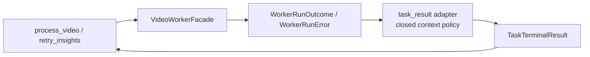

# Video Processing Task-Result Adapter Boundary

**Date:** 2026-07-19
**Status:** Implemented and accepted on 2026-07-19

## Context

Before implementation, `app/src-tauri/src/video_processing.rs` was a 1,238-line application module.
Some of its size is legitimate: it is the Tauri composition point for URL processing, source-identity cache
preflight, AI retry, and cancellation. It also owns several separable policies, including request
preparation, URL cache lookup, preflight outcome handling, task-result adaptation, retry diagnostics,
and the command functions themselves.

The process lifecycle and execution tuple have already moved behind `WorkerLane`, `WorkerJob`, and
`VideoWorkerFacade`. Terminal stdout is already parsed into operation-specific closed DTOs by
`worker_runtime/result_protocol.rs`. The remaining task-result mapping in `video_processing.rs`
converts the typed runtime outcome into the public `TaskTerminalResult` used by process-video and AI
retry commands.

The active local-media plan will add another command to this application boundary. Adding it before
making the current task-result policy explicit would increase the number of command paths that must
repeat or parameterize status, stage, cancellation, transport, protocol, and unstructured-failure
behavior.

This is a maintainability refactor, not a response to a known user-visible defect. The current
focused baseline is green: 18 `video_processing::tests` passed before this design was written.

## Requirements

The first extraction must:

- preserve the exact process-video and retry-insights terminal result shapes;
- preserve cancellation, already-running, transport, protocol, unstructured, pipe, and wait failure
  semantics;
- preserve the structured-result-first behavior already owned by the runner;
- keep fixed stages, statuses, codes, and sanitized messages closed rather than caller-supplied;
- add no command, contract field, manifest field, dependency, network request, filesystem operation,
  log content, or user-visible behavior;
- leave `WorkerJob`, `VideoWorkerFacade`, `WorkerLane`, and terminal protocol ownership unchanged;
- avoid reserving a dead local-media variant before contract v4 and its Python consumer exist; and
- reduce responsibility in `video_processing.rs` without creating another general-purpose facade.

## Alternatives Considered

### 1. Split request, cache, preflight, result, and diagnostics at once

This would produce the smallest final parent file immediately, but it combines multiple failure and
trust boundaries in one review. Cache lookup reads task manifests, request preparation reads local
settings, preflight has deliberately tolerant identity semantics, and result adaptation is pure
application policy. A large move would make behavior drift harder to locate and would collide with
the pending contract-v4/local-media work.

**Decision:** Rejected for the first increment.

### 2. Extract only the task-result adapter, then reassess

This isolates one closed transformation with no filesystem, network, Tauri, account, or manifest
ownership. Existing tests already characterize most branches, and the future local-media command can
join the same explicit policy only when its real worker operation lands.

**Decision:** Selected.

### 3. Wait until local-media implementation finishes

This avoids an immediate refactor but forces contract-v4 work to modify an already broad module and
either duplicate task failure mapping or expand a raw string-parameter API. It also makes review of
new local-path security behavior compete with unrelated existing result policy.

**Decision:** Rejected.

## Decision

Create a private child module:

```text
app/src-tauri/src/video_processing.rs
app/src-tauri/src/video_processing/task_result.rs
```

`video_processing.rs` remains the Tauri command adapter and application orchestrator. The new
`task_result.rs` owns only the conversion from a typed worker runtime outcome to a closed task
terminal result.

The planned application-facing surface is intentionally small:

```rust
pub(super) enum TaskCommandContext {
    ProcessVideo,
    RetryInsights,
}

pub(super) fn map_task_worker_result(
    result: Result<WorkerRunOutcome, WorkerRunError>,
    context: TaskCommandContext,
) -> Result<TaskTerminalResult, String>;
```

`TaskCommandContext` is a closed policy selector, not a wire enum and not a facade. Callers cannot
provide an arbitrary status, workflow stage, error code, or unstructured failure message. Each
variant resolves a fixed policy internally:

| Context | Failure status | Failure stage | Unstructured message |
|---|---|---|---|
| `ProcessVideo` | `failed` | `video_extracting` | `Worker process failed before returning a structured result.` |
| `RetryInsights` | `partial_completed` | `insights_generating` | `AI generation worker failed before returning a structured result.` |

The adapter privately owns construction of synthetic task failures for cancellation,
already-running, request transport, protocol violation, and unstructured worker failure. Every
synthetic value must still pass `TaskTerminalResult::from_value`, so the existing closed protocol
invariants remain the final guard for trusted desktop-created values.

Existing cache-hit and retry diagnostic summaries stay in `video_processing.rs` and
`diagnostics.rs`. Moving logging projection into this module would mix a second responsibility into
the extraction. The adapter accepts no logging callback, event name, raw payload, stderr body, or
arbitrary diagnostic text.

## Result Mapping

The mapping remains exactly:

| Runtime outcome | Task adapter result |
|---|---|
| Structured `TaskTerminalResult` | Return the validated value unchanged |
| Structured non-task family | Fixed `WORKER_PROTOCOL_VIOLATION` task failure |
| `Cancelled` | Fixed `WORKER_CANCELLED` task failure |
| `UnstructuredFailure` | Fixed `WORKER_PROCESS_FAILED` task failure for the selected context |
| `AlreadyRunning` | Fixed `WORKER_ALREADY_RUNNING` task failure |
| `SpawnFailed` or `RequestDeliveryFailed` | Fixed `WORKER_REQUEST_TRANSPORT_FAILED` task failure |
| `ProtocolViolation` | Fixed `WORKER_PROTOCOL_VIOLATION` task failure with an empty public message |
| `PipeUnavailable` or `WaitFailed` | Preserve the existing command error using the runner's fixed static detail |

The adapter does not reinterpret `TaskTerminalResult` content and does not change cancellation race
precedence. Those responsibilities remain in `worker_runtime/runner.rs` and
`worker_runtime/result_protocol.rs`.

## Data Flow



The new adapter is downstream of the runtime and upstream of Tauri command return values. It does
not execute a worker and does not own process lifecycle, progress routing, cache lookup, source
identity, settings, task storage, or IPC request parsing.

## Failure and Security Boundaries

- Rejected or mismatched worker output is never serialized into the synthetic error.
- `WorkerRunError.detail` may cross as a command error only for the existing `PipeUnavailable` and
  `WaitFailed` branches. That field remains a runner-owned `&'static str`; this design does not
  broaden it to runtime or user-controlled text.
- Unstructured stderr remains represented only by its typed classification. The adapter ignores the
  body and returns the existing fixed public message.
- A valid structured task result can contain task paths, transcript text, and generated content. The
  adapter treats that value as an opaque validated object and returns it unchanged; it does not
  inspect, copy into errors, summarize, or log those fields.
- Synthetic failure construction accepts no task path, source URL, local-media path, selection token,
  credential, transcript, prompt, preference, generated body, or raw request payload.
- The adapter cannot select a worker lane, invocation, progress route, environment value, or LLM
  policy.
- No result code, stage, status, or message becomes configurable from IPC.

## Interaction With Local-Media Contract v4

This increment does not add `ProcessLocalMedia` to either `WorkerJob` or `TaskCommandContext`. The
active local-media implementation must add the real worker job, CLI consumer, contract-v4 request,
and its task-result context in the same atomic change.

At that point, the new context must explicitly declare its status, stage, and fixed unstructured
message. It may share values with URL processing, but it must not silently reuse the URL variant if
that would obscure the operation being reviewed. Local path/token values remain outside this
adapter.

After this extraction is implemented and accepted, the local-media ExecPlan should record it as a
completed prerequisite immediately before contract-v4 implementation. No local-media product step
is considered implemented by this refactor.

## Explicit Non-goals

- Do not move URL cache lookup in this increment.
- Do not move source-identity preflight in this increment.
- Do not split request DTOs or retry diagnostics in this increment.
- Do not rename Tauri commands or alter their signatures.
- Do not change desktop-worker contract v3, result families, or task manifest schema v3.
- Do not add local file selection, local-media processing, or new workflow progress.
- Do not make `task_result.rs` a new execution facade.
- Do not use file length as acceptance evidence; responsibility and dependency direction are the
  acceptance criteria.

## Verification Strategy

Implementation must proceed test-first and preserve the current green baseline.

Focused adapter tests must cover:

- exact structured-task passthrough;
- rejection of a structured source/model family as a protocol failure;
- process-video and retry-specific cancellation status/stage shapes;
- process-video and retry-specific unstructured messages;
- already-running, spawn, request-delivery, and protocol failures;
- unchanged `PipeUnavailable` and `WaitFailed` command-error behavior;
- absence of runner detail, stderr, URL-like text, and payload text from synthetic public errors;
- exhaustiveness of the two current contexts.

The existing cache, IPC request, retry request, and retry diagnostic tests stay with
`video_processing.rs`. Tests that solely characterize task outcome mapping move beside the new
module so their ownership matches production code.

Required gates for implementation:

```powershell
cargo test --manifest-path app/src-tauri/Cargo.toml video_processing
cargo test --manifest-path app/src-tauri/Cargo.toml
cargo fmt --manifest-path app/src-tauri/Cargo.toml -- --check
npm --prefix app test
node --test scripts/tests/*.test.mjs
python scripts/validate_agents_docs.py --level WARN
git diff --check
```

No worker suite is required solely for this Rust-only refactor, but the canonical contract and
packaged worker must remain untouched. If implementation changes either one, that is scope drift and
requires returning to design review.

## Consequences

### Positive

- Command functions no longer own generic worker outcome/error classification.
- Process and retry failure policy becomes closed and locally testable.
- The future local-media command has an explicit integration point without adding a general facade.
- The extraction can be reviewed independently from cache, settings, manifest, and local-path work.

### Negative

- The Rust module tree gains one small private file.
- `video_processing.rs` remains a maintenance hotspot after this increment because cache, preflight,
  request preparation, diagnostics, and command orchestration intentionally stay in place.

### Neutral

- File length will decrease, but line count is not the purpose or success metric.
- A later cache/preflight extraction may still be justified, but it requires separate evidence and
  approval after this boundary is stable.

## Rollback

The change has no persisted-data or contract migration. If the extraction introduces unexpected
behavior, move the adapter code and its tests back into `video_processing.rs`; no task files,
settings, manifests, worker resources, or frontend state require repair.

## References

- `docs/design-docs/2026-07-19-typed-worker-job-facade.md`
- `docs/design-docs/2026-07-19-closed-worker-terminal-results.md`
- `docs/design-docs/2026-07-18-process-video-request-contract-v3.md`
- `docs/exec-plans/active/2026-07-16-local-media-file-import-plan.md`
- `app/src-tauri/src/video_processing.rs`
- `app/src-tauri/src/worker_runtime/`
