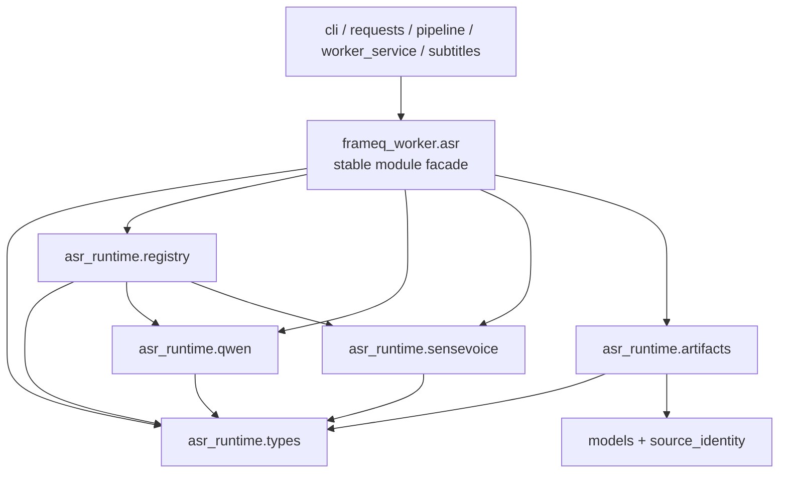

# ASR Application Module Split

**Date:** 2026-07-20

**Status:** Implemented and accepted on 2026-07-21

**Baseline:** `0157e81`

## Context

`worker/frameq_worker/asr.py` is the next unresolved Python maintenance hotspot in the current
code-audit baseline. The file contains 676 physical lines, all of them production code. It currently
owns several responsibilities that have different dependencies and failure behavior:

- the public ASR errors, transcript data objects, `Transcriber` protocol, and model-factory types;
- the supported-model registry, default model, display/family lookup, cache-path policy, and factory
  selection;
- the Qwen model adapter and lazy `qwen_asr` dependency loading;
- the SenseVoice adapter, lazy `funasr` loading, language/tag normalization, sentence extraction,
  optional VAD-block inference, WAV decoding, and audio slicing; and
- transcript `.txt`, `.md`, and optional segment JSON artifact writing, including source-identity
  validation and metadata formatting.

These concerns do not share one failure boundary. A missing model SDK is a fixed ASR dependency
error. A provider inference failure is a terminal ASR runtime error. Failure in the optional
SenseVoice VAD fast path deliberately falls back to full-audio generation. Artifact writing has a
separate local-filesystem and source-identity boundary. Keeping those paths in one file makes a
provider change require reviewing storage behavior, and makes a transcript-format change require
reviewing model-loading code.

The existing module name is also a real compatibility surface. `cli.py`, `requests.py`,
`pipeline.py`, `worker_service.py`, `subtitles.py`, and multiple tests import names from
`frameq_worker.asr`. The split must therefore make ownership smaller without forcing an unrelated
consumer migration or creating a second public API.

This is an internal structural refactor. It changes no user-visible behavior, worker contract,
model lifecycle, local-media behavior, artifact schema, or packaging policy, so no product-spec
change is required.

## Requirements

The split must:

- preserve `worker/frameq_worker/asr.py` as the only supported production import surface for ASR;
- preserve every repository-observed public name, call signature, default value, exception code,
  exception message, return type, and artifact shape exported from that module;
- preserve the supported worker-model order as SenseVoice Small followed by Qwen3-ASR, with
  `iic/SenseVoiceSmall` as the default;
- preserve lazy provider imports and model construction so importing `frameq_worker.asr` does not
  require `funasr`, `numpy`, or `qwen_asr` to be installed or initialized;
- preserve the current SenseVoice VAD optimization as best-effort: missing optional VAD imports,
  invalid VAD output, unsupported WAV input, audio slicing failure, or VAD inference failure must
  fall back to the existing full-audio `generate` call;
- preserve fixed provider model arguments, language mapping, result cleaning, sentence filtering,
  speaker projection, segment IDs/timing, and empty-transcript behavior;
- preserve model-cache directory creation and the exact `MODELSCOPE_CACHE` mutation point;
- validate a transcript source identity before creating or writing the output directory;
- preserve stem and no-stem filenames, UTF-8/newline behavior, Markdown metadata, segment JSON,
  and stale-segment-sidecar removal;
- keep canonical source, provider inference, and official artifact writing local; add no network,
  telemetry, prompt, transcript, path, or model-result logging;
- keep the canonical worker tree under `worker/frameq_worker` authoritative and never hand-edit an
  ignored generated Tauri worker mirror; and
- add source-boundary tests that make the selected ownership and dependency direction enforceable.

## Non-goals

This refactor does not:

- implement local video/audio import or change the active local-media Contract v4 work;
- add, remove, download, expose, or select an ASR model;
- change the Rust ASR model lifecycle, model-download progress, desktop settings, or supported
  desktop allowlist;
- change `ProcessRequest.language`, progress/error registries, task manifests, cache invalidation,
  pipeline stages, subtitles, History, AI generation, Credits, or server behavior;
- make the existing three-file transcript write atomic or alter current partial-write semantics;
- sanitize or otherwise change the current provider exception text wrapped by `ASRRuntimeError`;
- replace the `Transcriber` protocol with a class facade or dependency-injection framework; or
- guarantee compatibility for private Python attributes such as `__module__` or for pickled ASR
  objects. FrameQ does not persist or pickle these runtime objects.

## Alternatives Considered

### 1. Keep the file intact and add headings or comments

Headings would make navigation easier but would not isolate SDK imports, VAD fallback behavior,
cache environment mutation, or artifact filesystem effects. Reviewers would still need to reason
about all five domains for every edit.

**Decision:** Rejected.

### 2. Move everything into one `asr_helpers.py`

A broad helper file would reproduce the same mixed ownership under a less meaningful name. It would
also make it easy for callers to bypass the intended public module.

**Decision:** Rejected.

### 3. Replace `asr.py` with a public `asr/` package

Changing a module into a same-named package can preserve many imports, but it changes import
resolution, module metadata, packaging shape, and review scope. None of those changes is necessary
to isolate the implementation, and current callers do not need public submodules.

**Decision:** Rejected.

### 4. Add an `ASRFacade` class

The existing `Transcriber` protocol already abstracts provider invocation, and the module-level
functions are the established composition API. A new class would wrap stateless registry and
artifact functions without removing a complex external subsystem or adding a useful lifetime.

**Decision:** Rejected.

### 5. Keep `asr.py` as a stable module facade and move implementation into a private package

The established imports remain unchanged while each provider and filesystem failure boundary gains
one owner. The private package name can avoid colliding with the existing module.

**Decision:** Selected.

## Decision

Keep `frameq_worker.asr` as the compatibility module and create this private implementation tree:

```text
worker/frameq_worker/asr.py
worker/frameq_worker/asr_runtime/
  __init__.py
  types.py
  registry.py
  qwen.py
  sensevoice.py
  artifacts.py
```

`asr_runtime/__init__.py` remains empty and is not a secondary facade. Production modules outside
`asr_runtime/` continue importing only from `frameq_worker.asr`.

| Module | Owns | Must not own |
|---|---|---|
| `asr.py` | stable imports/re-exports and the documented compatibility surface | provider SDK imports, VAD/WAV logic, cache environment mutation, JSON/Markdown/file writes, pipeline orchestration |
| `asr_runtime/types.py` | ASR error hierarchy, transcript data objects, protocol/factory/spec types, narrow provider-result text coercion, missing-dependency message construction | model registry, provider SDK imports, cache directories, WAV/VAD, source identity, artifact writes |
| `asr_runtime/registry.py` | default/cache constants, ordered model specs, name/family/display lookup, cache-path policy, ModelScope cache configuration, adapter factory selection | provider-specific model/VAD constants, inference calls, result cleaning, WAV/VAD, transcript formatting or writes |
| `asr_runtime/qwen.py` | Qwen model ID, adapter, lazy SDK import, model construction/caching, provider call, empty-result and dependency/runtime error mapping | SenseVoice, VAD/WAV, registry policy, environment mutation, artifact writes |
| `asr_runtime/sensevoice.py` | SenseVoice model/VAD constants and private tag pattern, adapter, lazy SDK import, fixed model/generate arguments, language/tag normalization, sentence segments, best-effort VAD-block path, WAV decoding/slicing | Qwen, registry policy, environment mutation, source identity, transcript artifact writes |
| `asr_runtime/artifacts.py` | `transcribe_and_write`, source-identity validation, output filenames, `.txt`/Markdown/segment JSON writes, stale segment removal | provider SDKs, model selection, VAD/WAV, pipeline or task finalization |

The two shared helpers in `types.py` are deliberately narrow contract helpers rather than a generic
utility bucket:

- normalize the provider result containers already accepted by both adapters into text; and
- produce the existing fixed missing-runtime-dependency guidance.

If either helper later gains provider-specific behavior, it must move to that provider module
instead of expanding `types.py` into a general helper owner.

## Stable Compatibility Surface

The root module must continue exposing the following repository-observed names:

```python
# Errors and data/protocol types
ASRError
ASRDependencyError
ASRRuntimeError
ASREmptyTranscriptError
ASRUnsupportedModelError
TranscriptSegment
Transcript
TranscriptArtifacts
Transcriber
ModelFactory
AsrModelSpec

# Registry and constants
QWEN_ASR_MODEL
SENSEVOICE_SMALL_MODEL
DEFAULT_ASR_MODEL
DEFAULT_MODEL_CACHE_ENV
MODELSCOPE_CACHE_ENV
SENSEVOICE_VAD_MODEL
SENSEVOICE_VAD_MAX_SEGMENT_TIME_MS
SUPPORTED_ASR_MODELS
supported_asr_model_names
resolve_asr_model_name
asr_model_display_name
asr_model_family
resolve_model_cache_dir
configure_modelscope_cache_dir
build_qwen_asr_transcriber
build_sensevoice_transcriber
build_asr_transcriber

# Adapters and artifacts
QwenAsrTranscriber
SenseVoiceTranscriber
transcribe_and_write
write_transcript_files
```

`SENSEVOICE_TAG_PATTERN` remains a private SenseVoice implementation detail and is not added to the
stable root compatibility list.

The root re-exports the actual objects from their private owners; it does not create duplicate
error classes, dataclasses, adapters, or wrapper functions. Provider-specific constants remain with
their adapters so neither provider imports the registry that constructs it. `registry.py` imports
those constants to build the ordered public model table and default/factory policy. Boundary tests
assert object identity for definitions/functions and exact values/order for constants, for example:

```python
assert frameq_worker.asr.Transcript is frameq_worker.asr_runtime.types.Transcript
assert frameq_worker.asr.QwenAsrTranscriber is frameq_worker.asr_runtime.qwen.QwenAsrTranscriber
assert frameq_worker.asr.write_transcript_files is (
    frameq_worker.asr_runtime.artifacts.write_transcript_files
)
```

Moving definitions changes their implementation `__module__` value. The supported compatibility
contract is the stable root import, public name, object identity, constructor/function signature,
error and behavior—not private module metadata or pickle byte compatibility.

No current production caller needs modification:

- `cli.py` keeps importing `DEFAULT_ASR_MODEL` and `build_asr_transcriber`;
- `requests.py` keeps importing `DEFAULT_ASR_MODEL`;
- `pipeline.py` keeps importing its current errors, types, adapters, cache/factory, and artifact
  functions;
- `worker_service.py` keeps importing `DEFAULT_ASR_MODEL`, `Transcriber`, and the factory; and
- `subtitles.py` keeps importing `TranscriptSegment`.

## Behavior and Failure Matrix

| Condition | Required behavior |
|---|---|
| missing/blank model name | resolve to `iic/SenseVoiceSmall` |
| supported-model enumeration | return SenseVoice Small, then Qwen3-ASR, in the current order |
| unknown model | raise `ASRUnsupportedModelError` with code `ASR_MODEL_UNSUPPORTED` and current message |
| no `FRAMEQ_MODEL_DIR` entry in the supplied environment | resolve `<project_root>/models` |
| explicit cache for Qwen | create the directory and pass its POSIX path as `cache_dir` |
| explicit cache for SenseVoice | create it and set `MODELSCOPE_CACHE` to its POSIX path |
| provider SDK absent during lazy model construction | raise `ASRDependencyError` with code `ASR_DEPENDENCY_MISSING` and current install guidance |
| Qwen/SenseVoice main provider call raises | wrap `str(exc)` in `ASRRuntimeError`, preserving the provider exception as cause |
| provider returns no usable text | raise `ASREmptyTranscriptError` with code `ASR_EMPTY_TRANSCRIPT` and current message |
| SenseVoice optional VAD path unavailable or fails | return no optimized result and run the current full-audio `generate` fallback |
| SenseVoice VAD blocks succeed | clean tags, keep valid block order/timing, generate stable `seg-0001` IDs, and join text with spaces |
| SenseVoice sentence metadata is missing/malformed | keep the usable transcript text and omit invalid segments |
| transcript text is blank | fail before source validation or filesystem mutation |
| source identity is unsafe for persistence | fail before `output_dir.mkdir` and before any transcript write |
| non-empty output stem | write `<stem>_transcript.txt`, `<stem>_transcript.md`, and optional `<stem>_transcript_segments.json` |
| empty output stem | write `transcript.txt`, `transcript.md`, and optional `segments.json` |
| non-empty segments | write pretty UTF-8 JSON with `ensure_ascii=False` and one trailing newline |
| no segments | remove an existing matching segment sidecar and return `segments_path=None` |

## Provider Invariants

### Qwen

- Import `Qwen3ASRModel` only inside the default model loader.
- Keep constructor defaults `max_inference_batch_size=4` and `max_new_tokens=4096`.
- Call `from_pretrained` with the existing model name and keyword arguments.
- Call `model.transcribe(audio=audio_path.as_posix(), language=language)` exactly once per request.
- Trim usable text and return the caller-supplied language unchanged.

### SenseVoice

- Import `AutoModel` only inside the default model loader.
- Keep `vad_model="fsmn-vad"`, `max_single_segment_time=30000`, and
  `trust_remote_code=True` model construction.
- Preserve language mapping: Chinese aliases to `zh`, English aliases to `en`, and everything else
  to `auto`.
- Preserve the full-audio arguments `use_itn=True`, `batch_size_s=60`, `merge_vad=True`,
  `merge_length_s=15`, and a fresh empty cache.
- Remove current SenseVoice tags but do not otherwise translate or rewrite transcript text.
- Keep sentence timing coercion, invalid-item filtering, source order, optional speaker handling, and
  stable sequential segment IDs.

### SenseVoice VAD fallback

The optional VAD-block path is an optimization, not a second public failure mode:

1. It runs only when the model exposes both `vad_model` and `inference`.
2. Missing `numpy` or `funasr.utils.vad_utils` returns `None` and selects full-audio generation.
3. Empty/invalid VAD output, unsupported/non-readable PCM WAV, empty audio slices, VAD inference
   exceptions, or empty block transcripts return `None`.
4. A successful path preserves merged block timing and returns a segmented transcript.
5. Only a failure from the subsequent main `model.generate` call becomes `ASRRuntimeError`.

This fallback distinction must be characterized before moving the code because a broad exception
cleanup could otherwise turn recoverable optimization failures into task failures.

## Artifact Invariants

`asr_runtime/artifacts.py` remains the only ASR implementation module that imports
`TranscriptMetadata`, `SourceIdentity`, `canonical_url_for_persistence`, and `json`, or writes
official transcript artifacts.

The operation order stays:

1. trim and reject empty text;
2. construct or accept transcript metadata;
3. validate/project the canonical source URL for persistence;
4. create the output directory;
5. choose the established stem/no-stem paths;
6. write `.txt` and Markdown;
7. write the segment sidecar or remove the stale sidecar; and
8. return `TranscriptArtifacts`.

The writer remains a direct multi-file operation. This split does not claim crash-atomic behavior:
an error writing a later file can occur after an earlier file was updated, exactly as in the
baseline. Atomic transcript artifact commit requires its own design because it would change failure
and recovery behavior.

## Dependency Direction



Enforced direction rules:

- no private module imports `frameq_worker.asr`;
- no production module outside `asr_runtime/` imports `frameq_worker.asr_runtime.*`;
- no private module imports `pipeline`, `worker_service`, `cli`, `media`, task-store/application
  orchestration, progress, LLM, or server code;
- neither provider module imports `registry.py`; registry may depend on the providers, never the
  reverse;
- only `qwen.py` contains the `qwen_asr` import;
- only `sensevoice.py` contains `funasr`, `numpy`, and `wave` dependencies;
- only `registry.py` mutates `MODELSCOPE_CACHE` or creates a model cache directory; and
- only `artifacts.py` owns source-identity persistence and transcript filesystem writes.

## Security and Operational Constraints

- The split adds no input surface. Audio/output paths continue coming from the existing worker
  pipeline and task-local preparation, not from a new frontend or server request.
- No module may log model prompts/results, transcript text, full user paths, source credentials,
  cookies, or provider payloads.
- Provider exception wrapping remains unchanged for compatibility. This design does not claim that
  arbitrary third-party exception text is sanitized; it only prevents the refactor from adding new
  exposure paths.
- Model imports stay lazy so normal contract parsing, CLI help, and tests do not load heavy runtime
  dependencies or trigger model/network work.
- No automated test downloads or initializes a real ASR model. Provider behavior uses injected fake
  factories and fake model objects.
- `worker/frameq_worker` is canonical. Any packaged worker mirror is refreshed only through the
  established installer/build path and verified by recursive file-set and byte equality.

## Interaction with Active Local-media Work

The active local-media plan will reuse the same ASR path after video/audio normalization. This
refactor prepares that path for safer maintenance but does not implement the source union, opaque
selection token, Rust IPC, local-media worker operation, source-aware manifest, or UI.

The split must therefore leave these files and contracts unchanged:

- `contracts/desktop-worker-contract.json`;
- `worker/frameq_worker/requests.py` request behavior;
- `worker/frameq_worker/pipeline.py` stage behavior and public imports;
- Rust Tauri selection/worker job/task-result/task-manifest modules; and
- all React local-media composition.

The local-media implementation may later call the same root ASR facade with a prepared canonical
audio file. It must not import a provider-specific private module.

## Test Strategy

Implementation follows characterization-first extraction:

1. extend `worker/tests/test_asr.py` for currently implicit registry errors, provider error mapping,
   SenseVoice VAD fallback, no-stem artifacts, and pre-write source validation;
2. add `worker/tests/test_asr_module_boundaries.py` and establish one expected RED because the
   approved private package does not yet exist;
3. move one responsibility at a time while keeping behavior tests green;
4. make the boundary suite green only after the final stable root and all owners exist; and
5. run the full worker and cross-layer packaging/governance gates.

The boundary suite must use AST/path inspection rather than line-number or formatting-sensitive
whole-source comparisons. It verifies:

- the exact private file set and empty initializer;
- owner symbols and forbidden dependencies per module;
- exact root re-export identity for public errors, data objects, adapters, registry/artifact
  functions, plus exact public constant values and model order;
- a fresh-process root import that does not load `qwen_asr`, `funasr`, or `numpy`;
- no private imports from production callers and no production callers bypassing the root; and
- a root `asr.py` below 120 physical lines with no provider SDK, WAV, JSON, source-identity, or
  filesystem implementation.

## Implementation Order

1. Lock behavior gaps and establish the ownership-boundary RED.
2. Extract types/errors/shared provider-result contract helpers.
3. Extract Qwen adapter behavior.
4. Extract SenseVoice normalization, VAD, WAV, and adapter behavior.
5. Extract registry/cache/factory behavior.
6. Extract artifact writing and Markdown formatting.
7. Reduce `asr.py` to exact compatibility re-exports and turn the boundary suite green.
8. Run complete validation, update durable architecture/security/audit evidence, and archive the
   ExecPlan only after user-approved implementation is complete.

## Implementation Outcome

The approved boundary is implemented without changing production callers. `asr.py` is now 52
physical lines and contains only explicit compatibility re-exports. The private implementation
owners measure 95 lines for `types.py`, 77 for `qwen.py`, 316 for `sensevoice.py`, 113 for
`registry.py`, and 132 for `artifacts.py`; `asr_runtime/__init__.py` is empty.

Behavior-first validation added five missing characterizations and nine structural boundary tests.
The ownership suite first produced the intended RED because the six approved private files were
absent, then passed 9/9 after extraction. Focused ASR plus boundary coverage passes 32/32, including
exact public object identity, model constants/order, provider error/fallback behavior, artifact
bytes and source-validation order, private dependency direction, and fresh-process SDK laziness.

Full regression evidence is 515/515 worker tests, Ruff clean, scripts 23/23 plus installer tests
5/5, app 549/549, TypeScript/i18n lint clean, frontend build clean, Rust 173/173 under normal Windows
process permissions, rustfmt clean, and Tauri no-bundle release build clean. The established worker
resource refresh plus complete relative-path/SHA-256 comparison proves all 56 packaged files match
the canonical worker tree byte-for-byte.

No real ASR model was loaded and no network, cloud LLM, or AI Credit was used. The existing
`pydub`/`audioop` Python 3.13 warning and frontend chunk-size warning remain unrelated debt. Native
third-party model introspection and a real packaged-model transcription remain residual release
risks, not blockers for this internal structural refactor.

## Acceptance Criteria

- `frameq_worker.asr` remains the only production import path; public definitions/functions keep
  exact root identities, while constants keep exact values/order and every symbol keeps its
  signature/default/error/behavior contract.
- The five private implementation owners match this document and the root is under 120 physical
  lines.
- Existing 18 focused ASR tests plus new behavior and boundary tests pass.
- Optional SenseVoice VAD failures still degrade to full-audio generation; main provider failures
  remain terminal.
- Transcript source validation still occurs before output-directory creation and artifact paths and
  bytes remain unchanged.
- No contract, request, pipeline, task manifest, app, server, model-download, local-media runtime,
  or user-visible behavior changes.
- Full worker, Ruff, app, Rust, scripts, packaging mirror, governance, format, build, and diff gates
  pass as specified by the active ExecPlan.
- Real-model smoke is optional release evidence and is recorded as residual risk when not run; no
  automated validation consumes a model download or cloud/AI Credit.
