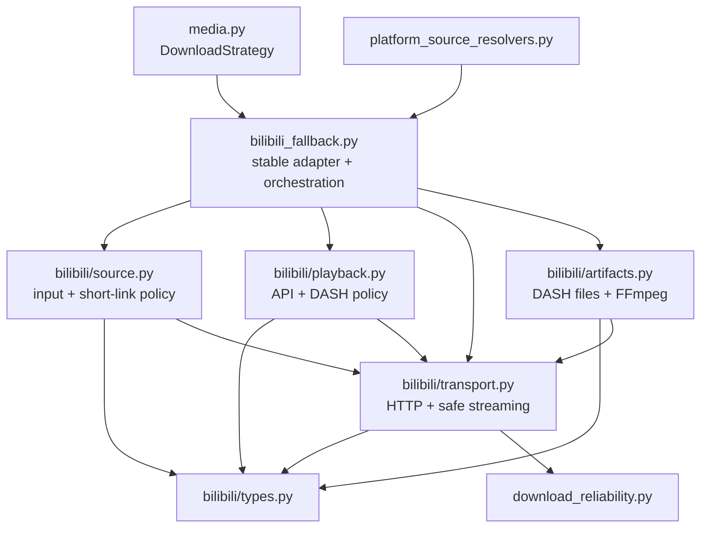

# Bilibili Fallback Module Split

**Date:** 2026-07-20
**Status:** Implemented and accepted
**Baseline:** `35fccd0`

## Context

Before this change, `worker/frameq_worker/bilibili_fallback.py` was a 936-line production module
that implemented the complete ordinary-public-video fallback behind one stable import path. The
baseline module owned:

- BV/av/share-text parsing, safe Bilibili host checks, `?p=N` selection, and bounded `b23.tv`
  resolution;
- public view/playurl request construction, response decoding, API failure classification, and page
  selection;
- DASH video/audio compatibility parsing, DRM rejection, deterministic stream ranking, and backup
  URL ordering;
- `urllib` request and resumable stream-download behavior;
- temporary `.m4s` lifecycle, FFmpeg stream-copy merge, final MP4 replacement, and cleanup; and
- workflow progress emission plus the top-level fallback orchestration.

These responsibilities fail for different reasons and have different dependencies. Source parsing
needs URL and redirect policy. Playback interpretation should be deterministic over bounded response
data. Network transport owns request/response and safe streaming behavior. Artifact assembly owns
filesystem and subprocess effects. Keeping them together makes a change to one platform rule compete
with unrelated download and merge code in the same review.

The repository-observed compatibility surface is wider than the production caller surface:

- `media.py` imports `BilibiliFallbackError` and `download_bilibili_video`;
- `platform_source_resolvers.py` imports `BilibiliFallbackError` and `parse_bilibili_input`;
- focused and cross-layer tests import `HttpResponse`, URL builders, stream selection, and the data
  types from `bilibili_fallback.py`; and
- `test_progress_events.py` requires all five `bilibili.*` producer codes to remain visible in the
  root producer module.

At the baseline, the Bilibili/media/source/progress focused regression set passes 169 tests. This is
an internal structural refactor. It must not change accepted URLs, platform policy, fallback order,
progress, errors, output names, artifact lifecycle, task results, or user-visible behavior.

## Requirements

The split must:

- retain `worker/frameq_worker/bilibili_fallback.py` as the only production import path used by
  modules outside the private Bilibili implementation;
- keep `yt-dlp` first and preserve the existing Douyin -> Xiaohongshu -> Bilibili fallback strategy
  order in `media.py`;
- preserve direct BV/av parsing, share-text extraction, safe `b23.tv` resolution, redirect depth,
  HTTP-to-HTTPS retry, final-host validation, ordinary `/video/` restriction, and zero-based internal
  part indexing;
- preserve the public view and playurl endpoints, query parameters, fixed headers, request timeouts,
  response-size limit, compression compatibility, and current fixed error codes;
- preserve DASH field compatibility, AV1 -> HEVC -> H.264 codec preference, bandwidth/pixel/quality
  tie-breakers, highest-bandwidth audio selection, DRM rejection, and ordered URL deduplication;
- preserve Range resume and restart-on-invalid-Content-Range behavior through the shared safe
  download writer;
- preserve output stems (`<bvid>.mp4` or `<bvid>_p<N>.mp4`), `.m4s` names, merge staging name,
  FFmpeg `-c copy`, and final `os.replace` semantics;
- preserve the current failure cleanup contract: remove merge staging and `.part` files on every
  terminal path, retain completed `.m4s` inputs after a failed acquisition/merge, and remove them
  only after a successful final replacement;
- preserve the five registered progress codes, their `video_extracting` stage, and progress values
  `22/26/30/32/34` in the root orchestration module;
- keep raw submitted/media URLs, cookies, `SESSDATA`, request headers, FFmpeg command/output, and
  exception text out of returned public errors and progress;
- add focused dependency tests before moving implementation; and
- add no general platform downloader framework, base fallback class, service locator, new product
  capability, contract field, progress code, error code, or UI change.

## Non-goals

This refactor does not:

- add login, QR login, browser-cookie import, SESSDATA, CAPTCHA solving, proxy rotation, PGC/bangumi,
  VIP/member-only, private-video, DRM-decryption, batch, playlist, or download-center behavior;
- change frontend URL admission or the shared platform URL support contract;
- change subtitle-first behavior, SourceIdentity canonicalization, task manifests, History, ASR, AI,
  or local-media import;
- extract or redesign `media.py`'s three-platform strategy table;
- create shared HTTP/response/download modules for Douyin or Xiaohongshu; or
- hand-edit the generated Tauri worker resource mirror.

## Alternatives Considered

### 1. Keep the file intact and add comments

This retains the current review hotspot. Comments cannot enforce import direction, failure ownership,
or side-effect isolation.

**Decision:** Rejected.

### 2. Move most helpers into one `bilibili_helpers.py`

This reduces the root file's line count but keeps URL policy, API interpretation, network transport,
and artifact mutation mixed behind a generic name. It improves appearance without creating stable
review or test boundaries.

**Decision:** Rejected.

### 3. Create one reusable multi-platform fallback framework

The three platforms have materially different source identity, response formats, stream topology,
cookie behavior, download rules, and failure vocabularies. A shared framework would either expose a
large optional interface or hide platform policy behind callbacks. Existing shared reliability
primitives and `DownloadStrategy` already cover the genuinely common boundaries.

**Decision:** Rejected.

### 4. Keep the root compatibility module and add a private Bilibili package split by failure boundary

This preserves every caller path while making source, playback, transport, and artifact changes
independently reviewable. Ordinary functions and immutable data types are sufficient; no new facade
class is required.

**Decision:** Selected.

## Decision

Use the following private module tree:

```text
worker/frameq_worker/bilibili_fallback.py
worker/frameq_worker/bilibili/
  __init__.py
  types.py
  source.py
  playback.py
  transport.py
  artifacts.py
```

The package is internal. `bilibili/__init__.py` contains no compatibility re-exports; callers keep
using `frameq_worker.bilibili_fallback`.

| Module | Owns | Must not own |
|---|---|---|
| `bilibili_fallback.py` | stable imports/re-exports, client/runner defaults, download workflow, page choice, output stem, progress emission | URL grammar internals, response decompression, stream ranking internals, raw `urllib`, safe-download implementation, FFmpeg execution internals |
| `bilibili/types.py` | fixed error type, immutable response/source/video/page/DASH/command values, narrow structural client/runner types | parsing, HTTP, filesystem, subprocess, progress |
| `bilibili/source.py` | direct ID and ordinary-video URL parsing, host/path policy, share-text extraction, part index, bounded short-link resolution | public APIs, DASH, media download, FFmpeg, output paths, progress |
| `bilibili/playback.py` | public API URL construction, bounded JSON/API interpretation, page metadata, DASH validation/ranking, quality labels, DRM/login/no-stream failure policy | network execution, source redirects, filesystem, subprocess, progress |
| `bilibili/transport.py` | fixed public headers, bounded response decoding, `urllib` GET, resumable safe streaming, Range restart, response chunks | source grammar, page/stream selection, output naming, FFmpeg, progress |
| `bilibili/artifacts.py` | backup URL attempts, `.m4s` acquisition, FFmpeg `-c copy`, merge-output validation, staging/final cleanup primitives | source/API parsing, stream ranking, task manifests, ASR, progress |

`bilibili_fallback.py` remains a module-level application adapter, not a new facade object. It is the
only place that knows the complete fallback sequence:

```text
parse source
  -> emit metadata progress
  -> request and parse video info
  -> choose requested page
  -> emit stream progress
  -> request and select DASH pair
  -> derive task-local output paths
  -> emit/download video
  -> emit/download audio
  -> emit/merge
  -> atomically replace final MP4
```

## Compatibility Surface

The root module continues to bind the following repository-observed names to the same semantic
types/functions:

```python
BilibiliFallbackError
HttpResponse
CommandResult
BilibiliParseResult
BilibiliPage
BilibiliVideoInfo
BilibiliDashSelection
UrllibBilibiliHttpClient
parse_bilibili_input
build_video_info_url
build_playurl_url
select_dash_stream_pair
download_bilibili_video
```

The signatures of `parse_bilibili_input`, `select_dash_stream_pair`, and
`download_bilibili_video` remain compatible with existing fake clients and runners. In particular,
the currently unused `duration_seconds` argument remains accepted; removing or assigning new
semantics to it is outside this structural change.

Implementation-only constants and underscore-prefixed helpers are not a cross-module API. The plan
may move them to their owning private module, but behavior tests must prove the resulting policy is
unchanged.

## Failure Ownership

| Failure family | Owning boundary | Stable codes |
|---|---|---|
| source syntax/host/content/short link | `source.py` | `BILIBILI_ID_PARSE_FAILED`, `BILIBILI_UNSUPPORTED_CONTENT`, `BILIBILI_SHORT_LINK_RESOLVE_FAILED` |
| metadata/API/page | `playback.py` plus root page choice | `BILIBILI_VIDEO_INFO_UNAVAILABLE`, `BILIBILI_PART_NOT_FOUND`, `BILIBILI_LOGIN_REQUIRED` |
| playback/DASH policy | `playback.py` | `BILIBILI_NO_PLAYABLE_STREAM`, `BILIBILI_DRM_PROTECTED`, `BILIBILI_LOGIN_REQUIRED` |
| network stream acquisition | `transport.py` + `artifacts.py` | `BILIBILI_DASH_DOWNLOAD_FAILED` |
| FFmpeg merge/final staging | `artifacts.py` | `BILIBILI_FFMPEG_MERGE_FAILED` |

Child modules raise only `BilibiliFallbackError` with the current fixed English internal message.
They do not attach URLs, response bodies, headers, commands, stdout/stderr, or arbitrary exception
text. The existing `media.py` mapping remains the only conversion into a `CommandResult` consumed by
the worker pipeline.

## Artifact Lifecycle

The split preserves this state table:

| Terminal point | Existing completed MP4 | Complete video/audio `.m4s` | `.part` files | merge staging |
|---|---|---|---|---|
| metadata/selection failure | untouched | none | none | none |
| video/audio download failure | untouched | any completed input remains | removed | removed |
| FFmpeg failure/missing output | untouched | both completed inputs remain | removed | removed |
| successful merge and `os.replace` | atomically replaced | removed | removed | removed |

The refactor must not replace a valid final MP4 before a non-empty merge staging file exists. It also
must not broaden cleanup to arbitrary files or directories.

## Dependency Direction



No private Bilibili module imports `media.py`, `pipeline.py`, `media_preparation.py`, source identity,
task storage, ASR, AI, or the root compatibility module. This prevents cycles and keeps the root the
only application composition point.

## Security and Operational Constraints

- The split must preserve public/no-cookie behavior. No child module accepts a cookie jar, browser
  profile, SESSDATA, credential, proxy, authorization header, or arbitrary header input from callers.
- Redirect and API/media targets remain derived only from the submitted Bilibili input and public
  Bilibili responses, with current final-host validation for source URLs.
- Full volatile CDN URLs may exist in worker memory only for selection/download. Tests, returned
  errors, progress, diagnostics, and new documentation fixtures must not print them as failure detail.
- Compressed responses already have an input-size check. A focused test should additionally reject
  decoded output above the same limit with the existing fixed failure code; implement this hardening
  in a separate pre-extraction commit so it is distinguishable from file movement. A post-decode
  rejection does not by itself prove a strict peak-memory bound for every compression library, so
  that narrower residual risk must not be overstated in closeout evidence.
- `subprocess.run` remains `shell=False` through list arguments. Raw FFmpeg stdout/stderr and local
  paths never become a `BilibiliFallbackError` message.
- The canonical worker tree is edited only under `worker/frameq_worker`. The generated Tauri resource
  mirror is refreshed by the existing synchronization path and checked recursively for file and byte
  equality.

## Implementation Order

1. Add behavior characterization for public imports, compressed/decoded response bounds, backup URL
   order, artifact preservation, progress, and caller paths.
2. Add RED AST/import-boundary tests for the proposed private package and root ownership.
3. Add decoded-body size enforcement under the existing fixed failure semantics and make its focused
   test GREEN before moving code.
4. Extract shared immutable types and re-export them from the root.
5. Extract source parsing/short-link policy, then playback/API/DASH policy, keeping focused tests
   green after each move.
6. Extract transport, safe download, and artifact/FFmpeg effects; reduce the root to stable
   composition and progress.
7. Run cross-layer and full gates, refresh the packaged worker only through the established path,
   update architecture/security/audit evidence, and archive the dedicated ExecPlan.

Each extraction is independently reviewable and must keep the focused suite green. Any change to
accepted inputs, error code, progress tuple, candidate ranking, output path, cleanup semantics,
fallback order, or public import path stops the refactor and returns it to design review.

## Acceptance

- `bilibili_fallback.py` contains compatibility bindings, orchestration, and progress only.
- Private modules match the responsibility and dependency table above; AST tests reject back-edges
  and production imports of private modules outside the root.
- All repository-observed root imports remain valid and refer to one shared error/data type identity.
- Existing focused 169/169 behavior remains green before new tests; all new characterization and
  boundary tests pass after extraction.
- URL support, source identity, fallback dispatch/order, API and stream policy, progress tuples,
  error codes, artifact lifecycle, and final MP4 behavior are unchanged except for the explicit
  decoded-body safety cap.
- Ruff, the complete worker suite, app/Rust/script regression gates, packaged-worker equality,
  Tauri no-bundle build, governance validation, and `git diff --check` pass.
- Optional live Bilibili smoke uses one stable ordinary public video without credentials. If no
  stable sample/network is available, the plan records this as unverified rather than weakening the
  automated or security boundary.

## Implementation Evidence

The implemented root adapter is 137 lines. The private package contains a 1-line internal
`__init__.py`, 54-line `types.py`, 172-line `source.py`, 213-line `playback.py`, 256-line
`transport.py`, and 74-line `artifacts.py`; the complete physical implementation is 907 lines versus
the 936-line baseline module. Production callers continue to import only
`frameq_worker.bilibili_fallback`, and root compatibility/type-identity tests cover every
repository-observed binding.

TDD evidence captured the expected RED states for the missing decoded-output check, missing private
modules, transport ownership, artifact ownership, and direct-ID lazy-client regression. The final
focused Bilibili/media/source/progress boundary set passes 183/183; the complete worker suite passes
450/450 with Ruff clean. App tests pass 549/549 with lint and production build clean. Rust passes
169/169 under normal Windows subprocess permissions; the sandboxed run's blocked-stdin fixture was
re-run outside that process restriction. Node cross-layer tests pass 23/23, Cargo formatting passes,
all six canonical/private-package files match the generated Tauri mirror by SHA-256, and the Tauri
no-bundle release build succeeds.

No credential-free live Bilibili platform smoke was run because no stable sample was selected for
this implementation session. Current public API/CDN availability therefore remains explicitly
unverified rather than inferred from fake-client coverage.

## Residual Risk

Bilibili APIs, response fields, CDN behavior, and public codec availability can change outside the
repository. Unit tests and fake clients prove deterministic policy but cannot prove current public
platform availability. The decoded-output check rejects oversized results but may still allocate
library-produced output before rejection; a true streaming peak-memory guarantee would require a
separate compression-specific design. Moving code also cannot eliminate the maintenance cost of
Bilibili-specific policy; it only makes the failure and dependency boundaries reviewable. The later
Xiaohongshu and Douyin audits must start from their own behavior rather than copying this package
structure mechanically.
