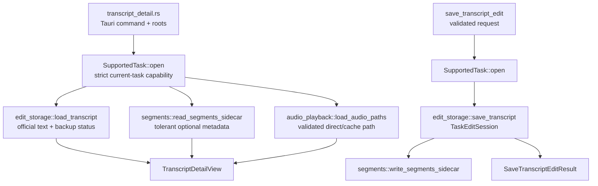
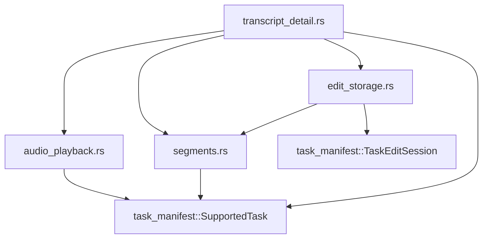

# Transcript Detail Application Module Split

**Date:** 2026-07-20
**Status:** Implemented and accepted on 2026-07-20

## Context

`app/src-tauri/src/transcript_detail.rs` is the next unresolved Rust maintenance hotspot in the
code-audit baseline. The approved baseline contains 1,133 physical lines: 552 lines before the test
module and 580 lines of inline characterization tests. Production code currently combines four
responsibilities with the Tauri command root:

- `load_transcript_detail` / `save_transcript_edit` runtime-path resolution and command composition;
- validated transcript text loading, fixed official-path policy, one-time original backups,
  Markdown replacement, segment persistence, and manifest preview updates;
- tolerant segment-sidecar parsing and strict edited-segment encoding; and
- direct or app-local-cached audio playback path preparation, including link/reparse protection and
  temporary-file installation.

These responsibilities share the validated `SupportedTask` capability, but they do not share the
same failure boundary. Segment corruption deliberately degrades to an empty list. Missing audio
deliberately degrades to text-only review. Transcript edit failures are recoverable errors and must
not weaken fixed-path, backup, or manifest rules. Audio-cache installation is rebuildable and must
never become task authority.

The existing Task Access Facade decision remains authoritative: raw `TaskManifest` parsing,
support/privacy predicates, relative artifact resolution, canonical containment, and manifest
writes stay private to `task_manifest.rs`. This change is an internal structural refactor. It does
not add user-visible behavior and therefore does not require a product-spec change.

## Requirements

The split must:

- keep `transcript_detail.rs` as the only crate-visible transcript-detail module and preserve the
  exact `load_transcript_detail` and `save_transcript_edit` Tauri command paths, request DTOs,
  result DTOs, aliases, and error strings;
- keep `app/src-tauri/src/lib.rs`, frontend clients, IPC payloads, task manifest schema v3,
  desktop-worker contract v4, and local-media runtime scope unchanged;
- require the root to open tasks only through `SupportedTask::open` and pass validated capabilities
  into private child modules;
- keep transcript mutation behind `TaskEditSession`; no child may parse or write raw
  `frameq-task.json`;
- preserve the official paths `transcript/transcript.txt`, `transcript/transcript.md`, and
  `transcript/segments.json` and reject alternate, linked, reparse, or escaping targets;
- preserve one-time `.txt` and existing `.md` backups under `transcript/original/` without backing
  up unsupported or quarantined task metadata;
- preserve Markdown prefix content before the first `## Transcript` marker and preserve the
  existing fallback Markdown template when the marker is absent;
- preserve tolerant segment reads, strict segment writes, speaker-as-metadata semantics, and the
  current empty-segment behavior;
- preserve the direct-audio path for app-local outputs, the rebuildable
  `.frameq-audio-review/<task_id>/audio.<ext>` copy for custom outputs, the six-extension allowlist,
  and the current hard-link/symlink/reparse handling;
- add no network access, logging, arbitrary file selection, generic storage facade, service
  locator, callback abstraction, or second task-access owner; and
- move existing tests without deleting their behavior and add characterization for currently
  implicit segment, audio-routing, Markdown-prefix, and empty-segment rules before extraction.

## Alternatives Considered

### 1. Keep the file intact because half of it is tests

Moving the test module alone would lower the visible line count but would leave transcript edits,
segment parsing, and audio-cache effects in one production file. Those areas have distinct
dependencies and recovery behavior, so the maintenance pressure is not only a line-count artifact.

**Decision:** Rejected.

### 2. Split only the inline tests

This is a useful final cleanup step, but it does not isolate filesystem effects or make ownership
reviewable. A future change to audio caching or segment encoding would still require navigating the
same mixed production module.

**Decision:** Rejected as the complete solution. Existing integration tests will move to a private
test file after production ownership is separated.

### 3. Add `TranscriptDetailFacade` or move transcript behavior into `task_manifest.rs`

`SupportedTask` and `TaskEditSession` already provide the non-bypassable task trust boundary. A new
facade would wrap a single root caller without hiding another complex external subsystem. Moving
audio cache, segment codecs, or Markdown policy into `task_manifest.rs` would instead mix
application-specific behavior into the raw manifest trust owner and make the future local-source
predicate harder to review.

**Decision:** Rejected.

### 4. Split by current workflow and failure boundary

Keep command composition in the root, isolate audio playback preparation, isolate segment codec
behavior, and isolate official transcript edit persistence. Each child receives only the validated
capability and values it needs.

**Decision:** Selected.

## Decision

Use this private module tree:

```text
app/src-tauri/src/transcript_detail.rs
app/src-tauri/src/transcript_detail/
  audio_playback.rs
  segments.rs
  edit_storage.rs
  tests.rs
```

The responsibility map is:

| Module | Owns | Must not own |
|---|---|---|
| `transcript_detail.rs` | child declarations, existing IPC DTOs, thin Tauri commands, runtime-root composition, validated task opening, load-result assembly | raw manifest parsing, audio copying, segment JSON, backup/Markdown/file-write internals |
| `audio_playback.rs` | optional audio lookup through `SupportedTask`, extension policy, direct-vs-cache routing, canonical cache containment, temp copy/install, playable-path projection | Tauri commands, transcript text, segments, `TaskEditSession`, settings, network, raw manifests |
| `segments.rs` | fixed segment path, tolerant sidecar decode/filtering, strict edited-segment validation/encoding | Tauri commands, audio, backups, Markdown, manifest parsing, task opening |
| `edit_storage.rs` | official transcript path validation, transcript load, linked-target rejection, one-time backups, Markdown replacement, save ordering, segment delegation, preview/artifact registration through `TaskEditSession` | Tauri/runtime paths, audio cache, raw manifests, task support predicates, network |
| `tests.rs` | current command-level characterization fixtures plus new behavior and dependency-boundary evidence | production helpers or alternate application behavior |

Only the root remains `pub(crate)`. Child entry points use `pub(super)` where composition requires
them; all lower helpers remain private. `lib.rs` continues to register
`transcript_detail::load_transcript_detail` and `transcript_detail::save_transcript_edit` without
modification.

## Stable Internal Interfaces

The extraction uses ordinary private functions rather than another facade:

```rust
// audio_playback.rs
pub(super) struct AudioPlaybackPaths {
    pub(super) source_path: String,
    pub(super) asset_path: String,
}

pub(super) fn load_audio_paths(
    task: &task_manifest::SupportedTask,
    direct_audio_root: &Path,
    playback_cache_root: &Path,
) -> Result<Option<AudioPlaybackPaths>, String>;

// segments.rs
pub(super) fn read_segments_sidecar(
    task: &task_manifest::SupportedTask,
) -> Result<Vec<TranscriptSegmentView>, String>;

pub(super) fn validate_segments_path(task_dir: &Path, path: &Path) -> Result<(), String>;

pub(super) fn write_segments_sidecar(
    path: &Path,
    segments: &[TranscriptSegmentView],
) -> Result<(), String>;

// edit_storage.rs
pub(super) struct LoadedTranscript {
    pub(super) text: String,
    pub(super) has_original_backup: bool,
}

pub(super) struct SavedTranscript {
    pub(super) text: String,
    pub(super) artifacts: HashMap<String, String>,
    pub(super) has_original_backup: bool,
}

pub(super) fn load_transcript(
    task: &task_manifest::SupportedTask,
) -> Result<LoadedTranscript, String>;

pub(super) fn save_transcript(
    task: task_manifest::SupportedTask,
    text: &str,
    segments: &[TranscriptSegmentView],
) -> Result<SavedTranscript, String>;
```

These names and signatures are the planned interface. Their capability shape may not be weakened:
children receive `SupportedTask` / `TaskEditSession`, never an output root plus task ID that would
let them reopen or reinterpret raw task storage independently.

## Load and Save Flow



The load root assembles three independent projections. Missing audio and missing/unusable segments
remain optional; failure to open a supported task or read its required official transcript remains
terminal. The save root validates/open the task once and delegates one ordered edit operation. It
does not open the task again after any filesystem effect.

## Behavior and Failure Matrix

| Condition | Required behavior |
|---|---|
| unsupported, legacy, or quarantined task | fail through `SupportedTask::open` before transcript backup or mutation |
| missing/invalid required transcript artifact | return the existing fixed safe error; do not read an alternate path |
| missing, malformed, or wrong-shape segment sidecar | return an empty segment list and keep text review usable |
| mixed valid/invalid segment items | keep valid items in source order and drop invalid items |
| no declared audio artifact | return `audio_path = None` and `audio_asset_path = None` |
| validated audio already under direct app-local output root | return the canonical source as both source and asset; create no playback copy |
| validated audio under a custom output root | install a rebuildable app-local cache copy through the existing temp/rename path |
| existing cache hard link | unlink only the cache directory entry, install the copy, and leave the outside inode content unchanged |
| cache symlink/reparse or escaping canonical path | reject before copying or exposing the target |
| empty edited transcript | fail before backup or write |
| alternate, escaping, linked, or reparse transcript target | fail before modifying the target or outside content |
| first successful save | create original `.txt` and existing `.md` backups once, then write official artifacts |
| later successful save | retain the first backups unchanged |
| Markdown contains `## Transcript` | preserve the prefix before the first marker and replace only the transcript section |
| non-empty edited segments | validate, write `segments.json`, and register the closed `Segments` artifact |
| empty segments with an existing declared segment artifact | write an empty segment array and retain the declaration |
| empty segments without a declared segment artifact | do not create or register a sidecar |

This refactor preserves the current save ordering and partial-failure semantics. It does not claim a
new multi-file transaction: a later write failure may occur after an earlier official file write,
exactly as today. Crash-safe multi-artifact transcript editing would require a separate design.

## Dependency Direction



- `audio_playback.rs` must not import `segments`, `edit_storage`, Tauri, settings, or runtime-path
  composition.
- `segments.rs` must not import audio, edit storage, Tauri, runtime paths, or `TaskEditSession`.
- `edit_storage.rs` may call the segment codec but must not import audio, Tauri, runtime paths, or
  raw manifest types.
- No child calls a root Tauri command or accepts arbitrary paths from the frontend.
- Link/reparse detection reuses the existing crate-visible task-storage helper where semantics are
  identical; it does not duplicate OS-specific policy in multiple children.

## Security and Compatibility

- Raw task-manifest DTOs and path-resolution primitives remain private to `task_manifest.rs`.
- Error messages remain fixed and must not include complete user paths, transcript content,
  manifest payloads, or link targets.
- Audio and transcript data remain local. The split adds no log, telemetry, server, LLM, worker, or
  network path.
- `audio_path` and `audio_asset_path` remain outputs of the validated command only; no arbitrary
  media-player or text-writer command is added.
- Cache copies remain rebuildable and non-authoritative. Task artifacts remain under the validated
  task capability and are never replaced by cache paths in the manifest.
- Request/result serialization, camelCase aliases, frontend clients, localization, command
  registration, manifest schema v3, and contract v4 remain byte-for-byte compatible in shape.
- The active local-media plan remains independent. This refactor adds no picker, local source
  variant, worker job, manifest union, or runtime consumer.

## Consequences

### Positive

- Audio cache, segment codec, and transcript persistence changes can be reviewed and tested against
  their own failure boundaries.
- The root becomes a readable composition point without creating another facade layer.
- Existing task-access capability enforcement becomes more visible because private children cannot
  reopen raw task storage.
- Integration tests no longer dominate the production module file.

### Negative

- The module tree gains four files and limited `pub(super)` seams.
- Some command-level tests remain intentionally broad because they prove cross-child ordering and
  security behavior.
- Source-boundary assertions add maintenance when an intentionally approved ownership change is
  made later.

### Neutral

- Total Rust line count may stay similar or increase slightly because module declarations and
  boundary tests replace implicit co-location.
- Existing non-transactional multi-file save behavior remains unchanged and explicitly outside
  scope.

## Implementation Order

1. Add missing characterization cases and a RED source-boundary test while all code is still in the
   root.
2. Extract audio playback/cache behavior and keep all audio-routing/link tests green.
3. Extract the segment codec and keep tolerant-read/strict-write behavior green.
4. Extract transcript load/edit persistence, preserving write and manifest-update ordering.
5. Move command-level tests to `transcript_detail/tests.rs`, reduce the root, and satisfy dependency
   boundaries.
6. Run focused and full regression gates, measure final files, update architecture/security/audit
   evidence, and archive the ExecPlan.

Each extraction stops if an error string, path rule, backup behavior, segment fallback, audio-cache
route, command path, DTO, or task-manifest behavior changes.

## Acceptance

- All current 10 transcript-detail tests and the added characterization matrix pass.
- The source-boundary test proves the approved owners and forbidden dependencies.
- `transcript_detail.rs` contains command/DTO/composition code only and stays below 200 physical
  lines after the separate test module is excluded.
- `lib.rs`, frontend production code, contracts, worker code, task-manifest implementation, and
  active local-media runtime behavior have no production diff.
- Complete Rust tests and rustfmt pass; App tests/lint/build, scripts, Tauri no-bundle build,
  governance, and diff checks remain green.
- No product-visible behavior, contract, manifest schema, cache location, network path, or logging
  behavior changes.

## Implementation Result

The approved boundary is implemented as a 134-line command/DTO/composition root, plus private
`audio_playback.rs` (160 lines), `segments.rs` (99 lines), and `edit_storage.rs` (191 lines).
Command-level characterization and the source-ownership gate live in the separate 791-line
`tests.rs`; the focused suite increased from 10 to 14 tests. `SupportedTask` / `TaskEditSession`
remain the only task trust and mutation capabilities, and no frontend, command registration,
contract, worker, packaged-worker, task-manifest implementation, or local-media runtime behavior
changed.

## References

- `docs/design-docs/2026-07-18-task-access-facade.md`
- `docs/design-docs/frameq-code-audit-uml.md`
- `docs/ARCHITECTURE.md` sections “Task access facade boundary” and “Transcript Detail and Audio
  Review Boundary”
- `docs/SECURITY.md` sections “Task Access Facade Enforcement” and “Transcript Audio Review Local
  File Boundary”
- `docs/exec-plans/active/2026-07-16-local-media-file-import-plan.md`
