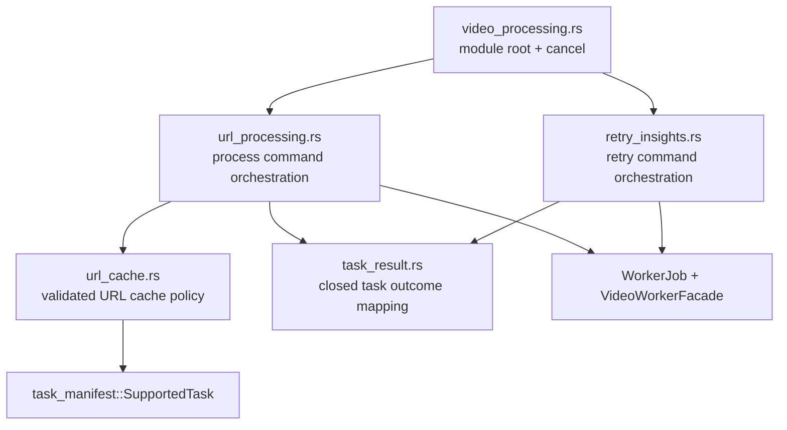

# Video Processing Application Module Split

**Date:** 2026-07-20
**Status:** Implemented and accepted on 2026-07-20

## Context

`app/src-tauri/src/video_processing.rs` is still a maintenance hotspot after task-result adaptation
moved into `video_processing/task_result.rs`. At the approved baseline the parent contains 1,118
lines: roughly 520 lines of production code followed by URL-cache, process-request, AI-retry, and
diagnostic tests. The file now combines three application responsibilities with the Tauri module
root:

- process-video request preparation, URL source-identity preflight, worker execution, and cache-hit
  orchestration;
- model-aware URL cache lookup and cached task projection; and
- retry-insights request validation, worker execution, and safe diagnostics.

These responsibilities have different dependency and failure boundaries. Cache lookup needs
validated task access and filesystem-facing task projections. Retry needs server-managed LLM job
execution but no cache, task-manifest, or source-identity logic. URL processing is the only current
flow that needs ASR setting resolution and tolerant identity preflight. Keeping them in one file
makes the pending local-media contract-v4 work compete with unrelated URL and AI-retry code.

This is a structural refactor. It fixes no user-visible defect and must not change the desktop-worker
contract, Tauri command surface, cache behavior, cancellation behavior, result shape, diagnostics,
or local-media product scope.

## Requirements

The split must:

- keep `video_processing.rs` as a small Tauri adapter/module root and cancellation command owner;
- preserve the exact `process_video` and `retry_insights` Tauri command paths and return types;
- keep task-result adaptation solely in the existing `task_result.rs` module;
- isolate retry parsing/execution/diagnostics from URL cache and task-manifest dependencies;
- make URL cache lookup accept only the matching inputs it needs rather than the complete worker
  request DTO;
- characterize every current source-identity preflight outcome before moving it;
- preserve tolerant cache-preflight behavior for failed, unstructured, mismatched-family, and
  protocol-violation results;
- preserve terminal cancellation, busy, and transport behavior;
- keep complete URLs, paths, transcript content, prompts, generated content, credentials, and raw
  worker output out of new diagnostics and public errors;
- add no generic facade, service locator, callback interface, dead local-media type, or contract-v4
  placeholder; and
- keep dependency direction from application orchestration toward cache/result helpers, never from
  helpers back into Tauri commands.

## Alternatives Considered

### 1. Keep the file intact until local-media implementation

This avoids an immediate move, but contract-v4 work would enter a file that still combines URL
cache, URL preflight, AI retry, and command composition. Reviewers would have to distinguish
path-sensitive new behavior from unrelated existing code in the same diff.

**Decision:** Rejected.

### 2. Add one broad `VideoProcessingFacade`

The worker lifecycle and execution tuple are already behind `VideoWorkerFacade`, task access is
behind `SupportedTask`, and media preparation is behind `MediaPreparationFacade`. Wrapping the
remaining application functions in another object would add indirection without hiding a genuinely
complex subsystem from callers: the only caller is the Tauri module root.

**Decision:** Rejected. This split uses focused modules and ordinary functions, not another facade.

### 3. Split by request/helper/service categories

Files such as `requests.rs`, `helpers.rs`, or `services.rs` would group code by implementation shape
rather than stable product responsibility. They would also invite unrelated URL, retry, and future
local-media behavior to accumulate again.

**Decision:** Rejected.

### 4. Split by current workflow and failure boundary

Keep the root as composition, isolate retry, isolate URL cache policy, and keep URL request/config,
preflight, and process orchestration together. This produces cohesive modules without creating a
future local-media module before its contract exists.

**Decision:** Selected.

## Decision

Use this private module tree:

```text
app/src-tauri/src/video_processing.rs
app/src-tauri/src/video_processing/
  task_result.rs
  retry_insights.rs
  url_cache.rs
  url_processing.rs
```

The responsibility map is:

| Module | Owns | Must not own |
|---|---|---|
| `video_processing.rs` | child declarations, thin Tauri command delegates, cancellation, narrowly shared trusted result DTO construction | URL/retry orchestration, cache scanning, source preflight, worker request parsing |
| `task_result.rs` | existing closed process/retry typed outcome mapping | Tauri, cache, settings, manifests, diagnostics, worker execution |
| `retry_insights.rs` | retry target/language/request parsing, Tauri command, blocking orchestration, safe start/result diagnostics, tests | URL/source identity, ASR settings, task-manifest/cache projection, local media |
| `url_cache.rs` | current URL cache scan, exact URL/canonical identity match, ASR-model compatibility, cached task projection, tests | Tauri, worker execution, settings, logging, source preflight, local media |
| `url_processing.rs` | process IPC/worker DTOs, contract-v3 constant, ASR request resolution, source preflight, two-step cache orchestration, process job submission, cache-hit logging, tests | retry-insights policy, manifest internals beyond the cache API, local-media contract v4 |

`PROCESS_VIDEO_CONTRACT_VERSION` stays reachable to the existing crate test as
`video_processing::PROCESS_VIDEO_CONTRACT_VERSION` through a test-only alias. Tauri's command macro generates path-local hidden handler
symbols, so the root retains thin `process_video` and `retry_insights` command delegates instead of
function-only re-exports. Their existing module paths and command registration remain unchanged;
all parsing and blocking orchestration live in the child modules.

The parent may temporarily retain the internal `WorkerError`, `ProcessVideoResult`, and
`closed_task_result` used by trusted desktop-created task values. They are not public wire types and
must not become a general result builder. `summarize_task_result_for_log` moves with URL processing,
because only that flow owns cache-hit logging.

## URL Cache Boundary

`url_cache.rs` must not accept `ProcessVideoWorkerRequest`. Its entry points take the minimum
matching data:

```rust
cached_process_result_for_url(output_root, requested_url, asr_model)
cached_process_result_for_identity(output_root, source_identity, asr_model)
```

This prevents the cache policy from depending on the worker wire DTO or its contract version. The
cache continues to scan only `SupportedTask`, accept only `completed | partial_completed`, require a
real transcript artifact, compare exact safe URL or canonical identity, and enforce the existing
empty/equal ASR-model compatibility rule. Invalid cached terminal projections remain unusable and do
not block a new process run.

## Source-Identity Preflight Matrix

Before extraction, introduce a pure classifier for the typed worker result and lock the existing
behavior:

| Typed result | Preflight decision | Process-video consequence |
|---|---|---|
| completed source identity | `UseIdentity(identity)` | perform the second cache lookup |
| failed source identity | `ContinueWithoutIdentity` | skip second lookup and run normal process |
| wrong structured result family | `ContinueWithoutIdentity` | continue normally |
| unstructured worker failure | `ContinueWithoutIdentity` | continue normally |
| protocol-violation runtime error | `ContinueWithoutIdentity` | continue normally |
| cancelled | `Cancelled` | map through the existing process task-result policy |
| already running | `AlreadyRunning` | map through the existing process task-result policy |
| spawn/delivery/pipe/wait transport failure | `Transport` | map through the existing process task-result policy |

The classifier is not a facade. It is a private deterministic function that makes the deliberately
tolerant cache optimization policy reviewable and testable independently of process spawning.

## Dependency Direction



`url_cache.rs` must not import `tauri`, runtime paths, supervisors, `WorkerJob`, diagnostics, or
settings. `retry_insights.rs` must not import `task_manifest`, URL cache, source identity, or ASR
settings. No child module calls back through root command functions.

## Security and Compatibility

- Existing strict Serde request parsing remains unchanged and non-echoing.
- Retry diagnostics continue to record only validated target, output language, status, and bounded
  error code.
- Source preflight never logs or returns the submitted URL or rejected worker content.
- Cache projection still reads artifacts only through `SupportedTask` capabilities.
- The contract remains v3; TypeScript, Python, packaged worker, manifest schema, command names, and
  result DTOs are unchanged.
- No `local_media.rs` or `ProcessLocalMedia` variant is created. Those land atomically with contract
  v4 and the real worker consumer.

## Implementation Order

1. Add the source-preflight behavior-matrix tests and observe RED against the missing classifier.
2. Implement the pure classifier in the current module and verify GREEN.
3. Extract retry-insights code and its tests.
4. Extract URL cache code, narrow its input API, and move cache tests.
5. Extract URL process/config/preflight orchestration and tests; reduce the parent to composition.
6. Run focused and complete regression gates, measure the final files, update architecture/security
   and audit evidence, then archive the dedicated ExecPlan.

Each extraction must leave the focused `video_processing` suite green before the next move. A
failure-shape, cache-rule, log-content, command-path, or contract change stops this refactor and
returns it to design review.

## Acceptance

- The preflight matrix covers every row above.
- Existing five cache tests, five process/request tests, six retry tests, and four task-result tests
  pass beside their owning modules.
- `video_processing.rs` contains composition/cancellation/shared closed DTO support only.
- Dependency scans prove the cache and retry boundaries above.
- All 159 baseline Rust tests and rustfmt pass; cross-layer app/scripts/docs/diff gates remain green.
- Production diffs are restricted to `video_processing.rs` and its private child modules.
- No contract, worker, packaged resource, frontend production, manifest-schema, or user-visible
  behavior changes.
