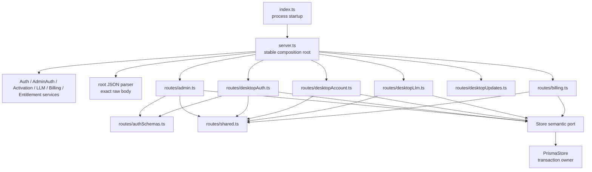

# Server Route Module Split

**Date:** 2026-07-21
**Status:** Implemented and accepted on 2026-07-21

## Context

`server/src/server.ts` is a 710-line Fastify composition root that also owns every HTTP adapter in
the FrameQ account service. `buildServer()` currently creates six application services, resolves
runtime configuration, installs the exact-raw-body JSON parser, declares eight Zod schemas,
registers twenty routes, performs desktop and administrator authentication, manages administrator
cookies and CSRF checks, and maps service/store results into HTTP responses.

The long file is not evidence that FrameQ needs another facade class. `buildServer()` already is the
stable facade and composition root used by production startup and all route-level tests. The
maintenance problem is that unrelated HTTP capabilities and failure policies share one source
file. For example, changing an administrator cookie helper currently competes in the same module
with desktop LLM secret checkout, public update lookup, and the WeChat raw-signature path.

The Store transaction boundary is already correct and must not be weakened during this split.
Payment settlement, activation redemption, and administrator entitlement adjustment remain
single semantic Store operations whose concrete transactions are owned by `PrismaStore`. This
refactor changes only route-registration ownership. It does not move business policy into routes,
move HTTP policy into services, or introduce new persistence calls.

This is a structural refactor. It fixes no user-visible defect and must not change route paths,
methods, schemas, status codes, response bodies, headers, cookies, authentication, quota
accounting, update selection, payment gating, raw webhook verification, error text, service
lifetime, Store semantics, logging, or network behavior.

## Requirements

The split must:

- preserve `ServerDependencies` and `buildServer(dependencies)` as the only external server
  composition contract;
- keep `server/src/index.ts` importing and invoking only the stable `server.ts` root;
- keep Fastify construction, all service construction, environment/default resolution, release
  manifest loading, and the global exact-raw-body JSON parser in `server.ts`;
- register routes through synchronous capability functions with explicit, narrow dependency
  records;
- separate administrator, desktop authentication, desktop account, desktop LLM checkout, desktop
  update, and billing/webhook HTTP adapters;
- keep administrator cookie parsing/writing, CSRF header handling, and administrator response
  mapping inside the administrator capability;
- keep desktop bearer authentication and the shared quota/error helpers in one small route-support
  module used only by capability modules;
- share the two identical OTP request schemas without making one capability import another;
- preserve exact raw request bytes for WeChat signature verification and allow only the billing
  module to consume the attached `rawBody` value;
- preserve the current disabled-before-auth behavior of all three WeChat routes;
- preserve current read projections and require each atomic mutation to remain one semantic
  service/Store call; routes may not coordinate a transaction or import the Prisma implementation;
- add behavior characterization for the exact raw-body and cookie attributes before moving those
  policies;
- add a source/AST ownership gate before extraction; and
- remove no live route, test, public type, or supported behavior.

## Non-goals

This work does not:

- add a `ServerFacade`, route-manager class, dependency container, service locator, or generic
  repository abstraction;
- convert capability modules to Fastify plugins or add `fastify-plugin`;
- change the server API, desktop API client, worker checkout contract, Prisma schema, Store port,
  entitlement policy, or payment integration status;
- make WeChat Pay production-ready or enable it by default;
- redesign administrator HTML, login HTML, validation rules, or public errors;
- sanitize or otherwise alter existing error messages as part of the move;
- add logging, telemetry, request-body capture, or secret-bearing diagnostics;
- change when `now()` is evaluated, when services are constructed, or when configuration defaults
  are resolved;
- remove or consolidate application services; or
- update a product specification, because no user-visible behavior or external contract changes.

The unreferenced private `quotaResponse()` helper has no runtime caller. Its deletion is permitted
as the sole dead-code cleanup during extraction, after a source scan reconfirms that it remains
unreferenced. No other opportunistic cleanup belongs in this change.

## Alternatives Considered

### 1. Keep `server.ts` intact and add headings

This has the smallest diff, but administrator security changes, desktop account changes, public
update changes, and webhook changes would continue to collide in the same file. Comments do not
create dependency or ownership boundaries.

**Decision:** Rejected.

### 2. Extract only schemas and helper functions

Moving Zod schemas, cookie helpers, and response builders would reduce the physical line count but
leave all twenty handlers and their dependencies in the composition root. The source of the
maintenance pressure is route/failure ownership, not helper placement alone.

**Decision:** Rejected.

### 3. Register each capability as a Fastify plugin

Fastify plugins offer encapsulated hooks and decorators, but FrameQ does not need those features in
this refactor. Plugin registration introduces a new scope and lifecycle model, makes parser/hook
inheritance part of the change, and encourages async registration where the current routes are
synchronous. Adding that mechanism would enlarge the behavioral proof surface without improving
the present dependency boundary.

**Decision:** Rejected for this split. A future feature that genuinely needs capability-scoped
hooks or decorators can propose a plugin separately.

### 4. Add one broad `ServerFacade` or route-manager class

External callers already have the simple `buildServer()` facade. A second object would hide route
dependencies behind mutable fields or a wide constructor while keeping the same mixed ownership.
It would add indirection rather than isolate failures.

**Decision:** Rejected.

### 5. Keep `buildServer()` as the composition root and extract capability registrars

Ordinary registration functions preserve Fastify's current root instance and synchronous route
registration while making each dependency/failure boundary reviewable. Narrow dependency records
show exactly which services and Store capabilities each route group can reach.

**Decision:** Recommended.

## Decision

Keep `server/src/server.ts` as the sole public composition root and add a private
`server/src/routes/` directory. The root continues to create Fastify, construct all services,
resolve optional dependencies and environment defaults once, install the custom JSON parser, and
invoke capability registrars.

The target production files are:

| File | Sole responsibility |
|---|---|
| `server/src/server.ts` | Public dependencies/build entry, Fastify creation, service/config composition, global exact-raw-body parser, registrar calls |
| `server/src/routes/authSchemas.ts` | Shared email-start and email-verify Zod schemas used by desktop and administrator OTP routes |
| `server/src/routes/shared.ts` | Desktop bearer authentication, bearer extraction, quota-remaining calculation, and current public-error mapping |
| `server/src/routes/admin.ts` | Administrator pages, OTP/session/cookies/CSRF, activation creation, LLM configuration, entitlement adjustment, and administrator response mapping |
| `server/src/routes/desktopAuth.ts` | Public login page, desktop OTP start/verify, ticket exchange, and desktop logout |
| `server/src/routes/desktopAccount.ts` | Authenticated account projection and activation-code redemption |
| `server/src/routes/desktopLlm.ts` | Authenticated server-managed LLM checkout and quota response |
| `server/src/routes/desktopUpdates.ts` | Public desktop update lookup and 204/no-update mapping |
| `server/src/routes/billing.ts` | Disabled gate, authenticated native-order routes, order ownership, exact-raw-body webhook parsing, and settlement mapping |

`routes/` is private by convention and by dependency gates. Production startup and external tests
continue to import `server.ts`; they do not assemble individual registrars.

## Stable Composition Surface

The public TypeScript surface remains:

```ts
export type ServerDependencies = {
  store: Store;
  sendOtp: (email: string, code: string) => Promise<void>;
  createNativePayment: (input: {
    outTradeNo: string;
    amountFen: number;
    description: string;
  }) => Promise<NativePaymentResult>;
  parseWechatNotification?: WechatNotificationParser;
  adminEmail?: string;
  wechatPayEnabled?: boolean;
  llmConfigEncryptionKey?: string;
  releaseManifest?: DesktopReleaseManifest | null;
  releaseManifestPath?: string;
  now?: () => Date;
};

export function buildServer(dependencies: ServerDependencies): FastifyInstance;
```

No route registrar becomes a supported public integration API. `server/src/index.ts` and every
existing route-level test keep importing `buildServer` from `server.ts`.

Representative internal registration signatures are deliberately narrow:

```ts
registerAdminRoutes(app, {
  store,
  adminAuth,
  activationCodes,
  llmConfig,
  entitlementAdjustments,
  now,
});

registerDesktopLlmRoutes(app, { store, llmConfig, now });

registerBillingRoutes(app, {
  store,
  billing,
  parseWechatNotification,
  wechatPayEnabled,
  now,
});
```

Registrars return `void` and call `app.get()` / `app.post()` directly. They do not create Fastify
instances, call `app.register()`, construct services, read unrelated environment variables, or
start the server.

## Route Ownership Matrix

| Capability owner | Method and route |
|---|---|
| `desktopAuth.ts` | `GET /login` |
| `admin.ts` | `GET /admin/login` |
| `admin.ts` | `POST /admin/auth/email/start` |
| `admin.ts` | `POST /admin/auth/email/verify` |
| `admin.ts` | `POST /admin/auth/logout` |
| `admin.ts` | `GET /admin` |
| `admin.ts` | `POST /admin/api/activation-codes` |
| `admin.ts` | `POST /admin/api/llm-config` |
| `admin.ts` | `POST /admin/api/users/:userId/entitlement-adjustments` |
| `desktopAuth.ts` | `POST /auth/email/start` |
| `desktopAuth.ts` | `POST /auth/email/verify` |
| `desktopAuth.ts` | `POST /api/desktop/sessions/exchange` |
| `desktopAccount.ts` | `GET /api/desktop/account` |
| `desktopAuth.ts` | `POST /api/desktop/logout` |
| `desktopAccount.ts` | `POST /api/desktop/activation-codes/redeem` |
| `desktopLlm.ts` | `POST /api/desktop/llm/checkouts` |
| `desktopUpdates.ts` | `GET /api/desktop/updates/:target/:arch/:currentVersion` |
| `billing.ts` | `POST /api/desktop/billing/wechat-native` |
| `billing.ts` | `GET /api/desktop/billing/orders/:orderId` |
| `billing.ts` | `POST /api/wechat/notify` |

## Behavior and Failure Matrix

| Boundary | Behavior that must remain exact |
|---|---|
| Administrator OTP | Invalid body is 400; non-admin is 403 `ADMIN_ONLY`; service failures use the current public error mapping |
| Administrator session | Session and CSRF cookies keep names, current session/session/CSRF header sequence, `Path=/`, integer `Max-Age`, `SameSite=Lax`, production-only `Secure`, and session-only `HttpOnly` |
| Administrator mutation | Authentication is checked before CSRF; invalid/missing CSRF remains 403; Store transaction semantics remain behind semantic service/Store calls |
| Desktop OTP/session | Input schemas, ticket/session fields, expiry serialization, remote IP use, and current error mapping remain unchanged |
| Desktop account/redeem | Bearer token hashing, 401/400 mapping, capability fields, quota calculation, and account refresh after redemption remain unchanged |
| LLM checkout | Authentication precedes validation/config/quota; request id policy, idempotent quota consumption, secret response fields, and 400/403 mapping remain unchanged |
| Desktop update | Release manifest resolves once at server construction; lookup inputs and 204 empty-body behavior remain unchanged |
| WeChat disabled gate | All three routes return 404 `WECHAT_PAY_DISABLED` before authentication or parsing when disabled |
| Billing ownership | An authenticated user cannot read another user's order; missing/foreign orders remain 404 |
| WeChat webhook | Custom JSON parser retains the exact submitted bytes; only the billing route forwards them to the signature parser; fallback JSON serialization remains unchanged |
| Public errors | Existing sanitized service errors and current `Error.message` fallback remain byte-for-byte unchanged; this refactor adds no raw request logging |

## Dependency Direction



The allowed direction is startup -> root -> capability registrar -> service/Store port. Feature
registrars may import `authSchemas.ts` or `shared.ts`, but never another feature registrar. No route
module imports `index.ts`, `server.ts`, `database.ts`, or `prismaStore.ts`. Only `server.ts` imports
the default Fastify factory and constructs services. Only `billing.ts` accesses `rawBody`. Only
`admin.ts` owns administrator cookie/CSRF names.

## Security and Operational Constraints

- The global JSON parser remains installed before route registration. Moving it into billing would
  risk changing parser scope or webhook bytes and is forbidden.
- Raw request bodies remain in process memory only for the active request and are never logged,
  persisted, returned, or passed outside the notification parser.
- LLM API keys remain server-managed. Only the authenticated checkout route may return the
  decrypted per-call configuration already exposed by the current contract.
- Route modules receive the `Store` interface, never `PrismaStore` or a Prisma client. Atomic
  settlement, redemption, and adjustment are still owned below the route layer.
- Administrator session and CSRF cookies remain distinct. The CSRF cookie is readable by the
  administrator page; the session cookie remains `HttpOnly`.
- WeChat Pay remains disabled unless the already-resolved flag is exactly enabled. This refactor
  must not imply provider readiness.
- No request, response, secret, OTP, cookie, bearer token, API key, raw webhook body, or provider
  payload is added to logs or tests that print diagnostic content.

## Test Strategy

Before moving production code:

1. Add a route-table characterization covering every method/path in the ownership matrix.
2. Add an exact-raw-body characterization proving the injected notification parser receives the
   original JSON string rather than a reserialized body.
3. Extend administrator cookie characterization for the current three-header sequence (duplicated
   session header followed by CSRF), `HttpOnly`, `SameSite=Lax`, `Path=/`, and logout `Max-Age=0`
   behavior. Header deduplication is a separate behavior change and is out of scope.
4. Add `server/tests/serverModuleBoundaries.test.ts` and observe RED because the target route files
   do not exist and `server.ts` still owns direct route calls.

The boundary suite will use the TypeScript compiler API or equally structured source inspection to
assert the exact route-module set, route ownership table, stable root exports, constructor/parser
ownership, forbidden imports, feature-module independence, billing-only `rawBody`, admin-only
cookie/CSRF constants, and a root size ceiling of 200 physical lines. The semantic ownership checks
are the primary gate; the line ceiling is only a regression alarm.

During extraction, run the existing focused suites beside each capability. At completion, all
existing 57 baseline server tests plus the new characterization/boundary tests must pass. The
server build, cross-layer account/checkout consumers, governance validation, and diff checks must
also pass.

## Implementation Order

1. Add green behavior characterization and the final-architecture RED ownership suite.
2. Extract shared OTP schemas and cross-capability route support.
3. Extract desktop authentication and account routes; keep their existing focused tests green.
4. Extract administrator and desktop LLM routes; keep admin, quota, and transaction-safety suites
   green.
5. Extract update and billing routes, retaining the root raw-body parser; reduce `server.ts` to
   composition and turn the ownership suite fully green.
6. Run complete regression/scope gates, update durable architecture/security/audit evidence with
   measured results, and archive the ExecPlan.

Every step is a move-first change. If route behavior, Store call order, cookie bytes, raw webhook
bytes, error text, external imports, or test results change, stop and return the difference to
design review rather than adapting the contract inside this refactor.

## Implementation Outcome

- `server.ts` is now a 112-line composition root with exactly the two stable exports
  `ServerDependencies` and `buildServer()`. It still owns Fastify, six service instances, runtime
  defaults, release-manifest resolution, the global exact-raw-body JSON parser, and registrar
  composition.
- The private route tree contains `admin.ts` (330 lines), `authSchemas.ts` (12), `billing.ts` (95),
  `desktopAccount.ts` (115), `desktopAuth.ts` (88), `desktopLlm.ts` (60),
  `desktopUpdates.ts` (34), and `shared.ts` (30). No registrar imports another feature registrar,
  Prisma/startup infrastructure, or a Fastify plugin.
- Behavior characterization locked all 20 method/path pairs, exact webhook raw bytes, and the
  administrator cookie/CSRF wire sequence. The boundary suite first failed 4/6 against the old
  root, then passed 6/6 after extraction.
- Complete validation passed: server 65/65 and TypeScript build, app 549/549 and lint, native
  Windows Rust 173/173, worker 515/515, and scripts 23/23. The only runtime notices were the
  repository's existing Node SQLite experimental warning and Python `audioop` deprecation warning.
- Scope proof found no tracked production diff in Prisma/schema, Store/services, app, Rust, worker,
  contracts, or package manifests. Production changes are limited to `server/src/server.ts` and
  the new private `server/src/routes/` tree; the remaining changes are characterization/boundary
  tests and durable governance documentation.
- No live SMTP, LLM supplier, updater, or WeChat payment smoke was run. Fastify injection does not
  cover production proxy/TLS configuration. The existing duplicate administrator-session
  `Set-Cookie` header remains an explicit compatibility residual for a separate behavior/security
  change rather than being silently altered by this structural refactor.

## Acceptance Criteria

- `ServerDependencies`, `buildServer()`, and `server/src/index.ts` usage are unchanged.
- The exact route ownership and behavior matrices are covered and pass.
- `server.ts` contains no Zod schema or direct route handler and is at most 200 physical lines.
- `server.ts` still owns Fastify/service construction, runtime-default resolution, manifest loading,
  and the exact-raw-body parser.
- Feature route modules have narrow dependencies, never import one another, and cannot reach
  Prisma/database/startup infrastructure.
- Only `admin.ts` owns administrator cookies/CSRF; only `billing.ts` consumes `rawBody`.
- All baseline and new server tests pass; TypeScript compilation succeeds.
- Cross-layer account/checkout tests and governance/diff gates pass.
- No product spec, public API, Prisma schema, Store transaction, dependency, network behavior,
  payment enablement, or user-visible behavior changes.
