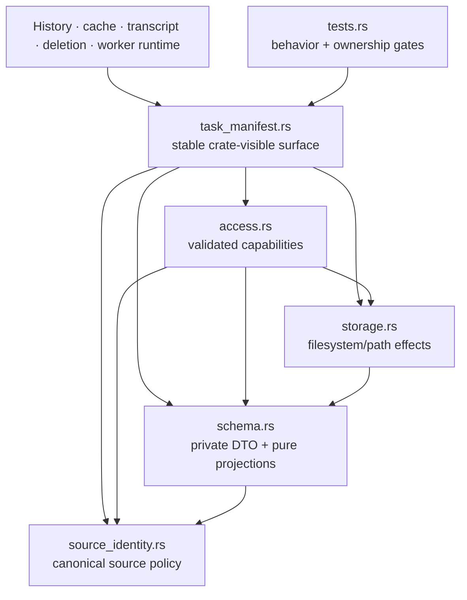

# Task Manifest Trust Module Split

**Date:** 2026-07-21
**Status:** Implemented and verified on 2026-07-21

## Context

`app/src-tauri/src/task_manifest.rs` is the largest remaining FrameQ production hotspot. The file
has 1,326 physical lines: a 380-line inline test module and 946 production lines. Its size is only
one signal; the stronger maintenance pressure is that one file currently combines five different
reasons to change:

- canonical `SourceIdentity` validation and sensitive-query rejection;
- raw schema-v3 manifest DTOs, safe error/source/artifact projections, and Insight JSON parsing;
- configured output-root resolution, manifest enumeration/read/write, task-ID validation,
  relative artifact policy, canonical containment, and link/reparse checks;
- the non-bypassable `SupportedTask` / `TaskScan` / `TaskEditSession` capability boundary; and
- broad characterization for source privacy, scan isolation, safe errors, artifact access, and
  result parsing.

The accepted Task Access Facade decision remains authoritative. History, cache reuse, transcript
review/edit, deletion, worker command construction, and terminal-result parsing already enter task
storage through the stable `task_manifest::*` surface. They must not learn about raw manifest DTOs
or rebuild task support/path checks themselves.

The active local-media plan increases future pressure on this boundary: its later task will add a
closed URL/local source union. That behavior is not implemented here. This structural split must
make the existing boundary easier to review without pre-creating the union, changing schema v3, or
claiming local-media runtime support.

This is an internal architecture refactor. It changes no user-visible behavior and therefore does
not require a product-spec update.

## Requirements

The split must:

- keep `app/src-tauri/src/task_manifest.rs` as the only crate-visible import surface and preserve
  every existing `task_manifest::*` constant, type, function, method, field, signature, and type
  identity used by production callers and tests;
- retain `SupportedTask::scan/open` as the only application entry for supported task discovery and
  opening, and retain `TaskEditSession` as the only raw-manifest mutation capability;
- keep raw `TaskManifest`, `TaskManifestError`, load/read/write helpers, task/artifact path
  primitives, source support predicates, and manifest mutation private to the task-manifest module
  tree;
- preserve schema version 3, source privacy migration version 2, canonical URL rules, supported
  platform/stable-ID rules, safe artifact keys, unknown-field round trips, safe error projection,
  JSON formatting, final newline, and direct Rust manifest-write behavior;
- preserve scan isolation: one corrupt, unsupported, mismatched, linked, or racing entry does not
  hide other supported tasks, while failure to enumerate the configured task root remains a whole
  operation error;
- preserve exact task-ID, relative-path, canonical-containment, symlink, junction, and Windows
  reparse-point behavior and existing fixed non-echoing errors;
- preserve artifact reads, tolerant Insight parsing, existing/declarative artifact projections,
  edit-session artifact/preview updates, and save ordering without adding rollback or atomicity;
- keep local files, source URLs, paths, manifests, transcript/AI content, and errors out of new
  logging, diagnostics, network, server, worker, or telemetry paths;
- add a RED/GREEN source-ownership gate proving private modules cannot become bypass entry points;
  and
- add no dependency, facade class, trait hierarchy, service locator, repository abstraction,
  product behavior, IPC command, contract field, manifest source variant, or migration.

## Current Stable Surface

The root path currently exposes these crate-visible items and must continue to do so:

- constants: `TASK_MANIFEST_FILE_NAME`, `TASKS_DIR_NAME`, `TASK_SCHEMA_VERSION`, and
  `SOURCE_PRIVACY_MIGRATION_VERSION`;
- contracts/projections: `TaskArtifact`, `SourceIdentity`, `TranscriptMetadata`, `InsightView`, and
  `SafeTaskError`;
- capability types: `SupportedTask`, `TaskScan`, and `TaskEditSession`;
- parsing: `parse_insight_view` and `parse_insights_payload`;
- root/path helpers: `configured_output_root`, `configured_output_root_from_project`,
  `path_to_frontend_string`, and `is_link_or_reparse_point`; and
- all currently crate-visible methods on those types.

Call sites in `history.rs`, `history_deletion.rs`, `transcript_detail/`, `video_processing/`, and
`worker_runtime/` continue using these exact root paths. No production caller imports a private
child module.

## Alternatives Considered

### 1. Keep production intact and move only the inline tests

This would reduce the visible root from 1,326 to roughly 946 lines but retain source privacy,
schema projection, filesystem trust, and capability behavior in one production file. Navigation
would improve, but ownership and failure boundaries would not.

**Decision:** Rejected as the complete solution. Tests will move after production ownership is
separated.

### 2. Split the file and expose each child module crate-wide

Direct `task_manifest::storage::*` or `task_manifest::schema::*` access would let future callers
bypass `SupportedTask`, depend on raw DTOs, or coordinate paths and writes independently. That
would improve file size while weakening the accepted trust architecture.

**Decision:** Rejected. Child modules remain private and the root selectively re-exports only the
existing stable surface.

### 3. Combine this split with the local-media manifest union

The future union changes supported-task semantics, History projections, privacy markers, worker
production, and older-client behavior. Combining it with a pure move would make failures
ambiguous and would invalidate the claim that this refactor preserves behavior.

**Decision:** Rejected. No local source field or predicate is introduced in this work.

### 4. Split by trust responsibility behind one stable root

Separate canonical source policy, pure schema policy, filesystem/path effects, validated access,
and tests. Keep all children private and preserve `task_manifest::*` through direct re-exports,
without wrapper types or a second facade.

**Decision:** Selected.

## Decision

Use this private module tree:

```text
app/src-tauri/src/task_manifest.rs
app/src-tauri/src/task_manifest/
  source_identity.rs
  schema.rs
  storage.rs
  access.rs
  tests.rs
```

The existing root becomes a compact module declaration, invariant-constant, and re-export surface:

```rust
mod access;
mod schema;
mod source_identity;
mod storage;

#[cfg(test)]
mod tests;

pub(crate) const TASK_MANIFEST_FILE_NAME: &str = "frameq-task.json";
pub(crate) const TASKS_DIR_NAME: &str = "tasks";
pub(crate) const TASK_SCHEMA_VERSION: u64 = 3;
pub(crate) const SOURCE_PRIVACY_MIGRATION_VERSION: u64 = 2;

pub(crate) use access::{SupportedTask, TaskEditSession, TaskScan};
pub(crate) use schema::{
    parse_insight_view, parse_insights_payload, InsightView, SafeTaskError, TaskArtifact,
    TranscriptMetadata,
};
pub(crate) use source_identity::SourceIdentity;
pub(crate) use storage::{
    configured_output_root, configured_output_root_from_project, is_link_or_reparse_point,
    path_to_frontend_string,
};
```

The exact formatting may be adjusted by rustfmt, but the visibility and responsibility shape may
not be widened. Child modules are declared with private `mod`, never `pub mod`. Definitions may use
the minimum visibility necessary for root re-export or sibling composition; helpers remain private
or `pub(super)`.

## Responsibility Map

| Module | Owns | Must not own |
|---|---|---|
| `task_manifest.rs` | private child declarations, four existing invariant constants, exact stable re-exports, test module declaration | raw DTOs, filesystem calls, URL parsing, supported-task logic, wrapper types |
| `source_identity.rs` | `SourceIdentity`, version/length bounds, platform/stable-ID rules, canonical URL/query matching, sensitive name/value rejection, equality key | filesystem, settings, manifest parsing, artifact paths, task access, logging/network effects |
| `schema.rs` | `TaskArtifact`, raw `TaskManifest`/error DTOs, safe projections, transcript/Insight views, Insight parsing, pure relative-artifact allowlist/path policy, unknown-field preservation | filesystem I/O, canonicalization, settings, task enumeration, caller orchestration |
| `storage.rs` | configured output root, frontend path projection, task directory/manifest enumeration and direct read/write, task-ID validation, declared artifact resolution, canonical containment, parent preparation, storage-entry and link/reparse checks | source URL policy, History/UI DTOs, supported-task policy, transcript/AI semantics, network/logging |
| `access.rs` | `SupportedTask`, `TaskScan`, `TaskEditSession`, support gating, safe task projections, validated artifact reads, tolerant Insight reads, restricted in-memory mutation and save composition | settings, arbitrary root discovery, caller-specific History/transcript/delete behavior, raw path inputs from frontend, local-media union |
| `tests.rs` | existing characterization fixtures/assertions, new edit-session characterization, RED/GREEN ownership/dependency gate | production helpers, alternate policy, feature behavior |

Pure relative artifact-string validation belongs to `schema.rs`, while filesystem resolution and
canonical containment belong to `storage.rs`. This avoids a schema/storage import cycle: storage
depends on schema policy, never the reverse.

## Dependency Direction



Allowed dependencies are root -> children, access -> storage/schema/source, storage -> schema, and
schema -> source. Private children never import application callers, Tauri commands, worker
runtime, server code, or the root as a compatibility shortcut. No child may import another child
in the reverse direction.

## Access and Mutation Flow

### Open

1. A caller invokes `SupportedTask::open(output_root, task_id)` through the stable root.
2. `access.rs` asks `storage.rs` to validate the task ID, ordinary task directory, and ordinary
   manifest before reading and deserializing the private schema.
3. `schema.rs` verifies schema/privacy markers and asks `source_identity.rs` to validate the
   canonical identity and exact `source_url` match.
4. Only then does `access.rs` construct `SupportedTask`.

### Scan

1. `storage.rs` enumerates only ordinary task directories and ordinary manifest files.
2. `access.rs` isolates each entry, validates the manifest task ID against its expected directory,
   and applies the same support predicate as `open`.
3. Unsupported or damaged entries increment only the aggregate ignored count. Root enumeration
   failure remains terminal.

### Artifact read

1. `schema.rs` validates the closed artifact key and safe relative manifest value.
2. `storage.rs` derives the task-local path and proves canonical containment.
3. `access.rs` performs the same optional/required/tolerant content read as today.

### Edit

1. `SupportedTask::into_edit_session` transfers the already validated private manifest and task
   directory into `TaskEditSession`.
2. The session accepts only `TaskArtifact` plus safe relative paths, validates existing paths or
   parents through storage, and mutates the private in-memory DTO.
3. `save()` uses the current pretty JSON plus final newline and direct manifest write. It does not
   add atomic replacement, rollback, retries, locks, or a second task open.

## Behavior and Failure Matrix

| Condition | Required unchanged behavior |
|---|---|
| unknown, wrong-version, malformed, or sensitive SourceIdentity | fail the source support predicate without echoing source data |
| schema v1/v2, missing privacy marker, quarantine, absent/mismatched identity | unavailable through `open`; isolated during `scan` |
| unreadable task root | fail the whole scan with the current fixed safe message |
| corrupt/racing/unsupported individual manifest | ignore that entry, increment aggregate ignored count, retain valid tasks |
| manifest task ID differs from requested/physical task | reject or isolate before artifact access |
| linked/reparse task directory or manifest | reject before read or mutation |
| unsupported artifact key, absolute/escaping/sensitive relative path | reject with the current fixed field-level message and no raw path echo |
| missing optional artifact | return `None` or empty Insight list according to the existing method |
| existing artifact outside canonical task root | reject before read or frontend path projection |
| malformed Insight artifact | return an empty list; do not make the supported task unavailable |
| unsafe stored error code/message | expose only the current bounded code and sanitized fallback |
| valid unknown manifest fields | retain them through decode/encode and edit-session save |
| edit-session save failure | return the current error; make no new rollback/atomicity guarantee |

## Security and Non-Functional Requirements

### Security

- Raw `TaskManifest` and low-level storage helpers remain unnameable outside the private module
  tree. The root does not re-export them.
- No new function accepts a frontend-supplied output root, task path, manifest path, or artifact
  path. Existing application callers continue receiving validated capabilities.
- Error strings remain fixed and must not contain task IDs, local paths, source URLs, query values,
  manifest content, transcript/AI content, credentials, or link targets.
- The split introduces no logs, diagnostics, telemetry, server calls, LLM calls, worker process,
  shell invocation, or network I/O.

### Reliability and compatibility

- Operation ordering, number of manifest reads/writes, canonicalization behavior, scan isolation,
  and direct write semantics remain unchanged.
- Serde field names/defaults/flatten behavior, JSON shape/formatting, final newline, public method
  signatures, and root import paths remain unchanged.
- Existing schema-v3 URL tasks require no rewrite or migration. Unsupported legacy data remains
  physically untouched.

### Performance and operations

- The refactor adds no additional filesystem enumeration, canonicalization, JSON parse, or write on
  a successful path.
- It adds no dependency, runtime process, cache, configuration, build artifact, installer content,
  or operational service.
- Physical line count is a review alarm only. The target is a root under 100 lines, while ownership
  and dependency tests are the primary acceptance gate.

## Local-Media Compatibility

The active local-media plan remains authoritative and unimplemented after this work. In
particular, this split does not add `source_kind`, local filename metadata, a URL/local union, a new
privacy marker, task-ID generation, or History source projection.

After this refactor is complete, local-media manifest task 6 must change the appropriate private
owners atomically:

- source-specific canonical URL rules remain in `source_identity.rs`;
- the closed manifest source union and pure predicate live in `schema.rs`;
- `access.rs` admits a supported task only through that one schema predicate; and
- `storage.rs` remains source-agnostic and must never receive the original local source path.

The local-media ExecPlan should be updated during this refactor's closeout to name those owners,
without marking any local-media runtime task complete.

## Test Strategy

Baseline evidence on commit `7521038` is 13 focused matches for `cargo test ... task_manifest` and
173 complete Rust tests.

Before moving production code:

1. Add an edit-session characterization proving safe artifact/preview mutation preserves unknown
   fields, pretty JSON, the final newline, and non-echoing rejection of an escaping path.
2. Add `task_manifest_module_boundary_matches_approved_private_owners`. Run it against the old
   layout and require RED only because the approved private files do not exist.

During extraction, keep all behavior tests green while the final boundary test remains
intentionally RED until the complete module tree and separate test file exist. The boundary test
must prove:

- the exact four production child files plus `tests.rs` exist;
- the root contains only private module declarations, invariant constants, re-exports, and the test
  declaration, and stays below 100 physical lines;
- owner symbols are present only in their approved files;
- private child module paths are absent from production callers;
- source/schema owners contain no filesystem/settings dependencies;
- settings/output-root resolution and low-level filesystem/path effects remain storage-only;
- raw `TaskManifest` is not root-re-exported; and
- no child imports Tauri/application callers, logging, server, worker, or network modules.

Complete acceptance requires focused and full Rust tests, rustfmt, app tests/lint/build, repository
script tests, Tauri no-bundle build, WARN governance validation, protected-path scope proof, and
`git diff --check`. A real Tauri UI smoke is optional because IPC and UI behavior are unchanged; if
not run, it remains an explicit residual risk.

## Implementation Order

1. Add the missing edit-session characterization and final-ownership RED gate.
2. Extract canonical source policy and preserve all source privacy tests.
3. Extract pure schema/projection/relative-artifact policy and preserve serialization/error/Insight
   tests.
4. Extract settings/filesystem/path behavior and preserve scan/artifact/link tests.
5. Extract access/edit capabilities, move tests, and turn the ownership gate GREEN.
6. Run complete regression and scope gates, update durable architecture/security/audit/local-media
   references, and archive the ExecPlan.

Every step is a move-first change. If any public path, type identity, method, manifest byte shape,
error, source predicate, path rule, scan count, I/O ordering, or caller behavior changes, stop at
the last green boundary and return the difference to design review.

## Consequences

### Positive

- Source privacy, pure schema policy, filesystem trust, and capability orchestration become
  separately reviewable without creating a bypass path.
- The existing root import surface remains stable for all application callers.
- Future local-media manifest work has explicit owners and is less likely to mix path-sensitive I/O
  with source-union policy.
- Broad characterization no longer hides production responsibilities inside one file.

### Negative

- The module tree gains five files and explicit re-export seams.
- Some definitions require crate visibility for root re-export even though their child module paths
  remain private; source-boundary tests must guard that distinction.
- A future intentional ownership change must update the boundary test and durable design together.

### Neutral

- Total Rust line count may remain similar or increase slightly.
- The existing facade/capability model, direct Rust manifest write behavior, and active local-media
  feature scope remain unchanged.

## Implementation Result

The approved shape was implemented without modifying any existing Rust application caller. The
former 1,326-line root is now 26 physical lines; private production owners are `source_identity.rs`
174 lines, `schema.rs` 298, `storage.rs` 205, and `access.rs` 298. All 520 test lines live in the
private `tests.rs` module. The root re-exports the same crate-visible constants, types, functions,
and capability identities; raw DTO/path/write primitives remain private.

The new edit-session characterization passed before production movement. The ownership test then
failed on the old layout because `source_identity.rs` was absent and passed after the complete
private tree, including its recursive private-child import scan. Final focused coverage is 15/15.
The complete Rust suite passed 175/175 under normal Windows process permissions; the restricted
sandbox run produced the known blocked-stdin cancellation permission failure at 174/175 and no
task-manifest failure. App tests passed 549/549, repository scripts 23/23, TypeScript/i18n lint,
frontend build, rustfmt, governance, Tauri no-bundle release build, scope, and diff gates passed.

No product spec, schema/contract field, dependency, command registration, frontend/worker/server
source, manifest I/O order, logging/network path, or local-media runtime behavior changed. A real
Tauri History/transcript UI smoke was not run; native WebView interaction remains an explicit
residual risk for this source-level internal refactor.

## Acceptance Criteria

- `task_manifest.rs` remains the only crate-visible import surface and is below 100 physical lines.
- The exact private owners and dependency direction match this design.
- All existing root constants/types/functions/methods and their call sites remain unchanged.
- Raw manifest/path/write primitives remain inaccessible to application callers.
- All baseline and new behavior tests pass, and the ownership test records expected RED then GREEN.
- Full Rust and cross-layer regression gates pass with exact evidence recorded.
- No product behavior, schema/contract field, migration, dependency, network/log path, task I/O
  ordering, or local-media runtime behavior changes.
- Architecture, security, audit, task tracking, active local-media references, indexes, and the
  archived ExecPlan match the implemented module tree.

## References

- `docs/design-docs/2026-07-18-task-access-facade.md`
- `docs/design-docs/2026-07-20-transcript-detail-module-split.md`
- `docs/design-docs/frameq-code-audit-uml.md`
- `docs/ARCHITECTURE.md`, section `2026-07-18 Task access facade boundary`
- `docs/SECURITY.md`, sections `Task Access Facade Enforcement` and
  `Unsupported Legacy Task Isolation Boundary`
- `docs/exec-plans/active/2026-07-16-local-media-file-import-plan.md`
