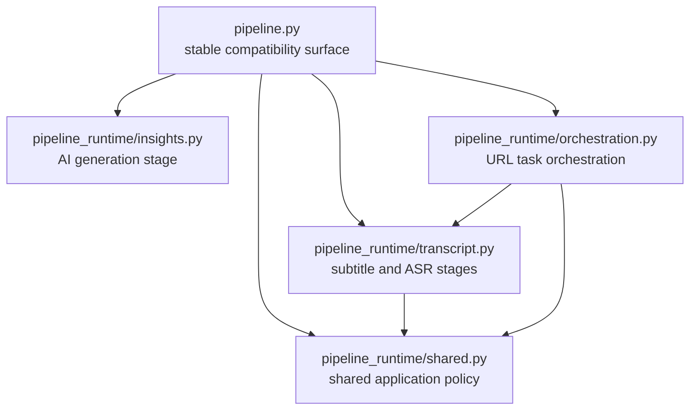

# Worker Pipeline Module Split

- Date: 2026-07-21
- Status: Implemented, verified, and accepted by the user on 2026-07-22
- Related active plan: `docs/exec-plans/active/2026-07-16-local-media-file-import-plan.md`
- Scope: behavior-neutral Python worker refactor

## Context

Before this implementation, `worker/frameq_worker/pipeline.py` was 589 physical lines and owned
four independently reviewable responsibilities:

1. shared path, progress, and failure-result helpers;
2. subtitle and ASR transcript stages;
3. official-transcript validation plus summary/insight generation; and
4. URL task creation, media preparation, transcript selection, and task finalization.

The file is no longer responsible for low-level media preparation or raw task-manifest writes:
`MediaPreparationFacade` and `TaskStoreFacade` already own those boundaries. It nevertheless remains
the physical owner of both the process-video application flow and the AI stage reused by
`worker_service.retry_insights_once`. This makes a change to one stage require reviewing imports,
failure policy, and tests for the other stages even though process-video is forbidden from entering
AI and retry-insights is forbidden from entering media preparation or ASR.

The active local-media plan will later add a real source-specific worker consumer. That feature must
not be mixed into this refactor. The present contract remains global v4 with the URL process request
at v3, and no local-media picker, Rust job, CLI consumer, source variant, manifest variant, or
progress producer is added here.

## Requirements

### Functional compatibility

- Preserve the existing `frameq_worker.pipeline` import path and every repository-observed callable
  or type currently owned by that module.
- Preserve function signatures, default values, returned `ProcessResult` objects, exception catches,
  artifact keys, progress events, and task-finalization order.
- Preserve direct object identity: the stable root re-exports the actual private objects rather than
  wrappers, subclasses, aliases created by assignment, or duplicate definitions.
- Keep `cli.py`, worker stdin modes, request/result contracts, task schema, History, UI, server,
  dependency declarations, and packaged runtime behavior unchanged.

### Non-functional requirements

- Each private module has one reviewable responsibility and a closed dependency direction.
- Process-video orchestration cannot import InsightFlow, LLM construction, output-language policy,
  or the AI stage.
- AI generation cannot import ASR, media preparation, source resolution, or task persistence.
- The split creates no new facade class, generic stage framework, dependency-injection container,
  event bus, plugin system, or local-media placeholder.
- Existing source URL, local path, transcript, prompt, generated-content, and diagnostic privacy
  boundaries remain unchanged.

## Decision

Keep `worker/frameq_worker/pipeline.py` as the sole stable production import surface and move its
implementations into an empty-initializer private package named `pipeline_runtime/`.

`pipeline_runtime/__init__.py` remains empty. It is not a second public entry point and performs no
registration or eager composition.

### Stable root surface

The root contains imports and direct re-exports only. It defines no function, class, dataclass, or
wrapper and remains below 100 physical lines. It preserves these current pipeline-owned names:

- `PipelineContext`
- `TranscriberFactory`
- `complete_transcript_stage`
- `emit_progress`
- `failed_result`
- `prepare_asr_transcriber_stage`
- `prepare_pipeline_context`
- `resolve_cache_dir`
- `resolve_output_dir`
- `run_asr_transcript_stage`
- `run_asr_transcript_step`
- `run_insight_generation_step`
- `run_prepared_subtitle_transcript_step`
- `run_worker_pipeline`
- `write_prepared_subtitle_stage`

Incidental imported modules and dependency classes that happened to be visible as attributes of the
old implementation file are not a supported compatibility surface. Repository production and test
callers continue importing the names above from `frameq_worker.pipeline`.

### Responsibility map

| Owner | Symbols and responsibility |
|------|----------------------------|
| `pipeline_runtime/shared.py` | `TranscriberFactory`, `resolve_output_dir`, `resolve_cache_dir`, `failed_result`, and `emit_progress`; no task, media, transcript, or AI orchestration |
| `pipeline_runtime/transcript.py` | `run_asr_transcript_step`, `run_prepared_subtitle_transcript_step`, `write_prepared_subtitle_stage`, `prepare_asr_transcriber_stage`, `run_asr_transcript_stage`, and the private safe progress-argument helpers |
| `pipeline_runtime/insights.py` | `run_insight_generation_step`, including official `transcript.txt` containment/link checks, UTF-8 read, target-scoped generation, partial artifact preservation, and result mapping |
| `pipeline_runtime/orchestration.py` | `PipelineContext`, `prepare_pipeline_context`, `complete_transcript_stage`, and `run_worker_pipeline`; creates the URL task, calls `MediaPreparationFacade`, selects subtitle or ASR, and finalizes through `TaskStoreFacade` |
| `pipeline.py` | Directly re-exports the current stable names from the four owners; owns no behavior |

### Dependency direction

The private package follows these rules:

- no private child imports `frameq_worker.pipeline`, `frameq_worker.cli`, or
  `frameq_worker.worker_service`;
- `shared.py` imports only the types and pure builders needed for paths, typed failures, progress,
  and the transcriber factory signature; its ASR dependency is limited to the stable `Transcriber`
  contract and it imports no provider, model-registry, cache, or artifact behavior;
- `transcript.py` may import `shared.py`, the stable ASR surface, transcript/source DTOs, progress
  normalization, and `TaskContext`; it must not import media preparation, InsightFlow, LLM,
  worker service, or orchestration;
- `insights.py` may import InsightFlow generation, result/transcript/preference types, and
  output-language types; it must not import ASR, media, media preparation, source resolution,
  `TaskStoreFacade`, CLI, worker service, shared pipeline policy, transcript stages, or orchestration;
- `orchestration.py` may import `shared.py`, `transcript.py`, `MediaPreparationFacade`, source
  resolution, and `TaskStoreFacade`; it must not import `insights.py`, InsightFlow, LLM,
  output-language policy, or retry request types; and
- production modules outside `pipeline_runtime/` continue importing pipeline-owned names only from
  `frameq_worker.pipeline`.

The last rule intentionally retains the current compatibility surface. This refactor improves
physical ownership and enforceable dependency direction; it does not claim to make the CLI import
graph lazy or to remove historical CLI re-exports.

## Runtime Flow

### URL process flow

The behavior remains:

1. `worker_service.run_worker_once` parses the existing process-video request and loads runtime
   configuration.
2. Stable `pipeline.run_worker_pipeline` resolves to the implementation in
   `pipeline_runtime.orchestration`.
3. Orchestration resolves output/cache roots, resolves the source identity, creates one task through
   `TaskStoreFacade`, and calls `MediaPreparationFacade.prepare(UrlMediaSource, TaskContext)`.
4. A usable prepared subtitle is written as the official transcript. A missing or unwritable
   subtitle falls through to the existing ASR path.
5. ASR preparation and transcription produce the same transcript artifacts and metadata.
6. Orchestration finalizes exactly once after a transcript success, or finalizes the current task
   with the existing media/ASR failure result.

Process-video orchestration has no route to `pipeline_runtime.insights`.

### AI retry flow

The behavior remains:

1. `worker_service.retry_insights_once` parses the strict retry request, loads the task through
   `TaskStoreFacade`, persists an insights-only preference snapshot when present, and calls the
   stable `pipeline.run_insight_generation_step` export.
2. The implementation in `pipeline_runtime.insights` validates the exact official transcript path
   and link/junction constraints before reading its plain UTF-8 body.
3. The selected target generates summary plus mindmap or insights only, using the existing output
   language and preference scope.
4. `worker_service` merges existing AI artifacts and performs the sole retry finalization.

The AI owner does not open a task, prepare media, run ASR, persist a preference snapshot, merge old
artifacts, or finalize a manifest.

## Failure and Progress Compatibility

The physical move preserves the following policies exactly:

| Condition | Required current behavior |
|----------|---------------------------|
| Source identity cannot be resolved | Return `SOURCE_IDENTITY_UNAVAILABLE` at `video_extracting`; do not create/finalize a task |
| Task roots cannot be prepared | Return `TASK_STORAGE_UNAVAILABLE` at `video_extracting` |
| `MediaPreparationFacade` fails | Finalize the created task with the facade's existing safe code, message, and stage |
| Prepared subtitle write raises `ASRError` | Return no subtitle result and continue through ASR |
| Real ASR is disabled and no transcriber was injected | Return `ASR_MODEL_NOT_READY` at `video_transcribing` |
| Required model cache is absent | Return `ASR_MODEL_NOT_DOWNLOADED` at `video_transcribing` |
| Transcriber factory raises `OSError` | Preserve the current `ASR_MODEL_CACHE_UNAVAILABLE` result and message construction |
| Transcription raises `ASRError` | Preserve the ASR code/message at `video_transcribing` and finalize the task |
| AI transcript path is not the exact official path or crosses a link/junction boundary | Return `partial_completed` with `TRANSCRIPT_TEXT_PATH_INVALID`, empty text, and no prompt call |
| Official transcript cannot be read as UTF-8 | Return `partial_completed` with `TRANSCRIPT_TEXT_NOT_FOUND`, empty text, and no prompt call |
| AI client is absent | Return `partial_completed` with `INSIGHTFLOW_CONFIG_MISSING` while preserving the transcript body |
| One AI target sub-operation fails | Preserve successful target artifacts and return the first current `InsightGenerationError` as `partial_completed` |

The transcript owner emits the same existing events in the same order and conditions:

- `subtitle.detect.found` at 68 with a normalized safe language argument;
- `asr.transcribe.starting` at 58;
- `asr.cache.preparing` at 58 only when preparing a real default transcriber; and
- `asr.transcribe.running` at 68.

Media-preparation events remain wholly owned by `MediaPreparationFacade`. No new progress code,
argument, log entry, or diagnostic event is introduced.

## Security and Privacy

- The split moves existing code without widening any input, output, persistence, network, prompt,
  or logging surface.
- Official transcript path validation remains entirely inside the AI owner and runs before any file
  read or LLM call. Rejected path, transcript, prompt, and generated body values remain unreported.
- Source identity and URL resolution remain in orchestration and the existing source modules. AI
  code receives neither a source URL nor a manifest.
- `TaskStoreFacade` remains the only task persistence owner used by process and retry application
  flows. Private pipeline modules do not regain raw manifest writes.
- `MediaPreparationFacade` remains the only media subsystem entry. Transcript and orchestration
  modules do not call download, ffprobe, FFmpeg, copy, or subtitle-discovery primitives directly.
- This change adds no local path. Contract-v4 local source paths remain forbidden outside the future
  bounded Rust selection/worker-stdin/worker-memory flow.
- Existing exception messages are preserved for behavior compatibility but gain no new diagnostic,
  log, progress, or technical-details sink.

## Verification Strategy

### RED/GREEN ownership gate

Add `worker/tests/test_pipeline_module_boundaries.py`. Its first test expects this exact private tree:

- `pipeline_runtime/__init__.py`
- `pipeline_runtime/shared.py`
- `pipeline_runtime/transcript.py`
- `pipeline_runtime/insights.py`
- `pipeline_runtime/orchestration.py`

Before implementation, that test fails because the private tree is absent. Dependent ownership tests
skip until the exact tree exists, then prove:

- the initializer is empty;
- every approved symbol has one physical owner;
- the stable root defines no functions/classes and stays below 100 lines;
- every stable root export is the exact object from its approved private owner;
- private modules have no root/application back edges;
- process orchestration cannot reach AI modules;
- AI generation cannot reach ASR/media/source/task-persistence modules;
- only transcript owns ASR behavior imports, with `shared.py` limited to the `Transcriber` contract;
  only orchestration owns media preparation, source resolution, and `TaskStoreFacade`; and
- production modules outside the private tree import no `pipeline_runtime` child directly.

### Behavioral characterization

Existing public tests continue importing `frameq_worker.pipeline`. Before moving implementation,
focused tests must cover the current source/task/media/subtitle/ASR/AI failure matrix sufficiently to
distinguish a moved behavior from a changed behavior. Existing task-artifact, CLI, media-preparation,
source-privacy, output-language, preference, and contract tests remain authoritative.

`worker/tests/test_media_preparation.py::test_pipeline_enters_media_subsystem_only_through_facade`
must inspect the new orchestration owner while also proving that the stable root exposes the same
pipeline entry. It must not weaken the prohibition on direct download, extraction, probe, or
subtitle-discovery calls.

### Required commands

- focused pipeline/module/task/media/CLI tests;
- `uv run pytest worker/tests`;
- `uv run ruff check worker`;
- `npm --prefix app test`;
- `npm --prefix app run lint`;
- `npm --prefix app run build`;
- `cargo test --manifest-path app/src-tauri/Cargo.toml`;
- `cargo fmt --manifest-path app/src-tauri/Cargo.toml -- --check`;
- `node --test scripts/tests/*.test.mjs`;
- `python scripts/validate_agents_docs.py --level WARN`;
- `npm --prefix app run tauri -- build --no-bundle`; and
- `git diff --check`.

The established Tauri worker synchronization path must refresh the ignored packaged mirror and the
recursive equality/hash test must prove that the canonical and packaged worker trees contain the
same relative files and bytes. The generated mirror is never hand-edited.

## Documentation Impact

Implementation closeout updates:

- `AGENTS.md` with the new durable design and completed-plan links;
- `TASKS.md` with acceptance evidence;
- `docs/ARCHITECTURE.md` with the stable root/private-owner dependency boundary;
- `docs/SECURITY.md` with the process/AI isolation and root-only import gate;
- `docs/design-docs/frameq-code-audit-uml.md` with current line counts, module ownership, and the
  resolved audit item;
- the active local-media ExecPlan so future worker steps start from the actual private owners;
- the technical-debt tracker so manual real-platform smoke points at the actual orchestration
  owner; and
- the active/completed ExecPlan indexes when the implementation plan is archived.

No product specification changes because the refactor changes no user-visible behavior, wire
contract, artifact, task schema, platform support, AI call, or local-media capability.

## Implementation Results

- The stable root is 39 physical lines and contains only explicit direct re-exports. The private
  owners are `shared.py` at 68 lines, `transcript.py` at 250 lines, `insights.py` at 152 lines, and
  `orchestration.py` at 159 lines; the package initializer is empty.
- Five behavior characterizations were added before movement, and the exact-tree ownership test
  intentionally remained RED until all four owners existed. Final focused behavior passed 56/56,
  ownership/identity/dependency tests passed 11/11, and AST comparison against baseline `fd81f10`
  found zero mismatches across all 17 moved definitions.
- Full validation passed Worker 531/531, App 549/549, normal-Windows Rust 175/175, and Node scripts
  23/23, together with Ruff, app lint/build, rustfmt, Tauri release `--no-bundle`, governance, and
  whitespace gates. The sandbox-only blocked-stdin cancellation failure was reproduced as a denied
  `taskkill` operation; the identical Rust command passed outside that restriction without a code
  change.
- The supported generator refreshed the ignored packaged worker, and recursive relative-path plus
  SHA-256 comparison proved 61 canonical files and 61 packaged files with zero missing, extra, or
  mismatched entries.
- No contract, request/model, manifest, CLI/worker-service production, app/server production,
  dependency, product-specification, or local-media runtime file changed. Existing `audioop`
  deprecation and Vite chunk-size warnings remain unrelated and non-blocking.
- Residual validation is limited to the already-declared structural-refactor risks: no real public
  download, packaged ASR execution, cloud LLM/Credits call, or native desktop end-to-end smoke was
  run; static dependency gates still require future behavioral/security review when semantics
  change. The user accepted the implementation and authorized a local commit and merge on
  2026-07-22; push, tag, PR, branch deletion, and worktree deletion remain separate actions.

## Alternatives Considered

### Keep the 589-line file

Rejected because process-video and AI stages remain physically coupled even though their allowed
dependencies and failure boundaries differ. Existing facade work removed lower-level complexity but
did not create an enforceable process-versus-AI import boundary.

### Extract only `run_insight_generation_step`

Rejected because it would leave shared policy, transcript stages, and top-level orchestration in one
large owner and would require another structural pass before local-media implementation. The chosen
four-owner split is still small enough to review as one behavior-neutral change.

### Clean up `cli.py` compatibility exports in the same change

Rejected by approved scope A. CLI import-surface cleanup has different compatibility questions and
must not obscure whether the pipeline move itself preserved behavior.

### Combine the split with local-media runtime

Rejected because new source types, path handling, FFmpeg strategy, task schema, History, and UI would
make failures impossible to attribute to either restructuring or new behavior. No dead local source
owner or branch is created here.

### Add a `PipelineFacade` class or generic stage registry

Rejected because there is one current process pipeline and one separately confirmed AI stage. A new
class, registry, plugin system, or generic executor would add indirection without owning a missing
policy or failure boundary.

## Consequences

### Positive

- URL orchestration, transcript production, and AI generation become independently reviewable.
- Dependency tests make the existing no-AI orchestration and no-media/ASR AI-owner boundaries
  structural facts.
- Future local-media implementation can modify its approved source/orchestration owner without first
  moving unrelated AI code.
- Existing callers and tests retain one stable import path and exact object identities.

### Negative

- The worker gains five small files and explicit re-export wiring.
- Stable-root imports remain eager because CLI compatibility cleanup is out of scope; this change
  does not promise faster startup or fewer imported modules.
- Boundary tests intentionally make future ownership changes require an explicit design update.

### Neutral

- Total production line count may rise slightly from imports and explicit boundaries.
- `TaskStoreFacade`, `MediaPreparationFacade`, ASR, InsightFlow, contracts, and manifests keep their
  existing ownership and behavior.
- The active local-media plan remains incomplete at Rust native-selection step 2 after this refactor.

## Acceptance Criteria

The design is implemented only when:

1. the exact private module tree and dependency rules pass;
2. `pipeline.py` is a direct-re-export-only stable root below 100 lines;
3. all current pipeline-owned public names resolve to the exact approved private objects;
4. focused and full behavior suites prove unchanged progress, failures, artifacts, task finalization,
   prompt source, output-language, preference, and target behavior;
5. no contract, manifest, CLI mode, UI, server, dependency, or local-media runtime behavior changes;
6. canonical and packaged worker trees are recursively byte-equal after the supported refresh path;
   and
7. governance, formatting, build, Tauri, and diff gates pass with exact evidence recorded in the
   implementation ExecPlan.
