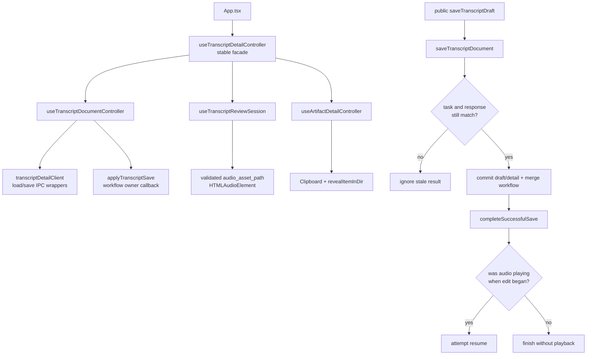
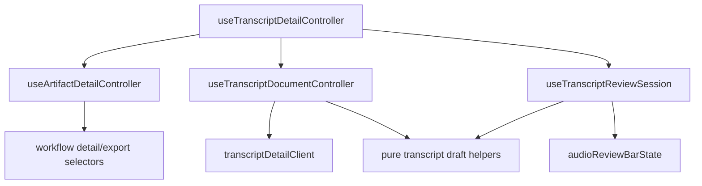

# Frontend Transcript Detail Controller Split

**Date:** 2026-07-23
**Status:** Implemented and verified on 2026-07-23

## Context

`app/src/features/transcript/useTranscriptDetailController.ts` is a 509-line React hook with a
stable public role, 12 state cells, 5 refs, 3 effects, and several private responsibilities. It
currently owns:

- the shared task-result detail tab used by summary, insights, and the legacy transcript detail
  projection;
- transcript-detail loading, fallback state, draft text, segment drafts, dirty/loading/saving
  state, and task-staleness checks;
- clipboard and saved-artifact location actions;
- audio element ownership, playback time, scrubbing, segment seeking, active-segment following,
  and scroll-into-view behavior;
- edit-session pause/resume intent and full-text/segment edit transitions; and
- current-task audio release before permanent History deletion.

The hook is the correct application-level facade for `App.tsx`,
`LocalTranscriptWorkspace`, `TranscriptReviewPanel`, and `AiResultDetailSheet`, but these
responsibilities do not share one failure boundary. Clipboard or file-location failure must not
affect transcript state. A stale load/save result must not affect a new task. Audio playback
failure must not discard a draft. Deletion preparation must release only the matching task's
audio element.

This is an internal structural refactor. It adds no user-visible behavior, command, contract,
storage path, network path, or new security boundary, so it does not require a product-spec
change. The Rust transcript-detail module split in
`docs/design-docs/2026-07-20-transcript-detail-module-split.md` remains authoritative for Tauri
file access and is not changed by this frontend split.

The current public controller shape is used across feature presentation components and tests.
Changing that shape would create a broad migration without improving the first extraction.
Therefore the existing hook remains the only production import surface and continues returning
the same flat controller projection.

## Requirements

The split must:

- keep `app/src/features/transcript/useTranscriptDetailController.ts` as the only production
  controller import used by `App.tsx` and existing presentation consumers;
- preserve `TranscriptDetailController = ReturnType<typeof useTranscriptDetailController>` and
  every current returned field and action;
- keep `App.tsx`, `LocalTranscriptWorkspace`, `TranscriptReviewPanel`, and
  `AiResultDetailSheet` behaviorally unchanged and avoid moving feature state back into
  `App.tsx`;
- preserve the `load_transcript_detail` and `save_transcript_edit` client calls, payloads,
  localized message codes, clipboard behavior, and saved-artifact location behavior;
- preserve the current task-identity rule: a late load or save from task A cannot mutate the
  projection for task B;
- preserve full-text and segment editing, dirty-state semantics, playback-following selection,
  pause-on-edit, conditional resume-after-save, Escape/end-edit cancellation of pending resume,
  and current-task-only deletion preparation;
- keep audio playback limited to `audio_asset_path` returned by the validated Tauri command;
- introduce no React context, global store, generic event bus, service locator, reducer framework,
  new Tauri command, new IPC field, new i18n key, or new network/logging behavior;
- add characterization coverage before extraction for behavior that currently depends on
  cross-responsibility sequencing; and
- keep each private child independently understandable and testable without creating a second
  workflow/task-identity owner.

## Alternatives Considered

### 1. Keep the hook intact and extract only pure helpers

Moving formatting and small callbacks would lower the visible line count slightly, but load/save
effects, audio effects, edit transitions, and task-staleness rules would remain interleaved. The
maintenance problem is mixed state/effect ownership, not a lack of utility functions.

**Decision:** Rejected as the complete solution.

### 2. Keep a stable facade and extract private responsibility-owned hooks

The existing hook remains the only public controller. It composes one task-detail action owner,
one transcript document owner, and one review-session owner, then returns the current flat
projection. Cross-child sequencing remains explicit in the facade.

**Decision:** Selected. It separates failure boundaries while minimizing consumer and regression
risk.

### 3. Replace the controller with a reducer or a nested public API

A reducer could centralize transitions, and a nested
`controller.detail/document/review` API could make consumers more explicit. Both approaches would
change every consumer and test at the same time as the extraction. The current state is not a
single state machine: clipboard, artifact location, task-bound persistence, and browser audio
effects have distinct dependencies and failure semantics.

**Decision:** Rejected for this refactor. A future consumer redesign may introduce nested
projections only with separate evidence that the stable facade has become a constraint.

## Decision

Use the following module tree:

```text
app/src/features/results/
  useArtifactDetailController.ts

app/src/features/transcript/
  useTranscriptDetailController.ts
  useTranscriptDetailController.test.ts
  transcriptControllerBoundary.test.ts
  useTranscriptDocumentController.ts
  useTranscriptReviewSession.ts
```

The implementation may keep a focused test in the facade file rather than duplicate a child test
when the behavior is inherently cross-child. It must not create a general-purpose hook-testing
framework as part of this refactor.

### Responsibility map

| Module | Owns | Must not own |
|---|---|---|
| `useTranscriptDetailController.ts` | stable public facade, child composition, exact flat return projection, successful-save handoff between document and review session | direct Tauri invocation, browser audio calculations, clipboard/file-location implementation, duplicate transcript state |
| `useArtifactDetailController.ts` | detail tab open/close, locale-aware detail text, current saved export paths, clipboard actions, saved-artifact location actions, unsaved-transcript location warning | transcript loading/saving, task mutation, audio element, segment editing, History deletion |
| `useTranscriptDocumentController.ts` | task-scoped load, fallback projection, draft text, segments, dirty/loading/saving state, semantic draft updates, save request, stale-result rejection, successful document commit, workflow merge callback | audio playback, element refs, scroll behavior, result-detail tabs, History deletion, raw paths from IPC |
| `useTranscriptReviewSession.ts` | audio element and segment element refs, audio URL conversion, time/duration/playing state, active/editing segment, seek/scrub/follow/scroll, pause/resume intent, successful-save review completion, matching-task audio release | transcript IPC, workflow mutation, clipboard/export, manifest/path validation, Tauri commands |

Only the facade is a production controller surface shared across feature boundaries. The child
hooks are implementation owners, not additional application facades.

## Stable Public Surface

The facade must continue returning the current flat fields and actions in the same semantic
groups:

```ts
type ExistingTranscriptDetailControllerSurface = {
  // Shared result detail.
  detailTab: DetailTab | null;
  openDetailTab: (tab: DetailTab | null) => void;
  closeDetail: () => void;
  detailText: string;
  exportPath: string | null;
  currentTranscriptPath: string | null;
  copyDetail: () => Promise<void>;
  copyTranscript: () => Promise<void>;
  exportDetail: () => Promise<void>;
  exportTranscript: () => Promise<void>;

  // Transcript document.
  transcriptDetail: TranscriptDetailResponse | null;
  transcriptDraft: string;
  transcriptSegments: TranscriptSegment[];
  transcriptDirty: boolean;
  transcriptLoading: boolean;
  transcriptSaving: boolean;
  updateTranscriptSegmentDraft: (segmentId: string, text: string) => void;
  updateFullTranscriptDraft: (text: string) => void;
  saveTranscriptDraft: () => Promise<void>;

  // Review session.
  activeTranscriptSegmentId: string | null;
  editingTranscriptSegmentId: string | null;
  transcriptAudioCurrentTime: number;
  transcriptAudioDuration: number;
  transcriptAudioPlaying: boolean;
  transcriptAudioRef: React.RefObject<HTMLAudioElement | null>;
  transcriptSegmentRefs: React.RefObject<Record<string, HTMLDivElement | null>>;
  transcriptAudioSrc: string;
  transcriptAudioProgress: number;
  transcriptAudioScrubberMax: number;
  transcriptAudioScrubberStyle: CSSProperties;
  hasTranscriptSegments: boolean;
  playTranscriptSegment: (segment: TranscriptSegment) => Promise<void>;
  handleTranscriptAudioMetadata: () => void;
  handleTranscriptTimeUpdate: () => void;
  handleTranscriptAudioPlay: () => void;
  handleTranscriptAudioPause: () => void;
  toggleTranscriptAudio: () => Promise<void>;
  scrubTranscriptAudio: (event: ChangeEvent<HTMLInputElement>) => void;
  beginTranscriptSegmentEdit: (segmentId: string) => void;
  endTranscriptSegmentEdit: () => void;
  prepareTranscriptForTaskDeletion: (expectedTaskId: string) => void;
};
```

This declaration documents the required compatibility shape; the implementation continues deriving
the exported type with `ReturnType` rather than introducing a second manually maintained public
interface.

## Planned Private Interfaces

The exact private type spelling may change during implementation, but the capability direction
must remain:

```ts
// useArtifactDetailController.ts
useArtifactDetailController({
  workflow,
  locale,
  transcriptDraft,
  transcriptDirty,
  setActionNotice,
});

// useTranscriptDocumentController.ts
const document = useTranscriptDocumentController({
  workflow,
  applyTranscriptSave,
  setActionNotice,
});

await document.saveTranscriptDocument(review.completeSuccessfulSave);

// useTranscriptReviewSession.ts
const review = useTranscriptReviewSession({
  reviewTaskId,
  audioAssetPath: document.transcriptDetail?.audio_asset_path ?? null,
  transcriptSegments: document.transcriptSegments,
  setActionNotice,
});
```

`saveTranscriptDocument` is private and may accept a successful-save continuation. The public
facade wraps it as the existing zero-argument `saveTranscriptDraft`. The continuation runs only
after task identity and response identity both match and the saved document state has been
committed. It may clear edit mode and conditionally resume audio; it must not run for stale or
failed saves.

The child hooks receive semantic values and callbacks. They do not receive a workflow setter,
arbitrary filesystem path, Tauri command runner, event bus, or another child's internal setter.

## State and Effect Ownership

| State/effect | Owner | Reason |
|---|---|---|
| `detailTab` and derived detail text/export path | artifact detail | shared result-detail UI behavior independent of transcript persistence |
| transcript detail response, draft, segments, dirty/loading/saving | document | one task-scoped local document lifecycle |
| loaded/current task refs and stale load/save checks | document | task identity protects document persistence and projection |
| audio element, time, duration, playing, active segment | review session | browser media lifecycle and timed selection change together |
| editing segment and pending resume intent | review session | edit entry/exit directly controls playback |
| segment element refs and active-segment scroll effect | review session | DOM review behavior, not document persistence |
| saved workflow merge | document through the existing callback | `useTaskProcessingController` remains the sole workflow/task owner |
| cross-child save completion | facade | explicit application sequencing without child-to-child imports |

`reviewTaskId` is the current task ID only when the current workflow still declares an official
transcript artifact. When that identity becomes null or changes, the review session clears active
selection, edit state, and pending resume intent. Its separate validated-audio-source effect resets
browser audio time/duration/playing state when the asset changes. The document hook independently
resets its task-scoped projection.

## Load, Edit, and Save Flow



### Load rules

1. No current task or no official transcript artifact resets the document projection to the
   workflow text and resets the review identity.
2. Re-rendering the same loaded task does not issue another detail request.
3. A task change cleans up the previous load effect. Its late response cannot mutate the new task.
4. A successful load installs the returned text, segments, and validated audio projection.
5. A failed load keeps the workflow text usable, clears optional segments/audio detail, and emits
   only the existing localized fallback message.

### Edit and save rules

1. Segment edits update both the segment list and the synthesized full draft, then mark the
   document dirty.
2. Full-text edits update only the draft and dirty state, matching current behavior.
3. Entering segment/full-text edit pauses playing audio and records resume intent only when audio
   was actually playing.
4. Ending edit without saving clears resume intent but keeps the in-memory draft dirty.
5. Save freezes the expected task ID and sends the current draft and segments through the existing
   client.
6. A stale response is ignored before document commit, workflow merge, notice, edit completion, or
   audio resume.
7. A current successful response updates the document projection, clears dirty state, invokes the
   existing workflow merge callback, emits the current saved notice, then completes the review
   session.
8. Audio resume failure replaces the success notice with the current localized
   `savedAutoplayFailed` message; it does not roll back the saved transcript.

## Behavior and Failure Matrix

| Condition | Required behavior |
|---|---|
| no task or no transcript artifact | reset document/review state; issue no detail request |
| repeated render for the same task | do not load again |
| task changes while load is pending | ignore the previous load response |
| detail load fails | keep workflow text, clear optional detail/segments, show fixed fallback notice |
| loaded detail has no audio asset | keep editing available and show the existing quiet no-audio notice |
| copy has no text | show the existing nothing-to-copy notice |
| clipboard rejects | show the matching fixed copy-failure notice; expose no raw error |
| transcript has unsaved changes and user locates export | do not reveal the saved path; show the existing save-first notice |
| saved artifact path is absent | show the existing no-export notice |
| `revealItemInDir` rejects | show the matching fixed locate-failure notice; expose no path/error detail |
| user clicks the active playing segment | pause audio and retain the active segment |
| user begins edit while audio is playing | pause and remember conditional resume intent |
| user ends edit before save | clear resume intent, leave dirty draft intact |
| save succeeds for the current task | commit document, merge workflow, clear edit state, conditionally resume |
| save succeeds after the visible task changes | ignore the response and do not resume old audio |
| save fails | keep dirty draft, show fixed save-failure notice, expose no raw error |
| deletion preparation receives another task ID | do nothing |
| deletion preparation receives the current task ID | pause, remove `src`, reload the element, and clear playing state |

## Dependency Direction



- No private child imports another private child. The facade is the only composition point.
- `useArtifactDetailController` must not import the transcript client, audio state, or workflow
  mutation controller.
- `useTranscriptDocumentController` must not import `convertFileSrc`,
  `revealItemInDir`, browser audio element helpers, or `App.tsx`.
- `useTranscriptReviewSession` must not import the transcript client, opener plugin, workflow
  mutation controller, History client, or any Tauri invoke wrapper.
- Presentation components continue importing only the stable facade type.
- Pure helpers remain in `transcriptReviewState.ts` and `audioReviewBarState.ts`; this refactor does
  not duplicate their policy inside hooks.

## Test Strategy

### Characterization before extraction

Extend the stable facade tests before moving production behavior:

- no-task/artifact reset and same-task load deduplication;
- late load ignored after task change;
- successful load and fixed fallback/no-audio notices;
- current-task save success and stale-task save rejection;
- segment and full-text dirty-state behavior;
- pause-on-edit, conditional resume-on-save, and end-edit clearing resume intent;
- copy/export success, absent-content/path behavior, dirty-transcript location block, and safe
  failure notices;
- audio seek, active-segment following, scrubbing, and playback failure notices; and
- matching-task-only deletion preparation.

Tests must compare message codes rather than rendered language and must prove rejected promise
details or local paths are not copied into notices.

### Post-extraction ownership coverage

- Facade tests exercise each owner's state/effect behavior and retain cross-child save and
  task-switch sequencing through the stable public surface.
- A source-boundary test verifies the approved module files, stable consumer import surface, and
  forbidden dependency directions, `ReturnType` alias, and physical line limits.
- Existing browser coverage remains the integration proof for real React scheduling and DOM
  wiring, especially delayed save after task restoration, segment Escape behavior, transcript
  availability during AI activity, and the audio review workspace.

This refactor must not replace browser/native evidence with the lightweight hook harness. Native
Tauri filesystem and audio-path validation remain covered by the existing Rust and packaged-app
boundaries.

## Security and Compatibility

- The frontend continues receiving playable paths only from `load_transcript_detail`; no child
  accepts arbitrary user-selected paths.
- `convertFileSrc` remains confined to the review session and only consumes the validated
  `audio_asset_path`.
- Clipboard and locate actions continue using existing derived content and saved manifest artifact
  paths. Unsaved transcript drafts are copied but never treated as saved export paths.
- Promise rejection values, complete local paths, transcript contents, credentials, and raw Tauri
  errors must not enter notices or logs.
- The split adds no telemetry, network request, server request, worker request, storage write,
  command registration, or permission.
- Workflow task identity remains owned by `useTaskProcessingController`. The transcript document
  owner may only request a semantic saved-result merge through `applyTranscriptSave`.
- IPC request/result types, localization resources, HTML/ARIA output, CSS classes, manifest schema,
  desktop-worker contract, AI behavior, and Credits behavior remain unchanged.

## Consequences

### Positive

- Task-scoped persistence, browser audio effects, and generic detail actions become independently
  reviewable.
- The public facade stays stable, so presentation and App composition risk remains small.
- Stale-task protection has one explicit document owner rather than being interleaved with audio
  callbacks.
- Future audio-review or transcript-edit changes have narrower test and dependency surfaces.

### Negative

- The feature gains three private hooks and corresponding test seams.
- The stable facade still returns a broad flat projection; this is an intentional compatibility
  choice, not the final ideal API for every future consumer.
- Some integration tests remain broad because pause/edit/save/task-switch ordering crosses private
  owners.

### Neutral

- Total lines may remain similar or increase. Success is measured by ownership and dependency
  clarity, not aggregate line-count reduction.
- `TranscriptReviewPanel.tsx` remains a presentation component and is outside this refactor even
  though it is also substantial.

## Implementation Order

1. Add missing facade characterization tests while production remains in one file.
2. Extract detail-tab, clipboard, and saved-artifact location behavior into
   `useArtifactDetailController`.
3. Extract task-scoped transcript load/draft/save behavior into
   `useTranscriptDocumentController`.
4. Extract audio/edit/review-session behavior into `useTranscriptReviewSession`.
5. Reduce `useTranscriptDetailController` to stable composition, successful-save sequencing, and
   exact flat projection.
6. Add source/dependency boundary tests and run focused/full App gates.
7. Update architecture, code-audit evidence, technical-debt status, `TASKS.md`, and the ExecPlan;
   archive the plan only after all gates pass.

Each extraction stops if a controller field, localized message code, IPC call, task-staleness rule,
audio/edit transition, saved artifact action, or presentation behavior changes.

## Acceptance

- Existing production consumers retain their current import and use sites.
- The facade returns the same public keys and action semantics.
- `useTranscriptDetailController.ts` contains only stable composition and cross-child sequencing
  and remains below 200 physical lines.
- No new private child exceeds 250 physical production lines without a documented reason.
- Characterization, focused child, facade integration, source-boundary, full App, lint, build, and
  relevant browser smoke tests pass.
- `App.tsx`, Tauri commands, worker/server code, contracts, manifest schema, localization
  resources, CSS, and product-visible behavior have no intentional change.
- Governance validation and `git diff --check` pass.

## Implementation Evidence

The implementation preserves the 41-key flat facade and leaves all production consumers unchanged.
The boundary-test physical-line measurement records:

| Production module | Physical lines |
|---|---:|
| `useTranscriptDetailController.ts` | 126 |
| `useArtifactDetailController.ts` | 139 |
| `useTranscriptDocumentController.ts` | 199 |
| `useTranscriptReviewSession.ts` | 250 |

The pre-extraction facade baseline was 1 file / 4 tests. Characterization expanded it to 18 tests;
the final task-scoped resume regression raised it to 19. The ownership test first failed on the
missing approved owners, then passed after the split. Final automated evidence is:

- focused facade 19/19 and ownership 1/1;
- selected real Chromium integration 4 passed / 24 skipped;
- complete App 65 files / 583 tests, TypeScript/i18n lint, and production build;
- repository scripts 25/25, governance 0 errors / 0 warnings, and `git diff --check`;
- no diff in `App.tsx`, presentation consumers, `transcriptDetailClient`, Tauri, worker, server, or
  contracts.

The only intentional behavior hardening is task-scoped pending-resume reset: an edit begun on task A
cannot cause task B audio to play after a later save. No IPC, path, network, localization, schema,
log, AI, or Credits behavior changed. Native Tauri load/play/edit/save smoke was not rerun because
the implementation did not touch IPC, asset scope, permissions, native code, or packaged runtime;
that remains the explicitly unverified manual residual risk.

## Validation Commands for the Future ExecPlan

```text
npm --prefix app test
npm --prefix app run lint
npm --prefix app run build
node --test scripts/tests/*.test.mjs
python scripts/validate_agents_docs.py --level WARN
git diff --check
```

The future ExecPlan must identify the focused browser smoke command supported by the repository at
implementation time. Native Tauri validation is not required for a frontend-only structural
change unless implementation unexpectedly touches IPC, asset scope, or packaged runtime behavior.

## References

- `docs/design-docs/frameq-code-audit-uml.md`
- `docs/design-docs/2026-07-19-app-composition-integration-coverage.md`
- `docs/design-docs/2026-07-20-transcript-detail-module-split.md`
- `docs/ARCHITECTURE.md` sections “Local Transcript and AI Workspace Boundary,” “Desktop
  Task-Identity Isolation Boundary,” and “Transcript Detail and Audio Review Boundary”
- `docs/DESIGN.md` sections “Local Transcript and AI Workspaces” and “Transcript Audio Review UX”
- `docs/SECURITY.md` sections “Workspace Data-Flow Disclosure,” “Desktop Task-Identity Isolation
  Boundary,” and “Transcript Audio Review Local File Boundary”
- `docs/exec-plans/tech-debt-tracker.md`
