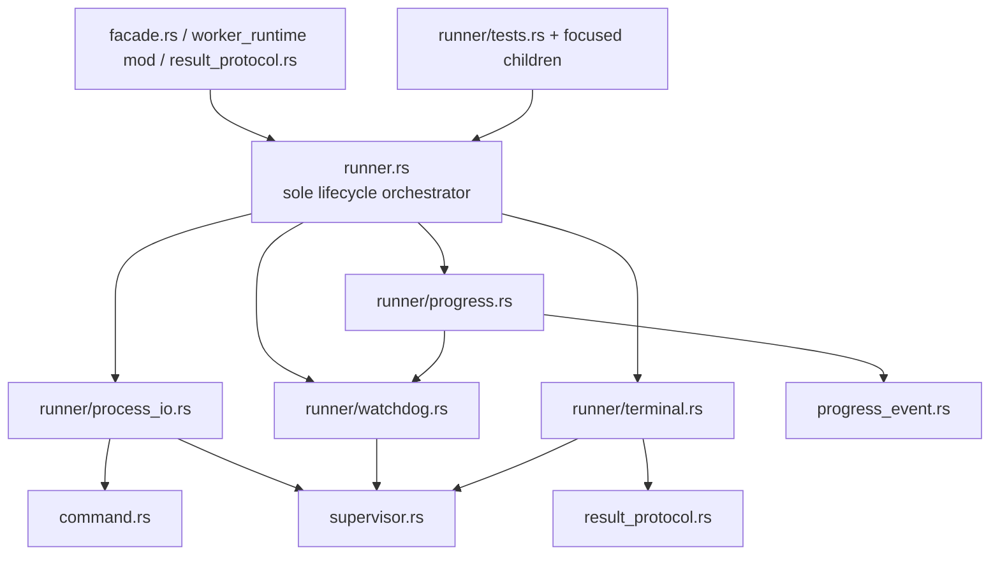

# Rust Worker Runner Module Split

- Date: 2026-07-23
- Status: Design approved by the user on 2026-07-23; implementation not started
- Scope: behavior-neutral Rust worker-runtime refactor
- Related designs:
  - `docs/design-docs/2026-07-18-rust-worker-runtime-lifecycle.md`
  - `docs/design-docs/2026-07-19-typed-worker-job-facade.md`
  - `docs/design-docs/2026-07-19-closed-worker-terminal-results.md`
  - `docs/design-docs/2026-07-22-rust-worker-watchdog.md`

## Context

`app/src-tauri/src/worker_runtime/runner.rs` is currently 2,162 physical lines. The production
region occupies lines 1-1,006, followed by a 1,156-line inline test module. The file remains the
correct single lifecycle owner, but it physically combines four independently reviewable
responsibilities:

1. child-process and pipe setup, request delivery, and failure cleanup;
2. idle/absolute watchdog policy, activity tracking, and timeout retry;
3. stderr progress parsing, validation, routing, and activity refresh; and
4. structured-result-first terminal classification and safe lifecycle diagnostics.

This is not evidence that FrameQ needs another public facade or another lifecycle owner.
`VideoWorkerFacade` already owns semantic video-job policy, `command.rs` owns fixed command and
environment construction, `supervisor.rs` owns instance state and OS process-tree signalling, and
`result_protocol.rs` owns operation-specific terminal-result validation. The problem is that the
private implementation and its tests are concentrated in one file, so a progress or watchdog
change requires navigating unrelated spawn, terminal, and fixture code.

The approved refactor must preserve the existing `WorkerLane` boundary and every lifecycle,
concurrency, protocol, security, and diagnostic behavior. It adds no user-visible capability,
contract field, Tauri command, worker operation, dependency, local-media implementation, or
product-specification change.

## Goals

- Keep `runner.rs` as the sole worker-lifecycle orchestration entry.
- Separate process I/O, watchdog, progress, and terminal policy into private child owners.
- Preserve current crate-visible type paths and application call sites.
- Preserve spawn/register/stdin/read/wait/finish/classify ordering and matching-instance cleanup.
- Preserve structured-result, cancellation, and timeout precedence exactly.
- Preserve fixed non-echoing diagnostics and validated-progress-only routing.
- Move broad tests out of the production root and prevent a new thousand-line test hotspot.
- Add an enforceable source-ownership and dependency-direction gate before production movement.

## Non-Goals

- Do not introduce a `WorkerExecution` state-machine abstraction, trait hierarchy, service locator,
  dependency-injection container, event bus, or generic process framework.
- Do not widen `WorkerLane`, `ProcessSupervisor`, or child helper visibility.
- Do not change `WorkerRunRequest`, `WorkerRunOutcome`, `WorkerRunError`, `WorkerTimeoutKind`,
  `ProgressRoute`, `WorkerJob`, or `ProcessSupervisors` call semantics.
- Do not change command construction, environment policy, stdin limits, progress schemas, terminal
  DTOs, error strings, log events, task manifests, AI Credits, or worker contracts.
- Do not combine this refactor with local-media runtime work, model-download behavior, application
  result mapping, or supervisor redesign.
- Do not claim new macOS/Unix runtime evidence from a Windows-only implementation run.

## Alternatives Considered

### Move only the inline tests

Moving the 1,156-line test module would improve navigation and reduce the apparent root size, but
the roughly 1,006-line production region would still combine four failure and concurrency
boundaries.

**Decision:** rejected as the complete solution. Tests still move as part of the selected split.

### Extract private responsibility owners behind the stable runner

Keep `runner.rs` as the only lifecycle orchestrator and extract narrow private helpers for process
I/O, watchdog, progress, and terminal policy. Preserve all current callers and type paths through
private imports/re-exports.

**Decision:** selected. This creates reviewable ownership without adding an application entry point
or changing resource ownership.

### Introduce a `WorkerExecution` state object

An explicit execution state object could own the child, guard, watchdog, and readers and might make
future phase transitions more formal. It would also change drop behavior, borrow/resource
ownership, and failure cleanup in the same change as the physical split.

**Decision:** rejected for this P1 refactor. It carries unnecessary concurrency risk under the
approved behavior-neutral boundary.

## Decision

Use this private module tree:

```text
app/src-tauri/src/worker_runtime/
  runner.rs
  runner/
    process_io.rs
    progress.rs
    terminal.rs
    watchdog.rs
    tests.rs
    tests/
      lifecycle.rs
      progress.rs
      terminal.rs
      watchdog.rs
      fixtures.rs
```

The exact test subdivision may be reduced if a file would contain only trivial forwarding, but the
production tree and ownership boundaries are fixed. `runner.rs` declares child modules with
private `mod`, never `pub mod`. Child definitions use the minimum `pub(super)` visibility needed
for root orchestration or sibling composition. No child path becomes an application import
surface.

The root remains the source of the existing `super::runner::*` paths used by `facade.rs`,
`result_protocol.rs`, and `worker_runtime/mod.rs`. A moved type may be privately re-exported from
the root only when necessary to preserve that exact path and visibility.

## Responsibility Map

| Owner | Owns | Must not own |
|---|---|---|
| `runner.rs` | `WorkerLane`; operation/request/outcome/error surface; lifecycle ordering; instance guard; test-hook composition | OS signalling implementation, command policy, progress parsing details, terminal DTO semantics, application mapping |
| `runner/process_io.rs` | process-group configuration; `WorkerCommandSpec` spawn; one-shot stdin delivery; stdout/stderr pipe setup helpers; matching-child terminate/reap cleanup helpers | lifecycle phase ordering, watchdog policy, progress validation, terminal classification, application-visible API |
| `runner/watchdog.rs` | closed timeout policies; deadline selection; validated-activity clock; watchdog control/handle/thread; timeout request retry and safe failure log | cancellation API, direct PID selection, application timers, AI retry, progress payload interpretation |
| `runner/progress.rs` | `ProgressRoute`; progress protocol/record; stderr reader; prefix parsing; payload validation; safe invalid-event detail; event emission | raw stderr forwarding, terminal result parsing, deadline policy, task/AI semantics |
| `runner/terminal.rs` | stderr marker; safe start/exit detail; structured-result-first terminal matrix; unstructured exit summary | worker DTO field validation, task-result adaptation, raw error rendering, process cleanup |
| `runner/tests.rs` and children | shared test composition, cross-module lifecycle races, platform fixtures, focused owner tests, ownership/dependency gate | production helpers, alternate policies, production configuration |

`process_io.rs` may call the private process-tree termination function defined in
`supervisor.rs`, but OS command construction and signalling stay physically owned by
`supervisor.rs`. The helper never accepts a PID, executable, environment key, or shell fragment
from a UI/IPC/worker payload.

## Dependency Direction



Allowed dependencies are:

- application/runtime composition to the stable `runner.rs` surface;
- root orchestration to the four private children;
- process I/O to fixed command specs and supervisor-owned termination;
- watchdog to instance-bound supervisor timeout requests;
- progress to the watchdog's narrow activity handle and existing progress validators; and
- terminal policy to the closed result protocol and the finished supervisor phase.

Private children never import `facade.rs`, `video_processing`, `asr_model`, Tauri command handlers,
task manifests, account/LLM policy, or each other through the root as a compatibility shortcut.
`progress.rs -> watchdog.rs` is the only approved direct child-to-child production edge and is
limited to recording validated activity.

## Stable Surface

The refactor preserves these current root-owned or root-exposed items:

- `WorkerLane::run`, `cancel`, and `is_active`;
- test-only lane activation/finish helpers;
- `WorkerOperation`;
- `WorkerTimeoutKind`;
- `WorkerRunRequest`;
- `WorkerRunErrorKind` and `WorkerRunError`;
- `WorkerExitSummary`;
- `WorkerRunOutcome`; and
- `ProgressRoute` constructors used by the semantic facade/model-download composition.

Application modules continue to enter the video lane only through
`VideoWorkerFacade::execute(WorkerJob)` and the model-download lane only through the narrow
`ProcessSupervisors::run_asr_model_download` method. They do not gain direct access to spawn,
stdin, pipes, wait/reap, progress internals, supervisor mutation, watchdog controls, or
process-tree termination.

## Lifecycle Invariants

Every successful setup follows this exact order:

1. emit the fixed safe start diagnostic;
2. spawn the fixed `WorkerCommandSpec` in the platform process group;
3. register the PID/PGID and receive a unique `ProcessInstance`;
4. create the instance guard;
5. start the watchdog bound to that exact instance;
6. deliver and close the optional one-shot stdin payload;
7. take stdout/stderr and start the reader threads;
8. wait for and reap the child;
9. stop and join the watchdog;
10. finish the matching supervisor instance;
11. join the reader threads only after the lane is released;
12. emit the fixed safe exit diagnostic;
13. classify the terminal result; and
14. emit the fixed safe outcome diagnostic.

Private extraction must not split this ordering across independently callable executors.
`runner.rs` remains the only owner that chooses the next lifecycle step.

## Failure and Race Matrix

| Condition | Required unchanged behavior |
|---|---|
| spawn fails | return typed `SpawnFailed`; never activate the lane |
| lane is already active | terminate/reap the just-spawned unregistered child; return `AlreadyRunning` |
| watchdog thread cannot start | terminate/reap the registered child, finish the matching instance, return `WatchdogStartFailed` |
| stdin delivery fails | stop watchdog, clean up the matching child, finish instance; return confirmed cancellation/timeout when that phase won, otherwise `RequestDeliveryFailed` |
| stdout or stderr pipe is unavailable | stop watchdog, terminate/reap, finish, return fixed `PipeUnavailable` |
| wait fails | stop watchdog, terminate/reap, finish, join readers, return fixed `WaitFailed` |
| reader fails or panics | retain terminal outcome and use the fixed safe reader marker; do not echo stderr |
| valid structured stdout exists | return the validated structured result even if cancellation/timeout was claimed concurrently |
| no structured result and matching phase is cancelling | return `Cancelled` |
| no structured result and matching phase is timing out | return `TimedOut(Idle\|Absolute)` |
| missing structured result with nonzero exit | return the fixed unstructured exit summary |
| malformed/multiple stdout lines or successful exit without a result | return the fixed protocol violation |
| invalid/diagnostic/empty progress line | do not emit and do not refresh idle activity |
| validated progress line | emit the validated payload and refresh only the idle activity clock |
| endless valid progress | absolute deadline still terminates the matching process tree |
| timeout signal fails | supervisor restores `Running`; watchdog logs fixed metadata and retries after fixed backoff |
| stale watchdog instance fires | cannot claim or terminate a later instance |

`InstanceGuard` remains the final cleanup defense for early returns. A termination-in-flight lease
continues to prevent lane reuse until the matching OS termination call has completed.

## Security and Privacy

- Logs retain only the fixed operation, supervisor-owned PID, exit marker/code, timeout type,
  progress validation marker, and closed outcome name.
- Logs, errors, and events must not include raw args, stdin, environment values, executable/current
  directory paths, source/local-media paths, URLs, cookies, credentials, transcript text, prompts,
  preference prose, generated AI content, or raw stderr/stdout.
- Unvalidated progress never reaches the frontend and never resets the watchdog.
- Terminal parsing continues to require exactly one valid UTF-8 JSON line and delegates closed DTO
  semantics to `result_protocol.rs`.
- `supervisor.rs` remains the only module that constructs and sends OS process-tree signals.
- Test failure hooks remain available only under `cfg(test)` and cannot become production policy or
  request fields.
- The split adds no filesystem, network, telemetry, LLM, server, or shell surface.

## Test Strategy

### RED/GREEN ownership gate

Before moving production code, add a source-level test that expects the approved private production
tree and intentionally fails because those files do not yet exist. The completed gate proves:

- the exact four production child files exist;
- `runner.rs` declares them privately and remains the sole `WorkerLane` implementation;
- `runner.rs` stays at or below 500 physical lines;
- no production child exceeds 400 physical lines without renewed design review;
- application production modules do not import a `runner::*` child path;
- no child exposes a second `run`, spawn/wait lifecycle, cancellation, or activity entry;
- only `process_io.rs` owns process/pipe helpers;
- only `watchdog.rs` owns deadline/control/thread behavior;
- only `progress.rs` owns progress protocol/validation/routing behavior;
- only `terminal.rs` owns safe lifecycle detail and terminal classification;
- only `supervisor.rs` constructs OS termination commands/signals; and
- child modules do not import application, account/LLM, task, or Tauri command layers.

The line limits are review alarms, not permission to move behavior into dense helpers. Symbol
ownership and dependency direction remain the primary gate.

### Focused behavior tests

- `watchdog.rs`: closed operation policies, exact-tie absolute selection, validated activity,
  failed-signal rollback/retry, idle and absolute deadlines.
- `progress.rs`: worker/model protocols, validated emission, invalid/diagnostic/empty input,
  non-resetting spam, stderr reader failure marker.
- `terminal.rs`: structured-result precedence, cancel/timeout ordering, closed terminal matrix,
  protocol violation, safe log detail.
- lifecycle tests: spawn/register, missing pipe, wait failure, stdin-only request, blocked-stdin
  cancellation/timeout, finish-before-reader-join, process-tree cleanup, stale instance exclusion,
  second-task admission, watchdog-start failure.

Existing behavioral assertions and recognizable test names are preserved where practical. Shared
platform fixture builders live in `tests/fixtures.rs`; lifecycle, watchdog, progress, and terminal
tests are separated by topic so the refactor does not replace one 1,156-line inline module with a
single similarly sized external file.

## Implementation Order

1. Record baseline line counts, callers, test inventory, and full Rust result in the ExecPlan.
2. Add the ownership/dependency test and require RED only because the private tree is absent.
3. Move watchdog policy/control/thread behavior and its focused tests; run focused Rust tests.
4. Move progress route/parser/reader behavior and its focused tests; run progress/watchdog tests.
5. Move terminal classification/safe diagnostics and its focused tests; run terminal tests.
6. Move process I/O and cleanup helpers while keeping lifecycle ordering in `runner.rs`; run all
   lifecycle tests.
7. Split broad tests and fixtures by topic; turn the complete ownership gate GREEN.
8. Run the complete validation matrix and update durable architecture, security, audit, task, and
   ExecPlan records with exact evidence.

Every production step is move-first. If a type path, method, command/env/stdin behavior, lifecycle
order, terminal result, error detail, event/log value, timeout, cleanup, caller, or platform fixture
changes, stop at the last green step and return the difference to design review.

## Verification

The implementation ExecPlan must include at least:

```text
cargo test --manifest-path app/src-tauri/Cargo.toml
cargo fmt --manifest-path app/src-tauri/Cargo.toml -- --check
node --test scripts/tests/*.test.mjs
python scripts/validate_agents_docs.py --level WARN
git diff --check
```

Focused Rust tests run after each owner extraction. Cross-layer App/Worker/build gates may be added
by the ExecPlan if dependency or packaging inspection shows they are required; they may not replace
the complete Rust suite.

The Windows implementation environment can validate real blocked-stdin and process-tree behavior
only when process permissions allow `taskkill`. Existing macOS process-group tests and hosted
workflow evidence remain authoritative until the unchanged portable fixture is run again on an
available supported Unix host. A missing host is recorded as unverified, never inferred as passed.

## Documentation Impact

The implementation closeout must update:

- `AGENTS.md` with the durable design and completed ExecPlan links;
- `TASKS.md` with exact test and line-count evidence;
- `docs/ARCHITECTURE.md` with the stable runner/private-owner dependency boundary;
- `docs/SECURITY.md` with the retained sole-orchestrator and supervisor signalling boundaries;
- `docs/design-docs/frameq-code-audit-uml.md` with implemented owners and current line counts;
- `docs/exec-plans/active/index.md` and `docs/exec-plans/index.md` while the implementation plan is
  activated/archived; and
- any active local-media or release plan that names `runner.rs` as a future change location.

No product specification changes are required because this refactor changes no user-visible
behavior or contract.

## Consequences

### Positive

- Process I/O, watchdog, progress, and terminal policy become separately reviewable.
- The sole lifecycle owner and semantic facade remain intact.
- Progress/watchdog and terminal/supervisor race tests gain clearer ownership.
- Future local-media job work can enter the existing facade/runner without enlarging one physical
  implementation file.

### Negative

- The runtime gains four production files plus a test subtree and explicit private seams.
- Some moved definitions require `pub(super)` or a private root re-export for sibling/root use.
- Source-boundary tests must be maintained when an intentional ownership change is approved.

### Neutral

- Total Rust lines may stay similar or grow slightly because imports and module declarations are
  explicit.
- Runtime performance, process count, thread count, timeout values, events, and logs remain
  unchanged.
- `supervisor.rs` and `result_protocol.rs` remain sizeable separate owners and are not silently
  included in this refactor.

## Acceptance Criteria

- The approved private production tree and dependency direction are implemented.
- `runner.rs` remains the only lifecycle orchestrator and is at or below 500 physical lines.
- No child production module exceeds 400 physical lines without renewed design review.
- Existing runner-facing types, methods, import paths, callers, and object identities remain
  unchanged.
- Spawn/register/stdin/read/wait/finish/classify order and every failure/race rule remain unchanged.
- Supervisor-only OS signalling, validated-progress-only activity, and safe non-echoing diagnostics
  remain enforced.
- Characterization and ownership tests record the intended RED-before-move and GREEN-after-split
  evidence.
- Focused and complete validation commands pass with exact counts recorded.
- Architecture, security, audit, task tracking, indexes, and the archived ExecPlan match the final
  implementation.
- Unrun platform/native smoke remains explicitly recorded as residual risk.
