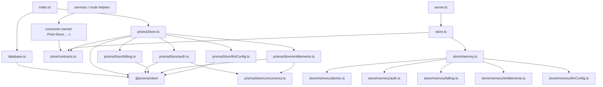

# Server Store / PrismaStore Module Split

- Date: 2026-07-23
- Status: Design, ExecPlan, and Task 1 concurrency-gate amendment approved by the user on
  2026-07-23; implementation in progress
- Scope: behavior-neutral TypeScript server persistence refactor
- ExecPlan: `docs/exec-plans/active/2026-07-23-server-store-prisma-module-split-plan.md`
- Related designs:
  - `docs/design-docs/2026-07-22-server-auth-quota-operations-hardening.md`
  - `docs/design-docs/2026-07-21-server-route-module-split.md`

## Context

At baseline commit `86d3e0a`, `server/src/store.ts` is 1,054 physical lines and
`server/src/prismaStore.ts` is 1,117 physical lines.

`store.ts` currently combines:

- 23 persisted-record and closed-outcome types;
- the 32-method full `Store` port;
- the complete `MemoryStore` test adapter and its public fixture state;
- serialized in-memory rollback coordination;
- authentication rate-limit planning; and
- payment, activation, entitlement, quota, administrator-audit, and LLM-configuration behavior.

`prismaStore.ts` mirrors the full port and additionally combines:

- Prisma single-record reads and writes;
- eight security- or accounting-sensitive semantic operations;
- transaction-local payment and entitlement helpers;
- conditional authentication rate-limit SQL;
- SQLite/Prisma conflict classification and bounded retry; and
- webhook/idempotency error classification.

The size increase is not accidental duplication alone. Commit `2dc663b` added database-backed
authentication dispatch limits, purpose-scoped OTP verification, atomic ticket/session exchange,
and quota-event concurrency protection. Those changes deliberately made `Store` a consistency
facade. Routes and services must not regain a generic transaction callback or reconstruct those
operations from CRUD calls.

The current structure still has two independent maintenance problems:

1. a change to one persistence capability requires navigating unrelated authentication, billing,
   configuration, and test-adapter code; and
2. most services and route helpers are typed against the complete `Store` even when they consume
   only one narrow capability.

This design addresses both problems without splitting one runtime Store instance into public
repositories. It uses stable adapter roots, private transaction-slice modules, and consumer-owned
capability ports. It does not change product behavior, HTTP routes, database schema, migration
history, supported SQLite topology, or external dependencies.

## Requirements

### Functional preservation

- Preserve every current `Store` method name, parameter, return type, closed status, and call
  behavior.
- Preserve the `./store.js` import path for all current record/outcome types, `Store`, and
  `MemoryStore`.
- Preserve the `./prismaStore.js` import path and exact exported `PrismaStore` class identity.
- Preserve `ServerDependencies.store: Store` and the single Store instance constructed in
  `index.ts`.
- Preserve MemoryStore public fixture arrays, mutable-record behavior, ordering, rollback, and
  subclass-based failure-injection seams.
- Preserve Prisma queries, conditional writes, transaction membership, retry classification,
  retry bounds, idempotency, and independent-client concurrency behavior.

### Non-functional preservation

- Authentication and accounting correctness remains database-enforced rather than mutex-enforced.
- No raw OTP, session, ticket, CSRF, activation code, LLM key, cookie, or payment secret enters a
  new log, error, type, or module boundary.
- `Prisma.TransactionClient` never crosses into a service, route, public Store port, or generic
  callback supplied by an application caller.
- MemoryStore and PrismaStore continue to satisfy the same closed semantic outcomes.
- Production remains one server process per local SQLite database file; this refactor does not
  claim multi-host or network-filesystem support.
- The implementation must remain reviewable with focused source-ownership and behavior tests.

## Goals

- Reduce `store.ts` to a stable compatibility root.
- Keep `prismaStore.ts` as the sole exported production persistence adapter.
- Separate authentication, billing, entitlement/accounting, LLM configuration, and concurrency
  implementation by transaction/failure boundary.
- Narrow each service and route helper to the Store methods it actually consumes.
- Retain one full Store contract and one Store object at the server composition root.
- Repair the ineffective Prisma OTP concurrency barrier before relying on it as refactor evidence.
- Add a RED/GREEN source gate that prevents private persistence modules from becoming new
  application entry points.

## Non-Goals

- Do not introduce public `UserRepository`, `OrderRepository`, `EntitlementRepository`, Unit of
  Work, generic transaction callback, service locator, dependency-injection container, CQRS layer,
  or event bus.
- Do not split one request across independently injected Store objects.
- Do not move business transaction composition into routes or application services.
- Do not change database models, indexes, constraints, migrations, `DATABASE_URL`, backup/restore,
  readiness, shutdown, or deployment topology.
- Do not change authentication limits, OTP lifetime/attempt rules, session/ticket lifetime,
  subscription extension, AI Credit accounting, activation semantics, or administrator audit
  requirements.
- Do not remove current class methods or MemoryStore fixture fields in this refactor, including
  legacy authentication helpers that are outside the official `Store` type.
- Do not force MemoryStore and PrismaStore to share a generic implementation or identical private
  file graph.
- Do not combine this work with production SMTP/staging evidence, the local-media feature, release
  publication, or a provider integration.

## Alternatives Considered

### Physical extraction only

Move `MemoryStore` and sections of `PrismaStore` to additional files while keeping all services and
routes typed against broad `Store`.

**Decision:** rejected as the complete solution. It improves navigation but leaves every consumer
authorized at the type level to call unrelated security-sensitive operations.

### Stable adapters, private transaction slices, and narrow consumer ports

Keep the two current import roots and one full Store instance. Move implementation into private
transaction/failure owners and type each consumer against an explicit `Pick<Store, ...>` capability.

**Decision:** selected as the approved 2R approach. It improves physical ownership and interface
segregation without creating independently composable repositories or another transaction owner.

### Public repositories plus Unit of Work

Expose entity repositories and let a caller request a Unit of Work or transaction callback.

**Decision:** rejected. Payment, activation, administrator adjustment, authentication, and quota
operations deliberately cross entities. Public repositories would make it easier to reintroduce
partial commits and caller-local race rules.

### Shared generic Memory/Prisma implementation

Create a generic base Store or repository framework and inject backend-specific primitives.

**Decision:** rejected. The in-memory adapter uses serialized snapshots and override-aware fixture
methods, while Prisma relies on conditional SQL, constraints, transaction clients, and classified
retry. Sharing contracts and black-box tests is valuable; sharing these implementations would hide
the actual failure models.

### Remove legacy class helpers while splitting

Delete `createEmailOtp`, `findLatestUsableOtp`, `incrementOtpAttempts`, `consumeOtp`,
`createDesktopLoginTicket`, and `consumeDesktopLoginTicket`, which are not members of `Store` and
have no production callers.

**Decision:** deferred. They are accidental class surface and one current test subclasses one of
them, even though that override no longer intercepts semantic verification. P1-3 first preserves
the class surface and repairs the test. A later explicit compatibility cleanup may remove them
with its own source scan and approval.

## Decision

Adopt a phased transaction-slice dual-adapter structure:

```text
server/src/
  store.ts
  store/
    contracts.ts
    memory.ts
    memory/
      atomic.ts
      auth.ts
      billing.ts
      entitlements.ts
      llmConfig.ts
  prismaStore.ts
  prismaStore/
    concurrency.ts
    auth.ts
    billing.ts
    entitlements.ts
    llmConfig.ts
```

`store.ts` remains the stable compatibility root. It directly re-exports the existing contract
types from `store/contracts.ts` and the actual `MemoryStore` class from `store/memory.ts`; it does
not wrap or subclass the moved class.

`prismaStore.ts` remains the only module exporting `PrismaStore`. The class retains its constructor
and current public methods, but method bodies delegate to private operation functions. No private
child exports a second Store class or is imported by application code.

The private Memory and Prisma trees are intentionally parallel at the capability level but not
required to have identical helper functions. They share the full contract and semantic test
matrix, not a generic repository implementation.

## Stable Surface

The following remain unchanged:

- every current named export from `store.ts`;
- `Store` and all 32 official methods;
- `MemoryStore` and `PrismaStore` constructor behavior;
- `MemoryStore` public arrays and `llmConfig` field;
- current class methods outside `Store`;
- all current internal calls through `this.<publicMethod>`, including the tested subclass overrides
  of `createSession`, `createDesktopLoginTicket`, `markOrderPaid`, `upsertEntitlement`, and
  `createAdminEntitlementAdjustment`;
- `ServerDependencies.store`;
- production construction through `new PrismaStore(prisma)`; and
- test construction through `new MemoryStore()` or `new PrismaStore(prisma)`.

Moving `MemoryStore` behind a direct root re-export must preserve one class object. Importing it
from `store.ts` and its defining private module in an ownership test must yield the same constructor,
although production and ordinary tests remain forbidden from importing the private path.

The refactor may move method bodies, but a semantic MemoryStore operation must continue calling the
override-aware public method where existing failure-injection tests rely on virtual dispatch. A
private operation therefore receives a narrow callback set bound to the current Store instance; it
must not bypass `this.createSession`, `this.createDesktopLoginTicket`, `this.markOrderPaid`,
`this.upsertEntitlement`, or `this.createAdminEntitlementAdjustment` with direct array mutation.

## Consumer-Owned Capability Ports

The complete `Store` contract remains the canonical superset in `store/contracts.ts`.
`server.ts` and `index.ts` continue to accept/construct the complete Store. Individual consumers
define named type-only ports from that contract:

| Consumer | Capability alias | Allowed Store methods |
|---|---|---|
| `auth.ts` | `AuthStore` | `issueEmailOtp`, `invalidateIssuedOtpAfterDeliveryFailure`, `verifyDesktopOtpAndCreateTicket`, `exchangeDesktopTicketAndCreateSession` |
| `adminAuth.ts` | `AdminAuthStore` | `issueEmailOtp`, `invalidateIssuedOtpAfterDeliveryFailure`, `verifyAdminOtpAndCreateSession`, `findAdminSessionByTokenHash` |
| `billing.ts` | `BillingStore` | `findSessionByTokenHash`, `createOrder`, `findOrderByOutTradeNo`, `settlePaidOrder` |
| `activation.ts` | `ActivationStore` | `createActivationCode`, `redeemActivationCodeAndGrantEntitlement` |
| `llmConfig.ts` | `LlmConfigStore` | `getLlmConfig`, `upsertLlmConfig` |
| `entitlementAdjustment.ts` | `EntitlementAdjustmentStore` | `applyEntitlementAdjustmentWithAudit` |
| desktop account/shared route helpers | `AccountReadStore` / `DesktopSessionStore` | `getUserById`, `getEntitlement`, or `findSessionByTokenHash` as actually consumed |
| desktop auth route | `DesktopAuthRouteStore` | `revokeSession` |
| billing route | `BillingReadStore` | `getEntitlement` |
| desktop LLM route | `LlmQuotaStore` | `findSessionByTokenHash`, `consumeLlmQuota` |
| administrator route | `AdminStore` | `revokeAdminSession`, `listUsers`, `getEntitlement`, `listActivationCodes`, `listAdminEntitlementAdjustments` |

Each alias is a local or adjacent `Pick<Store, ...>` type owned by its consumer. It creates no
runtime object and no second persistence contract. A service cannot name a method outside its
declared capability without a TypeScript change visible in review.

Route registration still receives the same single Store instance from `server.ts`. Narrowing the
type does not create child Stores or authorize a route to import `PrismaStore`, `PrismaClient`, or
a private implementation path.

## Responsibility Map

| Owner | Owns | Must not own |
|---|---|---|
| `store.ts` | stable direct exports only | records, transaction bodies, mutable state, Prisma |
| `store/contracts.ts` | record DTOs, closed outcomes, full `Store` type | implementations, Prisma, random IDs, crypto comparisons |
| `store/memory.ts` | actual `MemoryStore` class, public fixture state, stable methods, override-aware delegation | semantic transaction bodies, rate-limit policy duplication |
| `store/memory/atomic.ts` | serialized operation lease, complete snapshot, rollback, release | business decisions, partial snapshots, independent locks per capability |
| `store/memory/auth.ts` | OTP dispatch/limits, purpose verification, ticket/session exchange | billing, entitlement, LLM configuration |
| `store/memory/billing.ts` | order/webhook settlement and monthly-pass recovery | generic entitlement mutation outside settlement |
| `store/memory/entitlements.ts` | entitlement CRUD, quota event, activation redemption, administrator adjustment/audit | payment webhook matching, authentication |
| `store/memory/llmConfig.ts` | singleton LLM config read/upsert | key encryption, HTTP mapping, quota |
| `prismaStore.ts` | actual exported adapter class, constructor, stable method delegation, Prisma client type boundary | transaction bodies, retry classification, SQL |
| `prismaStore/concurrency.ts` | rate-limit reservation SQL, classified bounded conflict retry, Prisma error predicates | business outcomes, routes/services, supplier retry |
| `prismaStore/auth.ts` | user/OTP/ticket/session operations and complete auth transactions | billing, entitlement/accounting |
| `prismaStore/billing.ts` | order/webhook operations and complete paid-order settlement transaction | activation, administrator adjustment |
| `prismaStore/entitlements.ts` | entitlement/quota/activation/administrator operations and their complete transactions | payment webhook matching, authentication |
| `prismaStore/llmConfig.ts` | singleton LLM config read/upsert | encryption, HTTP response, quota checkout |

`store/memory/atomic.ts` remains one coordinator for the complete in-memory state. Capability-local
locks are forbidden because an operation can touch multiple arrays and rollback must restore the
entire prior revision.

## Transaction Ownership

| Semantic operation | Memory owner | Prisma owner | Atomic invariant |
|---|---|---|---|
| `issueEmailOtp` | memory auth under one snapshot lease | Prisma auth using rate-limit SQL in one transaction | all limits reserved, exact-scope old OTP consumed, new OTP created together |
| `verifyDesktopOtpAndCreateTicket` | memory auth | Prisma auth | one attempt plus optional consume/user/ticket commit together |
| `verifyAdminOtpAndCreateSession` | memory auth | Prisma auth | one attempt plus optional consume/admin session commit together |
| `exchangeDesktopTicketAndCreateSession` | memory auth | Prisma auth | ticket consume and desktop session create together |
| `settlePaidOrder` | memory billing | Prisma billing | webhook, order status, and entitlement extension commit together |
| `consumeLlmQuota` | memory entitlements | Prisma entitlements | conditional quota increment and unique usage event commit together |
| `redeemActivationCodeAndGrantEntitlement` | memory entitlements | Prisma entitlements | code redemption and entitlement grant commit together |
| `applyEntitlementAdjustmentWithAudit` | memory entitlements | Prisma entitlements | entitlement mutation and append-only administrator audit commit together |

Private helpers may share a transaction client only inside the module that owns the complete
semantic operation. No helper returns a live transaction, callback, partially mutated aggregate,
or caller-composable set of writes.

Billing retains its transaction-local monthly-pass extension helper rather than calling a separate
public entitlement repository. Memory billing continues to invoke the override-aware
`upsertEntitlement` callback so rollback injection remains meaningful; Prisma billing performs the
same database writes on its own transaction client.

## Dependency Direction



Allowed dependencies are:

- composition and consumers to the stable contract root or type-only narrow ports;
- `database.ts` to `@prisma/client` for process-level client lifecycle/readiness only;
- stable adapter roots to their private operation modules;
- private operation modules to `store/contracts.ts`, existing `security.ts`, and their backend;
- Prisma authentication/entitlement operations to the private concurrency owner; and
- Memory semantic operations to one root-supplied atomic coordinator and narrow override-aware
  callbacks.

Forbidden dependencies are:

- service/route code to either private tree, `PrismaClient`, or `Prisma.TransactionClient`;
- a private child importing its stable root;
- Memory modules importing Prisma modules or the reverse;
- Prisma transaction clients crossing between semantic operation owners;
- private children importing Fastify routes, services, runtime configuration, email, WeChat, or
  observability; and
- a generic repository or transaction abstraction shared by both backends.

## Behavior and Failure Invariants

### Authentication

- OTP purpose, email, state, attempts, expiry, replacement scope, and constant-time hash comparison
  remain unchanged.
- Dispatch limits remain one email/minute, five email/hour, and twenty IP/hour in the exact current
  windows and purpose scope.
- SMTP failure consumes only the just-issued challenge and does not refund committed rate-limit
  reservations.
- Two concurrent correct verifications produce at most one artifact.
- A failed ticket/session insert rolls back the matching OTP/ticket consumption.
- Only recognized conflicts retry, at the current fixed bound and backoff.

### Payment and entitlement

- Webhook provider/event identity, order binding, transaction identity, replay, and recovery
  behavior remain unchanged.
- A payment event, paid order, and subscription extension never become partially visible.
- Activation redemption remains single-use and grants expiry/quota in the same transaction.
- Administrator adjustment remains additive/audited and preserves `llmQuotaUsed`.
- AI Credit checkout remains `consumed | reused | unavailable | temporarily_unavailable`, with one
  conditional quota write and one unique request event.
- No database retry repeats a supplier call; Store code still owns no supplier call.

### Memory parity

- `runAtomically` remains FIFO-serialized and restores all mutable arrays plus LLM configuration on
  an exception.
- Returned records remain the same mutable in-memory objects where current code returns references.
- Public arrays retain current names and remain available to tests.
- Sort order and fixed thrown errors remain unchanged.
- Existing subclass failure injection continues to execute inside the semantic atomic boundary.

## Ineffective OTP Barrier Repair

`server/tests/prismaAuthQuotaConcurrency.test.ts` currently defines
`OtpReadBarrierPrismaStore` by overriding `findLatestUsableOtp`. The semantic
`verifyDesktopOtpAndCreateTicket` and `verifyAdminOtpAndCreateSession` methods query
`tx.emailOtp.findFirst` directly, so that override no longer intercepts the read being raced.
The test passes through ordinary scheduling, not because the named barrier is proven active.

Before production extraction:

1. replace the subclass with a test-only Prisma client/transaction proxy that blocks the actual
   `emailOtp.findFirst` call used inside the semantic transaction;
2. assert both participants reached the barrier before release;
3. retain two independent `PrismaClient` instances on one real temporary SQLite file; and
4. prove the existing one-artifact and one-attempt outcomes.

The repair adds no production hook, environment variable, sleep, or Store method. If the effective
barrier exposes a real concurrency failure, implementation stops and returns to the existing
authentication/quota design rather than weakening the test.

### Task 1 Evidence and Approved Amendment

Implementation evidence showed that the literal read barrier is incompatible with the current
Prisma/SQLite transaction admission behavior: after the first independent client completes
`tx.emailOtp.findFirst` and waits, the second client cannot enter the same transaction callback/read
point. Both desktop and administrator cases reached exactly one of two required arrivals and then
timed out.

The approved amendment retains the intended proof without waiting inside the serialized
transaction:

1. a test-only outer gate blocks both independent clients immediately before each calls
   `$transaction`;
2. the test asserts both clients reached that gate before release;
3. a transaction-client proxy separately observes the real `tx.emailOtp.findFirst` call for each
   client without blocking it;
4. the test asserts two real reads plus the existing one-artifact and one-attempt outcomes; and
5. no production hook, delay, Store method, schema, retry, or transaction body changes.

This amendment passed the complete Prisma authentication/quota concurrency file 13/13. The user
approved it on 2026-07-23 before production extraction began.

## Security and Privacy

- Store inputs and records continue containing hashes rather than raw OTPs, tickets, sessions,
  CSRF tokens, activation codes, or API keys.
- Private modules add no logging. Existing structured server logs and fixed public errors remain
  outside the persistence implementation.
- Prisma exception inspection remains closed to known error classes/codes and bounded SQLite busy
  markers; raw database messages do not become public responses.
- Provider payload handling remains inside the existing billing persistence boundary and is not
  copied to diagnostics.
- Routes and services cannot obtain a transaction callback or direct database client through a
  narrow port.
- This refactor adds no HTTP, network, filesystem, environment, secret, cookie, or telemetry
  surface.

## Test Strategy

### Characterization before movement

Add tests that lock:

- the exact `store.ts` named exports and the `prismaStore.ts` class export;
- direct-reexport class identity for `MemoryStore`;
- the full Store method set and current class compatibility methods;
- MemoryStore public fixture fields, mutation/reference behavior, sort order, and complete rollback;
- subclass failure injection for ticket, session, order, entitlement, and administrator audit
  writes;
- current Prisma conflict classification and retry counts; and
- the repaired effective OTP barrier.

### RED/GREEN ownership gate

Before moving production bodies, add a source-level test that expects the approved tree and fails
only because the private files do not yet exist. The completed gate proves:

- `store.ts` is a direct-export-only root at or below 60 physical lines;
- `store/contracts.ts`, `store/memory.ts`, and `prismaStore.ts` are each at or below 350 physical
  lines;
- no private production child exceeds 400 physical lines without renewed design review;
- only `store.ts` exports the official contracts and `MemoryStore` path;
- only `prismaStore.ts` exports `PrismaStore`;
- application production code imports no private child;
- only the existing infrastructure owner `database.ts`, `prismaStore.ts`, and its private Prisma
  tree import `@prisma/client`; `database.ts` remains limited to client lifecycle/readiness and does
  not own Store transactions;
- only `prismaStore/concurrency.ts` owns retry/error/rate-limit SQL helpers;
- every semantic transaction is implemented by exactly one approved backend owner;
- no service or route outside the `server.ts` composition root accepts the full Store when its
  approved narrow port is sufficient;
- no private child exposes a Store class, repository, Unit of Work, or generic transaction callback
  to application consumers; the approved Memory atomic coordinator remains private-tree-only;
  and
- private dependency edges match this design and contain no cycle through a stable root.

Line limits are review alarms rather than permission to create dense modules. Transaction
ownership, consumer capabilities, and dependency direction are the primary gates.

### Existing behavior and concurrency suites

Retain and run:

- Memory authentication/quota concurrency tests;
- independent-client Prisma authentication/quota concurrency tests;
- Memory and Prisma transaction-safety tests;
- activation, billing, authentication, administrator, LLM quota/configuration, route, health, and
  observability tests;
- route/module boundary tests;
- migration, deployment, readiness, and lifecycle tests; and
- TypeScript compilation.

The implementation ExecPlan must record exact focused and complete counts. The current baseline on
Windows is 142 passed and one platform-related POSIX signal test skipped; `npm --prefix server run
build` passes. A future count change must be explained, not silently substituted.

## Implementation Order

1. Record the exact exports, methods, fields, callers, physical lines, tests, schema/migration hash,
   and baseline commands in the ExecPlan.
2. Repair the ineffective OTP barrier and add export/state/override characterization.
3. Add the exact-tree/ownership/dependency gate and require RED only because the approved private
   tree is absent.
4. Move contracts and `MemoryStore` behind the stable `store.ts` direct re-exports; keep all
   methods and fields compatible.
5. Extract Memory atomic, authentication, billing, entitlement, and LLM-config owners one at a
   time with focused tests after each move.
6. Extract Prisma conflict/rate-limit policy, then authentication, billing, entitlement, and
   LLM-config operations behind the stable `PrismaStore` class.
7. Introduce consumer-owned narrow capability types without changing runtime construction or
   objects.
8. Turn the complete ownership gate GREEN, run the full validation matrix, and update durable
   architecture/security/audit/task records with measured final lines and evidence.

Every production step is move-first. If a query predicate, conditional update, transaction member,
retry classification, method/field/import surface, closed outcome, fixture seam, order, error,
schema, migration, or runtime dependency changes, stop at the last green step and return the
difference to design review.

## Verification

The implementation ExecPlan must include at least:

```text
npm --prefix server test
npm --prefix server run build
npm --prefix server run prisma:generate
node --test scripts/tests/*.test.mjs
python scripts/validate_agents_docs.py --level WARN
git diff --check
```

Focused Server tests run after each private-owner extraction. The plan must also prove:

- `server/prisma/schema.prisma` and every existing migration are byte-for-byte unchanged;
- no dependency or lockfile changes occurred;
- `server.ts`, `index.ts`, routes, services, and tests use only stable roots or their
  consumer-owned type aliases;
- independent Prisma clients still exercise one real temporary SQLite database; and
- active production-operations/release plans are updated only where their source locations or
  evidence references genuinely change.

Cross-layer App, Rust, and Worker suites may be included as repository closeout confidence gates,
but they do not replace the complete Server and Prisma gates.

## Documentation Impact

The implementation closeout must update:

- `AGENTS.md` with the durable design and completed ExecPlan links;
- `TASKS.md` with final owner sizes and exact validation evidence;
- `docs/ARCHITECTURE.md` with stable Store roots, private transaction owners, and narrow consumer
  ports;
- `docs/SECURITY.md` with retained transaction-client and semantic-operation boundaries;
- `docs/design-docs/frameq-code-audit-uml.md` with implemented paths and measured sizes;
- ExecPlan indexes when the implementation plan is activated and archived; and
- active server production-operations/release plans if their source/evidence maps reference moved
  Store implementation locations.

No product specification update is required because this refactor changes no user-visible behavior,
HTTP contract, persistence schema, or supported operation.

## Consequences

### Positive

- Authentication, billing, entitlement/accounting, and configuration changes become separately
  reviewable.
- Services and route helpers expose their actual persistence authority in TypeScript.
- The existing Store consistency facade and one-instance composition remain intact.
- Memory/Prisma parity is enforced through contracts and behavior rather than a misleading shared
  implementation.
- Concurrency tests gain an effective read barrier rather than relying on incidental scheduling.

### Negative

- The Server gains two private module trees and more explicit imports/delegation.
- Stable class wrappers and override-aware Memory callbacks add small forwarding overhead in source
  code.
- Capability-port aliases require maintenance when a consumer intentionally gains persistence
  authority.
- Source-boundary tests must be updated with every approved ownership change.

### Neutral

- Total TypeScript lines may remain similar or grow because contracts and imports become explicit.
- Runtime object count, database connection count, query count, transaction count, and retry timing
  remain unchanged.
- SQLite remains the supported small single-instance database; this design neither improves nor
  weakens multi-host scalability.

## Risks and Mitigations

| Risk | Mitigation |
|---|---|
| A transaction is accidentally split across children | one semantic owner per operation; no transaction-client escape; transaction-safety tests |
| Memory rollback misses moved state | one complete atomic coordinator and snapshot characterization |
| Delegation bypasses subclass failure injection | explicit override-aware callbacks and focused injected-failure tests |
| Narrow ports fragment into duplicate public APIs | consumer-owned type-only `Pick` aliases; one canonical full Store |
| Private children become application imports | exact AST/source-boundary gate |
| Prisma and Memory are forced into false symmetry | shared contracts/outcomes/tests only; backend-specific private implementation |
| OTP concurrency test remains schedule-dependent | assert a proxy barrier intercepts the actual transaction read |
| Refactor is confused with production-readiness evidence | keep hosted Linux, SMTP, staging, restore, and release gates in their existing plans |

## Acceptance Criteria

- The approved stable roots and private trees are implemented.
- `store.ts` directly re-exports the existing contracts and actual `MemoryStore` class.
- `prismaStore.ts` remains the sole exported production adapter.
- Every current import, Store method, public class compatibility method, Memory fixture field, and
  relevant subclass seam remains compatible.
- Each service and route helper is typed against its approved narrow Store capability.
- No service/route imports Prisma or receives a transaction callback/client.
- All eight semantic operations retain one complete atomic owner per backend.
- Memory serialized full-state rollback and Prisma conditional transaction/retry behavior remain
  unchanged.
- The effective independent-client OTP barrier and existing concurrency/transaction matrices pass.
- Schema, migrations, dependencies, HTTP behavior, public errors, secrets, and logs remain
  unchanged.
- Characterization precedes movement and the ownership gate records RED-before-tree and GREEN-after
  evidence.
- Complete Server/build/Prisma/script/governance/diff gates pass with exact results recorded.
- Architecture, security, audit, task tracking, and the archived ExecPlan match the final code.
- Unrun hosted/staging/provider evidence remains explicitly unverified.
