# ASR Model Download Job Capability Boundary

- Date: 2026-07-24
- Status: Accepted on 2026-07-24; implementation pending under
  `docs/exec-plans/active/2026-07-24-asr-model-download-job-capability-plan.md`
- Scope: behavior-neutral Rust worker-runtime capability-boundary refactor
- Related designs:
  - `docs/design-docs/2026-07-18-rust-worker-runtime-lifecycle.md`
  - `docs/design-docs/2026-07-19-typed-worker-job-facade.md`
  - `docs/design-docs/2026-07-22-rust-worker-watchdog.md`
  - `docs/design-docs/2026-07-23-rust-worker-runner-module-split.md`

## Context

FrameQ already routes task executions through the closed `WorkerJob` and `TaskWorkerFacade`
boundary. That facade derives the Python invocation, worker operation, progress route, credential
policy, and serialized worker lane from one semantic job.

ASR model download is still an exception. `asr_model.rs` currently builds a crate-visible
`WorkerCommandSpec` directly, including:

- the bundled Python executable;
- the `-m frameq_worker --download-asr-model` argument vector;
- the complete child environment and legacy environment removals;
- the absence of stdin; and
- the child working directory.

`ProcessSupervisors::run_asr_model_download` then accepts that raw command specification and adds
only the operation, progress route, and model-download lane. The current caller is trusted and the
constructed command is fixed, but Rust does not enforce that policy. Any crate module that obtains
the crate-visible type can construct another executable, argument vector, environment, or working
directory and submit it to the model-download lane.

This is a capability-security gap rather than a reported user-visible defect. Process construction
must have one owner, and application modules must express intent through a closed semantic job
instead of receiving the capability to describe arbitrary child processes.

This decision supersedes only the neutral statement in
`docs/design-docs/2026-07-19-typed-worker-job-facade.md` that ASR model download keeps its command
builder in `asr_model.rs`. The task facade, worker lifecycle, runner split, and separate
model-download lane remain unchanged.

## Goals

- Make `worker_runtime` the only owner of worker executable, argv, environment removal, stdin, and
  working-directory construction.
- Replace the raw model-download command input with a closed `AsrModelDownloadJob`.
- Keep ASR model availability checks and app-local `.env` parsing in `asr_model.rs`.
- Allow only the four existing model-download configuration overrides to cross the application to
  runtime boundary.
- Make `WorkerCommandSpec` inaccessible outside `worker_runtime`.
- Preserve every current model-download command, progress, cancellation, watchdog, terminal-result,
  error-mapping, and Tauri behavior.
- Add an executable regression gate for the new ownership boundary.

## Non-Goals

- Do not change the Tauri command or event protocol.
- Do not change the Python worker CLI, desktop-worker contract, or worker result schema.
- Do not change `.env` names, lookup rules, model source order, revision behavior, or checksum
  behavior.
- Do not move `.env` file access into `worker_runtime`.
- Do not merge the task and model-download lanes.
- Do not introduce a generic `BaseJob`, process builder, dependency-injection container, or
  arbitrary environment map.
- Do not alter model cache paths, downloaded artifacts, timeout values, cancellation semantics,
  logs, network requests, LLM calls, or AI Credits.
- Do not combine this boundary refactor with local-media acceptance or release work.

## Alternatives Considered

### Keep configuration ownership in `asr_model.rs` and submit a closed semantic job

`asr_model.rs` continues to check model availability, parse app-local `.env`, and extract the four
allowlisted model-download overrides. It submits those values in an opaque
`AsrModelDownloadJob`. `worker_runtime::command` derives every raw process detail.

**Decision:** selected. This closes the raw process capability while preserving the existing
configuration dependency direction and keeping the change behavior-neutral.

### Let `worker_runtime` read app-local `.env`

The runtime could accept a zero-field download job and resolve all configuration itself. This would
hide even the four override values from the application layer.

**Decision:** rejected. `.env` parsing, source selection, and model configuration are application
policy already owned by `settings` and `asr_model`. Moving file access into the process runtime
would couple a low-level execution boundary to configuration persistence without providing a
material security improvement.

### Move the builder but keep accepting `WorkerCommandSpec`

The existing builder could move into `worker_runtime::command` while the supervisor method still
accepted a raw specification.

**Decision:** rejected. This changes file location but preserves the capability leak. A later
caller could still construct or modify an arbitrary executable, argv, environment, or cwd.

## Decision

### Semantic input

Add an application-visible, runtime-owned semantic value:

```rust
pub(crate) struct AsrModelDownloadJob {
    download_url: Option<String>,
    download_sha256: Option<String>,
    modelscope_endpoint: Option<String>,
    sensevoice_revision: Option<String>,
}
```

The fields stay opaque outside their defining runtime module. A crate-visible constructor accepts
exactly these four named values. Narrow `pub(super)` accessors may be used by sibling runtime
modules; there is no generic collection or escape hatch.

The job must not accept or expose:

- an executable or runtime path;
- argv or a command fragment;
- arbitrary environment keys;
- environment-removal keys;
- stdin;
- cwd;
- a worker operation, lane, route, event name, timeout, PID, or callback.

`asr_model.rs` remains responsible for parsing the app-local `.env` and calling the existing
`configured_env_value` helper for exactly:

- `FRAMEQ_ASR_MODEL_DOWNLOAD_URL`;
- `FRAMEQ_ASR_MODEL_DOWNLOAD_SHA256`;
- `FRAMEQ_MODELSCOPE_ENDPOINT`; and
- `FRAMEQ_SENSEVOICE_REVISION`.

It packages the resulting optional values into `AsrModelDownloadJob`. It no longer imports raw
command types or command-construction helpers.

### Command policy

Add `build_asr_model_download_command_spec` to `worker_runtime::command`. Given runtime paths and
an `AsrModelDownloadJob`, it constructs the same command as the current
`asr_model.rs::build_model_download_command_spec`:

- program: the bundled Python path under the resource directory;
- argv: `-m frameq_worker --download-asr-model`;
- stdin: none;
- cwd: the app-local user-data directory;
- fixed environment: `PYTHONPATH`, `PYTHONUTF8`, `PYTHONIOENCODING`, `PATH`,
  `FRAMEQ_MODEL_DIR`, `FRAMEQ_RESOURCE_DIR`, and `FRAMEQ_USER_DATA_DIR`;
- optional environment: only the four job values listed above; and
- environment removals: the existing legacy local-LLM removal set.

No key, argument, path, or route is accepted from UI or IPC input. Override values remain trusted
configuration values under the existing `.env` boundary and can affect only their associated
allowlisted environment keys.

### Visibility

`WorkerCommandSpec` and its fields become visible only inside `crate::worker_runtime`, using
`pub(in crate::worker_runtime)` or an equivalently narrow visibility. The type is no longer
re-exported by `worker_runtime/mod.rs` or the crate root.

Runner internals and runtime-owned tests may continue to construct specifications. Application
modules, Tauri command handlers, and other crate modules cannot name or construct the type.

`WorkerInvocation` remains private to runtime command/facade composition. This refactor does not
widen `WorkerRunRequest`, `WorkerLane`, supervisor state, or runner internals.

### Execution boundary

Change the narrow model-download entry to:

```rust
pub(crate) fn run_asr_model_download(
    &self,
    paths: &RuntimePaths,
    job: AsrModelDownloadJob,
    window: Window,
) -> Result<Result<WorkerRunOutcome, WorkerRunError>, String>
```

The method prepares the command internally, fixes
`WorkerOperation::DownloadAsrModel`, fixes the model-download progress route, and submits the
request only to the private model-download lane.

The nested result intentionally matches `TaskWorkerFacade::execute`:

- outer `Err(String)` means command preparation failed before process execution;
- inner `Err(WorkerRunError)` means the supervised runtime failed; and
- inner `Ok(WorkerRunOutcome)` retains the current structured, cancelled, timeout, and
  unstructured terminal states.

`download_asr_model_blocking` propagates the outer preparation result and passes the inner runtime
result to the existing `map_model_download_run_result`. Product-facing error and status mapping
therefore stays unchanged.

## Responsibility Map

| Owner | Owns | Must not own |
|---|---|---|
| `asr_model.rs` | model availability; app-local `.env` parsing; four allowlisted override values; Tauri result mapping; cancelled-event product behavior | executable, argv, stdin, child env keys, env removal, cwd, lane, raw run request |
| `worker_runtime::facade` | opaque `AsrModelDownloadJob` semantic capability and constructor | `.env` file access, arbitrary process configuration, model availability, product status mapping |
| `worker_runtime::command` | fixed Python worker command, paths, argv, stdin policy, environment policy, legacy removal | Tauri commands, product result mapping, process lifecycle, arbitrary application-supplied keys |
| `ProcessSupervisors` | separate task/model lanes; fixed model operation and progress route; preparation-to-run composition | application configuration parsing, public lane selection, raw command acceptance |
| runner/supervisor | spawn, pipes, watchdog, cancellation, wait/reap, progress transport, terminal classification | model source policy, `.env` parsing, Tauri product result mapping |

## Dependency and Data Flow

```mermaid
flowchart LR
  Config["settings + app-local .env"] --> Model["asr_model.rs"]
  Model -->|"four optional allowlisted values"| Job["AsrModelDownloadJob"]
  Job --> Command["worker_runtime::command"]
  Paths["RuntimePaths"] --> Command
  Command --> Spec["WorkerCommandSpec<br/>runtime-private"]
  Spec --> Entry["ProcessSupervisors<br/>model-download entry"]
  Entry --> Lane["private model-download WorkerLane"]
  Lane --> Runner["runner + supervisor lifecycle"]
  Runner --> Result["WorkerRunOutcome / WorkerRunError"]
  Result --> Mapping["asr_model.rs<br/>existing product mapping"]
```



Application code can flow from configuration to one semantic job, but no dependency points back
from runtime command construction to `.env` persistence or Tauri product orchestration.

## Failure and Security Considerations

- Command-preparation errors remain separate from supervised runtime errors.
- Existing fixed, non-echoing runtime error mapping remains unchanged.
- The job contains no transcript, prompt, credential, Cookie, URL-derived worker payload, or LLM
  checkout material. Its optional URL is the existing operator-supplied model-download override
  and must not be added to lifecycle logs.
- Command diagnostics must not render environment values or the complete executable path.
- The model download continues to use bounded progress validation and the existing closed terminal
  result protocol.
- Cancellation, watchdog, matching-instance cleanup, and process-tree termination remain owned by
  the existing runtime lifecycle.
- No arbitrary `std::process::Command` capability is introduced outside the current
  runner/supervisor owners.

## Compatibility Invariants

The implementation must preserve:

- the exact bundled Python selection;
- the exact model-download argv and absence of stdin;
- the existing fixed and optional child environment;
- the existing legacy local-LLM environment removal;
- the current working directory;
- model availability short-circuit behavior;
- model source and fallback order;
- progress event name, prefix, schema, and ordering;
- separate task and model-download concurrency lanes;
- cancellation event and Tauri return values;
- idle and absolute watchdog behavior;
- structured-result-first terminal classification;
- current product error mapping and safe diagnostics; and
- the absence of additional network, LLM, or Credits activity.

This change requires no product-spec revision or worker-contract version because no observable
protocol or behavior changes.

## TDD and Verification Strategy

Implementation begins with failing tests for the new boundary.

### Capability boundary

Add a Rust source-ownership test under the existing `worker_runtime` test boundary that proves:

- `WorkerCommandSpec` is not crate-visible;
- neither `worker_runtime/mod.rs` nor `lib.rs` re-exports it;
- production modules outside `worker_runtime` do not reference `WorkerCommandSpec`,
  `WorkerInvocation`, or `WorkerRunRequest`;
- `asr_model.rs` submits `AsrModelDownloadJob`;
- the model-download CLI flag and raw command builder are owned by `worker_runtime::command`; and
- no model-download execution method accepts a raw specification.

The check should inspect production Rust sources while excluding test-only `Command` fixtures. It
must use focused structural assertions rather than banning ordinary domain result types such as
`WorkerRunOutcome`.

### Command policy

Move the current model-download command-spec assertions from `asr_model.rs` to
`worker_runtime::command` and cover:

- exact program, argv, stdin, cwd, and fixed environment;
- all four optional overrides independently and together;
- omission of blank or absent values through the existing configuration extraction behavior;
- exclusion of unrelated `.env` keys;
- exact legacy LLM environment removal; and
- preparation failure propagation without starting the lane.

### Application behavior

Keep focused `asr_model.rs` tests for:

- already-available short-circuiting;
- completed and cancelled results;
- idle and absolute timeouts;
- unstructured and protocol-invalid results;
- already-running, spawn, request-delivery, watchdog, pipe, and wait failures; and
- safe, unchanged product status/error mapping.

Existing runner and supervisor tests remain the authority for lifecycle races, cancellation,
watchdog, process-tree termination, and lane cleanup.

### Validation commands

```text
cargo test --manifest-path app/src-tauri/Cargo.toml
cargo fmt --manifest-path app/src-tauri/Cargo.toml -- --check
node --test scripts/tests/*.test.mjs
python scripts/validate_agents_docs.py --level WARN
git diff --check
```

Full implementation closeout must also run any broader repository gates required by the active
ExecPlan and `docs/EXECUTION_GATES.md`. Platform-specific runtime evidence must be reported
honestly; a Windows-only run does not prove macOS or Unix process behavior.

## Consequences

### Positive

- Raw worker process construction has one enforceable owner.
- Application modules can request model download without receiving executable, argv, env, cwd, or
  lane capabilities.
- Adding or changing a model-download environment override requires an explicit semantic job and
  command-policy change in one review.
- The model-download path now follows the same intent-to-policy pattern as task execution while
  retaining its separate lane and domain orchestration.

### Negative

- Model download gains a small semantic DTO and a nested preparation/runtime result matching the
  task facade.
- Command-policy tests move across module boundaries, creating a modest refactor diff despite no
  user-visible change.
- A source-ownership test must be maintained when the worker-runtime module tree changes.

### Neutral

- `asr_model.rs` still reads `.env`; only its process-construction responsibility moves.
- The four override values still reach the worker environment exactly as before.
- Existing public commands, progress events, downloaded files, and product UX remain unchanged.

## Implementation Sequence

1. Add failing capability-boundary and model-command policy tests.
2. Add the opaque `AsrModelDownloadJob`.
3. Move fixed model-download command construction into `worker_runtime::command`.
4. Change `ProcessSupervisors::run_asr_model_download` to accept the semantic job and preserve the
   nested preparation/runtime error boundary.
5. Migrate `asr_model.rs` to extract four values and submit the job.
6. Make `WorkerCommandSpec` runtime-private and remove both re-exports.
7. Move command-level tests to their new owner and retain application result-mapping tests.
8. Run focused tests, full Rust tests, formatting, repository architecture tests, governance
   validation, and diff checks.

Implementation must stop if any compatibility invariant requires a product or contract change;
that change would need separate specification and approval rather than being hidden in this
refactor.
