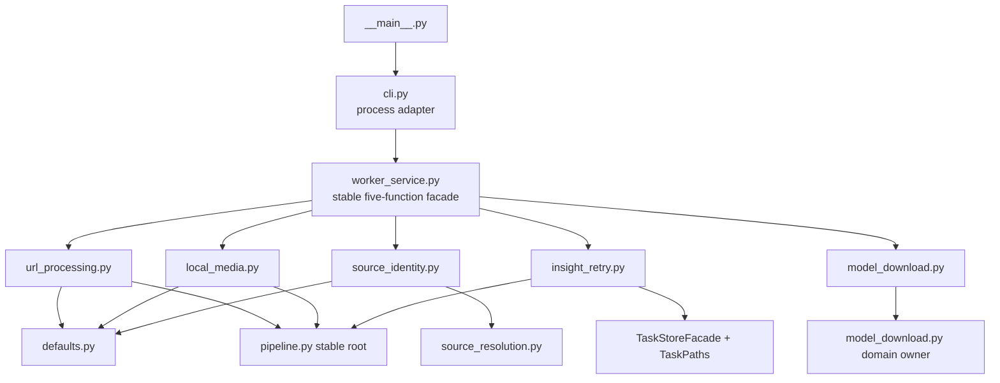

# Python Worker Application Facade and CLI Boundary

## Status

Accepted and implemented through the reviewed TDD ExecPlan on 2026-07-24. Completion evidence is
archived at
`docs/exec-plans/completed/2026-07-24-python-worker-application-facade-plan.md`.

This design changes internal Python ownership only. It does not change a desktop-worker contract,
CLI flag, stdin or result wire shape, progress event, error code, artifact, network request, model
selection, AI call, or Credits behavior.

## Context

The worker's lower-level pipeline and ASR implementations now have focused private owners, but the
two Python application entry modules have not received the same boundary treatment:

- `worker/frameq_worker/cli.py` is 282 lines and declares a 40-name `__all__` that re-exports ASR,
  desktop-contract, pipeline, request, media-preparation, and worker-service symbols.
- `cli.py` defines four `*args: object, **kwargs: object` wrappers for URL processing, local-media
  processing, source identity, and AI retry. Those wrappers obscure the callable interface and
  exist primarily so tests can import application behavior through the process adapter.
- Repository production code needs `frameq_worker.cli.main`; the broad compatibility surface is
  consumed principally by `worker/tests/test_cli.py` and `worker/tests/test_contract.py`.
- `worker/frameq_worker/worker_service.py` is 454 lines and owns five independent application use
  cases: URL processing, local-media processing, source-identity preflight, AI retry, and ASR model
  download.
- AI retry helpers accept `paths: object` and use `getattr()` for `summary_path` and
  `insights_json_path`, although `task_store.py` already exposes the exact `TaskPaths` dataclass.

The current process boundary is safe: stdin is capped, progress and results are validated/rendered,
and failures are mapped to closed results. The problem is ownership and readability. A test-only
compatibility surface makes `cli.py` appear to be the public owner of unrelated domain APIs, while
five use cases and their failure policies change together in one application module.

## Requirements

The refactor must:

1. keep `worker_service.py` as the stable Python application facade;
2. preserve the five existing facade entry names, parameter names and kinds, injectable dependency
   seams, return types, and externally observable behavior;
3. make `cli.py` only a process adapter for mode parsing, bounded stdin, result/progress rendering,
   and handler dispatch;
4. move each use case into one focused private application handler;
5. replace the AI retry `object/getattr()` path bag with the existing `TaskPaths`;
6. keep production short-link source resolution equivalent to the current CLI composition;
7. make tests import constants, parsers, helpers, and use-case functions from their real owners;
8. add a durable source boundary that prevents compatibility re-exports and responsibility drift;
9. keep the canonical worker source and packaged Tauri worker mirror identical.

## Non-Goals

This work does not:

- add a generic command bus, handler registry, base handler, dependency-injection framework, or
  service container;
- change `argparse` flags or add a second CLI;
- change desktop-worker contract v4, process-video contract v3, result schemas, progress codes,
  task manifests, artifact locations, or source-identity rules;
- change downloader, media, subtitle, ASR, LLM, model-download, or atomic-persistence behavior;
- combine URL and local-media processing into a generic optional-field request;
- make private application handlers public package APIs;
- add real LLM, model-download, or public-platform smoke to automated tests.

## Options Considered

### Adopt focused private handlers behind the existing facade

Selected.

`worker_service.py` remains the stable import root while five private modules own the five use
cases. `cli.py` loses its compatibility API and dispatches only to the facade. This closes the
ownership gap without changing the process or application contracts.

### Shrink only `cli.py`

Rejected as incomplete. Removing test-only CLI re-exports would improve the process adapter, but
the 454-line five-use-case application module and untyped path bag would remain.

### Add a generic command/handler registry

Rejected as unnecessary. The worker has five fixed modes already selected by strict CLI flags and
Rust-owned command policy. A dynamic registry or base class would add indirection without a runtime
extension requirement.

## Decision

### Stable facade and private handler tree

Create this private package:

```text
worker/frameq_worker/worker_application/
  __init__.py
  defaults.py
  url_processing.py
  local_media.py
  source_identity.py
  insight_retry.py
  model_download.py
```

`worker_application/__init__.py` is intentionally empty and does not re-export handler functions.
Production modules do not import private handlers directly. `worker_service.py` is the sole
production import root for those handlers.

The ownership is:

| Owner | Responsibility |
|---|---|
| `cli.py` | fixed mode parsing, one capped stdin object, safe progress/result rendering, facade dispatch, exit code |
| `worker_service.py` | stable five-function public facade and no use-case implementation |
| `worker_application/defaults.py` | production source resolver and the existing real-ASR enablement default |
| `worker_application/url_processing.py` | process-video parsing, runtime environment, URL pipeline call, task persistence failure mapping |
| `worker_application/local_media.py` | local-media parsing, runtime environment, local pipeline call, task persistence failure mapping |
| `worker_application/source_identity.py` | source preflight parsing, resolution, and closed source-identity result |
| `worker_application/insight_retry.py` | retry parsing, LLM default, task open/snapshot, AI target execution, merge, and sole finalize |
| `worker_application/model_download.py` | model cache location, download invocation, progress callback, and closed third-party failure mapping |

Handlers may import `defaults.py`; they may not import one another. Domain execution continues
through the existing stable roots such as `pipeline.py`, `task_store.py`, `model_download.py`,
`requests.py`, and `source_resolution.py`.



### `worker_service.py` public surface

`worker_service.py` exports exactly:

```python
__all__ = [
    "run_worker_once",
    "run_local_media_once",
    "resolve_source_identity_once",
    "retry_insights_once",
    "run_asr_model_download_once",
]
```

The facade functions keep their current explicit dependency seams:

- URL processing: project root, command runner, transcriber, transcriber factory, real-ASR gate,
  environment, progress callback, and source request resolver.
- Local-media processing: the same processing seams except source resolution.
- Source identity: source request resolver.
- AI retry: project root, Insight client, Insight client factory, and environment.
- Model download: project root, environment, and progress callback.

The implementation may use direct imports from the private handler modules so the exported
functions retain their real `inspect.signature`. It must not replace them with `*args/**kwargs`
wrappers.

The current CLI wrappers install the platform-aware `build_default_source_resolver()` for URL
processing and source identity. That production default moves to `worker_application/defaults.py`
before the wrappers are removed. Tests lock existing short-link behavior through the stable facade.
Callable object identity or its `repr` is not a compatibility promise; observable resolution
behavior and injectable parameter shape are.

### `cli.py` process-adapter surface

`cli.py` keeps:

- `MAX_STDIN_REQUEST_BYTES`;
- `StdinRequestError`;
- bounded `read_stdin_request`;
- closed `stdin_failure_result`;
- result, worker-progress, and model-progress render/print functions;
- fixed `argparse` mode parsing;
- dispatch to the five `worker_service` functions;
- the current model-download-only failure exit status.

It removes:

- `__all__`;
- the four `*args/**kwargs` wrappers;
- imports whose only purpose is compatibility re-export;
- ASR, LLM, request parser, pipeline, and media-preparation helper ownership;
- the source-resolver composition singleton.

The production import allowlist is limited to Python standard-library process-adapter modules,
`worker_service`, the two event prefixes, and progress-event validators.

Python cannot make module globals truly private. The enforced boundary is therefore repository
ownership: production consumers use only `main`, while tests import domain symbols from their real
owners instead of treating incidental CLI imports as an API.

### Typed task paths

The AI retry owner imports `TaskPaths` from `task_store.py` and uses:

```python
def merge_existing_ai_artifacts(
    paths: TaskPaths,
    result: ProcessResult,
) -> ProcessResult: ...

def read_existing_summary(paths: TaskPaths) -> str: ...

def read_existing_insights(paths: TaskPaths) -> list[Insight]: ...
```

The functions access `paths.summary_path` and `paths.insights_json_path` directly. This is a static
boundary correction only; it does not change path construction, existence checks, UTF-8 decoding,
schema validation, fallback behavior, or artifact persistence.

## Data and Error Flow

The process path remains:

```text
Rust-owned fixed CLI mode
  -> capped one-object stdin
  -> worker_service stable facade
  -> one application handler
  -> existing domain owner
  -> existing closed dict/result
  -> validated progress and JSON rendering
```

Error ownership remains unchanged:

- `cli.py` owns unreadable, oversized, non-UTF-8, malformed, empty, or non-object stdin failure.
- URL and local-media handlers map task recovery and commit errors to their existing safe results.
- source identity returns only the existing completed/failed source-identity result family.
- AI retry retains invalid request, unavailable manifest, persistence, partial completion, merge,
  and finalization semantics.
- model download retains archive-invalid classification and maps all third-party failures to fixed
  non-echoing terminal fields.

No handler logs or returns request JSON, raw URLs beyond the existing validated source-identity
contract, local source paths, credentials, prompts, transcript content, full downloader exceptions,
or internal transaction paths.

## Test Design

### Characterization before movement

Before extracting handlers, focused tests lock:

- the five facade function parameter names, parameter kinds, and return annotations;
- all five CLI modes, bounded stdin, result/progress output, and exit status;
- the platform-aware production source resolver used by URL and identity modes;
- ASR and Insight client default construction and the existing injection seams;
- closed request, persistence, retry, model-download, and source-identity failures.

### TDD extraction slices

Each slice follows RED, minimal GREEN, focused regression, and an isolated commit:

1. add the private tree and URL handler ownership gate;
2. extract local-media processing;
3. extract source identity and production resolver defaults;
4. extract AI retry and replace `object/getattr()` with `TaskPaths`;
5. extract model download;
6. reduce `worker_service.py` to its exact five-function facade;
7. migrate tests to real owners and reduce `cli.py` to the process adapter;
8. add the final cross-module source boundary and run the complete gate.

### Long-term source boundary

An AST/source test must prove:

- `cli.py` has no `__all__`, `*args`, or `**kwargs`;
- `cli.py` does not import ASR, LLM, request, pipeline, or media-preparation symbols;
- `worker_service.__all__` is exactly the five approved names;
- `worker_service.py` contains no JSON parsing, environment loading, filesystem access, task
  persistence, model download, or pipeline implementation;
- the private package has exactly the approved modules;
- handlers do not import sibling handlers;
- only `worker_service.py` imports the five use-case handler modules in production code;
- AI retry helpers use `TaskPaths` and contain no `getattr(paths, ...)`;
- `__main__.py` continues to import only `cli.main`.

Behavior tests, not source text alone, continue to prove the wire and security invariants.

## Validation

Implementation completion requires:

```powershell
uv run pytest worker/tests
uv run ruff check worker
node --test scripts/tests/*.test.mjs
python scripts/validate_agents_docs.py --level WARN
npm --prefix app run tauri -- build --no-bundle
git diff --check
```

When the execution environment cannot write the default uv or pytest cache, the same locked project
environment may be used with a repository-ignored cache/basetemp. The command and reason must be
recorded; environment failures must not be reported as code failures.

Automated tests use fake downloaders, fake transcribers, and fake Insight clients. They do not
consume AI Credits, download an ASR model, or contact real public platforms.

The packaged-worker check must prove every new private module is copied from canonical
`worker/frameq_worker` source into the Tauri resource mirror with identical bytes.

## Documentation Impact

Implementation must update:

- `docs/ARCHITECTURE.md` to move production composition from CLI to the application layer;
- `docs/SECURITY.md` to record the closed process-adapter and handler ownership boundaries;
- `docs/design-docs/frameq-code-audit-uml.md` to show the five handlers and mark the issue resolved;
- `docs/exec-plans/tech-debt-tracker.md` to move this item from High Priority to resolved;
- `TASKS.md`, `AGENTS.md`, and active/completed ExecPlan indexes.

No product specification update is required because user-visible behavior and external contracts
are explicitly invariant.

## Acceptance Criteria

The design is implemented only when:

- `cli.py` is a process adapter with no compatibility re-export surface or broad wrappers;
- `worker_service.py` is the sole stable application facade and exports exactly five explicit
  functions;
- each use case has one focused private handler;
- production short-link source resolution, ASR, AI, model download, artifacts, and failures remain
  behaviorally identical;
- AI retry uses `TaskPaths` without dynamic path lookup;
- tests import symbols from real owners and the source boundary prevents regression;
- full worker, Ruff, repository-script, governance, packaged Tauri, and diff gates pass.

## Residual Risks

- Moving default dependency composition can cause subtle behavior drift if characterization tests
  do not cover short links and injected alternatives. The TDD plan must establish those tests
  before extraction.
- Tests that monkeypatch incidental module globals will need to patch the true owner or use an
  existing explicit dependency parameter. This is intentional removal of a test-only compatibility
  contract.
- Real platform pages can change independently of this refactor. Existing manual real-platform
  smoke remains a release risk but is not evidence required for an ownership-only change.
- The existing Python 3.12 `pydub`/`audioop` deprecation warning remains separate tracked debt and
  is not caused or addressed by this work.
