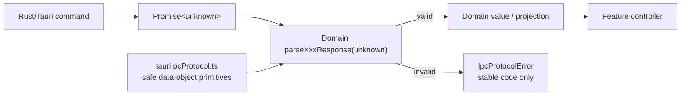

# Tauri IPC Runtime Decoding Boundary

- Date: 2026-07-24
- Status: Implemented and verified
- Scope: behavior-neutral React/TypeScript Tauri command-result hardening
- ExecPlan: `docs/exec-plans/completed/2026-07-24-tauri-ipc-runtime-decoding-plan.md`

## Implementation Outcome

The boundary is implemented in `app/src/tauriIpcProtocol.ts` and the five owning clients. The
shared module accepts only ordinary own data properties, rejects accessors, symbols, exotic
prototypes, sparse/custom arrays, missing/unknown keys, and reflection failures, and exposes only
stable non-echoing domain codes. Account, History, remaining settings, transcript detail, and
FrameQ-owned update DTOs now follow `unknown -> domain parser -> public value`.

TDD covered valid producer fixtures, malformed nested values, identity and semantic mismatches, and
secret-bearing accessors. A repository boundary test prevents generic `invoke<T>`, direct response
assertions, and non-`unknown` runners from returning in the reviewed client set. Verification
completed with focused App 64/64, full App 637/637, Rust 223/223, repository scripts 27/27, lint,
build, rustfmt, governance, and diff checks. No Rust DTO, wire contract, storage format, dependency,
or user-visible behavior changed.

## Context

TypeScript types disappear at runtime. A value returned by `invoke()` is therefore an untrusted
runtime value even when Rust currently serializes the expected DTO. A direct assertion such as
`value as AccountStatusResponse` documents an assumption but does not validate it.

FrameQ already closes some high-risk result boundaries:

- `workerResultProtocol.ts` parses worker terminal results from `unknown`, validates closed nested
  shapes, and rejects malformed or accessor-backed objects without echoing their payload;
- `localMediaContract.ts` and `localMediaClient.ts` validate native-picker results before exposing
  the safe selection view;
- `settingsClient.ts` validates UI preferences and delegates model-download/cancellation results to
  the worker result protocol.

Before implementation, the general Tauri client boundary was inconsistent:

| Client | Pre-implementation runtime behavior | Pre-implementation risk |
|--------|--------------------------|----------------|
| `accountClient.ts` | runner already returns `Promise<unknown>`, then account/auth/checkout results are asserted | malformed account, entitlement, quota, login URL, and checkout data can enter application state |
| `historyClient.ts` | runner returns `Promise<unknown>` and `source` has a parser, but list/detail/delete containers and nested artifacts/errors/transcripts/insights are asserted | invalid nested task data can survive until rendering or workflow restoration |
| `settingsClient.ts` | UI preferences and worker results are decoded; LLM-named runtime settings, audio cache, and first-run responses are asserted | invalid paths, model lists, sizes, and availability flags can enter settings state |
| `transcriptDetailClient.ts` | generic runner and `invoke<T>` trust load/save responses completely | malformed segments, artifacts, task identity, and audio paths can enter edit/playback state |
| `updateClient.ts` | update preference and delivery command results are cast or defaulted from partial values | malformed persisted update state can be silently normalized instead of reported as a protocol failure |

This is separate from the closed worker terminal-result boundary. That existing boundary protects
Python stdout and worker-family results returned through Rust. This design covers ordinary
Rust/Tauri command results that never pass through `workerResultProtocol.ts`.

The change is internal and behavior-neutral for valid responses. It adds no command, wire field,
storage format, network request, localization, account behavior, media behavior, AI call, or Credit
consumption, so no product-spec or desktop-worker contract version change is required.

## Requirements

The implementation must:

- type every in-scope Tauri command runner as returning `Promise<unknown>`;
- parse every successful command result before any field is read or defaulted;
- keep response knowledge in the owning domain client instead of a universal client framework;
- validate closed top-level and nested DTO shapes, including arrays, enums, optional fields, and
  semantic relationships already required by the command;
- reject unknown fields unless a documented DTO intentionally permits a closed subset of optional
  known fields, such as artifact maps;
- throw only a stable, non-echoing `IpcProtocolError` when decoding fails;
- preserve existing valid-response projections and public client return types;
- preserve existing specialized worker and local-media parsers rather than rewriting them;
- add negative tests for primitives, arrays, missing/unknown fields, wrong nested types, accessors,
  symbols, and incompatible semantic combinations; and
- require future Tauri clients to make the same `unknown -> parse -> domain value` transition.

The implementation must not:

- introduce `BaseClient<T>`, a global schema registry, code generation, a service locator, or a
  general-purpose validation framework;
- add Zod or another runtime dependency for this bounded migration;
- stringify or include a rejected response, raw exception, getter result, account/payment value,
  URL, local path, transcript, artifact content, or updater metadata in a protocol error;
- change Rust response DTOs merely to simplify the TypeScript parser;
- treat an unchecked `??` default as validation; or
- expand the change into updater UI behavior, controller ownership, worker contracts, or Rust path
  authorization.

## Alternatives Considered

### 1. Keep type assertions and rely on Rust serialization

This preserves the smallest source diff, but it leaves the TypeScript process unable to distinguish
an expected DTO from a missing field, incompatible app/host pair, compromised test bridge, or future
producer drift. Type assertions are not an executable boundary.

**Decision:** Rejected.

### 2. Add a generic `BaseClient<T>` or schema framework

A generic client can centralize invocation, but it cannot know account, History, transcript, and
update invariants without accumulating domain callbacks or a schema registry. Zod would reduce some
parser boilerplate but adds a dependency and does not by itself define privacy-safe errors or closed
semantic relationships.

**Decision:** Rejected for this migration. It can be reconsidered only if repeated domain parsers
remain materially costly after this boundary is closed.

### 3. Share defensive object-reading primitives and keep domain parsers local

A small module can safely inspect ordinary data objects, exact keys, and own data properties while
each client owns its DTO and semantic rules. This follows the Adapter and Anti-Corruption Layer
patterns already used by the worker result protocol.

**Decision:** Selected.

## Decision

Add `app/src/tauriIpcProtocol.ts` as a narrow defensive parsing primitive module. It owns only:

```ts
export class IpcProtocolError extends Error {
  readonly code: IpcProtocolErrorCode;
}

export type IpcProtocolErrorCode =
  | "ACCOUNT_IPC_RESPONSE_INVALID"
  | "HISTORY_IPC_RESPONSE_INVALID"
  | "SETTINGS_IPC_RESPONSE_INVALID"
  | "TRANSCRIPT_IPC_RESPONSE_INVALID"
  | "UPDATE_IPC_RESPONSE_INVALID";
```

The class sets `message` to the same stable code and never accepts a payload, cause, free-form
detail, path, or field value. A caller may use `error.code` or the stable message without exposing
the rejected value.

The module may also expose small mechanical helpers for:

- recognizing a plain object with `Object.prototype` or `null` prototype;
- reading own property descriptors without evaluating getters;
- rejecting accessors, symbols, unexpected keys, arrays, and exotic prototypes;
- returning a `Record<string, unknown>` snapshot of accepted own data properties; and
- checking exact required plus explicitly optional key sets.

It must not contain account, History, settings, transcript, update, worker, or local-media field
names. Domain response parsers stay in their owning client or a domain-local protocol file if a
client would otherwise become difficult to read.



## Parsing Policy

### Object and property safety

A response object is accepted only when it is a non-array ordinary data object with an allowed
prototype, no symbol keys, and only own data properties. The parser inspects descriptors first and
must not evaluate an accessor on a rejected object. Any reflection error fails closed with the
owning domain code.

Nested objects and array elements follow the same rule. A parser must never spread, stringify, log,
or interpolate an unvalidated object.

### Required, optional, and nullable fields

- Required fields must be present with the exact expected runtime type.
- Optional fields must be explicitly listed and validated when present.
- Nullable fields accept only the documented type or `null`.
- Numbers must be finite; count, byte-size, quota, timestamp, and identifier semantics add integer
  and non-negative checks where their producer contract requires them.
- Arrays must be real arrays, bounded by the existing response ownership, and every element must be
  decoded.
- Closed enums use explicit value sets; a TypeScript union annotation alone is insufficient.
- Artifact maps allow only the existing `TaskArtifacts` key set and validate every present value.

Defaults are applied only after a parser has established that an optional field is legitimately
absent. They cannot convert a wrong type into a valid value.

### Command and semantic validation

Each public function invokes one command and immediately calls its matching parser. Examples:

- account status validates all quota and entitlement fields before mapping snake_case to the
  existing `AccountStatus`;
- checkout and History deletion retain task/order identity checks;
- History validates the list container, source projection, terminal status, artifacts, error,
  transcript metadata, and every Insight;
- transcript detail validates segment timing and the complete save response before edit state
  changes;
- update preferences validate all three fields rather than silently converting wrong types to
  `null`;
- `logout_account`, whose Rust success type is unit, validates the serialized unit result instead
  of discarding an arbitrary value.

The TypeScript parser is an integrity boundary, not a replacement for Rust authorization. Local
path containment, supported-task checks, account session ownership, and update signature trust stay
with their existing native owners.

## Responsibility Map

| File | Implemented responsibility |
|------|------------------------|
| `app/src/tauriIpcProtocol.ts` | stable error class and domain-free safe object-reading primitives |
| `app/src/accountClient.ts` | account status, auth flow, checkout, checkout status, redeem, and unit response decoders |
| `app/src/historyClient.ts` | History list/detail/delete plus nested task/artifact/error/transcript/Insight decoders |
| `app/src/settingsClient.ts` | runtime settings, audio cache, first-run, and existing preference/worker-result error integration |
| `app/src/transcriptDetailClient.ts` | unknown runner plus load/save/segment/artifact decoders |
| `app/src/updateClient.ts` | Tauri update delivery/preferences decoders; updater plugin handle remains owned by its typed plugin adapter |
| `app/src/workerResultProtocol.ts` | unchanged specialized worker-family protocol |
| `app/src/localMediaContract.ts` | unchanged specialized local-media contract |

The external updater plugin returns a behavior-bearing handle with
`downloadAndInstall()`. This plan does not reinterpret that handle as a closed plain-data Tauri DTO.
It remains behind `UpdateCheckRunner`; only FrameQ-owned `get_update_delivery`,
`get_update_preferences`, and `save_update_preferences` command results enter this migration.

## Failure and Privacy Policy

All decoding failures map to exactly one domain code:

| Domain | Code |
|--------|------|
| account | `ACCOUNT_IPC_RESPONSE_INVALID` |
| History | `HISTORY_IPC_RESPONSE_INVALID` |
| settings | `SETTINGS_IPC_RESPONSE_INVALID` |
| transcript detail | `TRANSCRIPT_IPC_RESPONSE_INVALID` |
| updates | `UPDATE_IPC_RESPONSE_INVALID` |

Existing worker-specific codes such as `INVALID_ASR_MODEL_DOWNLOAD_RESPONSE` and
`INVALID_CANCEL_PROCESS_RESPONSE` remain stable at their established public boundary. Existing
semantic producer errors such as native `HISTORY_DELETE_FAILED` remain producer outcomes; a
malformed delete success DTO becomes `HISTORY_IPC_RESPONSE_INVALID`.

Protocol errors contain no field path or value. Tests must prove that secret-bearing fixtures and
throwing getters do not appear in the error name, message, code, cause, or serialized enumerable
properties.

## Migration Order

1. Add the shared primitive and adversarial tests.
2. Migrate account responses, including unit logout.
3. Migrate History from outer list/detail/delete containers through all nested values.
4. Migrate remaining settings responses while retaining existing specialized parsers.
5. Replace transcript generic invocation with `Promise<unknown>` and explicit load/save decoders.
6. Migrate FrameQ-owned update delivery and preference command responses.
7. Add a repository boundary test that prevents new direct response assertions and `invoke<T>` in
   the reviewed client set.
8. Run complete App, Rust compatibility, repository, documentation, and diff gates.

Each slice starts with failing malformed-response tests and preserves valid-response fixtures.

## Test Strategy

Focused tests must cover:

- valid current Rust DTO fixtures and existing public projections;
- primitive, `null`, array, exotic-prototype, symbol-key, accessor, missing-field, unknown-field,
  wrong-type, non-finite-number, and malformed nested values;
- closed enum and semantic mismatches such as wrong task/order identity, invalid segment timing, or
  incoherent error/status data;
- privacy fixtures containing email, checkout URL, local path, transcript text, and update metadata,
  proving none are reflected by `IpcProtocolError`;
- existing worker result, local-media, UI-preference, model-download, and cancellation behavior; and
- a static boundary scan covering the in-scope client files.

The complete App suite and build prove valid behavior remains compatible. Rust tests prove current
native producers still serialize the shapes accepted by the TypeScript decoders. No live account,
payment, updater download, media task, LLM, or AI Credit is required.

## Consequences

### Positive

- Tauri DTO drift fails at one explicit anti-corruption boundary instead of reaching UI state.
- Account, payment, transcript, path, and updater values receive consistent non-echoing failures.
- Domain ownership stays visible; a reader can find the response contract beside the command
  adapter.
- Future clients have one repeatable pattern without inheriting a generic framework.

### Negative

- Handwritten parsers and adversarial tests add code.
- Valid Rust DTO changes now require synchronized TypeScript parser and fixture updates.
- Per-domain errors identify the failing boundary but deliberately omit field-level diagnostics.

### Neutral

- Valid user-visible behavior, localization, storage, networking, worker contracts, updater
  signatures, and Credits remain unchanged.
- This does not eliminate all runtime validation work in the application; external plugin handles
  and browser APIs keep their own adapters.

## Acceptance

The boundary is complete when:

- all in-scope Tauri runners return `Promise<unknown>`;
- no in-scope command response uses `as Response`, `Partial<Response>` normalization, or
  `invoke<Response>`;
- every response reaches application state only after its domain parser succeeds;
- negative and privacy tests pass for all five domains;
- existing specialized worker/local-media parsers remain green;
- full App, lint, build, Rust, repository-script, governance, and diff gates pass; and
- the ExecPlan records evidence and is moved to `completed/`.

## References

- `app/src/workerResultProtocol.ts`
- `app/src/localMediaContract.ts`
- `app/src/localMediaClient.ts`
- `docs/design-docs/2026-07-19-closed-worker-terminal-results.md`
- `docs/ARCHITECTURE.md`
- `docs/SECURITY.md`
