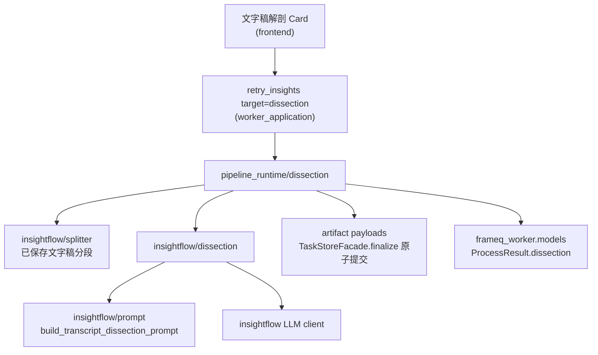

# 文字稿解剖（Transcript Dissection）功能设计

**Date:** 2026-07-31
**Status:** Approved design; active ExecPlan
**Owner module:** `智能提炼` 工作区 / `worker/frameq_worker/insightflow/`

## Context

`智能提炼` 工作区（`AiGenerationWorkspace`）当前**已实现**两张独立 target 卡片：`要点总结`
（`summary`，同时生成 Mermaid mindmap）与 `启发灵感`（`insights`，结构化 Insight 数组）。
`生成文字稿`（`draft`，AI 草稿）已有产品规格但尚未实现。本设计以 `draft` 规格描述的三卡
目标态为基线，提出第四张卡片；实现时不得假设 `draft` 已经存在，两个 target 可独立排期，
共享 contract 的扩展必须避免冲突，但实现 dissection 不得顺带注册尚不可用的 draft target。

- `summary` 把文字稿**浓缩**为要点；
- `insights` 从文字稿**发散**为可延展选题；
- `draft` 把单条灵感**展开**为成稿。

用户还缺少第四种动作：把一篇已完成的文字稿**拆解**开来——理解它的主题结构、叙事骨架、
表达手法、节奏与可复用模板，从而判断"它好在哪、弱在哪、我能怎么复用"。这是内容从业者
复盘拆解能力的核心诉求，与 `summary`/`insights`/`draft` 正交，不能由其中任一替代。

本设计在 `智能提炼` 工作区新增第四张独立 target 卡片 `文字稿解剖`，底层 target 标识为
`dissection`。它对任务已保存的正式 `transcript/transcript.txt` 做结构化深度拆解，产出
可分段溯源、可复用、可导出的解剖报告。

## Goals

- 让用户对一篇已完成文字稿做"拆解式"理解，而非浓缩或发散：看清主题分段、叙事结构、
  表达手法、信息节奏、可复用骨架、风险点与优劣。
- 把 `文字稿解剖` 做成与 `要点总结`、`启发灵感`、`生成文字稿` 平级的第四张独立
  target 卡片，共享 AI整理 的卡片模板、类型化状态、额度与隐私纪律。
- 以任务已保存的正式文字稿为唯一 AI 输入来源，沿用 `insightflow/splitter.py` 的分段
  能力，让每段解剖结论可追溯到 `sourceChunkIds[]`。
- 严格保持项目的本地优先与隐私边界：只把完成解剖所需的文字稿内容发送给 LLM supplier；
  长文字稿虽分片发送，但多轮调用合计可能覆盖全文。不得发送视频、音频、source URL 或
  用户偏好快照。
- 复用既有的确认 / 额度 / 错误归属机制，不引入新的隐私或额度漏洞。

## Non-goals

- 不做对视频画面/景别/运镜/剪辑的分析；本功能解剖对象是**文字稿文本**，不是视频流。
  视频画面级拆解属于另一能力域，不在此 spec 范围。
- 不读取 `我的灵感档案` 或 `本次生成偏好` 快照；解剖关注表达结构与事实判断，个性化
  程度低，保持与 `要点总结` 一致的"通用整理"纪律。
- 不把解剖结果写回 `transcript.txt` 或复用 transcript artifact，避免污染本地优先的
  "正式文字稿"概念。
- 不做自由文本 prompt 编辑器或"复制片段 → 粘贴进某页面"的桥接。
- 不改变主流程：视频提取与文字稿生成仍可在不使用 LLM 的情况下完成。
- 不个性化 `要点总结`、`启发灵感`、`生成文字稿` 或 Mermaid mindmap。
- 不在 v1 把视频帧、音频波形或说话人画像作为 LLM 输入；`speaker` 仅作为元数据标注，
  不作为身份推断输入。
- 不依赖 `insights` / `summary` / `draft` 的结果；`dissection` 只依赖已保存的可用文字稿。

## Product Model

`文字稿解剖` 是 `智能提炼` 目标态的第四张独立 target 卡片，遵循与已实现的两张卡片及
已规划的 `draft` 相同的卡片模板：各自拥有状态、额度/隐私说明、确认/重试/查看动作、
进度与错误。

- **输入（seed）**：受支持任务中已保存且非空的正式文字稿 `transcript/transcript.txt`。
  `completed` 与 `partial_completed` 任务均可用；不能只凭状态推断，官方 artifact 缺失、
  非法或为空时本卡片安静禁用。
- **依赖关系**：`dissection` 仅依赖已保存的可用文字稿，不依赖任何其他 target 的结果。
  这是它区别于 `draft`（依赖 `insights` 选中种子）的关键。
- **产物命名**：卡片 UI 文案为 `文字稿解剖`（用户术语）；底层 AI 产物称为
  `解剖报告 / dissection`，以区别于 ASR `transcript.txt`、`summary`、`insights.json`
  与 `{stem}_draft.md`。UI 可在卡片副标题注明"（结构拆解）"以避免语义混淆。
- **与 `summary` 的区别**：`summary` 回答"它说了什么"，`dissection` 回答"它是怎么说
  的、结构好在哪、能复用什么"。

## Dissection Dimensions（解剖维度）

解剖报告围绕以下维度组织，所有结论必须可追溯到文字稿内容，不允许凭空发散：

| 维度 | 说明 | 落点 |
|------|------|------|
| 主题分段 | 在确定性 splitter chunk 之上归纳若干语义主题段 | `segments[]`，每段含 `title` / `sourceChunkIds[]` / `coreClaim` |
| 叙事结构 | 开头钩子类型、论证推进、转折、收尾类型 | `overallNarrative` |
| 表达手法 | 金句、类比、数据引用、故事、反问、对比等 | 段级 `rhetoricalDevices[]` + 全局 `highlights[]` |
| 信息节奏 | 长短句交替、密度、情绪曲线 | 段级 `rhythmNote` |
| 可复用骨架 | 可借鉴的叙述模板 | `reusableTemplate` |
| 风险与争议 | 需核实的观点、可能引起争议的判断 | 段级 `riskFlags[]` |
| 受众适配 | 对不同受众的匹配评估 | `audienceFit[]` |
| 亮点与短板 | 整体优劣 | `strengths[]` / `weaknesses[]` |

`insightflow/splitter.py` 产生的是受长度上限约束的确定性输入 chunk，不等同于语义主题段。
每个主题段使用非空、去重且升序的 `sourceChunkIds[]` 引用一个或多个合法 chunk；这样既允许
一个主题跨 chunk，又保持与 `insights.sourceChunkId` 同源，便于跨 target 溯源对照。

## Generation Flow（文字稿解剖 Card）

- **文字稿未保存 / 仍在转录 / 转录失败**：卡片安静禁用，提示"请先等待文字稿完成"。
  不消耗额度，不暴露 LLM 入口。
- **文字稿可用（`completed` 或 `partial_completed`，且官方文字稿受验证、非空）**：主按钮
  `确认` 可点。
- 点击 `确认` 打开确认页（**不消耗额度**）。
- 确认页点击最终 `确认` 后，触发 worker 的解剖生成命令（见 Architecture Boundary）。
- 生成期间：复用 `insights_generating` 阶段，`activeAiTarget` 为 `"dissection"`；本地
  工作区保持可读/可回听，文字稿编辑/保存禁用，提示"AI 正在使用已保存版本"。
- 失败：该卡片显示失败态 + 重试入口；若其他 target 成功，整体为 `partial_completed`，
  错误仅归因到 `文字稿解剖`。

## Confirmation Panel

`文字稿解剖` 确认页展示：

- **本次输出语言**：展示确认时解析后的实际 UI locale（简体中文、繁體中文或 English），
  不显示 `system` 字样；点击最终确认时冻结该值。
- **解剖对象摘要**：任务标题 + 文字稿字数 + 输入片段数（来自 splitter 的当前 chunk 数），
  不展示原文全文。
- **额度说明**：`1 次额度 = 1 次云端 LLM API 调用尝试`；确认页不得固定显示为 `1 次`，
  应说明本次生成会按实际 LLM 调用次数扣除。
- **数据提示**：将把任务已保存的文字稿内容分片发送给管理员配置的云端 LLM 服务；多轮调用
  合计可能覆盖全文。**不会**上传视频、音频、source URL 或用户偏好快照；解剖不读取任何
  偏好。
- **操作按钮**：`确认`、`取消`。

用户点击 `确认` 后才触发 worker 的解剖生成流程。

## Quota Consumption

- `1 次额度` 表示 FrameQ 向云端 LLM 发起 1 次 chat-completion/API 调用尝试。
- 单次解剖最多 6 次调用尝试（含 map、reduce 与最多一次 repair）。确认页展示根据当前输入
  计算的保守调用区间和 6 次硬上限；预计上限超过 6 次或账户剩余额度小于预计上限时不启动。
- v1 call plan 为确定性规则：splitter 仍以 2,000 字符生成 chunk；每个 map 调用最多装入 4 个
  chunk，随后固定 1 次 reduce，并预留最多 1 次 repair。因此 `lower = ceil(chunkCount / 4) + 1`，
  `upper = lower + 1`；`upper > 6` 时拒绝。共享 contract 固定这些常量，TypeScript 预览与
  Python worker 执行前复算必须一致，不一致时失败闭合且不 checkout。
- 用户在确认页点击 `确认` 后，解剖生成按实际 LLM API 调用次数消耗额度；它不隐式生成或
  扣除 `要点总结` / `启发灵感` / `生成文字稿` / Mermaid mindmap 的调用。
- 每次 LLM API 调用尝试在发起前或发起时扣除 1 次额度；该次调用失败、超时、返回不可解析
  或最终导致解剖部分失败时，对应额度不自动返还。
- 仅进入确认页或点击 `取消` 不消耗额度。
- 前端账户/额度预检只是快速阻断；每次调用的最终授权与扣减由既有 server-managed checkout
  决定。checkout 未成功不扣额度；checkout 成功后即使 provider 调用失败、超时或结果解析
  失败，该次额度也不返还。

## Result Experience

- 成功：写入 `ai/dissection.json`（结构化）与 `ai/dissection.md`（GFM 渲染）。固定任务内
  相对路径与当前 retry 产物的 `ai/summary.md`、`ai/insights.json` 纪律一致。
- `文字稿解剖` 卡片提供 `查看`、`复制`、`导出（定位文件）` 动作；查看使用经净化的
  Markdown 渲染（GitHub Flavored Markdown），不渲染原始 HTML。
- 解剖结果是独立 artifact，不与官方 transcript、summary、insights、draft 共用容器，
  也不可作为官方 transcript 编辑/导出。
- 查看 UI 以分段卡片为主干：每段展示 `标题` / `核心论点` / `表达手法` / `节奏` /
  `风险标记`，并提供"定位到文字稿对应片段"的交互。定位使用 artifact 内受验证的 UTF-8
  byte range，不把 splitter chunk ID 误当作现有 ASR segment ID；不跨任务。
- 全局区展示 `叙事结构` 摘要、`可复用骨架`、`亮点金句`、`受众适配` 与 `亮点/短板`。
- 失败：卡片展示结构化错误原因、重试入口与可修改入口；重试走同一确认 / 额度流程。

## Dissection Artifact Schema

解剖产物为结构化 JSON，文件 `{task_dir}/ai/dissection.json`：

```json
{
  "schemaVersion": 1,
  "sourceTranscriptSha256": "64-char-lowercase-hex",
  "sourceLanguage": "zh-CN",
  "sourceChunks": [
    {
      "id": 1,
      "startByte": 0,
      "endByte": 1860,
      "sha256": "64-char-lowercase-hex"
    },
    {
      "id": 2,
      "startByte": 1860,
      "endByte": 3512,
      "sha256": "64-char-lowercase-hex"
    }
  ],
  "overallNarrative": {
    "openingHook": "提问式钩子",
    "structureType": "问题—论证—案例—收束",
    "turningPoint": "第三段引入反例",
    "closingType": "行动号召"
  },
  "segments": [
    {
      "id": 1,
      "title": "开场提问与立场",
      "sourceChunkIds": [1, 2],
      "coreClaim": "用反问提出核心命题",
      "supportingPoints": ["数据引用", "个人案例"],
      "rhetoricalDevices": ["反问", "对比"],
      "rhythmNote": "短句密集，节奏快",
      "reusablePattern": "反问开场 + 个人立场",
      "riskFlags": []
    }
  ],
  "highlights": ["「金句原文」"],
  "reusableTemplate": {
    "name": "反问—论证—反例—收束",
    "skeleton": ["反问开场", "立场声明", "2 个支撑案例", "反例转折", "行动收束"]
  },
  "audienceFit": [
    { "audience": "新手", "fit": "medium", "note": "术语未充分解释" }
  ],
  "strengths": ["开头钩子强", "案例具体"],
  "weaknesses": ["收尾仓促", "第三段论证跳跃"]
}
```

字段约束：

| 字段 | 类型 | 约束 |
|------|------|------|
| `schemaVersion` | `number` | 固定 `1` |
| `sourceTranscriptSha256` | `string` | 生成开始时官方 `transcript.txt` UTF-8 字节的 SHA-256；用于跨重启过时检测，不上传 supplier |
| `sourceLanguage` | `string \| null` | 仅复用可信 transcript metadata；未知时为 `null`，不得让 LLM 猜测 |
| `sourceChunks[]` | `object[]` | 完整覆盖发送给模型的 chunk；ID 从 1 递增；UTF-8 byte range 非重叠、升序且在全文边界内；slice SHA-256 必须匹配；不存正文 |
| `overallNarrative` | `object` | 可选字段为 `null`；`structureType` 必填 |
| `segments[].id` | `number` | 结果内递增，从 1 开始 |
| `segments[].sourceChunkIds` | `number[]` | 非空、去重、升序，且每项必须是本次输入的合法 chunk ID |
| `segments[].coreClaim` | `string` | 必填，一句话核心论点 |
| `segments[].rhetoricalDevices` | `string[]` | 可空数组 |
| `segments[].riskFlags` | `string[]` | 可空数组；非空时需在 UI 标注 |
| `highlights` | `string[]` | 金句原文，最多 8 条 |
| `reusableTemplate.skeleton` | `string[]` | 3-7 步骨架 |
| `audienceFit[].fit` | `enum` | `high \| medium \| low` |
| `strengths` / `weaknesses` | `string[]` | 各最多 6 条 |

`ai/dissection.json`、worker `ProcessResult.dissection`、UI 详情页、复制文本与 Markdown
导出均以该结构化 schema 为准。manifest 只登记通用 artifact key `dissection` 与
`dissection_md`；v1 不新增重复的 `dissection_path`、`has_dissection` 或
`dissection_count` 顶层字段。
Markdown 导出按段分组展示 `标题` / `核心论点` / `表达手法` / `风险标记`，并在末尾汇总
`可复用骨架` 与 `亮点/短板`。

## Prompt Strategy

worker 生成解剖时应新增
`build_transcript_dissection_prompt(text_chunks, output_language)`（位于
`worker/frameq_worker/insightflow/prompt.py`），类比 `build_summary_prompt`，并遵守：

- **输出语言**：`output_language` 必须复用共享的 `zh-CN | zh-TW | en-US` 闭集，使用固定
  enum 派生的语言指令覆盖解剖报告的所有用户可见字段；不得把任意 UI 字符串直接拼为指令。
- **输入**：任务已保存的正式文字稿分段（来自 `insightflow/splitter.py`）。不拼接视频、
  音频、source URL 或用户偏好。
- **角色**：资深内容编辑/拆解师，对一篇口播文字稿做结构化复盘拆解。
- **分段对齐**：解剖的 `segments[].sourceChunkIds[]` 必须来自传入的 chunk ID 闭集；允许
  一个语义主题引用多个相邻 chunk，但不得自创、钳制或静默丢弃引用。
- **事实约束**：所有 `coreClaim` / `supportingPoints` / `highlights` 必须可在原文中定位；
  不允许凭空生成原文不存在的观点或案例。
- **原创性**：`reusableTemplate` 是对结构的抽象，可借鉴但不得逐字复制原文；`highlights`
  引用原文金句时须为原文摘录，不得改写。
- **风险标注克制**：`riskFlags` 只标注"需核实的事实声明"或"可能引起争议的判断"，不做
  价值审判，不输出敏感政治/法律结论。
- **个性化降级**：解剖不读取任何偏好；当文字稿语种与 `output_language` 不同时，解剖
  报告字段按 `output_language` 输出，原文金句保留原语种。
- worker 不应把超出既定 prompt 上限的长文字稿直接拼入单次 prompt；应以确定性 chunk 做
  map 阶段，再以结构化中间结果做 reduce 阶段。不得先用有损摘要替代尚未分析的原文并声称
  全文可追溯。多轮调用各自通过既有 managed client checkout 计入额度。

## Data and Storage

- 解剖 artifact 写入任务目录，与 `transcript`、`summary`、`insights`、`draft`、`mindmap`
  并列，互不覆盖。
- `ai/dissection.json` 为权威结构化产物；`ai/dissection.md` 为只读渲染，UI 查看、
  复制文本、导出定位以 JSON 为准，Markdown 仅用于人读导出。
- 任务 manifest 的既有 `artifacts` map 增加 `dissection: "ai/dissection.json"` 与
  `dissection_md: "ai/dissection.md"`；存在性从受验证 artifact 推导，不复制全文，也不新增
  `dissection_path` / `has_dissection` 平行状态。
- 解剖不上传 FrameQ server；属于本地任务产物。
- 当文字稿被重新编辑并保存后，旧解剖可能失效。artifact 保存生成时的
  `sourceTranscriptSha256`；加载详情与历史恢复时对当前官方文字稿重新计算摘要，不一致即
  标注"文字稿已更新，解剖可能过时"并提供"重新解剖"入口。旧 artifact 保留，不删除；
  不依赖仅存在于当前 UI 会话的保存事件。stale 时禁用旧引用定位，避免 chunk ID 指向新内容。
- splitter 需为每个 chunk 生成相对于冻结文字稿 UTF-8 字节的 `startByte` / `endByte` 和 slice
  SHA-256。artifact 不复制 chunk 正文；定位时必须同时验证全文摘要、byte range 与 slice 摘要。
- 日志、错误文案和诊断信息不得输出完整文字稿、完整 prompt 或解剖全文。

## Key Decisions and Alternatives

| 决策点 | 采用方案 | 放弃方案与原因 |
|------|----------|----------------|
| 命令边界 | 扩展 `retry_insights.target` | 新建 `generate_dissection` 会复制 Tauri 注册、runner、watchdog、checkout 与终态映射 |
| 溯源 | `sourceChunkIds[]` 多引用 | 单个 `sourceChunkId` 无法表达跨长度 chunk 的语义主题；`null` 会破坏可追溯承诺 |
| manifest | 复用 `artifacts` map | `dissection_path` + `has_dissection` 与文件事实形成可漂移的重复状态 |
| 过时检测 | artifact 内保存 transcript SHA-256 | 仅监听当前 UI 保存事件无法覆盖应用重启、历史恢复或外部受控变更 |
| 原文定位 | 保存 UTF-8 byte range + slice SHA-256，校验后定位 | 直接把 splitter ID 当 ASR segment ID 会定位错误；保存片段正文会重复敏感内容 |
| 额度 | 复用 managed client 每次 `generate()` checkout | worker 回调会制造第二个额度 owner，且无法保持 server 的幂等扣减语义 |
| 长文本 | 确定性 chunk map + 结构化 reduce | 单次塞入全文不可控；先做有损摘要再分析会削弱事实溯源 |

代价是 terminal-result contract 必须升版、结果解析更严格，且多轮调用成本高于单轮 summary；
收益是沿用现有安全/额度/原子提交 owner，不引入新的跨层入口或重复持久化状态。

## Architecture Boundary

- 这是 `AI整理` 的信息架构扩展，不是 worker 流水线重写。它不得改变 `process_video`、
  stdin 传输、server 权益/额度职责、`SourceIdentity`、任务存储或 `ProcessSupervisor`
  内部。
- **不新增 Tauri/CLI 命令**：扩展现有 `retry_insights` 的闭集 target，增加
  `target="dissection"`。该命令继续是 server-managed checkout 环境进入 worker 的唯一 AI
  入口；每次 `InsightClient.generate()` 自行 checkout 并消费一次额度，不增加 worker 侧
  `on_quota_charge` 回调或第二套额度状态。
- stdin request 必须包含确认时冻结的
  `output_language: "zh-CN" | "zh-TW" | "en-US"`；TypeScript、Rust、Python 拒绝缺失或
  非法值，不允许旧调用默认语言。实现 dissection 时须显式升级共享 contract 的 target
  能力（与 draft 一致）。
- 共享 contract 同时声明 dissection call-plan 版本、2,000 字符 chunk 上限、每个 map 调用最多
  4 个 chunk、1 次 reduce、最多 1 次 repair 与 6 次总上限。前端仅对已加载的已保存文字稿
  做确认页预览；worker 对实际读取的官方文字稿重新计算并最终执法。
- worker stdin 仍只接收 `task_id`、`target` 与 `output_language`。worker 通过
  `TaskStoreFacade` 打开受支持任务并只读取固定官方文字稿路径；dissection 分支不得读取、
  传递或拼接 manifest 中的视频、音频、source URL 或偏好快照。
- **类型化状态**：前端 `activeAiTarget` 扩展为
  `"summary" | "insights" | "dissection" | null`；未来实现 draft 时再加入 `"draft"`。UI
  行为不得从状态文案推断 target。底层仍复用 `insights_generating` 阶段，target 归属为
  `dissection`。
- 本地进度与 AI target 状态为分离的视图模型投影；AI 生成期间本地投影保持 ready
  （transcript 可用）。
- `FrameQ server` 仍只负责账号、权益、配额和 LLM checkout；server 不接收、不存储文字稿、
  解剖结果或偏好。
- LLM supplier 在用户确认后收到文字稿内容；多轮合计可能覆盖全文，确认页必须明确提示。
- `dissection` 与其他 target 之间无数据依赖，各自保持独立的状态、确认、额度与错误归属；
  历史恢复时两工作区共享同一 taskId。

## Module Split & Interfaces（实现侧设计）

解剖能力应内置于 `worker/frameq_worker/insightflow/`，不跨目录 import
（遵循"运行期不得从 `D:\Github\InsightFlow\src\server` 跨目录 import"铁律）。规划模块树：

```text
worker/frameq_worker/insightflow/
  prompt.py            # 新增 build_transcript_dissection_prompt
  dissection.py        # 新增：解剖生成逻辑与结果解析
  artifact_storage.py  # 复用现有 payload/原子提交能力
```

规划内部接口（planned，非最终实现）：

```python
# dissection.py
def generate_dissection(
    transcript_chunks: list[MarkdownChunk],
    output_language: OutputLanguage,
    llm_client: InsightClient,
    source_transcript_sha256: str,
) -> DissectionResult:
    """对已保存文字稿 chunk 做结构化拆解；每次 client.generate 自行完成额度 checkout。"""

# prompt.py
def build_transcript_dissection_prompt(
    transcript_chunks: list[MarkdownChunk],
    output_language: OutputLanguage,
) -> str:
    """构造解剖 prompt；输出语言指令来自共享 enum，不拼 UI 文案。"""

# dissection.py
def build_dissection_artifact_payloads(
    dissection: DissectionResult,
) -> dict[str, bytes]:
    """返回 ai/dissection.json 与 ai/dissection.md payload；不直接更新 manifest。"""
```

管道与重试入口：

- 新建 `worker/frameq_worker/pipeline_runtime/dissection.py`：编排"读取已验证的官方文字稿快照
  → 计算 SHA-256 → splitter 分段 → generate_dissection → 构造 artifact payload"。它不直接
  写 manifest。
- `worker/frameq_worker/worker_application/insight_retry.py`：扩展 `retry_insights` 以支持
  `target="dissection"`，拒绝该 target 携带 `preference_snapshot`，合并既有 AI 产物后统一交给
  `TaskStoreFacade.finalize`，由既有 prepared/committed journal 原子提交 payload 与 manifest。
- `worker/frameq_worker/models.py`：`ProcessResult` 增加 `dissection: DissectionResult | None`，
  类比 `summary` / `insights` / `draft`。

前端：

- `app/src/features/.../AiGenerationWorkspace` 新增第四张 target 卡片，复用既有卡片模板与
  确认页组件；`activeAiTarget` 类型扩展。
- 复用 `useArtifactDetailController.ts` 的结果详情 tab/复制/导出能力；不新建独立 tab
  容器与 transcript review 共享。
- transcript controller 新增受限的任务内 UTF-8 byte-range 定位能力；调用方必须提供已通过
  全文摘要、范围与 slice 摘要校验的引用。不得把 splitter chunk ID 传给既有 ASR segment
  定位入口，也不新增跨任务跳转。

## Dependency Direction



- `dissection.py` 只依赖 prompt、结果类型、输出语言语义与 `InsightClient` 协议；不得依赖
  pipeline、`TaskStoreFacade`、前端、Tauri、server 或 transcript 编辑模块。
- `dissection` 不读取 `insightflow` 中的偏好快照加载逻辑；偏好快照路径仅对 `insights`
  与 `draft` 开放。
- dissection pipeline 只构造 `artifact_payloads`；`TaskStoreFacade.finalize` 是 retry 路径唯一的
  manifest/产物提交 owner，不引入第二个原子写入或直接 manifest 更新路径。

## Behavior and Failure Matrix

| 条件 | 要求行为 |
|------|----------|
| 任务不受支持，或官方文字稿缺失、非法、为空 | 卡片安静禁用或返回固定安全错误；不发起 LLM checkout |
| 文字稿可用但极短（< 阈值，如 200 字） | 允许解剖，但 `segments` 可能为 1 段，`reusableTemplate` 标注"样本过短" |
| splitter 分段为空或失败 | 解剖失败并归因到 `dissection`，不影响其他 target |
| LLM 返回不可解析 JSON | 按既有 `insights` 解析失败路径处理：该次调用额度不返还，卡片失败 + 重试入口 |
| LLM 返回空、重复、乱序或越界的 `sourceChunkIds` | 允许至多一次有界 repair 调用；仍非法则整次失败闭合，不提交新 artifact，不钳制或静默丢段 |
| 文字稿在解剖期间被编辑保存 | 现有 UI 在 AI 活跃时禁用编辑/保存；worker 仍只读取一次文字稿字节快照并记录 SHA-256，防御并发外部修改 |
| 解剖失败但其他 target 成功 | 整体 `partial_completed`，错误仅归因 `dissection` |
| 前端账户或额度预检未通过 | 不启动 worker；若状态竞态变化，以每次 server checkout 的结果为准 |
| 预计调用上限超过 6 次，或剩余额度不足预计上限 | 在 worker/LLM 启动前阻断，不消费额度 |

## Security and Compatibility

- source URL、视频、音频、解剖结果与偏好快照不离开本机；文字稿内容在确认后分片发送给
  管理员配置的 LLM supplier，多轮合计可能覆盖全文。FrameQ server checkout 不接收 prompt，
  但 supplier 会接收实际文字稿内容。
- 错误信息不得包含完整文字稿、完整 prompt、source URL 或解剖全文。
- 解剖 artifact 与 transcript/summary/insights/draft/mindmap 互不覆盖，复用既有原子写入
  与任务局部 journal。
- `dissection` 不改变 `process_video` request 或 task-manifest schema v3 的既有字段语义；
  但会扩展 `retry_insights` target 闭集、task terminal result、artifact key 闭集、Rust/TypeScript
  运行时解码器与 `activeAiTarget`。`contracts/desktop-worker-contract.json` 须整体升版，不能把
  `ProcessResult.dissection` 描述成兼容的 DTO 例外。
- `dissection` 不引入新的网络路径、日志路径或 telemetry；LLM 调用复用既有
  server-managed checkout 与额度扣减链路。
- 历史恢复：经受验证的 manifest `artifacts.dissection` / `dissection_md` 只读恢复；加载 JSON
  后严格解码完整 schema，并以 `sourceTranscriptSha256` 判断是否过时；只有全文及 slice 摘要
  均匹配时开放原文定位。不支持的任务类型（legacy/quarantined）不展示解剖卡片，与既有
  History vNext 纪律一致。

## Consequences

### Positive

- 用户获得"拆解式"理解能力，补齐 `浓缩` / `发散` / `展开` 之外的第四种 AI 动作。
- 解剖维度可追溯 `sourceChunkIds[]`，与 `insights` 同源 chunk，便于跨 target 对照。
- 复用既有卡片模板、额度链路、原子写入与偏好纪律，新增边界小、风险可控。

### Negative

- 当前已实现工作区从两张增至三张卡片；未来 draft 实现后进入四卡目标态。两种窄屏堆叠
  顺序都必须保持明确（见下）。
- `activeAiTarget` 类型再次扩展，所有从状态文案推断 target 的旧代码需审计。
- 解剖的多轮 LLM 调用可能比单轮 summary 更耗额度，确认页需如实说明。

### Neutral

- `dissection` 与 `draft` 一样是"已规划未实施"的新 target；二者可按各自 ExecPlan
  独立排期，互不阻塞。

## Layout Note（窄屏顺序）

`draft` 尚未实现时，三张卡片在 < 1100 px 下的固定堆叠顺序为：
`要点总结` → `启发灵感` → `文字稿解剖`。未来四卡目标态为：
`要点总结` → `启发灵感` → `生成文字稿` → `文字稿解剖`。`生成文字稿` 依赖
`启发灵感`，紧随其后；`文字稿解剖` 独立并始终放最后。

## Validation Rules

- `文字稿解剖` 不得在任务不受支持、官方文字稿缺失/非法/为空，或解剖已成功且文字稿
  未变更时，自动发起任何 worker 调用。
- 文字稿保存后，旧解剖不自动失效；UI 标注过时并提供"重新解剖"入口。
- `sourceChunkIds[]` 为空、重复、乱序、越界或 splitter 失效时，结果必须失败闭合；不得钳制、
  静默丢段或提交带错误引用的 artifact。
- `output_language` 必须为共享 enum 合法值；缺失或非法时 worker 拒绝，返回固定
  invalid-request 错误，不回显输入。

## Implementation Order

1. 审核并确认 `docs/product-specs/2026-07-31-transcript-dissection.md` 的用户可见行为与边界。
2. 扩展并升版共享 contract：`retry_insights.target`、`activeAiTarget`、
   `ProcessResult.dissection`、artifact keys、call-plan 常量、严格解码器与 `output_language`
   闭集复用；manifest schema v3 仅扩展通用 `artifacts` map 的允许 key。
3. worker 侧：`insightflow/prompt.py` 新增 prompt 构造；新增 `insightflow/dissection.py`；
   复用 `artifact_storage.py` / `artifact_payloads`；新增 `pipeline_runtime/dissection.py`；扩展
   `worker_application/insight_retry.py`。
4. 前端：新增 dissection target 卡片 + 确认页 + 结果查看（分段卡片 + 全局区）+
   "定位到文字稿片段"；不得顺带显示未实现的 draft 卡片。
5. 写 RED 边界测试：dissection 不读取偏好、不发送视频/音频/URL、`sourceChunkIds[]` 失败闭合、
   TypeScript/Python call plan 一致与 6 次硬上限、每次 `client.generate` 的 checkout 扣减、
   SHA-256 跨重启过时标注、UTF-8 byte-range/slice 摘要定位、stale 禁止定位、失败时不提交
   半套产物。
6. 跑 focused 与全量回归门禁（`uv run ruff check worker`、`uv run pytest worker\tests`、
   `npm --prefix app test`、`npm --prefix app run lint`、`npm --prefix app run build`）。
7. 归档 ExecPlan，更新 `docs/ARCHITECTURE.md` 与 `docs/SECURITY.md` 的边界说明。

## Acceptance Criteria

- `智能提炼` 工作区显示独立 `文字稿解剖` target；`draft` 尚未实现时它排第三，未来四卡
  目标态排第四。实现 dissection 不得激活不可用的 draft 卡片或 worker target。
- `文字稿解剖` 在任务不受支持或官方文字稿缺失、非法、为空时安静禁用；`completed` 与
  `partial_completed` 的受支持任务均可使用。不消耗额度、不暴露 LLM 入口。
- 当前 `activeAiTarget` 类型扩展为 `"summary" | "insights" | "dissection" | null`；未来
  实现 draft 时再加入 `"draft"`。UI 不依赖状态文案推断 target。
- `文字稿解剖` 确认页展示解剖对象摘要、额度说明（1 次额度 = 1 次 LLM 调用尝试，按实际
  调用扣除）与如实的数据提示（文字稿内容会分片发送，多轮合计可能覆盖全文；不上传
  视频/音频/URL/偏好）。
- 确认页与 worker 按同一版本化 call plan 计算调用区间；最多 6 次，预计上限超过 6 次或
  剩余额度不足预计上限时，在任何 checkout 前阻断。
- `文字稿解剖` 确认页展示实际输出语言；最终确认冻结并发送共享 enum 的 `output_language`，
  生成中切换 UI 不改变该请求，重试使用重试确认时的新语言。
- 确认后才触发 worker 命令；解剖生成按实际 LLM 调用次数扣除额度；失败/超时/不可解析不
  返还。调用任何 `client.generate()` 前取消不扣；checkout 成功后再取消，已扣额度不返还。
- worker stdin 不接收文字稿或本地路径；dissection 分支通过受验证任务能力只读取一次官方
  文字稿快照，不读取视频、音频、URL 或偏好；`sourceChunkIds[]` 严格对齐 splitter chunk。
- 解剖写入 `ai/dissection.json` 与 `ai/dissection.md`；`ProcessResult` 含 `dissection`，manifest
  仅登记 `artifacts.dissection` / `dissection_md`；UI 提供查看/复制/导出与"定位到文字稿片段"，
  且不与官方 transcript 共用容器。
- artifact 保存 `sourceTranscriptSha256`；当前文字稿摘要不一致时，即使跨应用重启，UI 也
  标注"解剖可能过时"、禁用旧引用定位并提供重新解剖入口；旧 artifact 保留不删除。
- `文字稿解剖` 失败仅归因本 target；整体 `partial_completed` 时其他 target 的成功产物
  不受影响。
- `FrameQ server` 不新增保存文字稿、解剖结果或偏好的接口或字段。

## References

- `docs/product-specs/2026-07-31-transcript-dissection.md`（本功能用户可见行为、额度与隐私边界）
- `docs/product-specs/2026-07-11-local-transcript-ai-workspaces.md`（智能提炼工作区与
  Local/AI 命令分离纪律）
- `docs/product-specs/2026-07-12-generate-draft-from-inspiration.md`（第三张 target 卡片
  `生成文字稿` 的契约范式，本设计与之平行）
- `docs/product-specs/2026-07-06-personalized-insight-preferences.md`（偏好快照边界；
  dissection 显式不读取偏好）
- `docs/design-docs/2026-07-20-transcript-detail-module-split.md`（transcript artifact
  与官方路径纪律；dissection 不得污染）
- `docs/design-docs/core-beliefs.md`（本地优先、不跨目录 import）
- `docs/ARCHITECTURE.md`（智能提炼与 AI target 边界）
- `docs/SECURITY.md`（文字稿/URL 隐私边界）
