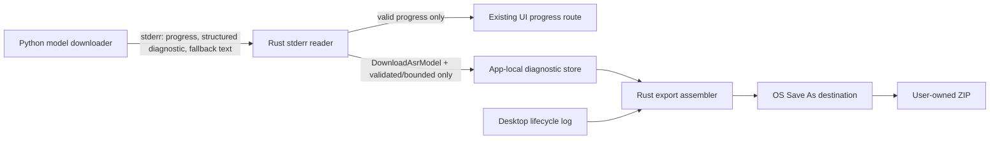

# Desktop Diagnostic Export Design

- Date: 2026-08-09
- Status: Implemented; native release smoke evidence pending
- Product spec: `docs/product-specs/2026-08-09-desktop-diagnostic-export.md`
- Supersedes: none; narrows and extends the existing desktop diagnostics boundary
- Related architecture:
  - `docs/design-docs/2026-07-22-rust-worker-watchdog.md`
  - `docs/design-docs/2026-07-23-rust-worker-runner-module-split.md`
  - `docs/design-docs/2026-07-24-asr-model-download-job-capability-boundary.md`

## Context

The runner is the single consumer of child stderr. It currently distinguishes validated progress
from ordinary diagnostic output, forwards only valid progress, and retains only the safe marker
`present|empty|reader_failed` for terminal logging. This is the correct default for operations that
may emit source URLs, media text, transcripts, prompts, or generated content.

ASR model download has a narrower data domain but an observability gap. Python catches
`ModelDownloadError` and broad exceptions and returns a fixed terminal failure, so merely writing
the runner's current stderr to disk would often preserve no root cause. Conversely, making Python
write app-local logs would duplicate path, rotation, sanitization, and export policy and would miss
interpreter startup or import failures.

The design therefore combines a structured worker diagnostic event as the primary evidence with a
Rust-owned, ASR-download-only sanitized stderr fallback. Rust remains the only persistence and
export owner.

## Alternatives

### Rust-owned capture and export with structured worker diagnostics

The existing stderr reader validates progress and diagnostic prefixes, persists only records
authorized by the semantic operation, and delegates storage/export policy to private diagnostics
modules.

**Decision:** selected. It preserves one stderr reader and one app-local persistence owner, catches
pre-application failures, and can enforce operation-scoped privacy before any disk write.

### Python-owned diagnostic file

Python could write `logs/frameq-worker-stderr.log` directly.

**Decision:** rejected. It cannot cover Python startup/import failures, gives the worker an
app-local path capability, and duplicates sanitization, rotation, concurrency, and export logic.

### Structured public error codes only

The existing terminal result could gain more public error codes without retaining support logs.

**Decision:** rejected. Product-facing errors should remain stable and safe, while support needs
bounded phase/category evidence and recent lifecycle context. Public errors alone do not preserve
enough detail for environment-specific third-party failures.

## Ownership and Module Boundaries

`app/src-tauri/src/diagnostics.rs` remains the stable crate-level diagnostics facade. Its internal
implementation is split into private modules:

- `diagnostics/worker_stderr.rs`: structured-event validation, ASR-download fallback
  sanitization, bounded append, deduplication, rotation, and retention;
- `diagnostics/export.rs`: snapshot collection, second-pass sanitization, manifest construction,
  ZIP size budgeting, Save As staging, atomic replacement, and cleanup; and
- the existing desktop-log implementation, retained behind the facade.

`worker_runtime/runner/progress.rs` remains the only child-stderr reader. It classifies each line
using the semantic `WorkerOperation` already fixed by the runtime facade:

1. valid progress: preserve the current event and watchdog behavior;
2. `FRAMEQ_DIAGNOSTIC `: parse and validate as a diagnostic event;
3. ordinary stderr: set the existing diagnostic-present marker and, only for
   `DownloadAsrModel`, offer the line to the bounded fallback sink; and
4. malformed reserved-prefix input: record only a fixed rejection code.

The reader does not open files directly. It receives a narrow sink/capability prepared by the
runner for `DownloadAsrModel`; other operations receive no persistence sink. This keeps filesystem
and policy details out of parsing and makes the absence of general stderr persistence explicit.

Python owns only safe exception classification and event emission. It receives no diagnostics
directory, filename, retention value, export state, or Save As path.

React owns only the two entry points, localized explanatory copy, busy state, and rendering the
closed command outcome. It never receives source-log text or an absolute destination path.



## Desktop-worker Contract v8

The global contract adds:

```json
{
  "contractVersion": 8,
  "events": {
    "workerDiagnosticPrefix": "FRAMEQ_DIAGNOSTIC "
  },
  "diagnosticEvents": {
    "version": 1,
    "operation": ["download_asr_model"],
    "invalidEventPolicy": {
      "producer": "reject",
      "consumer": "drop_and_record_code"
    }
  }
}
```

This is additive to the global contract but is not a progress channel. Request envelope versions,
terminal stdout schemas, existing progress prefixes, and model-download progress remain byte-for-
byte compatible unless the implementation plan identifies an independently required correction.

### Event schema

The canonical event fields are:

| Field | Requirement | Constraint |
|---|---|---|
| `version` | required | integer `1` |
| `operation` | required | `download_asr_model` |
| `phase` | required | closed enum owned by contract v8 |
| `category` | required | `network`, `tls`, `proxy`, `http`, `filesystem`, `integrity`, `dependency`, `unexpected` |
| `code` | required | closed category-compatible safe code |
| `exception_type` | optional | class identifier only, `[A-Za-z][A-Za-z0-9_]{0,79}` |
| `http_status` | optional | integer 100-599; valid only for HTTP classification |
| `os_error_code` | optional | bounded integer; valid only for approved filesystem/network classifications |

Unknown fields, duplicate keys, invalid combinations, oversized lines, malformed UTF-8/JSON, and
free-form message fields are rejected. The contract defines the exact phase and code enums so
Python and Rust tests prove closure against the same artifact.

The worker inspects the causal exception chain only to derive allowlisted fields. It emits at most
one terminal diagnostic event per failed model-download invocation and then preserves the existing
`ASR_MODEL_DOWNLOAD_FAILED` terminal result. Classification code must never serialize `str(exc)`,
`repr(exc)`, exception args, request objects, response bodies, headers, URLs, or tracebacks.

## Persistence Model

The diagnostics root is app-local `logs/`. Source logs are not user artifacts and are not indexed
by History.

The ASR diagnostic store uses records with a fixed internal envelope:

- UTC timestamp;
- bounded invocation-local correlation value generated by Rust and not derived from task ID;
- record kind: structured event, sanitized fallback, duplicate summary, or fixed internal marker;
- safe payload; and
- truncation/count metadata.

The invocation correlation value is local support metadata only and must not be reusable as an
account, machine, task, process, or source identifier. PID is unnecessary in the exported ASR log
and is omitted.

Before append, every record passes a common deny-first sanitizer followed by a positive structural
validator. Fallback stderr additionally removes or replaces:

- URL-like values and query fragments;
- Windows, UNC, POSIX, home-relative, and app-local path shapes;
- username, hostname, IP, email, environment assignment, credential/header, token/key, Cookie,
  Authorization, and proxy patterns;
- task-like identifiers and long opaque values; and
- control characters and multiline structure.

Sanitization is not permission to retain arbitrary stderr. The 1,000-character record cap, 200-line
per-invocation fallback cap, adjacent duplicate collapse, ASR log 4 MiB cap, and seven-day retention
apply even after sanitization. Rotation and pruning use Rust-owned file handles and tolerate a
locked or unreadable prior file without weakening model-download behavior.

Diagnostic write failure is supplemental: it records only an in-memory/fixed desktop marker when
possible and never changes cancellation, watchdog, cache, or terminal outcomes.

## Export Assembly

Expose one narrow Tauri command, conceptually `export_diagnostics()`. It accepts no payload. Rust
opens the Save As dialog and returns a closed status. A process-local mutex or atomic guard allows
one export at a time.

The exporter snapshots only known source files by Rust-constructed paths. It never traverses the
logs directory and never accepts a frontend-selected source. Records are parsed, filtered to the
last seven days, re-sanitized, and ordered newest-first for budgeting. Unknown or malformed source
records are omitted with fixed manifest reasons.

The ZIP allowlist is fixed to three root names:

```text
diagnostics.json
frameq-desktop.log
asr-model-download.log
```

The manifest is assembled last in memory so its `included`, `omitted`, and `truncated` fields match
the actual archive. The exporter never follows links/reparse points from source logs and does not
read model, cache, output, auth, settings, `.env`, or task directories.

The 5 MiB limit is enforced on the completed ZIP bytes, with a conservative pre-compression budget
to avoid repeatedly constructing an oversized archive. If a final archive exceeds the cap, the
exporter removes the oldest eligible diagnostic records and rebuilds; it never silently emits an
oversized file. `diagnostics.json` is mandatory.

After the user selects a destination, Rust creates a uniquely named staging file in the same
directory, writes and closes a complete ZIP, validates its size and required manifest, and then
atomically replaces the selected destination where the platform permits. A failed replacement
preserves any pre-existing destination whenever possible. All owned staging paths are exact,
same-directory paths and are removed on failure; no recursive cleanup is used.

No ZIP copy is written under app-local data. Export does not open a socket, resolve DNS, invoke the
worker, read a model, or call the FrameQ server.

## Manifest Boundary

`diagnostics.json` uses a versioned closed schema. It may identify:

- application version;
- OS family and architecture from fixed enums;
- export UTC timestamp and seven-day window bounds;
- selected public ASR model ID from the supported-model closed set;
- selected model cache state `ready|missing|invalid|unknown` derived without opening model bytes;
- fixed archive entry names and safe inclusion/omission status; and
- whether size or retention truncation occurred.

It must not include locale-independent free-form errors, environment variables, device names,
hostnames, usernames, IP addresses, account identity, task IDs, process arguments, paths, URLs,
proxies, credentials, model metadata files, or arbitrary platform strings.

## UI and IPC State

The ASR model guide derives export visibility from the existing terminal download state; export is
not a new model-download state. Settings > Advanced exposes the same command independently.

The frontend client runtime-decodes the Tauri response as a closed discriminated result:

```ts
type DiagnosticExportResult =
  | { status: "exported" }
  | { status: "cancelled" }
  | { status: "failed"; code: "DIAGNOSTIC_EXPORT_FAILED" };
```

Unexpected fields, unknown statuses, and malformed responses map to the same safe failed UI state.
The path is intentionally absent. The command must not use rejected-Promise text as a place to
transport raw OS errors.

The UI provides reviewed `zh-CN`, `zh-TW`, and `en-US` strings. The privacy note is visible before
the user commits to saving. Cancellation produces no toast; success and failure produce concise
localized notices.

## Failure Semantics

| Failure | Product outcome | Internal handling |
|---|---|---|
| user cancels Save As | `cancelled` | no file, no error notice |
| source log absent/unreadable | export may succeed | fixed omission reason in manifest |
| malformed source record | export may succeed | omit record; fixed count/reason only |
| diagnostic append/rotation failure | original model result unchanged | fixed safe marker when possible |
| concurrent export | safe `failed` or shared busy result | no second assembler/writer |
| staging/ZIP/finalize/replace failure | `failed` | cleanup exact owned staging file |
| cleanup failure | `failed` | fixed local marker; never expose path/error |

No diagnostic failure may mask the original model-download error or make a failed package appear
successful.

## Security Invariants

- Raw worker stderr is never persisted for operations other than `DownloadAsrModel`.
- Even for model download, raw lines are never written before sanitization and bounding.
- Structured events are primary; fallback stderr is a last-mile safety net for failures that
  cannot reach Python application handling.
- UI and IPC expose neither source logs nor absolute paths.
- Export uses fixed source and archive allowlists and performs no directory traversal.
- Logs and packages contain no user content, secrets, stable machine identity, model bytes, or
  network endpoint material.
- The operation adds no telemetry, upload, probing, server, LLM, or Credits behavior.
- Existing progress remains the only stderr input that may refresh idle activity.

## Test Strategy

### Cross-language contract

- Advance the shared artifact to v8 and update Python, Rust, TypeScript, and packaged-resource
  closure tests together.
- Prove the diagnostic prefix, event version, phases, categories, codes, optional-field rules, and
  invalid-event policy match across consumers.
- Prove URL/local-media request envelopes and existing terminal/progress schemas are unchanged.

### Python

- Classify DNS, timeout, TLS, proxy, HTTP, permission, disk-full, integrity, dependency, and unknown
  exception chains.
- Assert at most one event is emitted on terminal model-download failure.
- Seed exceptions with URLs, paths, usernames, hostnames, tokens, headers, proxy credentials, and
  response text and prove none appear in rendered events.
- Preserve existing progress and terminal-result behavior.

### Rust runner and storage

- Accept valid events and reject malformed JSON, unknown/duplicate fields, invalid combinations,
  oversized identifiers, and free-form messages without echoing input.
- Prove diagnostic events do not emit UI progress, refresh watchdog activity, or alter terminal
  classification.
- Prove fallback persistence is available only for `DownloadAsrModel`.
- Cover sanitizer families, UTF-8/control input, truncation, duplicate collapse, 200-line cap,
  concurrent writes, 4 MiB rotation, seven-day pruning, locked-file behavior, and diagnostic-write
  failure neutrality.

### Export

- Inspect ZIP entry names and manifest schema; reject traversal and arbitrary-source attempts by
  construction.
- Re-sanitize seeded legacy desktop records and prove forbidden strings are absent from both plain
  entries and compressed bytes after extraction.
- Cover missing/unreadable logs, malformed records, no prior failures, retention filtering,
  newest-first 5 MiB truncation, deterministic omission reasons, and `truncated` truthfulness.
- Cover Save As cancellation, concurrent calls, same-directory staging, destination replacement,
  pre-existing destination preservation, exact `.part` cleanup, and no app-local ZIP.
- Add an explicit no-network test seam or architecture assertion around export dependencies.

### Frontend

- Cover both entry points, terminal-failure-only visibility, busy state, closed IPC decoding,
  cancellation no-op, safe success/failure notices, and all three locales.
- Prove frontend invocation supplies no path, content, URL, or upload argument.

## Validation and Release Evidence

The implementation ExecPlan must include at least:

```text
desktop-worker contract checks
uv run pytest worker/tests
uv run ruff check worker
cargo test --manifest-path app/src-tauri/Cargo.toml
cargo fmt --manifest-path app/src-tauri/Cargo.toml -- --check
npm --prefix app test
npm --prefix app run lint
npm --prefix app run build
python scripts/validate_agents_docs.py --level ERROR
packaged worker/contract byte or hash verification
git diff --check
```

Windows real-host smoke evidence covers successful Save As, cancellation, an unwritable/failed
destination, package inspection, and a representative ASR model-download failure. macOS native
dialog behavior requires release-host smoke evidence; if unavailable during implementation it is
recorded as a release residual rather than inferred from unit tests.

## Documentation Impact

Implementation must update:

- `docs/ARCHITECTURE.md` for contract v8 and diagnostic ownership;
- `docs/SECURITY.md` for the ASR-only persistence/export boundary;
- `contracts/desktop-worker-contract.json` and all generated/packaged copies;
- the applicable release spec/notes when a release version is assigned; and
- the completed ExecPlan with platform evidence and residual risks.

## Consequences

### Positive

- User-PC-only model-download failures become supportable without automatic telemetry or a forced
  reproduction workflow.
- Structured events provide useful categories while keeping raw third-party error text out of the
  durable contract.
- Rust retains one filesystem/export owner and the runner retains one stderr consumer.
- Operation-scoped persistence prevents a support feature from becoming a transcript or AI-content
  logging channel.

### Negative

- Contract v8 requires synchronized Python, Rust, TypeScript, packaged-resource, and documentation
  updates.
- The sanitizer, retention, ZIP budgeting, and atomic-save paths create a meaningful test surface.
- Sanitization intentionally loses some detail; unknown cases may still require a targeted follow-
  up build or manual questions.

### Neutral

- Product-facing ASR failure semantics remain generic and stable.
- Users still decide whether to share a diagnostic package.
- Existing desktop logs remain app-local supplemental evidence and are not task artifacts.

