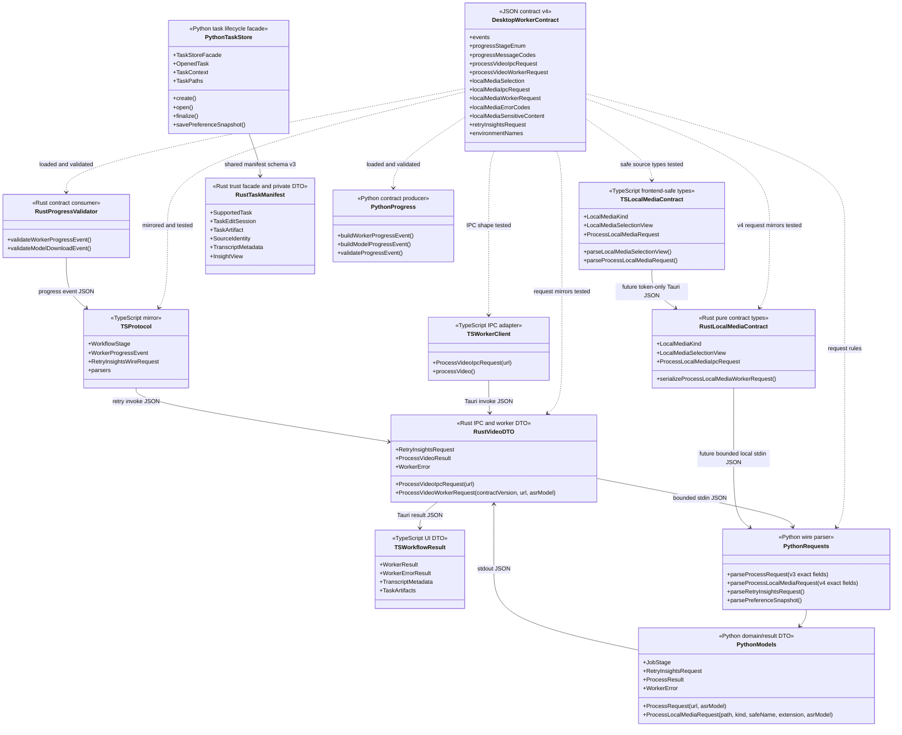
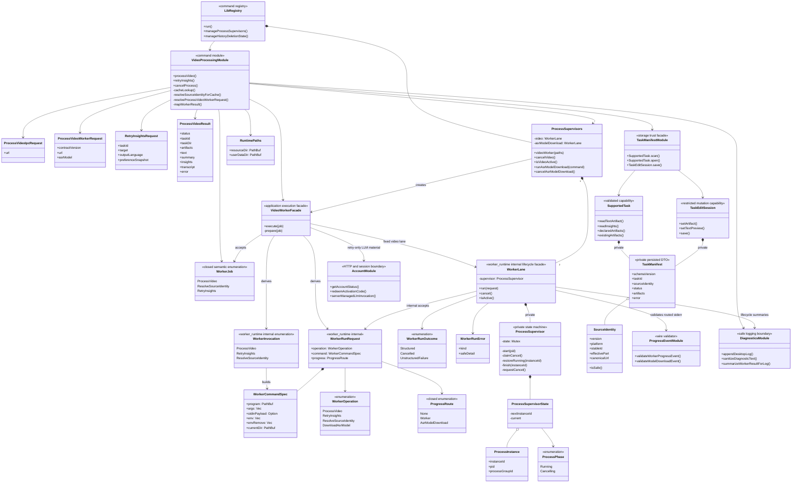
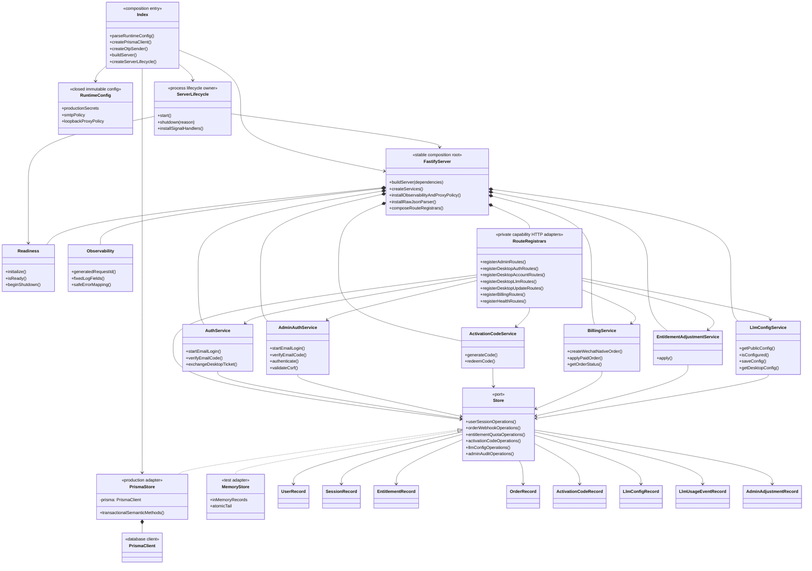
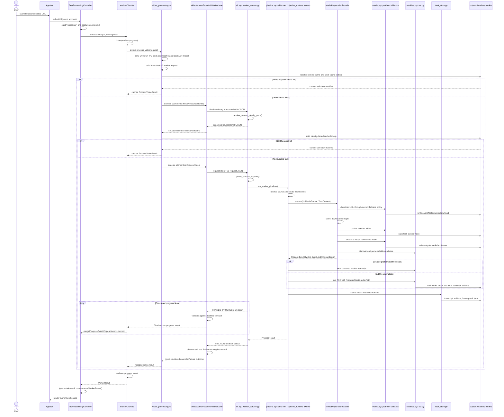
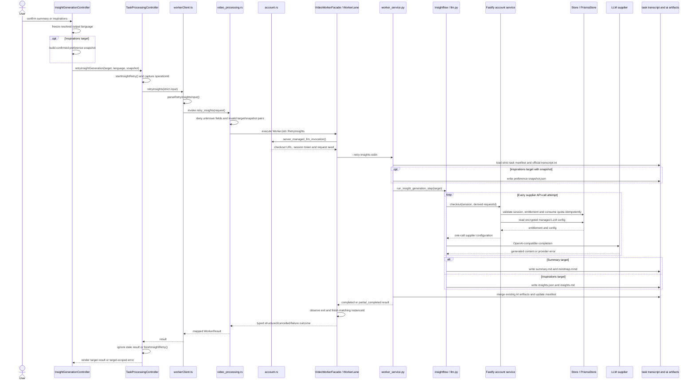
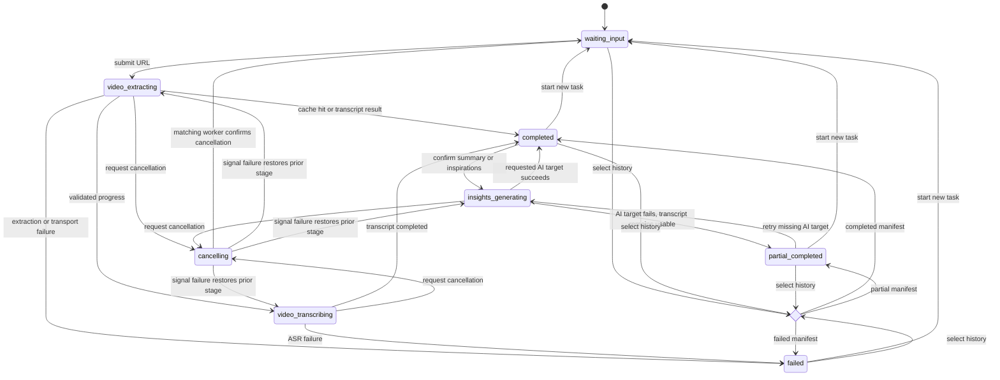

# FrameQ 代码审计 UML 基线

## 文档目的

本文档是 FrameQ 当前代码结构的持续更新审计基线，服务于两类读者：

- LLM：依据真实源码边界、依赖和调用链进行结构审计，提出可验证的重构建议。
- 人工维护者：在讨论、拆分和迁移代码时拥有同一张代码地图，并能判断建议是否改变既有所有权或安全边界。

本文档不是目标架构，也不试图把现状画得比源码更整洁。图中的职责交叉、重复 DTO、跨层协调和大模块会被保留，供后续审计使用。

### 一句话认识 FrameQ

FrameQ 是一个本地优先的桌面应用：用户在 React 界面提交视频链接，Rust/Tauri 负责可信的本机边界和子进程管理，Python worker 完成下载、媒体处理、字幕或 ASR 转写；用户确认后，worker 才会通过 FrameQ server 获取一次性的云端 LLM 调用配置，生成总结或启发内容。视频、音频、文字稿和 AI 结果默认写在用户本机。

### 一次任务的完整故事

先不看类名，一次普通任务可以理解为下面八步：

1. 用户在桌面界面输入视频链接。
2. React controller 把界面切换到“视频提取中”，并通过 Tauri client 发起 IPC 调用。
3. Rust/Tauri 校验运行目录和请求，先检查本机是否已有可安全复用的任务。
4. 没有缓存时，Rust 启动受监督的 Python worker 子进程，并通过受限 stdin 发送请求。
5. Python worker 解析来源，经媒体准备门面下载并校验视频、准备任务内 video/audio 和字幕候选；私有 orchestration/transcript owner 有可用字幕时直接写出，否则使用已准备的音频运行 ASR。
6. worker 把进度写到 stderr；Rust 校验后转换成 Tauri event；React 更新进度。最终结果则通过 stdout 返回一次 JSON。
7. worker 把正式产物和 `frameq-task.json` 写入本机任务目录；React 展示可编辑文字稿。
8. 只有用户再次确认“总结”或“启发”时，才进入独立 AI 流程并按实际供应商调用消耗额度。

理解这条主线后，再看后面的类图会容易很多：类图只是把每一步“由谁负责、依赖谁、数据放哪里”展开。

## 五分钟阅读路线

不需要从头到尾一次读完。按你的目的选择路线：

| 阅读目的 | 建议顺序 | 重点问题 |
|----------|----------|----------|
| 第一次了解 FrameQ | 第 1 图 -> 第 7 图 -> 第 9 图 | 系统分几层、一次任务怎么跑、状态怎么变化 |
| 整理 React 前端 | 第 2 图 -> 结构压力点 -> React 源码索引 | 谁拥有 workflow，`App.tsx` 为什么协调多个 controller |
| 整理 Rust/Tauri | 第 4 图 -> 第 7 图 -> 取消流程 | command、进程监督、缓存和存储安全能否合理拆分 |
| 整理 Python worker | 第 5 图 -> 第 7/8 图 -> Python 源码索引 | facade、pipeline、平台 fallback 和模型之间如何依赖 |
| 整理服务端 | 第 6 图 -> 第 8 图 | route、service、Store 和事务边界分别由谁负责 |
| 审计跨语言 DTO | 第 3 图 -> 契约漂移位置 | 同一 JSON 在 TypeScript、Rust、Python 中如何镜像 |
| 制定重构计划 | 结构压力点 -> 对应子系统图 -> 两条时序图 | 最小拆分边界是什么，会破坏哪些行为和测试 |

### 文档导航

- [1. 系统组件与包关系](#1-系统组件与包关系)
- [2. React Controller 与状态所有权](#2-react-controller-与状态所有权)
- [3. 跨语言契约镜像](#3-跨语言契约镜像)
- [4. Tauri 进程监督与存储边界](#4-tauri-进程监督与存储边界)
- [5. Python Worker 类与 Pipeline](#5-python-worker-类与-pipeline)
- [6. Server Service 与 Store](#6-server-service-与-store)
- [7. 视频处理与缓存时序](#7-视频处理与缓存时序)
- [8. 用户确认后的 AI 生成时序](#8-用户确认后的-ai-生成时序)
- [9. 桌面任务状态图](#9-桌面任务状态图)
- [结构压力点与审计问题](#结构压力点与审计问题)
- [源码索引](#源码索引)
- [LLM 审计使用方式](#llm-审计使用方式)

## 四个运行边界

“代码在同一个仓库”不代表“代码在同一个进程”。FrameQ 实际包含四个需要分别理解的运行边界：

| 边界 | 主要责任 | 明确不负责 |
|------|----------|------------|
| React WebView | 界面、交互、controller、workflow 投影、Tauri client | 不直接下载媒体，不直接读任意本机路径，不运行 ASR |
| Rust/Tauri host | IPC command、运行目录、严格文件边界、worker 监督、取消、日志、账户 session | 不实现平台下载算法，不执行 ASR/LLM prompt |
| Python worker 子进程 | 来源解析、下载、媒体处理、字幕、ASR、AI 内容生成、任务产物写入 | 不拥有桌面 UI 状态，不持久化账户 session |
| FrameQ server | 登录、激活、权益、额度、管理员 LLM 配置和每次调用 checkout | 不接收或保存用户视频、音频、文字稿和任务目录 |

重构时最重要的不是“减少文件数”，而是避免责任穿透这些边界。例如 React 不应为了方便直接实现下载，server 也不应为了生成总结而接收完整任务目录。

## 图例和术语

### 图中的线怎么读

| 表示方式 | 含义 |
|----------|------|
| `A --> B` | A 在主要流程中调用或依赖 B |
| `A -.-> B` | 事件、配置注入或按需依赖，不是普通同步调用 |
| `A *-- B` | A 组合并拥有 B 的生命周期 |
| `Interface <|.. Implementation` | Implementation 实现 Interface/Protocol |
| `alt / else` | 时序图中的条件分支，例如缓存命中或未命中 |
| `loop` | 同一动作可能发生多次，例如每次 LLM 供应商调用都先 checkout |
| `stateDiagram` 箭头 | 用户动作、进度事件或 terminal result 引起的状态迁移 |

部分 controller 之间的箭头表示 `App.tsx` 传入 callback 或状态，而不一定表示两个文件直接 import 对方。判断代码耦合时，应回到“源码索引”中的实际文件核对。

### 常用术语

| 术语 | 在本文中的意思 |
|------|----------------|
| composition root | 负责创建并连接各模块的入口。`App.tsx` 和 `server/src/server.ts` 中的 `buildServer()` 都承担这一角色 |
| controller | React hook 形式的交互控制器，拥有某一功能的 UI 状态和动作 |
| client / gateway | 把上层调用转换成 Tauri invoke、updater 或 HTTP 调用的边界模块 |
| DTO / wire contract | 跨函数、跨进程或跨语言传递的结构化数据形状 |
| facade | 为上层提供少量稳定入口、在内部协调多个模块的门面 |
| pipeline | 按阶段执行下载、校验、字幕/ASR 和结果落盘的处理流程 |
| WorkerJob / VideoWorkerFacade | Rust application module 提交的语义任务与唯一 video-lane 执行门面；门面固定派生 invocation、operation、progress、LLM policy 和 lane |
| WorkerLane | `worker_runtime` 内部受监督进程通道，统一提供 `run`、`cancel` 和 `is_active`；内部组合 `ProcessSupervisor`，application module 不再直接持有 |
| ProcessSupervisor | `worker_runtime` 内部记录受控子进程实例、阶段和取消竞争的状态机，不是 Python worker 本身，也不是 application module 的直接 API |
| lane | 一个互斥的受监督进程通道。当前 video 和 ASR model download 各有一个 lane |
| task manifest | 每个任务的 `frameq-task.json`，是 History、cache、retry 等功能的本地事实来源 |
| artifact | 任务产生的正式文件，如视频、音频、文字稿、总结和启发 JSON |
| source identity | 去除敏感参数后可持久化的稳定平台身份；不同于本次下载使用的原始 URL |
| checkout | worker 每次调用 LLM 前向 FrameQ server 申请一次供应商配置并消耗/复用额度记录 |
| strict current-task predicate | 读取任务前共同执行的 manifest、隐私标记、identity、路径和链接安全检查 |

## 基线与范围

| 项目 | 基线 |
|------|------|
| 基准提交 | `3fd01e807f5a4e61726fe3049c39b34dc74cbe64` |
| 提交日期 | 2026-07-22 |
| 提交主题 | `refactor(worker): split pipeline runtime boundaries` |
| 桌面前端 | `app/src/`，React + TypeScript |
| 桌面原生层 | `app/src-tauri/src/`，Tauri + Rust |
| 本地 worker | `worker/frameq_worker/`，Python |
| 账户服务 | `server/src/`，Fastify + TypeScript |
| 跨进程契约 | `contracts/desktop-worker-contract.json`，全局版本 v4；现行 URL process request 仍为 v3 |

该提交是本轮审计的已提交基线，已经包含 task access facade、typed worker job facade、
前端 task workspace 展示门面、Python media preparation facade、Rust task-result adapter，
以及后续 video processing、transcript detail、三平台 fallback、ASR、server routes、task
manifest 和 worker pipeline 的模块边界收口。本文区分“已经存在的生产实现”与
“2026-07-22 已登记的未来能力”；local-media v4 runtime 仍只是计划，而 worker watchdog
已在本次 post-baseline 更新中落地并按下方证据标记为当前能力。

Post-baseline update：原子持久化与 transaction recovery 已在 `61d489a` 落地，Rust-owned
worker watchdog 已完成实现与 Windows 原生验证；2026-07-23 又把唯一 runner 的 process I/O、
watchdog、progress 与 terminal 实现拆到四个私有 owner，并把测试按主题迁出 root。本文同步
这些审计状态、Rust 规模和源码位置；未特别标记的其余 UML 与依赖快照仍以 `3fd01e8` 为基线。

范围规则：

- 图只表示该提交中的生产实现，不把 active ExecPlan 当作已落地代码。
- `process_local_media` 尚未注册为 Tauri command，也不在 worker 当前请求模型中；全局
  contract v4 已锁定 local-media 的独立请求，但本基线只画已经落地的 v3 URL 处理流程。
- 独立的 `*.test.*`、`tests/` 和构建脚本不进入主要依赖图；测试入口在源码索引中按职责说明。
- Rust 测试通常以内联 `#[cfg(test)]` 模块存在，所以物理行数包含同文件内测试。
- 图中的“大文件”只是审计入口，不等同于已经证明存在设计缺陷。

## 代码规模快照

以下统计排除了独立测试文件和测试目录，但没有扣除 Rust 源文件中的内联测试。

行数只能帮助定位阅读成本，不能单独证明设计有问题。人工审计时应同时看三个信号：文件是否很大、是否混合多种责任、修改它是否会影响很多上下游模块。`adminPage.ts` 很大但相对隔离，可能比更小却处于跨语言核心链路的文件更容易维护。

| 子系统 | 生产源文件数 | 物理行数 |
|--------|-------------:|---------:|
| React / TypeScript | 76 | 13,538 |
| Tauri / Rust | 44 | 14,129 |
| Python worker | 56 | 10,096 |
| Fastify server | 31 | 6,093 |

当前较大的生产源文件：

| 文件 | 物理行数 | 当前可见职责 |
|------|---------:|--------------|
| `app/src-tauri/src/task_manifest.rs` | 26 | 唯一 crate-visible task-manifest surface：私有模块声明、四项不变量常量与稳定 re-export |
| `app/src-tauri/src/task_manifest/access.rs` | 298 | `SupportedTask` / `TaskScan` / `TaskEditSession` support gating、投影、artifact read 与受限 mutation |
| `app/src-tauri/src/task_manifest/schema.rs` | 298 | 私有 manifest/error DTO、safe projection、Insight parsing 与纯 relative-artifact policy |
| `app/src-tauri/src/task_manifest/storage.rs` | 205 | configured root、manifest I/O、task/artifact path、canonical containment 与 link/reparse effects |
| `app/src-tauri/src/task_manifest/source_identity.rs` | 174 | canonical `SourceIdentity`、platform/stable-ID/query privacy policy 与 equality key |
| `app/src-tauri/src/video_processing.rs` | 68 | Tauri command 薄委托、取消入口、子模块声明与可信 desktop task-result DTO 支持 |
| `app/src-tauri/src/video_processing/url_processing.rs` | 409 | URL process DTO/配置、两次 cache 编排、source identity 预检、job 提交、cache-hit 诊断与 9 个内联测试 |
| `app/src-tauri/src/video_processing/url_cache.rs` | 447 | model-aware URL/identity cache policy、`SupportedTask` 投影与 5 个内联测试；生产实现 123 行 |
| `app/src-tauri/src/video_processing/retry_insights.rs` | 365 | strict AI retry parser、job 编排、安全诊断与 6 个内联测试；生产实现 188 行 |
| `app/src-tauri/src/video_processing/task_result.rs` | 247 | closed process/retry context、typed outcome 映射、固定安全失败与内联边界测试 |
| `app/src-tauri/src/transcript_detail.rs` | 134 | transcript Tauri command、DTO、runtime-root composition、单次 `SupportedTask::open` 与结果组装 |
| `app/src-tauri/src/transcript_detail/audio_playback.rs` | 160 | validated audio 查找、扩展名策略、direct/cache 路由、安全临时复制与 canonical containment |
| `app/src-tauri/src/transcript_detail/segments.rs` | 99 | 固定 sidecar 路径、容错读取/过滤、严格编辑校验与 JSON 编码 |
| `app/src-tauri/src/transcript_detail/edit_storage.rs` | 191 | 官方 transcript 路径/链接校验、一次性备份、Markdown、顺序写入、preview/artifact/manifest 更新 |
| `app/src-tauri/src/worker_runtime/runner.rs` | 415 | 四类 worker 操作的唯一生命周期编排、稳定类型/re-export、instance guard 与私有 owner 组合 |
| `app/src-tauri/src/worker_runtime/runner/process_io.rs` | 108 | process-group setup、固定 spec spawn、一次性 stdin、stdout read 与 matching-child cleanup |
| `app/src-tauri/src/worker_runtime/runner/watchdog.rs` | 273 | 固定 timeout policy、deadline/activity、watchdog control/thread 与安全重试 |
| `app/src-tauri/src/worker_runtime/runner/progress.rs` | 195 | 闭集 route、stderr progress 校验/发射、fixed summary 与 validated activity refresh |
| `app/src-tauri/src/worker_runtime/runner/terminal.rs` | 71 | 安全 lifecycle detail、structured-result-first 分类与固定 exit summary |
| `worker/frameq_worker/pipeline.py` | 39 | 唯一稳定 production import surface；只做四个私有 owner 的显式 direct re-export，不拥有行为 |
| `worker/frameq_worker/pipeline_runtime/shared.py` | 68 | 路径解析、typed failure、进度发送与 `TranscriberFactory` contract |
| `worker/frameq_worker/pipeline_runtime/transcript.py` | 250 | prepared subtitle、ASR cache/factory、转写产物/错误与安全进度参数 |
| `worker/frameq_worker/pipeline_runtime/insights.py` | 152 | 官方 transcript 路径校验/读取、summary/insights target 与 partial-result policy |
| `worker/frameq_worker/pipeline_runtime/orchestration.py` | 159 | URL source、任务创建、媒体 facade、transcript 选择与唯一 process finalization |
| `server/src/store.ts` | 1,054 | 领域 records、closed Store port、MemoryStore 语义事务与测试状态 |
| `app/src/App.tsx` | 740 | composition root、controller 组装、跨 controller 回调、主要视图渲染 |
| `server/src/adminPage.ts` | 729 | 管理后台 HTML、交互脚本、样式和格式化 |
| `server/src/server.ts` | 140 | 稳定 HTTP composition root：Fastify、六个 service、显式 observability/proxy/readiness policy、raw-JSON parser 与 registrar 组合 |
| `server/src/runtimeConfig.ts` | 269 | 冻结的 fail-closed 运行配置、SMTP/可选集成验证与仅变量名错误 |
| `server/src/observability.ts` | 178 | Pino allowlist 日志、server request ID、固定错误映射与 loopback proxy trust |
| `server/src/bootstrap.ts` | 173 | readiness/listen、幂等 signal drain、Fastify close、Prisma disconnect 与 deadline |
| `server/src/routes/*.ts` | 882 | 七个 capability HTTP adapter 加私有 auth schema/shared helpers；最大单文件 `admin.ts` 为 354 行 |
| `server/src/prismaStore.ts` | 1,117 | Prisma adapter、purpose-scoped auth 与 quota/event 语义事务/有界冲突重试 |
| `worker/frameq_worker/media.py` | 598 | yt-dlp、fallback 选择、ffprobe、ffmpeg 和错误归一化 |
| `app/src/features/transcript/useTranscriptDetailController.ts` | 126 | 稳定 41-key facade、三个私有 owner 组合与 document/review save completion 接线 |
| `app/src/features/results/useArtifactDetailController.ts` | 139 | detail tab、locale-aware clipboard 与 saved-artifact locate actions |
| `app/src/features/transcript/useTranscriptDocumentController.ts` | 199 | task-scoped load/draft/segments/save、stale-result guard 与 workflow merge |
| `app/src/features/transcript/useTranscriptReviewSession.ts` | 250 | validated audio URL、browser media/segment refs、scrub/follow/edit resume 与 deletion release |

`pipeline.py` 先通过 media-preparation facade 从 868 行降为 589 行，本轮再收口为 39 行稳定
入口。四个私有 production owner 合计 629 行；增加的 import seam 不以减少总行数为目标，审计
价值是 URL orchestration、transcript/ASR 与 AI generation 已能独立评审并由 AST gate 禁止互相
吸收依赖。下载、选择、探测、任务内媒体准备和字幕发现仍只通过
`MediaPreparationFacade`，任务生命周期仍只通过 `TaskStoreFacade`。

`video_processing.rs` 先通过 task-result adapter 从 1,238 行降为 1,118 行，本轮再降为 68 行。
当前三个 workflow/failure boundary 分别由 `url_processing.rs`、`url_cache.rs` 和
`retry_insights.rs` 拥有；原有 `task_result.rs` 保持 closed outcome policy。四个 child module 共
1,468 行，但其中 851 行位于相邻的 24 个内联测试中。拆分价值是依赖和失败策略可单独审计，而
不是追求总行数减少；根模块不再是维护热点，未来 local-media 仍需随 contract v4 原子加入真实
模块和 consumer，不能预建空 facade/variant。

`task_manifest.rs` 从 1,326 行收口为 26 行稳定 root。四个私有生产 owner 合计 975 行，另有
520 行独立 `tests.rs`；生产行数略增来自显式 imports/visibility seam，测试增长来自 edit-session
characterization 和递归 source/dependency boundary。审计价值是 source privacy、pure schema、
filesystem trust 与 validated capabilities 可分别评审，而所有调用方仍只能经过
`task_manifest::*`，并非把 raw manifest/path API 暴露给更多模块。

`server.ts` 先从 710 行收口为 112 行 route composition root；生产运维加固后为 140 行，新增的
是显式 observability/proxy/readiness 组合，不重新吸收进程生命周期。私有 `routes/` 合计 882
行，分别拥有 health、admin、desktop auth/account/LLM/update、billing/webhook HTTP adapter，
以及共享 auth schema/窄 helper；最大 `admin.ts` 为 354 行。环境解析位于
`runtimeConfig.ts`，signal/listen/close/disconnect 位于 `bootstrap.ts`，数据库事务仍只在 Store
adapter。审计价值是 process lifecycle、HTTP capability、安全 policy 和一致性事务各有单一
owner，而不是把复杂度隐藏到新的 Fastify plugin 或万能 facade。

`asr.py` 从 676 行收口为 52 行稳定兼容入口。私有 `asr_runtime/` 包按失败边界拆为
`types.py` 95 行、`qwen.py` 77 行、`sensevoice.py` 316 行、`registry.py` 113 行和
`artifacts.py` 132 行，initializer 为空。拆分后的生产树合计 786 行；增加的边界连接与
结构测试换来了 provider SDK、VAD/WAV、cache 环境和 transcript 文件系统职责的独立 owner，
而不是把相同复杂度隐藏进新的 facade 类。

`transcript_detail.rs` 从 1,133 行收口为 134 行 composition root；原文件中的 791 行
command-level characterization 已移动到相邻 `tests.rs`，不再计入生产规模。三个私有 child
module 共 450 行，分别拥有 audio playback/cache、segment codec 和 official edit storage
失败边界。生产模块树合计 584 行，相比拆分前 552 行生产实现仅增加边界连接代码；维护价值来自
依赖与失败策略可独立审计，而不是压缩总行数。任务信任和 manifest mutation 仍只通过
`SupportedTask` / `TaskEditSession`，没有新增 transcript facade。

前端 `useTranscriptDetailController.ts` 从 509 行混合 hook 收口为 126 行稳定 facade。
`useArtifactDetailController.ts`、`useTranscriptDocumentController.ts` 和
`useTranscriptReviewSession.ts` 分别以 139、199、250 行拥有 artifact actions、task document
与 browser review session。Facade 保留原 41-key projection 和唯一 production consumer
surface；child 不互相 import，workflow task identity 仍只属于
`useTaskProcessingController`。模块树总行数增加来自明确边界和依赖 seam，不代表新增产品或
IPC 行为。

建议把这张表当成“从哪里开始读”的索引，而不是自动拆分清单。真正的拆分候选要结合后面 UML 中的依赖数量、状态所有权和时序约束判断。

## 1. 系统组件与包关系

Mermaid 没有原生 UML component diagram，本节用 `flowchart` 表达 component/package 关系。实线表示主要调用或数据依赖，虚线表示事件、配置注入或按需调用。

**这张图回答什么：** FrameQ 分成哪些运行部分，一次任务大致从哪里进入、在哪里处理、结果写到哪里，以及远程 server 在什么时候参与。

**怎么读：** 从左上角 `App.tsx` 开始沿实线向右阅读。大框表示进程或数据边界；同一大框内的节点通常运行在一起。虚线主要是反向进度事件、child env 注入和 updater 访问，不表示普通的业务函数调用。

```mermaid
flowchart LR
  subgraph DesktopProcess["Desktop process"]
    subgraph ReactLayer["React / TypeScript"]
      App["App.tsx<br/>composition root"]
      Controllers["Feature controllers<br/>workflow · account · history<br/>transcript · settings · updates"]
      Clients["Tauri clients<br/>workerClient · accountClient<br/>historyClient · settingsClient"]
      TSProtocol["desktopWorkerProtocol.ts<br/>workflowState.ts"]
      WorkspaceProjection["taskWorkspaceViewModel.ts<br/>workspace presentation facade"]
      Views["Feature views<br/>Task workspaces · sheets · forms"]
    end

    subgraph TauriLayer["Tauri / Rust"]
      Registry["lib.rs<br/>command registry"]
      Commands["Command modules<br/>video · account · history<br/>transcript · settings · updates"]
      WorkerRuntime["worker_runtime/<br/>command · facade · runner · supervisor"]
      Runtime["runtime.rs · diagnostics.rs<br/>progress_event.rs"]
      RustStorage["task_manifest.rs<br/>preferences · local settings"]
    end
  end

  subgraph WorkerProcess["Bundled Python worker process"]
    CLI["cli.py<br/>stdin/stdout/stderr facade"]
    WorkerService["worker_service.py<br/>application facade"]
    PipelineRoot["pipeline.py<br/>stable direct re-exports"]
    PipelineShared["pipeline_runtime/shared.py<br/>path · failure · progress policy"]
    PipelineTranscript["pipeline_runtime/transcript.py<br/>subtitle · ASR stages"]
    PipelineInsights["pipeline_runtime/insights.py<br/>official transcript · AI target"]
    PipelineOrchestration["pipeline_runtime/orchestration.py<br/>URL task orchestration"]
    MediaPreparation["media_preparation.py<br/>URL source · validation · audio · subtitle"]
    Media["media.py<br/>yt-dlp · ffprobe · ffmpeg"]
    Subtitles["subtitles.py<br/>discover · parse"]
    PlatformFallbacks["platform fallback modules<br/>HTTP · parsing · download"]
    SourceAdapters["platform_source_resolvers.py<br/>short-link adapter registry"]
    SourceResolution["source_resolution.py<br/>application resolver"]
    SourceIdentityCore["source_identity.py<br/>pure identity policy"]
    ASR["asr.py · asr_runtime/<br/>model_download.py · SenseVoice"]
    InsightFlow["llm.py + insightflow/<br/>summary · mindmap · inspirations"]
    PyStorage["task_store.py<br/>manifest and artifacts"]
    PyModels["models.py · requests.py"]
  end

  subgraph LocalData["App-local / configured local data"]
    Outputs["outputs/tasks/&lt;task_id&gt;<br/>media · transcript · ai · manifest"]
    Cache["cache/tasks/&lt;task_id&gt;<br/>downloads and temporary data"]
    Models["models/<br/>SenseVoice and VAD cache"]
    Config[".env · ui-preferences.json<br/>insight-preferences.json · updates.json"]
    Logs["logs/frameq-desktop.log"]
  end

  subgraph AccountService["FrameQ account service"]
    ServerRuntime["runtimeConfig · bootstrap<br/>readiness · observability"]
    Fastify["server.ts<br/>HTTP composition root"]
    ServerRoutes["routes/*<br/>capability HTTP adapters"]
    Services["Auth · Activation · Billing<br/>Entitlement · LLM config"]
    Store["Store port<br/>PrismaStore"]
    SQLite["SQLite / Prisma"]
  end

  subgraph External["External systems"]
    Platforms["Supported video platforms"]
    LLM["OpenAI-compatible supplier"]
    GitHub["GitHub Releases"]
  end

  App --> Controllers
  Controllers --> Clients
  Controllers --> TSProtocol
  App --> WorkspaceProjection
  WorkspaceProjection --> TSProtocol
  App --> Views
  Views --> WorkspaceProjection
  Clients -->|"Tauri invoke"| Registry
  Registry --> Commands
  Commands --> WorkerRuntime
  Commands --> Runtime
  Commands --> RustStorage
  WorkerRuntime --> Runtime
  WorkerRuntime -->|"fixed argv + bounded stdin"| CLI
  CLI --> WorkerService
  CLI --> SourceAdapters
  WorkerService --> PipelineRoot
  PipelineRoot --> PipelineShared
  PipelineRoot --> PipelineTranscript
  PipelineRoot --> PipelineInsights
  PipelineRoot --> PipelineOrchestration
  WorkerService --> PyModels
  WorkerService --> SourceResolution
  PipelineOrchestration --> SourceResolution
  SourceAdapters --> SourceResolution
  SourceAdapters --> PlatformFallbacks
  SourceResolution --> SourceIdentityCore
  PyModels --> SourceIdentityCore
  PipelineOrchestration --> MediaPreparation
  PipelineOrchestration --> PipelineTranscript
  PipelineOrchestration --> PipelineShared
  PipelineTranscript --> PipelineShared
  PipelineTranscript --> ASR
  PipelineInsights --> InsightFlow
  WorkerService --> InsightFlow
  PipelineOrchestration --> PyStorage
  MediaPreparation --> Media
  MediaPreparation --> Subtitles
  MediaPreparation -->|"TaskContext paths only"| PyStorage
  Media --> Platforms
  Media --> PlatformFallbacks
  PlatformFallbacks --> Platforms
  MediaPreparation --> Cache
  MediaPreparation --> Outputs
  ASR --> Models
  PyStorage --> Outputs
  RustStorage --> Outputs
  RustStorage --> Config
  Runtime --> Logs
  CLI -.->|"validated progress over stderr"| WorkerRuntime
  WorkerRuntime -.->|"Tauri progress event"| Clients
  Commands -->|"account and entitlement HTTP"| Fastify
  WorkerRuntime -.->|"session + checkout URL in child env"| InsightFlow
  InsightFlow -->|"per-call checkout"| Fastify
  ServerRuntime --> Fastify
  ServerRuntime --> SQLite
  Fastify --> ServerRoutes
  ServerRoutes --> Services
  Services --> Store
  Store --> SQLite
  InsightFlow -->|"supplier request after checkout"| LLM
  Clients -.->|"updater metadata/artifacts"| GitHub
```



### 用普通语言复述这张图

- React 是“用户操作和状态展示层”。它知道任务现在处于哪个阶段，但不知道如何调用 `ffmpeg` 或 ASR。
- `taskWorkspaceViewModel.ts` 是 local/AI workspace 的展示门面；组件消费取消、产物操作和 transcript
  source 等投影语义，不再解释原始 `WorkflowState`。
- Rust/Tauri 是“可信本机边界”。所有前端 IPC、运行目录、进程管理、取消和严格文件读取都先经过这里。
- Python worker 是“重处理层”。视频平台适配、媒体命令、字幕、ASR 和 AI 内容生成都发生在独立子进程中。
- `pipeline.py` 只是稳定导入入口；URL 任务编排位于 `pipeline_runtime/orchestration.py`，
  subtitle/ASR 位于 `transcript.py`，AI 位于 `insights.py`。URL 下载、媒体校验、任务内
  视频/音频准备和字幕发现仍统一经 `MediaPreparationFacade.prepare()` 返回
  `PreparedMedia`。
- `outputs/` 保存用户正式产物，`cache/` 保存可重建的中间数据，`models/` 保存本地 ASR 模型；三者用途不能互换。
- FrameQ server 只参与账户、权益、额度和 AI checkout。普通下载与转写不依赖 server-managed LLM 配置。
- LLM supplier 并不直接信任桌面保存的永久 API key；worker 先向 FrameQ server checkout，再按次调用供应商。

如果未来重构后出现“React 直接操作本地任意路径”或“server 开始接收完整文字稿以保存”，说明依赖已经跨过当前安全边界，不能只当作内部代码整理。

### 依赖方向怎么读

当前有两条主要方向：

- 交互调用：`React views -> controllers -> clients -> Tauri commands -> worker facade -> pipeline/services -> storage/config/types`
- 展示投影：`WorkflowState + AccountState -> taskWorkspaceViewModel -> local/AI workspace views`

实际代码中仍有需要审计的回流或高扇出位置：

- `App.tsx` 通过 callback/ref 协调多个 controller，是明确的 composition root，同时也承担跨 feature 调度。
- `video_processing.rs` 只保留 Tauri command 薄委托、取消和窄共享 DTO；URL 请求/config/
  preflight/job 编排在 `url_processing.rs`，cache policy 在 `url_cache.rs`，AI retry parser/job/
  diagnostics 在 `retry_insights.rs`，task outcome mapping 在 `task_result.rs`。受监督 child
  生命周期统一下沉到 `worker_runtime::WorkerLane`。
- `worker_runtime/runner.rs` 是四类 child 操作的唯一生命周期编排；私有
  `runner/process_io.rs`、`watchdog.rs`、`progress.rs`、`terminal.rs` 分别拥有底层实现，
  `command.rs` 负责固定调用与环境，`supervisor.rs` 负责私有实例状态和操作系统进程树终止。
- `worker_service.py` 保留四个 application use case；`pipeline.py` 已成为稳定 re-export root，
  URL process、transcript/ASR、AI target 和共享 policy 分别落在 `pipeline_runtime/` 私有 owner。
  `cli.py` 仍保留若干 pipeline/media helper 兼容入口，这是独立的后续兼容性问题。
- `runtimeConfig.ts` 与 `bootstrap.ts` 分别拥有 fail-closed config 和 process lifecycle；
  `server.ts` 只保留稳定 HTTP composition，`routes/*` 按 capability 拥有 HTTP adapter，并由
  boundary tests 禁止 feature-to-feature、Prisma 和 plugin import。

已完成且受门控守护的重要依赖修复：`models.py` 只依赖纯 `source_identity.py`；短链解析由
`cli.py` 组合 `platform_source_resolvers.py` 后，以 resolver callable 注入 application
service。原核心 model 间接依赖平台基础设施的问题已在 `f22861c` 解决。展示组件只消费
`TaskWorkspaceViewModel`，媒体底层原语只通过 `MediaPreparationFacade` 进入主 pipeline；这些
边界分别由前端 projection tests 和 worker AST/import-boundary tests 守护。

## 2. React Controller 与状态所有权

React 代码以 hooks 和纯函数状态模型为主。图中把 hook 视为 UML controller，把 client 视为 gateway。

**这张图回答什么：** `App.tsx` 为什么需要连接多个 hook，完整任务状态到底由谁拥有，以及 History、Transcript、Account、Settings 等功能怎样影响当前任务。

**怎么读：** 先找 `TaskProcessingController` 和 `WorkflowState`。这是任务身份和状态的中心。其他 controller 各自拥有局部 UI 状态，通过 `App.tsx` 传入的 callback 请求任务变更，而不是直接取得 workflow setter。

```mermaid
classDiagram
  class App {
    <<composition root>>
    +composeControllers()
    +wireCrossFeatureCallbacks()
    +renderWorkspacesAndSheets()
  }

  class TaskProcessingController {
    <<controller>>
    +workflow: WorkflowState
    +submitUrl()
    +retryInsightGeneration()
    +cancelCurrentProcessing()
    +restoreHistoryItem()
    +applyTranscriptSave()
  }

  class TranscriptDetailController {
    <<controller>>
    +loadTranscript()
    +saveTranscript()
    +controlAudioReview()
    +prepareTranscriptForTaskDeletion()
  }

  class InsightGenerationController {
    <<controller>>
    +openSummaryConfirmation()
    +openInsightPreferenceFlow()
    +confirmSummaryGeneration()
    +confirmInsightPreferences()
  }

  class HistoryController {
    <<controller>>
    +loadHistory()
    +selectHistoryItem()
    +deleteHistoryItem()
  }

  class AccountController {
    <<controller>>
    +refreshAccountStatus()
    +startLoginFlow()
    +handleAuthCallback()
    +signOutAccount()
  }

  class SettingsController {
    <<controller>>
    +loadSettings()
    +saveSettings()
    +loadInsightPreferences()
  }

  class AsrModelDownloadController {
    <<controller>>
    +refreshAsrModelStatus()
    +startAsrModelDownload()
    +cancelCurrentAsrModelDownload()
  }

  class AppUpdateController {
    <<controller>>
    +checkForUpdates()
    +installUpdate()
    +restartForUpdate()
  }

  class WindowChromeController {
    <<controller>>
    +handleToolbarMouseDown()
    +closeWindow()
    +minimizeWindow()
    +toggleMaximizeWindow()
  }

  class WorkflowState {
    <<state model>>
    +stage: WorkflowStage
    +activeAiTarget
    +cancellingFromStage
    +taskId
    +artifacts
    +error
  }

  class TaskWorkspaceViewModel {
    <<projection>>
    +banner
    +cancellationOwner
    +local.phase
    +local.cancellation
    +local.artifactActions
    +local.transcriptSource
    +ai.phase
    +ai.cancellation
    +ai.targets
  }

  class LocalTranscriptWorkspace {
    <<presentation>>
    +model: local projection
  }

  class AiGenerationWorkspace {
    <<presentation>>
    +model: ai projection
  }

  class AccountState {
    <<state model>>
    +authenticated
    +entitlementStatus
    +canProcess
    +canGenerateAi
    +llmQuotaRemaining
  }

  class WorkerClient {
    <<Tauri gateway>>
    +processVideo()
    +retryInsights()
    +cancelProcess()
  }

  class HistoryClient {
    <<Tauri gateway>>
    +getHistory()
    +getHistoryDetail()
    +deleteHistoryTask()
  }

  class TranscriptDetailClient {
    <<Tauri gateway>>
    +loadTranscriptDetail()
    +saveTranscriptEdit()
  }

  class AccountClient {
    <<Tauri gateway>>
    +getAccountStatus()
    +beginAuthFlow()
    +completeAuthFlow()
    +redeemActivationCode()
  }

  class SettingsClient {
    <<Tauri gateway>>
    +getLlmConfig()
    +saveLlmConfig()
    +checkFirstRun()
    +downloadAsrModel()
  }

  class InsightPreferencesClient {
    <<Tauri gateway>>
    +getInsightPreferences()
    +saveInspirationProfile()
    +saveDefaultGenerationPreferences()
  }

  class UpdateClient {
    <<Tauri and updater gateway>>
    +checkForAppUpdate()
    +installAppUpdate()
    +getUpdatePreferences()
  }

  class WindowChromeClient {
    <<Tauri gateway>>
    +startWindowDrag()
    +closeWindow()
    +minimizeWindow()
    +toggleMaximizeWindow()
  }

  class DesktopWorkerProtocol {
    <<wire validator>>
    +parseWorkerProgressEvent()
    +parseRetryInsightsInput()
  }

  App *-- TaskProcessingController
  App *-- TranscriptDetailController
  App *-- InsightGenerationController
  App *-- HistoryController
  App *-- AccountController
  App *-- SettingsController
  App *-- AsrModelDownloadController
  App *-- AppUpdateController
  App *-- WindowChromeController
  App --> TaskWorkspaceViewModel : projects
  App --> LocalTranscriptWorkspace : renders
  App --> AiGenerationWorkspace : renders

  TaskProcessingController *-- WorkflowState : owns
  TaskProcessingController --> WorkerClient
  TaskProcessingController --> HistoryClient : restores result shape
  TaskProcessingController --> AccountState : receives capability state
  TranscriptDetailController --> TranscriptDetailClient
  TranscriptDetailController --> TaskProcessingController : save callback
  InsightGenerationController --> TaskProcessingController : retry callback
  InsightGenerationController --> AccountState : gate
  InsightGenerationController --> AccountController : open and refresh callbacks
  HistoryController --> HistoryClient
  HistoryController --> TaskProcessingController : restore/delete callbacks
  HistoryController --> TranscriptDetailController : deletion guard
  AccountController --> AccountClient
  AccountController *-- AccountState : owns
  SettingsController --> SettingsClient
  SettingsController --> InsightPreferencesClient
  AsrModelDownloadController --> SettingsClient
  AsrModelDownloadController --> DesktopWorkerProtocol
  AppUpdateController --> UpdateClient
  WindowChromeController --> WindowChromeClient
  WorkerClient --> DesktopWorkerProtocol
  TaskWorkspaceViewModel --> WorkflowState
  TaskWorkspaceViewModel --> AccountState
  LocalTranscriptWorkspace --> TaskWorkspaceViewModel : reads local only
  AiGenerationWorkspace --> TaskWorkspaceViewModel : reads ai only
```



### 用普通语言复述这张图

1. `App.tsx` 创建所有 controller，并把它们的输入输出接起来，因此它是前端 composition root。
2. `useTaskProcessingController` 唯一拥有完整 `WorkflowState`。开始任务、取消、恢复 History、合并文字稿保存结果和 AI retry 都必须经过它。
3. Transcript、History 和 Insight controller 不直接替换当前任务。它们把“保存成功”“用户选中了 History”“用户确认生成 AI”等语义动作回传给 task controller。
4. Account controller 拥有登录和权益状态；task/insight controller 只消费能力判断，不应该复制账户状态机。
5. Tauri client 是 React 的边界。controller 应调用 client，而不是在 UI 组件中直接拼 command payload。
6. `createTaskWorkspaceViewModel` 不发请求也不保存状态，只把 workflow/account 投影成适合界面渲染的 local/AI workspace；取消按钮、产物定位、只读状态和 transcript source 的可见/可用语义都在这里决定。
7. `LocalTranscriptWorkspace` 与 `AiGenerationWorkspace` 只接收各自的 projection，不再同时读取
   原始 `WorkflowState`。未来音频任务可通过 `locateVideo.visible=false` 表达没有视频，组件无需理解来源类型。

图中的 `TranscriptDetailController --> TaskProcessingController` 等关系主要表示 `App.tsx` 的 callback wiring，不代表相应 controller 文件直接 import 另一个 controller。审计时要同时检查“运行期协调关系”和“静态 import 关系”。

### 前端协调关系说明

- `useTaskProcessingController` is the only owner of complete `WorkflowState` and operation IDs.
- `App.tsx` passes task mutation callbacks into transcript, history and insight controllers instead of exposing the React state setter.
- `useInsightGenerationController` owns confirmation/profile UI but receives the actual retry action from the task controller.
- `useHistoryController` owns list/detail/delete UI sequencing, while task identity replacement remains in the task controller.
- `useTranscriptDetailController` owns transcript and audio-review UI state, while a successful save is merged through the task controller.
- `createTaskWorkspaceViewModel` is the pure presentation facade over workflow and account state;
  workspace components consume its local/AI projections instead of reinterpreting raw workflow state.

这些边界是重构约束，也是审计目标：LLM 应区分“App 作为合理 composition root”与“App 承担了可下沉的业务协调”两种可能，不应仅凭行数下结论。

## 3. 跨语言契约镜像

FrameQ 的核心任务 DTO 在 TypeScript、Rust 和 Python 中分别实现。JSON contract 与测试约束了其中一部分，但不是由单一代码生成源生成。

**这张图回答什么：** 一个请求从 React 进入 Python、再把结果返回 React 时，同一份数据分别由哪些类型和解析器表示；修改字段时为什么需要同时检查三个语言层。

**怎么读：** 从 `DesktopWorkerContract` 和 `TSProtocol` 开始向下看。横向关系表示同一概念的语言本地实现，纵向关系表示 JSON 实际跨越 IPC、stdin/stdout 或磁盘 manifest 的顺序。



### 一个字段变化会经过哪里

以 `retry_insights.output_language` 为例：

1. TypeScript 在 `desktopWorkerProtocol.ts` 里限制允许值，并构造 Tauri invoke payload。
2. Rust 在 `video_processing.rs` 里再次严格反序列化，拒绝未知字段和 target/snapshot 的非法组合。
3. Rust 把合法请求序列化为 worker stdin JSON。
4. Python `requests.py` 再次解析为 `RetryInsightsRequest`，随后传入 worker service。
5. Python 返回 `ProcessResult` JSON，Rust 和 TypeScript 再映射为各自的 result 类型。

这种重复校验是跨信任边界的防御，不应简单归类为“重复代码全部删除”。真正需要审计的是：字段集合、枚举和失败语义是否可能在三处漂移，以及 contract test 是否覆盖了漂移风险。

`process_video` 在 v3 中明确分成两份不同契约：React `workerClient.ts` 只发送
`ProcessVideoIpcRequest { url }`；Rust `video_processing.rs` 从 app-local 设置解析并校验 ASR
model，再构造不可变的 `ProcessVideoWorkerRequest { contract_version, url, asr_model }`；Python
`requests.py` 严格验证版本、精确字段集和唯一支持模型后，才生成领域层
`ProcessRequest(url, asr_model)`。`language`、`output_formats` 和 `insightflow_mode` 已删除，不能
再作为兼容默认值或环境覆盖恢复。

全局 desktop-worker contract 现已升级为 v4，但上面的 `process_video` 请求仍严格保留 v3。
新增的 local-media 边界是独立闭集：TypeScript 只定义 UUID token 与安全展示元数据；Rust
定义 token-only IPC 与路径只进入 worker stdin 的序列化器；Python 定义严格六字段解析器和
隐藏路径/文件名 repr 的领域请求。当前阶段尚未注册 picker、Tauri command、`WorkerJob`
variant 或 Python CLI consumer，因此图中的 local-media stdin 连线表示已锁定的下一步契约，
不是已经可执行的产品流程。

### 可能发生契约漂移的位置

重点审计以下重复定义是否仍有足够的 contract test，或是否值得引入更集中的 schema/codegen：

- workflow stage 与 progress event。
- `ProcessVideoIpcRequest`、`ProcessVideoWorkerRequest`、Python `ProcessRequest`、
  `RetryInsightsRequest` 和 output-language 枚举。
- worker result、error、transcript metadata、insight 和 artifact keys。
- `SourceIdentity` 与 `frameq-task.json` schema v3。
- app-local 环境变量名、默认 ASR model 和模型进度字段。

引入 codegen 并非默认答案。审计必须同时评估 Rust/Python/TypeScript 构建链复杂度、严格解析需求和分发包稳定性。

## 4. Tauri 进程监督与存储边界

**这张图回答什么：** Rust/Tauri 为什么是代码量最大的区域之一，`process_video` 如何连接运行目录、缓存、worker command、进程监督、日志与 task manifest。

**怎么读：** 从 `LibRegistry` 看 command 如何注册，再沿
`VideoProcessingModule -> WorkerJob -> VideoWorkerFacade` 看 application 意图怎样被固定映射为
内部 command/run request；只有 `worker_runtime` 内部的 `WorkerLane` 接收底层请求，并组合私有
`ProcessSupervisor` 完成运行顺序。`TaskManifestModule` 一组展示的是独立的本地存储信任边界。



### Rust 层可以分成三种责任

| 责任 | 当前代表模块 | 说明 |
|------|--------------|------|
| IPC/application orchestration | `lib.rs`, `video_processing.rs`, `video_processing/url_processing.rs`, `video_processing/url_cache.rs`, `video_processing/retry_insights.rs`, `video_processing/task_result.rs` | 根模块接收 command；focused children 分别组织 URL、cache、retry 与 closed task outcome policy |
| 受监督 worker runtime | `worker_runtime/facade.rs`, `command.rs`, `runner.rs` + `runner/{process_io,watchdog,progress,terminal}.rs`, `supervisor.rs` | 分别拥有语义 job 策略、固定 command/env、唯一 child 生命周期编排、四个私有实现职责、私有取消状态与平台信号 |
| 本地信任与存储 | `runtime.rs`, `task_manifest.rs`, History/Transcript/Settings modules | 决定哪些目录和文件可读写，拒绝链接、越界路径和不受支持 manifest |

三种责任现在已有明确模块边界。`video_processing.rs` 是 68 行的 Tauri adapter；URL
orchestration、cache、retry 和 task-result policy 均在 focused child 中。它们不读取 raw stderr、
直接 spawn/wait/reap、调用 supervisor `start/finish` 或构造平台终止命令，也不组合 invocation、
operation、progress、LLM policy 或 lane。继续审计时应确认其他代码不能绕过 storage trust
boundary、`VideoWorkerFacade` 或内部 `WorkerLane`，而不是重新把低层策略/生命周期 helper 暴露为
crate-wide 公共 API。

### `ProcessSupervisor` 到底是什么

它不是一个后台任务队列，也不保存业务结果。它是 `worker_runtime::supervisor` 内部状态机，
只记录某个 lane 当前受控的 child instance、PID/process group 和 `Running/Cancelling` 阶段，
用 instance ID 防止旧 waiter 清除新进程。application module 看见的是
`WorkerJob + VideoWorkerFacade` 以及 `ProcessSupervisors` 的语义 cancel/activity/model-download
方法；video 和 model download 各自仍拥有一个内部 lane，因此可以独立监督，但同一 lane
不允许同时启动两个 child。

### Rust 所有权说明

- `ProcessSupervisors` 私有组合两个 `WorkerLane`；每个 lane 私有组合一个 `ProcessSupervisor`。
- `video_processing.rs` 是 IPC adapter 和 cancel owner；`url_processing.rs` 与
  `retry_insights.rs` 是 video lane 的两个 current application orchestrator，只能提交语义
  `WorkerJob`；`url_cache.rs` 无 worker/runtime 依赖。任何 application child 都不能选择
  invocation、operation、progress、LLM credentials 或 lane。
- `worker_runtime/facade.rs` 通过 exhaustive match 唯一派生当前三种 video job 的底层策略；只有
  retry-insights 会解析 server-managed LLM material。local-media 的 v4 请求类型已经锁定，但
  `ProcessLocalMedia` 仍必须与真实 Python CLI consumer 同批进入 facade，不能先放置 dead
  runtime variant。
- `worker_runtime/command.rs` 拥有固定调用、环境和 bounded stdin；`runner.rs` 是四类操作唯一的
  spawn/register/deliver/read/wait/finish/classify/log 编排；私有 `process_io.rs`、
  `watchdog.rs`、`progress.rs`、`terminal.rs` 各自拥有对应实现，且 application module
  不得导入 child path；`supervisor.rs` 独占实例状态与固定 Windows/macOS 进程树终止。
- `ProgressRoute` 是 `None | Worker | AsrModelDownload` 的闭集，由 typed job/model-download
  boundary 派生；application module 不能选择 route 或注入任意 parser、事件名、未验证 payload。
- `task_manifest.rs` 是 History、cache、transcript 和 delete 共用的严格存储信任边界；raw
  manifest/load/path/write 原语保持私有，调用方只能从 `SupportedTask::scan/open` 进入。
- `account.rs` 同时负责桌面 session、本地 session 文件、账户 HTTP API 和 AI checkout 环境构造。

## 5. Python Worker 类与 Pipeline

Python worker 主要由函数、dataclass 和 Protocol 组成，并不是传统的面向对象系统。下面的 `classDiagram` 把模块也画成“类”，只是为了统一表达职责和依赖，不能据此要求把所有函数改写成 class。

**这张图回答什么：** worker 进程入口、application facade、主 pipeline、媒体/ASR/AI service 和任务存储如何连接；原始下载 URL 与可持久化 source identity 如何分离。

**怎么读：** 从 `CLI -> WorkerService -> PipelineRoot` 看稳定调用入口，再沿
`PipelineOrchestration`、`PipelineTranscript` 和 `PipelineInsights` 三个私有行为 owner 展开。
MediaPreparationFacade、Transcriber、InsightFlow 和 TaskStoreFacade 仍是各自低层边界；Protocol
的虚线实现关系表示已有可替换边界。

```mermaid
classDiagram
  class CLI {
    <<process adapter>>
    +readStdinRequest()
    +main(argv)
    +renderResultJson()
    +renderProgressEvent()
  }

  class WorkerService {
    <<application facade>>
    +runWorkerOnce()
    +resolveSourceIdentityOnce()
    +retryInsightsOnce()
    +runAsrModelDownloadOnce()
  }

  class RequestsParser {
    <<strict parser>>
    +parseProcessRequest(v3 exact fields)
    +parseRetryInsightsRequest()
    +parsePreferenceSnapshot()
  }

  class PipelineRoot {
    <<stable import surface>>
    +directReexportsOnly()
  }

  class PipelineShared {
    <<shared policy module>>
    +resolveOutputDir()
    +resolveCacheDir()
    +failedResult()
    +emitProgress()
  }

  class PipelineTranscript {
    <<subtitle and ASR module>>
    +writePreparedSubtitleStage()
    +prepareAsrTranscriberStage()
    +runAsrTranscriptStage()
  }

  class PipelineInsights {
    <<official transcript and AI module>>
    +runInsightGenerationStep()
  }

  class PipelineOrchestration {
    <<URL task orchestrator module>>
    +preparePipelineContext()
    +completeTranscriptStage()
    +runWorkerPipeline()
  }

  class PipelineContext {
    +taskContext: TaskContext
    +taskStore: TaskStoreFacade
    +sourceRequest: SourceRequest
  }

  class ProcessRequest {
    +url
    +asrModel
  }

  class RetryInsightsRequest {
    +taskId
    +target
    +outputLanguage
    +preferenceSnapshot
  }

  class ProcessResult {
    +status: JobStage
    +taskId
    +taskDir
    +artifacts
    +text
    +summary
    +insights
    +transcript
    +error
  }

  class WorkerError {
    +code
    +message
    +stage
  }

  class TaskContext {
    +paths: TaskPaths
    +sourceIdentity
    +platform
    +model
    +createdAt
  }

  class TaskPaths {
    +outputRoot
    +cacheRoot
    +taskId
    +taskDir()
    +downloadDir()
    +transcriptDir()
    +aiDir()
  }

  class SourceIdentityPolicy {
    <<pure core boundary>>
    +identifySource()
    +sourceIdentityFromManifest()
    +canonicalUrlForPersistence()
  }

  class SourceResolutionModule {
    <<application boundary>>
    +resolveSourceRequest()
    +sanitizeSourceText()
  }

  class SourceRequestResolver {
    <<callable port>>
    +__call__(downloadUrl)
  }

  class SourceResolver {
    +resolveRequest()
    +identify()
  }

  class PlatformSourceResolvers {
    <<composition adapter>>
    +buildDefaultSourceResolver()
  }

  class SourceIdentity {
    +platform
    +stableId
    +effectivePart
    +canonicalUrl
  }

  class SourceRequest {
    <<transient source>>
    -downloadUrl
    +identity: SourceIdentity
  }

  class UrlMediaSource {
    <<current closed source variant>>
    +request: SourceRequest
  }

  class PreparedMedia {
    +videoPath: Path?
    +audioPath: Path
    +subtitleCandidate: SubtitleTranscript?
  }

  class MediaPreparationFacade {
    <<media preparation facade>>
    +prepare(source, taskContext) PreparedMedia
  }

  class MediaPreparationError {
    +code
    +stage
  }

  class MediaModule {
    <<media primitives>>
    +downloadVideo()
    +probeMediaFile()
    +extractAudio()
  }

  class SubtitleModule {
    <<subtitle adapter>>
    +findSubtitleTranscript()
  }

  class PlatformFallbacks {
    <<infrastructure adapters>>
    +Douyin
    +Xiaohongshu
    +Bilibili
  }

  class Transcriber {
    <<protocol>>
    +transcribe(audioPath)
  }

  class SenseVoiceTranscriber {
    +transcribe(audioPath)
  }

  class QwenAsrTranscriber {
    +transcribe(audioPath)
  }

  class InsightClient {
    <<protocol>>
    +generate(prompt)
  }

  class OpenAICompatibleInsightClient {
    +generate(prompt)
  }

  class ServerManagedInsightClient {
    +checkoutPerCall()
    +generate(prompt)
  }

  class InsightFlow {
    <<domain service>>
    +generateSummaryFromMarkdown()
    +generateInsightsFromMarkdown()
    +writeSummaryFiles()
    +writeInsightFiles()
  }

  class TaskStoreFacade {
    <<task lifecycle facade>>
    +create(request, sourceIdentity)
    +open(taskId)
    +finalize(context, result)
    +savePreferenceSnapshot(context, snapshot)
  }

  class OpenedTask {
    +context
    +transcript
  }

  CLI --> WorkerService : injects resolver
  CLI --> PlatformSourceResolvers : builds production resolver
  WorkerService --> RequestsParser
  WorkerService --> PipelineRoot
  WorkerService --> SourceRequestResolver
  WorkerService --> TaskStoreFacade
  WorkerService --> ServerManagedInsightClient
  RequestsParser --> ProcessRequest
  RequestsParser --> RetryInsightsRequest
  PipelineRoot --> PipelineShared : direct re-export
  PipelineRoot --> PipelineTranscript : direct re-export
  PipelineRoot --> PipelineInsights : direct re-export
  PipelineRoot --> PipelineOrchestration : direct re-export
  PipelineOrchestration *-- PipelineContext
  PipelineContext --> TaskContext
  PipelineContext --> TaskStoreFacade
  PipelineContext *-- SourceRequest
  PipelineOrchestration --> ProcessRequest : receives
  PipelineOrchestration --> UrlMediaSource : constructs
  PipelineOrchestration --> MediaPreparationFacade
  PipelineOrchestration --> PreparedMedia : consumes
  PipelineOrchestration --> PipelineTranscript
  PipelineOrchestration --> PipelineShared
  PipelineOrchestration --> TaskStoreFacade
  PipelineOrchestration --> SourceRequestResolver
  PipelineOrchestration --> SourceResolutionModule
  PipelineTranscript --> PipelineShared
  PipelineTranscript --> Transcriber
  PipelineInsights --> InsightFlow
  UrlMediaSource *-- SourceRequest
  MediaPreparationFacade --> UrlMediaSource
  MediaPreparationFacade --> PreparedMedia : returns
  MediaPreparationFacade --> MediaModule
  MediaPreparationFacade --> SubtitleModule
  MediaPreparationFacade --> TaskContext : task-owned paths
  MediaPreparationFacade ..> MediaPreparationError : raises
  ProcessResult *-- WorkerError
  TaskContext *-- TaskPaths
  TaskContext --> SourceIdentity
  SourceIdentityPolicy --> SourceIdentity
  SourceResolutionModule --> SourceIdentityPolicy : revalidates adapter output
  SourceResolutionModule --> SourceResolver
  SourceResolutionModule --> SourceRequest
  SourceRequestResolver <.. SourceResolver : resolveRequest bound method
  PlatformSourceResolvers --> SourceResolver : configures closed registry
  PlatformSourceResolvers --> PlatformFallbacks : wraps short-link parsers
  SourceRequest --> SourceIdentity
  MediaModule --> PlatformFallbacks
  Transcriber <|.. SenseVoiceTranscriber
  Transcriber <|.. QwenAsrTranscriber
  InsightClient <|.. OpenAICompatibleInsightClient
  InsightClient <|.. ServerManagedInsightClient
  InsightFlow --> InsightClient
  TaskStoreFacade --> OpenedTask
  TaskStoreFacade --> TaskContext
  TaskStoreFacade --> ProcessResult
```



### 用普通语言复述这张图

1. `cli.py` 负责进程协议，也是 source resolution 的生产 composition root：识别固定 mode、读取有上限的 stdin、构建默认平台 resolver，并把它注入 application service。它不应该成为所有 worker helper 的永久公共入口。
2. `worker_service.py` 提供四类用例：完整视频处理、source identity 预检、AI retry 和模型下载。
3. `pipeline.py` 只保留稳定 direct re-export。`pipeline_runtime/orchestration.py` 负责完整
   视频任务的阶段顺序并创建 `UrlMediaSource`、消费 `PreparedMedia`；`transcript.py` 负责
   subtitle/ASR，`insights.py` 负责 AI target。process owner 无 AI import，AI owner 无媒体、
   ASR、source 或 task-persistence import。
4. `MediaPreparationFacade` 是 URL 媒体准备的单一入口：协调下载、fallback、校验、任务内
   video/audio、字幕发现和稳定进度/错误语义，然后返回 `PreparedMedia`。它不执行 ASR、AI 或 task finalize。
5. `MediaModule` 提供 yt-dlp、ffprobe 和 ffmpeg 原语，并按平台与失败类型选择 fallback。三个 fallback 是平台基础设施，不是 UI feature。
6. `Transcriber` Protocol 已隔离 ASR 调用方式；当前发行路径使用 SenseVoice，但 worker 代码仍保留 Qwen adapter。
7. `TaskStoreFacade` 统一负责任务 create/open/finalize/preference snapshot 生命周期；raw manifest
   只在 `task_store.py` 内解析，下载用的临时数据则进入 `cache/tasks/<task_id>`。
8. `SourceRequest` 暂时持有本次下载 URL，`SourceIdentity` 才能进入 manifest。重构时不能为了减少类型而把这两个概念重新合并。
9. 平台 adapter 只能返回待验证 URL；`SourceResolver` 必须交回纯 identity policy 校验平台、稳定 ID 与 canonical URL，不能直接制造可持久化身份。

当前 facade 的输入闭集只有 `UrlMediaSource`。`LocalVideoSource` 与 `LocalAudioSource` 必须和
contract v4、严格 parser 及真实 CLI consumer 同批加入，不能为了“预留扩展”先放置不可达类型。

完整视频处理的 parser 先要求 wire JSON 精确等于
`contract_version + url + asr_model`，并验证版本为 3、URL 非空、model 位于当前 allowlist；随后
领域 `ProcessRequest` 只保留 `url + asr_model`。Rust 已经解析 app-local 配置，因此 Python 不再
从环境变量二次覆盖本次请求的 ASR model。

### `models.py -> source_identity.py -> fallbacks` 如何被解决

该链路是 `f22861c` 之前的真实问题：核心 result/data model 为了引用 `SourceIdentity`，会间接加载三个平台 parser。现在 `source_identity.py` 只保留纯稳定 ID、canonical URL、manifest 与持久化规则；`source_resolution.py` 承担 direct-first resolution、短链 resolver port、临时 `SourceRequest` 和错误文本清洗；只有 `platform_source_resolvers.py` 会桥接现有平台 fallback，并由 `cli.py` 在生产入口组装和注入。

这个问题已解决，但仍是需要长期守护的依赖边界。平台 adapter 的输出被视为不可信 URL，必须回到纯 identity policy 重新校验；隔离进程测试和 AST import gate 会阻止核心模块重新导入 fallback、HTTP request、压缩或子进程基础设施。

### Python 依赖说明

- `run_worker_once()` 将 strict request parsing、环境加载和主 pipeline 连接起来。
- `retry_insights_once()` 不进入下载/ASR pipeline，但直接加载 task manifest、构造 AI client、调用 `run_insight_generation_step()` 并合并既有 AI artifacts。
- `pipeline.py` 是 39 行稳定 direct-reexport root，不含定义或行为。`pipeline_runtime/shared.py`
  拥有路径/失败/进度 policy，`transcript.py` 拥有 subtitle/ASR，`insights.py` 拥有官方
  transcript 校验和 AI target，`orchestration.py` 拥有 URL task/media/transcript/finalization
  顺序。
- `media_preparation.py` 依赖 `media.py`、`subtitles.py` 和 `TaskContext` 的任务内路径，但不导入
  `TaskStoreFacade`、ASR 或 InsightFlow，也不写 manifest 或完成任务。
- `models.py -> source_identity.py` 是当前核心 import 链，终点是纯 identity policy，不再加载平台基础设施。
- `worker_service.py` 通过稳定 root 调用 pipeline-owned symbols；只有私有
  `pipeline_runtime/orchestration.py` 依赖 `SourceRequestResolver` callable，生产实现由
  `cli.py` 通过 `platform_source_resolvers.py` 注入。
- `platform_source_resolvers.py -> platform fallback modules` 是当前短链基础设施桥接链；adapter 返回 URL，`source_resolution.py` 再调用纯 identity policy 验证。
- `media.py` 仍直接依赖平台 fallback 执行下载；这与 source identity 的稳定身份政策已经分离。
- `cli.py` 为现有测试/调用方继续重导出部分媒体选择 helper，但真实 pipeline 只从
  `MediaPreparationFacade.prepare()` 进入媒体准备；兼容 surface 仍可在后续审计中缩小。
- `test_import_boundaries.py` 隔离验证 core import 不加载 `*_fallback`，并以 AST gate 限制核心/application source 模块的基础设施 import。
- `test_media_preparation.py` 以行为和 AST gate 证明 orchestration owner 不绕过 facade，
  facade 也不吸收 ASR、AI 或 task persistence 所有权；
  `test_pipeline_module_boundaries.py` 另外锁定 root identity、exact private tree 与 process/AI
  dependency isolation。
- `InsightClient` 和 `Transcriber` 已经形成 protocol seam，可作为其他模块拆分时的参考，而不是要求所有函数都类化。
- worker 中保留 `QwenAsrTranscriber` 实现，但当前桌面 `SUPPORTED_ASR_MODELS` allowlist 只开放 SenseVoice；审计时应区分“代码存在”与“发行路径可达”。

## 6. Server Service 与 Store

**这张图回答什么：** FrameQ server 如何把 HTTP route、业务规则和数据库事务分开，以及 desktop/worker 的账户与 AI checkout 请求最终落到哪里。

**怎么读：** `Index` 是进程启动点，先取得冻结的 `RuntimeConfig`，再把 Prisma、HTTP root、
`Readiness` 与 `ServerLifecycle` 组合起来。`FastifyServer` 创建 services、安装 parser/安全 policy
并同步组合私有 `RouteRegistrars`；registrar 只负责 capability HTTP adapter。所有 service 都依赖
抽象 `Store`，生产使用 `PrismaStore`，测试可使用 `MemoryStore`。



### 一次 server 请求的典型路径

`HTTP request -> generated request ID -> Zod/request parsing -> authentication/CSRF -> domain service -> Store semantic method -> Prisma transaction -> fixed response/outcome log`

这条路径中的每层目的不同：

- route 负责 HTTP 细节，例如 header、cookie、状态码和输入 schema。
- service 负责业务政策，例如激活码能授予多少天、管理员补偿是否有效。
- Store semantic method 负责必须原子完成的读取和写入，例如支付结算、激活兑换和额度审计。
- PrismaStore 负责具体数据库操作，但不应该重新决定业务政策。

`server.ts` 已从 710 行收口为 140 行稳定 HTTP composition root；七个私有 route registrar 按
capability 拥有 HTTP schema、认证和 response mapping。进程生命周期由 `bootstrap.ts` 独占，
配置与日志/proxy policy 分别由 `runtimeConfig.ts` / `observability.ts` 独占。拆分没有移动
`Store`/`PrismaStore` 事务：本应原子的读取和写入仍不会散落到多个 service/route 调用中。

### 服务端所有权说明

- `buildServer()` 从显式 dependencies 创建 service、root parser 与 HTTP policy，再同步调用私有
  registrar；它不读取环境、不拥有 signal，也不再拥有直接业务 handler 或 Zod schema。
- 七个 registrar 分别拥有 health、admin、desktop auth/account/LLM/update 和 billing HTTP adapter，
  不互相 import，也不构造 service 或引入 Fastify plugin 生命周期。
- service 通过结构化 `Store` port 访问持久层；route 不应直接协调事务。
- `PrismaStore` 拥有生产事务边界，`MemoryStore` 是测试 adapter，但二者与 records/Store type 目前放在少数大文件中。
- `store.ts` 同时定义 records、union results、Store port 和完整 MemoryStore。
- Admin 页面是独立的 server-rendered HTML/CSS/JS 模块，体积大但与核心 service 依赖较少，审计时应区分“文件大”和“耦合高”。

## 7. 视频处理与缓存时序

**这张图回答什么：** 用户点击提交后，调用如何跨过 React、Tauri 和 Python；为什么开始下载前有两次缓存判断；progress 和最终 result 为什么走不同通道。

**怎么读：** 从上到下代表时间。每一列是一个参与者。`alt` 表示只会走其中一条分支，`loop` 表示处理期间可能重复发生。先沿“无缓存”的最长路径读一遍，再回看两个 cache-hit 分支。



### 正常无缓存路径的七个阶段

1. **前端冻结本次操作身份。** Task controller 增加 operation ID，后续 progress/result 必须证明自己仍属于当前操作。
2. **Rust 解析一次执行配置并做便宜的直接缓存检查。** IPC 只含 URL；Rust 校验 app-local
   ASR model，构造同一份 v3 worker request 供 cache 和执行使用。如果输入本身已能匹配安全
   manifest，就无需启动 Python。
3. **Rust 做 source identity 预检。** 短链接或分享文本可能需要 Python 平台 parser 才能得到稳定 ID；得到 identity 后再做一次严格缓存检查。
4. **Rust 启动正式 worker。** Rust 已把 UI 意图解析成 v3
   `contract_version + url + asr_model` 请求；`VideoWorkerFacade` 固定派生执行策略，内部
   `WorkerLane` 把 payload 放在 bounded stdin，而不是
   argv/environment，避免 URL 出现在命令行和普通诊断信息里。
5. **Python 执行本地 pipeline。** `MediaPreparationFacade` 统一把下载和临时文件放入 cache，
   把正式 video/audio 准备到 task outputs，并返回可选的已解析字幕；pipeline 只选择字幕写出或 ASR，最后由 `TaskStoreFacade` 完成 manifest。
6. **进度与结果分流。** progress 是多条 stderr 前缀事件；Rust 验证后转成 Tauri event。最终 result 是 stdout 上唯一的 JSON。
7. **前端拒绝迟到结果。** 即使旧 worker 较晚返回，只要 operation ID 已变化，task controller 就不会覆盖新任务。

### 为什么缓存要检查两次

- 第一次检查避免为已经规范化、可直接识别的输入启动子进程。
- 第二次检查覆盖短链接、分享文本或同一视频的不同 URL 表达；它使用 worker 解析出的稳定 `SourceIdentity`。
- 两次检查最终都必须通过同一个严格 current-task/manifest 安全条件，不能把“找到同名目录”等同于可复用缓存。

### 为什么 progress 不放在最终 JSON 里

一个任务在结束前需要多次更新 UI，而 stdout 必须保留为可一次解析的 terminal result。worker 因此把有固定前缀的结构化 progress 写到 stderr；Rust 只转发通过 contract 校验的事件，并把其他 stderr 作为经过脱敏的诊断材料。这种分流也是日志和 UI 安全边界的一部分。

### 取消流程怎么理解

取消不单独启动另一个 worker：

1. React 将状态切换为 `cancelling`，保留原 task UI 和 `cancellingFromStage`。
2. `cancel_process` 调用 `ProcessSupervisors::cancel_video()`；其私有 video lane 内部的
   `ProcessSupervisor` claim
   cancellation。
3. Windows 终止受控 PID tree；macOS 对受控 process group 发送 TERM，并可有界升级到 KILL。
4. waiter 仍负责最终结果。只有匹配实例且没有结构化 terminal result 时，才映射为 `WORKER_CANCELLED`。
5. signal 失败会恢复原 processing stage，而不是伪造取消完成。

## 8. 用户确认后的 AI 生成时序

**这张图回答什么：** 为什么转写完成后不会自动调用 LLM，用户确认一次 summary/insights 后，语言、偏好、账户 session、额度和供应商调用怎样连接。

**怎么读：** 前半段是桌面确认和 strict request，后半段是 worker 的每次 LLM 调用。注意 `loop Every supplier API-call attempt`：一次“启发生成”可能包含 topic planning 和多个问题生成调用，因此 checkout/额度不是每个按钮固定只发生一次。



### AI 流程与本地转写流程的区别

| 本地转写 | 用户确认后的 AI 生成 |
|----------|----------------------|
| 可在没有 LLM 配置和 AI 额度时运行 | 需要有效账户权益、server-managed LLM 配置和剩余额度 |
| 输入是视频 URL，可能下载媒体并运行 ASR | 输入是同一任务已经保存的官方 `transcript/transcript.txt` |
| 主要产物是 video/audio/transcript | 只写 summary/mindmap 或 insights artifacts |
| progress 主要来自下载、媒体和 ASR | progress/失败属于当前 AI target，不应遮住可用文字稿 |

### 为什么 checkout 位于循环内部

FrameQ 的额度按实际供应商 API-call attempt 计算，而不是按用户点击次数粗略计算。`ServerManagedInsightClient` 为每次调用派生 request ID，向 server checkout；server 在事务边界内校验 session、权益和额度，并利用 request ID 保证重放时的幂等语义。把 checkout 移到整个按钮操作之外，会改变额度和失败恢复行为。

### Summary 与 Inspirations 为什么分开

- `summary` 只生成 `summary.md` 和隐藏的 `mindmap.mmd`，不接受 preference snapshot。
- `insights` 生成 `insights.json`/`insights.md`，可以使用本次确认的个性化偏好快照。
- retry 会合并同一任务已有的另一类 AI artifact，生成 summary 不能清空 insights，反之亦然。
- 任一 AI target 失败时，已有本地文字稿仍可用，因此通常映射为 `partial_completed`，不是把整个任务视为失败。

该流程中没有视频重新下载或 ASR 重跑。任何拆分建议都必须保持 official `transcript/transcript.txt` 输入、每次供应商调用的 checkout/quota 语义，以及 summary 与 inspirations 的 artifact 隔离。

## 9. 桌面任务状态图

**这张图回答什么：** 桌面当前允许哪些用户可见阶段，普通处理、AI retry、取消、失败和 History restore 如何迁移，以及为什么工具栏按钮需要依赖统一状态判断。

**怎么读：** 椭圆式起点进入 `waiting_input`。实线箭头标签是触发原因。`history_restore` 是画图用的选择节点，不是实际保存的 stage。



### 状态所有权的三个关键点

1. **Progress 只能推进当前操作。** Rust/Tauri 转发的事件先经过 protocol 校验，React 再通过 operation ID 防止旧任务更新当前 state。
2. **`cancelling` 是桌面过渡态。** 它记住 `cancellingFromStage`，等待真实 worker terminal result；worker progress contract 本身不允许发送 `cancelling`。
3. **AI 失败不抹掉本地成功。** 只要文字稿已经存在，AI target 失败会保留本地 workspace，并允许之后只重试缺失 target。

### 这张图没有表达的内容

- 它没有表示 modal、sheet、选中的详情 tab 等局部 UI 状态，那些属于各 feature controller。
- 它没有表示多任务队列，因为当前产品仍是单任务模型。
- 它没有表示后台恢复或应用重启后继续运行，因为当前 worker 生命周期依附桌面进程。
- 它没有把 History 当成第二个 workflow owner；History 选择最终仍由 task controller 安装一个完整 terminal state。

`history_restore` 是图中的选择节点，不是持久化 workflow stage。状态模型中的 `cancelling` 只属于桌面 UI/ProcessSupervisor 过渡，不允许作为 worker progress wire stage。

## 结构压力点与审计问题

下表是基于依赖和职责的审计入口，不是已经批准的重构方案。

### 已解决审计项

| 原审计项 | 当前状态 | 证据与长期门控 |
|----------|----------|----------------|
| `models.py -> source_identity.py -> fallbacks` | 已在 `f22861c` 完成依赖倒置；core identity、application resolution 与 platform adapters 已分层 | `worker/tests/test_import_boundaries.py`、`worker/tests/test_source_resolution.py`；完整设计见 `docs/design-docs/2026-07-18-source-identity-dependency-boundary.md` |
| `worker_command.rs` 混合 supervisor、OS process、stdin/progress/output 与调用策略 | 已在 `9833bd6` 删除旧模块；`worker_runtime/command.rs`、`runner.rs`、`supervisor.rs` 分层，四类操作统一经过 `WorkerLane::run`，低层状态和终止函数保持私有 | `worker_runtime` 内联 Rust tests、`scripts/tests/unix-process-supervisor-workflow.test.mjs`；完整设计见 `docs/design-docs/2026-07-18-rust-worker-runtime-lifecycle.md` |
| `worker_runtime/runner.rs` 物理混合 process I/O、watchdog、progress、terminal 与 1,156 行内联测试 | **已解决**：415 行 root 仍是唯一 `WorkerLane` 生命周期编排；108/273/195/71 行的四个私有 owner 分别拥有 process I/O、watchdog、progress、terminal，测试拆到 273 行聚合器与最大 390 行的 focused children；现有类型路径、生命周期顺序、matching-instance cleanup、structured-result-first、supervisor-only signalling 与安全日志不变 | RED/GREEN exact-tree/visibility/dependency 门禁；runner 28/28、Rust 210/210、App 583/583、scripts 25/25、lint/build/rustfmt/governance/scope/Tauri `--no-bundle` 通过；设计 `docs/design-docs/2026-07-23-rust-worker-runner-module-split.md`，completed ExecPlan `docs/exec-plans/completed/2026-07-23-rust-worker-runner-module-split-plan.md`。macOS hosted workflow 未为本批提交运行 |
| Rust `WorkerLane::run` 对已注册 child 使用无界 `child.wait()` | **已解决**：`worker_runtime` 为四类当前操作派生固定 idle/absolute policy；instance-bound watchdog 可在 stdin 或 wait 阻塞时终止完整进程树，termination lease 阻止 PID/PGID 复用竞态，结构化结果与显式取消优先级保持不变 | Rust 208/208（其中 worker runtime 56/56）、App 567/567、worker 563 passed / 2 skipped、scripts 25/25、Chromium smoke 28/28、Tauri `--no-bundle`；Windows parent/descendant timeout fixture 通过；设计 `docs/design-docs/2026-07-22-rust-worker-watchdog.md`；completed ExecPlan `docs/exec-plans/completed/2026-07-22-worker-watchdog-plan.md`。macOS runtime evidence 尚待 hosted workflow 实际运行 |
| Process-video 请求中存在无消费者字段和多重 ASR model owner | 已在 `cfd1233` 升级为 contract v3；TS IPC 只传 `url`，Rust 解析配置并构造 `contract_version + url + asr_model`，Python 严格消费 | `app/src/desktopWorkerContract.test.ts`、`workerClient.test.ts`、Rust `video_processing` tests、`worker/tests/test_contract.py`/`test_requests.py`；完整设计见 `docs/design-docs/2026-07-18-process-video-request-contract-v3.md` |
| Local-media 新来源可能把路径泄露到 React、argv、日志或松散可选字段 | Contract v4 的纯类型边界已锁定：TS 只有 token/安全元数据，Rust/Python 路径请求严格闭集且固定非回显；原 URL worker request 仍为 v3。picker、command、CLI、pipeline 与 manifest 尚未实现 | `localMediaContract.test.ts`、`local_media_contract_tests.rs`、`worker/tests/test_requests.py`、三端 canonical contract tests，以及 recursive packaged-worker mirror equality test；执行记录见 active local-media ExecPlan |
| History/cache/transcript/delete 分别重组 manifest privacy 与 artifact path 安全流程，Python pipeline/retry 分别协调任务落盘 | 已在 `eecd0fb` 收口为 Rust `SupportedTask::scan/open` + `TaskEditSession` 和 Python `TaskStoreFacade`；raw Rust manifest/path/write 原语保持模块私有 | Rust facade tests 与既有 History/cache/transcript/delete characterization tests；`worker/tests/test_task_store.py` 与 worker 全量测试；设计见 `docs/design-docs/2026-07-18-task-access-facade.md` |
| Rust application callers 分别组合 `WorkerInvocation`、`WorkerOperation`、`ProgressRoute`、LLM policy 与 `WorkerLane` | 已在 `e69fed4` 收口为 `WorkerJob + VideoWorkerFacade`；两个 lane 私有，model download 使用独立语义方法；local-media v4 类型已锁定，但 runtime variant 仍与真实 CLI consumer 原子加入 | `worker_runtime::facade::typed_job_policy_tests` 证明三种当前 job 的固定 CLI/operation/progress/LLM policy；Rust facade/runner tests；设计见 `docs/design-docs/2026-07-19-typed-worker-job-facade.md` |
| Local/AI workspace 同时读取展示 ViewModel 与原始 `WorkflowState`，重复解释取消、只读与产物操作语义 | 已在 `e68bc4a` 把 cancellation、artifact actions、transcript source 和 target status 全部投影到 `TaskWorkspaceViewModel`；两个 workspace 只消费各自 projection | `taskWorkspaceViewModel.test.ts`、`TaskWorkspaces.test.tsx` 与 i18n rendering tests；音频任务可用 `locateVideo.visible=false` 表达无视频，不需要组件识别 source type |
| `pipeline.py` 直接协调下载、选择、ffprobe、任务内复制、FFmpeg、音频复用与字幕发现 | 已在 `be31b7f` 收口到 `MediaPreparationFacade.prepare(UrlMediaSource, TaskContext)`；pipeline 只消费 `PreparedMedia`，facade 不拥有 ASR、AI 或 task persistence | `worker/tests/test_media_preparation.py` 的行为/AST boundary tests 与 worker 全量测试；设计见 `docs/design-docs/2026-07-19-media-preparation-facade.md` |
| `pipeline.py` 在 facade 下沉后仍物理混合 shared policy、subtitle/ASR、官方 transcript AI 与 URL task orchestration | 已按职责收口为 39 行唯一稳定 direct-reexport root、空 initializer 和 `shared/transcript/insights/orchestration` 四个私有 owner；process owner 无 AI 依赖，AI owner 无 ASR/media/source/task-persistence 依赖，现有 caller/identity/行为保持不变 | characterization 56/56、ownership 11/11、worker 531/531、app 549/549、正常 Windows 权限 Rust 175/175、scripts 23/23、Ruff/lint/build/rustfmt/Tauri no-bundle、递归 61/61 mirror equality；设计见 `docs/design-docs/2026-07-21-worker-pipeline-module-split.md` |
| Rust runner 只凭 stdout JSON 含 `status` 判断结构化结果，TypeScript IPC gateway 只依赖静态类型 | 已在 `result_protocol.rs` 与 `workerResultProtocol.ts` 按操作收口；Rust 要求单行 UTF-8 JSON 并解析为 closed DTO，TypeScript 对 Tauri `unknown` 值再次做闭集校验，未知/缺失字段、错误类型、错误 family 与不一致状态均固定失败且不回显 payload | canonical `terminalResults` contract 与 Python/Rust/TypeScript negative tests；全量 worker 411、Rust 157、app 540、scripts 23；设计见 `docs/design-docs/2026-07-19-closed-worker-terminal-results.md` |
| `App.tsx` 协调多个 controller，但缺少 App 级真实渲染生命周期证据 | 审计原描述已校正：既有 `app-input.browser.test.ts` 本就通过生产 `main.tsx` 在 Chromium 中挂载 `<App />`，覆盖任务、History、文字稿、AI、设置与账户退出；本轮补齐启动账户深链和恢复任务产物定位两条组合根接线 | 深链测试先 RED 后 GREEN，断言唯一 `complete_auth_flow`；产物测试断言唯一 opener 路径与本地化结果；browser 27/27、app 542/542、scripts 23/23、lint/build/docs/diff 通过；设计见 `docs/design-docs/2026-07-19-app-composition-integration-coverage.md` |
| `useTranscriptDetailController.ts` 混合 result-detail actions、task document persistence 与 browser audio/edit session | 已收口为 126 行稳定 facade；139 行 artifact owner、199 行 document owner 与 250 行 review owner 按失败/状态边界分离，保留 41-key surface、stale task guard，并修复 pending resume 跨任务泄漏 | Characterization 18/18 后抽取，最终 facade 19/19、ownership 1/1、Chromium selected 4/4、App 583/583、scripts 25/25、lint/build/docs/diff 通过；source-boundary 强制 consumer、依赖、`ReturnType` 和 200/250 行限制；设计见 `docs/design-docs/2026-07-23-frontend-transcript-controller-split.md` |
| `video_processing.rs` 允许调用方传入任意 status/stage/message 来映射 task worker outcome，并与 cache/preflight/command 编排混在同一文件 | 已在 `1fa2f37` 收口到私有 `video_processing/task_result.rs`；调用方只能选择 `ProcessVideo` 或 `RetryInsights` closed context，structured task 透传，错误 family、protocol 和 runtime failure 使用固定安全结果；cache/preflight/诊断仍由父模块拥有 | 4 个 adapter tests 与全部 20 个 `video_processing` tests、完整 Rust 159、app 542、scripts 23、dependency boundary、rustfmt、lint/build/docs/diff 全部通过；设计见 `docs/design-docs/2026-07-19-video-processing-task-result-boundary.md` |
| `video_processing.rs` 在 task-result 下沉后仍同时拥有 strict AI retry、model-aware URL cache、source preflight、ASR request preparation、cache-hit diagnostics 与 Tauri orchestration | 已按 workflow/failure boundary 收口：68 行 root 保留薄 Tauri delegates/cancel；`retry_insights.rs`、`url_cache.rs`、`url_processing.rs` 分别拥有 retry、cache 与 URL orchestration；没有新增 facade 或 local-media placeholder | 新增 preflight matrix 4 项；retry 6、cache 5、URL 9、task-result 4，共 24 个 focused tests；完整 Rust 163、app 542、scripts 23、dependency scans、rustfmt/lint/build/docs/diff 通过；设计见 `docs/design-docs/2026-07-20-video-processing-module-split.md` |
| `transcript_detail.rs` 同时拥有 command/DTO、格式与链接校验、audio cache、segment IO、备份和 Markdown formatting | 已按失败边界收口：134 行 root 只保留 Tauri/runtime composition 与 DTO；`audio_playback.rs`、`segments.rs`、`edit_storage.rs` 分别拥有 cache、codec 与官方编辑存储；没有新增 facade，task trust 仍由 `SupportedTask` / `TaskEditSession` 独占 | 新增 3 组隐式行为矩阵和 1 个 RED/GREEN source-boundary gate；focused 14/14、完整 Rust 173/173、app 549/549、scripts 23/23、rustfmt/lint/build/Tauri no-bundle 通过；设计见 `docs/design-docs/2026-07-20-transcript-detail-module-split.md` |
| `bilibili_fallback.py` 同时拥有 source、public API/DASH、HTTP/safe streaming、artifact/FFmpeg 与 progress | 已按失败边界收口为 137 行稳定 root adapter，以及 `types/source/playback/transport/artifacts` 私有包；根入口、五个进度 code、候选/产物语义和类型身份保持兼容，没有新增 facade 类或三平台通用框架 | focused 183/183、worker 450/450、app 549/549、Rust 169/169、scripts 23/23、Ruff/rustfmt/lint/build/Tauri no-bundle 及 6/6 mirror hash 通过；设计见 `docs/design-docs/2026-07-20-bilibili-fallback-module-split.md` |
| `xiaohongshu_fallback.py` 同时拥有 source、进程内 CookieJar/HTTP、页面解压/初始状态、stream policy、安全下载与 progress | 已按失败边界收口为 169 行稳定 root adapter，以及 `types/source/page/streams/transport` 私有包；根入口、三项进度、同一 CookieJar、候选/备选次序、原子替换和共享身份保持兼容，没有新增 facade 类或三平台通用框架 | focused 222/222、worker 477/477、app 549/549、Rust 169/169、scripts 23/23、Ruff/rustfmt/lint/build/Tauri no-bundle 及递归 44/44 mirror equality 通过；设计见 `docs/design-docs/2026-07-20-xiaohongshu-fallback-module-split.md` |
| `douyin_fallback.py` 同时拥有 source、进程内 CookieJar/HTTP、Router Data、bit-rate/ratio probe、候选下载与 progress | 已按失败边界收口为 132 行稳定 root adapter，以及空 initializer 和 `types/source/page/streams/transport` 私有包；根入口、四项进度、同一匿名 client、Router Data、probe/排序/去重、Range 移除、固定失败和原子替换保持兼容，没有新增 facade 类或三平台通用框架 | focused 205/205、worker 501/501、app 549/549、正常 Windows 权限 Rust 169/169、scripts 23/23、Ruff/rustfmt/lint/build/Tauri no-bundle 及递归 50/50 mirror equality 通过；设计见 `docs/design-docs/2026-07-20-douyin-fallback-module-split.md` |
| `asr.py` 同时拥有模型 registry、两种 provider、SenseVoice VAD/WAV 与 transcript 文件写出 | 已按失败边界收口为 52 行稳定兼容入口和空 initializer；`types/qwen/sensevoice/registry/artifacts` 五个私有 owner 分离共享 contract、SDK、fallback、cache 环境与文件系统职责，生产调用方仍只导入 root | 行为新增 5 项、边界 9/9、focused 32/32、worker 515/515、app 549/549、正常 Windows 权限 Rust 173/173、scripts 23/23、Ruff/rustfmt/lint/build/Tauri no-bundle 及递归 56/56 mirror equality 通过；设计见 `docs/design-docs/2026-07-20-asr-module-split.md` |
| `server.ts` 同时创建 Fastify/services、定义 schema、拥有全部 20 个 route 和安全/HTTP mapping | 先按 capability 收口为 112 行稳定 composition root；当前 140 行 root 只组合显式 HTTP policy/services/parser 与 health + 六类业务 registrar，环境与 process lifecycle 进一步由 `runtimeConfig.ts` / `bootstrap.ts` 独占，没有引入 Fastify plugin 层级或万能 facade | 原 route/security characterization 与边界门禁继续通过；生产运维 focused/full Server gates见 active production-operations ExecPlan；route 拆分设计见 `docs/design-docs/2026-07-21-server-route-module-split.md` |
| `task_manifest.rs` 同时拥有 canonical source policy、raw schema、安全投影、storage/path effects、validated access 与内联测试 | 已按职责收口为 26 行唯一稳定 root 与私有 `source_identity/schema/storage/access/tests`；raw DTO/path/write primitives 不经 root re-export，所有既有调用者路径和 URL-only support predicate 保持不变，没有新增 facade 或 local-media source union | edit-session characterization 先 GREEN，ownership gate 从 missing-owner RED 转为完整私有树 GREEN；focused 15/15、正常 Windows 权限 Rust 175/175、app 549/549、scripts 23/23、rustfmt/lint/build/Tauri no-bundle/governance/scope/diff 通过；设计见 `docs/design-docs/2026-07-21-task-manifest-module-split.md` |
| Python transcript/AI 与 Rust manifest/transcript edit 仍有 direct 或多文件顺序写入 | **已在 `61d489a` 解决**：FrameQ 权威 transcript/AI/preference/manifest/Rust edit writers 均进入受审原子 owner；existing-task 通过 closed prepared/committed journal 恢复到旧或新完整 revision | Phase 2 设计见 `docs/design-docs/2026-07-19-worker-atomic-artifact-commit.md`；completed ExecPlan `docs/exec-plans/completed/2026-07-22-atomic-persistence-hardening-plan.md`；Worker 563/2 skipped、App 551、Windows Rust 185、scripts 25、63-file mirror 与 Tauri no-bundle 通过。macOS/Unix/真实 Tauri 仍为未验证残余风险 |

### 如何使用这张表

一次只选择一行进行源码审计，不要同时重构所有大文件。推荐按风险由低到高推进：

1. **命名和无调用入口。** 例如 `greet`、已经失真的 `LlmConfig` 命名。容易验证，也最适合先改善人工可读性。
2. **契约冗余。** 例如 CLI 兼容重导出，或未来新增但没有明确 consumer 的 wire 字段。先查调用方和 contract test，再决定保留、恢复语义或版本化删除。
3. **模块职责拆分。** 例如 `cli.py` compatibility exports 或 remaining Python parser/helper。需要 focused tests，但通常不改变进程模型。
4. **核心所有权和安全边界。** 例如 workflow owner、`WorkerLane`/private supervisor、task manifest/path validation。必须先写设计与迁移计划，不能用“文件太长”作为唯一理由。

每次审计输出应该能回答：“现在的事实是什么、最小可改善边界是什么、哪些行为绝不能变化、用什么测试证明没有变化”。

| 位置 | 可验证事实 | LLM 应回答的问题 |
|------|------------|------------------|
| `app/src/App.tsx` | 组装 9 个主要 controller，并通过 refs/callbacks 协调 reset、history、transcript、account 和 AI | 哪些协调属于 composition root；哪些可以成为明确的 application use case，而不产生第二个 workflow owner？ |
| `useTranscriptDetailController.ts` | 历史 509 行混合 hook 已收口为 126 行稳定 facade；artifact/document/review 三个私有 owner 分别为 139/199/250 行 | 后续修改应进入对应 owner，并保持唯一 consumer surface、41-key projection、task identity、child dependency 和 source-boundary 门禁；不要把 feature state 移回 `App.tsx` |
| `useTaskProcessingController.ts` | 同时处理 submit、progress、cancel、history restore、transcript merge 和 AI retry，并维护 operation ID | 是否需要拆 action/use-case，但仍保留唯一 task identity owner？ |
| `app/src-tauri/src/lib.rs` 中的 `greet` | scaffold command 仍在 `generate_handler!` 注册，但 `app/src/` 没有调用点 | 是否可通过 focused command-registry test 后删除，避免无业务含义的公开 IPC surface？ |
| `transcript_detail.rs` | 历史 1,133 行热点已收口为 134 行稳定 composition root；私有模块分别拥有 audio playback/cache、segment codec 与 official edit storage，完整证据见上方“已解决审计项” | 后续修改应进入对应私有 owner，并保持 root-only Tauri/runtime composition、`SupportedTask` / `TaskEditSession` 信任边界和 source-boundary 门禁；不要继续机械增加 facade |
| `worker/frameq_worker/pipeline.py` | 历史 589 行热点已收口为 39 行稳定 direct-reexport root；四个私有 owner 分离 shared policy、transcript/ASR、AI target 与 URL orchestration，完整证据见上方“已解决审计项” | 后续修改应进入对应私有 owner，并保持 root-only production imports、exact object identity、process/AI isolation、facade 与 AST 门禁；不要继续机械增加 facade 或重建 generic stage framework |
| `worker/frameq_worker/worker_service.py` | 仍是四类 worker use case 的 application facade，负责 strict request/runtime config、retry task open/snapshot/finalize 与 model download composition；pipeline 私有 owner 拆分不改变该职责 | 四类用例是否仍保持清晰失败边界；若未来拆分，如何保留一个 task-persistence owner、稳定 stdin/result contract 与 root-only pipeline imports？ |
| `app/src-tauri/src/worker_runtime/runner.rs` | 历史 2,162 行热点已收口为 415 行唯一生命周期编排；四个私有 owner 为 108/273/195/71 行，测试聚合器和 focused children 均不超过 390 行；完整证据见上方“已解决审计项” | 后续修改应进入对应 owner，并保持 root-only 生命周期顺序、现有类型路径、matching-instance cleanup、structured-result-first precedence、supervisor-only signalling、validated-progress-only activity 与安全日志；不得新增第二个 executor 或从 application 绕过 root |
| `worker/frameq_worker/cli.py` | 同时承担进程 adapter、source resolver composition root；`__all__` 还重导出 pipeline、request、ASR 和 helper symbols | 哪些调用方依赖兼容导出；如何保留必要 composition 职责并缩小其他公共 surface？ |
| `worker/frameq_worker/xiaohongshu_fallback.py` | 历史 894 行热点已收口为 169 行稳定 adapter；私有包分别拥有 source/page/streams/transport，完整实现证据见上方“已解决审计项” | 后续平台变化应修改对应私有 owner，并保持 root-only production entry、CookieJar/隐私和 AST 门禁；不要继续机械增加 facade |
| `worker/frameq_worker/douyin_fallback.py` | 历史 515 行热点已收口为 132 行稳定 adapter；私有包分别拥有 types/source/page/streams/transport，完整实现证据见上方“已解决审计项” | 后续平台变化应修改对应私有 owner，并保持 root-only production entry、同一进程内匿名 CookieJar、Router Data/probe/原子产物语义和 AST 门禁；不要继续机械增加 facade 或抽取三平台通用框架 |
| `worker/frameq_worker/asr.py` | 历史 676 行热点已收口为 52 行稳定兼容入口；私有包分别拥有 types、Qwen、SenseVoice/VAD、registry/cache 和 artifacts，完整证据见上方“已解决审计项” | 后续修改应进入对应私有 owner，并保持 root-only production import、provider lazy loading、VAD fallback、source-validation-before-write 和 AST 门禁；不要继续机械增加 facade |
| `server.ts` / `runtimeConfig.ts` / `bootstrap.ts` | 历史 710 行热点已收口为 140 行稳定 HTTP composition root；配置、observability/proxy/readiness 与 signal lifecycle 各有窄 owner，七个私有 registrar 拥有 capability adapter | 后续 route 变化应进入对应 registrar；process/config 变化进入既有 owner。保持 root-only Fastify/service/parser composition、admin cookie/CSRF、billing raw-body 和 Store/Prisma transaction 门禁；不要机械增加 facade 或 plugin 层级 |
| `auth.ts` / `adminAuth.ts` / `prismaStore.ts` | **认证/额度并发窗口已解决**：service 只调用 purpose-specific semantic Store operations；OTP attempt/consume/artifact、ticket/session 和 quota/event 分别在一个事务内提交，dispatch limit 持久化，冲突仅做有界本地重试 | 生产配置、可信代理、日志、health、shutdown、preflight/restore 和 Server CI 定义也已本地实现；仍需 hosted Linux signal/CI、获批 SMTP/staging/异地 restore 与 combined release evidence，不得把未运行证据写成通过 |
| `store.ts` / `prismaStore.ts` | broad Store port；MemoryStore 与 records 同文件；PrismaStore 镜像所有方法；认证/额度已通过 purpose-specific semantic operations 形成 consistency facade，route/service 不可获得 transaction callback 或组合退役低层调用 | 后续仅在有独立演进价值且不跨实体提交时拆 port；必须保留语义 transaction facade、Memory/Prisma parity 和独立客户端并发门禁 |
| Settings `LlmConfig` 命名 | TS/Rust 的 `LlmConfig`、`get_llm_config`、`save_llm_config` 当前只承载 output directory 与 ASR model，本地 LLM credentials 已被移除 | 是否应做兼容 command 迁移并改名为 desktop/runtime settings，以降低错误心智模型？ |
| 跨语言 DTO | TS/Rust/Python 仍手写镜像；全局 contract v4 已约束 process-video v3、local-media v4、progress/AI request 的核心字段，但 result、manifest 与部分 view DTO 仍由语言本地测试对齐 | 哪些 schema 值得 codegen；哪些应保持语言本地并通过 fixture/contract test 对齐？ |

## 源码索引

UML 节点经过了降噪，不会列出每个 helper。需要验证某条关系时，先从下表的入口文件开始，再使用 import、symbol reference 和测试定位具体实现。表中多个文件放在同一行，表示它们共同承担图中的一个概念，不表示它们应该继续永久放在一起。

### React / TypeScript

| UML 节点 | 主要源码 |
|----------|----------|
| App composition root | `app/src/App.tsx` |
| Task processing controller | `app/src/features/workflow/useTaskProcessingController.ts` |
| Workflow state | `app/src/workflowState.ts`, `app/src/desktopWorkerProtocol.ts` |
| Local-media frontend-safe contract | `app/src/localMediaContract.ts` |
| Worker gateway and terminal-result parser | `app/src/workerClient.ts`, `app/src/workerResultProtocol.ts` |
| Workspace presentation facade | `app/src/taskWorkspaceViewModel.ts` |
| Workspace presentation consumers | `app/src/features/transcript/LocalTranscriptWorkspace.tsx`, `app/src/features/results/AiGenerationWorkspace.tsx` |
| Transcript controller facade and private owners | `app/src/features/transcript/useTranscriptDetailController.ts`, `app/src/features/results/useArtifactDetailController.ts`, `app/src/features/transcript/useTranscriptDocumentController.ts`, `app/src/features/transcript/useTranscriptReviewSession.ts` |
| History controller | `app/src/features/history/useHistoryController.ts` |
| Insight generation controller | `app/src/features/insightPreferences/useInsightGenerationController.ts` |
| Account controller | `app/src/features/account/useAccountController.ts` |
| Settings controller | `app/src/features/settings/useSettingsController.ts` |
| Model download controller | `app/src/features/asrModel/useAsrModelDownload.ts` |
| Update controller | `app/src/features/updates/useAppUpdateController.ts` |
| Window chrome controller | `app/src/features/window/useWindowChromeController.ts`, `app/src/windowChrome.ts` |
| Tauri client modules | `app/src/accountClient.ts`, `historyClient.ts`, `settingsClient.ts`, `transcriptDetailClient.ts`, `updateClient.ts` |
| Preference state/client | `app/src/insightPreferences.ts`, `app/src/insightPreferencesClient.ts` |
| UI protocol rendering | `app/src/i18n/`, `app/src/workerErrorCopy.ts`, `app/src/safeTechnicalDetails.ts` |

### Tauri / Rust

| UML 节点 | 主要源码 |
|----------|----------|
| Command registry | `app/src-tauri/src/lib.rs` |
| Local-media pure v4 source/transport contract | `app/src-tauri/src/local_media_contract.rs` |
| Video processing Tauri adapter and cancellation root | `app/src-tauri/src/video_processing.rs` |
| URL process/config/preflight orchestration | `app/src-tauri/src/video_processing/url_processing.rs` |
| Model-aware validated URL cache policy | `app/src-tauri/src/video_processing/url_cache.rs` |
| Strict AI retry orchestration and diagnostics | `app/src-tauri/src/video_processing/retry_insights.rs` |
| Closed process/retry task-result adapter | `app/src-tauri/src/video_processing/task_result.rs` |
| Typed worker job execution facade | `app/src-tauri/src/worker_runtime/facade.rs` |
| Worker command policy | `app/src-tauri/src/worker_runtime/command.rs` |
| Worker lifecycle runner and private implementation owners | stable `app/src-tauri/src/worker_runtime/runner.rs`; private `runner/process_io.rs`, `watchdog.rs`, `progress.rs`, `terminal.rs`; focused tests under `runner/tests.rs` and `runner/tests/` |
| Closed worker terminal-result protocol | `app/src-tauri/src/worker_runtime/result_protocol.rs` |
| Private supervisor and OS process-tree termination | `app/src-tauri/src/worker_runtime/supervisor.rs` |
| Worker runtime facade and lane collection | `app/src-tauri/src/worker_runtime/mod.rs` |
| Runtime paths | `app/src-tauri/src/runtime.rs` |
| Progress validation | `app/src-tauri/src/progress_event.rs` |
| Safe desktop logging | `app/src-tauri/src/diagnostics.rs` |
| Task access facade and private manifest trust boundary | stable `app/src-tauri/src/task_manifest.rs`; private `task_manifest/source_identity.rs`, `schema.rs`, `storage.rs`, `access.rs` |
| History read/delete | `app/src-tauri/src/history.rs`, `app/src-tauri/src/history_deletion.rs` |
| Transcript command/composition | `app/src-tauri/src/transcript_detail.rs` |
| Transcript read/edit/audio cache | `app/src-tauri/src/transcript_detail/audio_playback.rs`, `segments.rs`, `edit_storage.rs` |
| Account/session/checkout env | `app/src-tauri/src/account.rs` |
| ASR model lifecycle | `app/src-tauri/src/asr_model.rs` |
| Local settings/preferences | `app/src-tauri/src/settings.rs`, `ui_preferences.rs`, `insight_preferences.rs`, `updates.rs` |

### Python Worker

| UML 节点 | 主要源码 |
|----------|----------|
| Process adapter | `worker/frameq_worker/cli.py`, `__main__.py` |
| Application facade | `worker/frameq_worker/worker_service.py` |
| Stable pipeline import surface | `worker/frameq_worker/pipeline.py` |
| URL task orchestration | `worker/frameq_worker/pipeline_runtime/orchestration.py` |
| Subtitle and ASR stages | `worker/frameq_worker/pipeline_runtime/transcript.py` |
| Official-transcript AI target | `worker/frameq_worker/pipeline_runtime/insights.py` |
| Shared pipeline path/progress/failure policy | `worker/frameq_worker/pipeline_runtime/shared.py` |
| Request/result models, including pure local-media v4 parsing | `worker/frameq_worker/models.py`, `requests.py` |
| Source identity policy | `worker/frameq_worker/source_identity.py` |
| Source resolution application service | `worker/frameq_worker/source_resolution.py` |
| Short-link composition adapters | `worker/frameq_worker/platform_source_resolvers.py` |
| Task lifecycle facade, paths, and persistence | `worker/frameq_worker/task_store.py` |
| Media preparation facade | `worker/frameq_worker/media_preparation.py` |
| Media command primitives | `worker/frameq_worker/media.py` |
| Platform download fallbacks | stable roots `douyin_fallback.py`, `xiaohongshu_fallback.py`, `bilibili_fallback.py`; private owners under `douyin/`, `xiaohongshu/`, `bilibili/` |
| Download reliability | `worker/frameq_worker/download_reliability.py` |
| ASR | stable root `worker/frameq_worker/asr.py`; private owners under `asr_runtime/`; model lifecycle in `model_download.py` |
| Subtitle discovery and parsing | `worker/frameq_worker/subtitles.py` |
| AI client | `worker/frameq_worker/llm.py` |
| Embedded InsightFlow | `worker/frameq_worker/insightflow/` |
| Progress contract | `worker/frameq_worker/progress_events.py`, `desktop_contract.py` |

### Fastify Server

| UML 节点 | 主要源码 |
|----------|----------|
| Process entry and lifecycle | `server/src/index.ts`, `bootstrap.ts`, `database.ts`, `email.ts`, `env.ts` |
| Runtime config / observability / readiness | `server/src/runtimeConfig.ts`, `observability.ts`, `readiness.ts` |
| Fastify HTTP composition root | `server/src/server.ts` |
| Capability HTTP adapters | `server/src/routes/health.ts`, `admin.ts`, `desktopAuth.ts`, `desktopAccount.ts`, `desktopLlm.ts`, `desktopUpdates.ts`, `billing.ts`, `authSchemas.ts`, `shared.ts` |
| Auth services | `server/src/auth.ts`, `adminAuth.ts` |
| Entitlement capabilities | `server/src/activation.ts`, `billing.ts`, `entitlementAdjustment.ts` |
| Managed LLM config | `server/src/llmConfig.ts` |
| Store port and test adapter | `server/src/store.ts` |
| Production store | `server/src/prismaStore.ts` |
| Admin presentation | `server/src/adminPage.ts`, `loginPage.ts` |
| Payment adapter | `server/src/wechat.ts` |
| Desktop update manifest | `server/src/updates.ts` |

## LLM 审计使用方式

把本文档交给 LLM 时，应要求它逐个子系统审计，不要直接生成全仓重写方案。每个 finding 至少包含：

1. **Evidence**：UML 节点、真实文件、具体 symbol/调用关系。
2. **Problem type**：职责混合、依赖倒置、重复契约、高扇入/高扇出、状态所有权、测试困难或安全边界模糊。
3. **Behavioral risk**：不重构的风险，以及重构可能破坏的行为。
4. **Smallest useful boundary**：最小可独立提取的模块或 port，不以“全部重写”为答案。
5. **Migration order**：每一步保持可编译、可测试，说明新旧边界的短期共存方式。
6. **Required tests**：现有测试入口、新增 contract/focused tests 和必须保留的失败语义。
7. **Security check**：URL、path、Cookie、session、LLM config、transcript 和日志是否跨越了新的边界。

### 人工与 LLM 的推荐协作循环

1. 人工从“结构压力点”选择一个边界，并明确本轮不处理的相邻模块。
2. LLM 根据 UML 找入口，但必须重新读取当前源码，不能只根据图下结论。
3. LLM 先提交 findings 和两到三个可选边界，不直接开始大范围改代码。
4. 人工确认业务语义、风险优先级和可接受的迁移范围。
5. 再编写 product/design 文档与 ExecPlan，并为现有行为补 characterization/contract tests。
6. 分步重构，每一步保持编译和 focused tests 通过。
7. 完成后更新本文档，对比重构前后的依赖数量、所有权和调用链，而不只比较行数。

不推荐使用“请一次性优化 FrameQ 全部代码结构”这样的提示词。它容易让 LLM 同时改动 workflow、进程、存储和契约，导致审查者无法区分必要变化与顺手重写。

推荐审计提示词：

```text
以 docs/design-docs/frameq-code-audit-uml.md 作为当前代码结构基线。
只审计一个指定子系统，并回到源码验证每个结论。
不要把 active ExecPlan 或目标架构当作已实现代码。
每个 finding 必须引用 UML 节点、源码路径和 symbol；区分事实、推断和建议。
优先提出可分步验证的小边界重构，保持单任务状态所有权、严格 manifest/path 校验、
WorkerLane/ProcessSupervisor cancellation race、桌面-worker contract、server Store 事务和本地优先隐私边界。
最后给出重构前后依赖变化、测试门控和回滚点。
```

## 维护规则

以下变化发生时更新本基线：

- 新增或删除进程、command、controller、application service 或持久化 schema。
- task identity、workflow state owner、ProcessSupervisor lane 或 retry flow 改变。
- `desktop-worker-contract.json` 升级。
- 主要模块拆分、合并或依赖方向改变。

更新步骤：

1. 更新基准 commit、日期和规模快照。
2. 重新核对 `App.tsx` controller wiring、`lib.rs` command registry、`worker_runtime` 可见性与
   lane 调用、Python imports 和 `server.ts` service wiring。
3. 更新受影响 UML 与源码索引，不为保持图形整洁而省略真实依赖。
4. 将已完成重构从“结构压力点”移出，并保留 Git 历史作为重构前对照。
5. 运行 `python scripts/validate_agents_docs.py --level WARN` 和 `git diff --check`。
